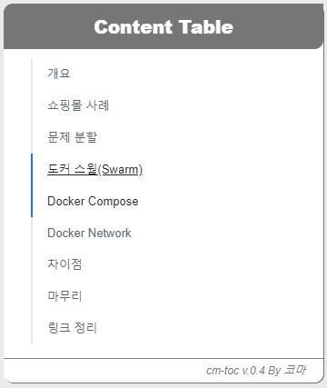

# 코마의 훈훈한 블로그

Minima 를 기반으로 커스터마이징 중인 Jekyll 블로그입니다.

## Change Log

- 2019
  - July 26 : ToC SASS 수정 및 구글 광고 사이드바 설정
  - Aug 08 : ToC 및 Content CSS 조정

## TODO

- Search 바 생성
- GNB 수정 (랜딩 페이지, 포스트 페이지 각각)
- ToC 바 업그레이드

## 로컬 jekyll 빌드

로컬에서 동작하는지 알아보기 위해서는 ruby 를 설치해야 합니다. 저는 Windows 10 에서 WSL 을 사용하고 있습니다. 따라서 Ubuntu 16.04 에서 설치하는 방법을 가이드 드리도록 하겠습니다.

```bash
$> sudo apt-get install ruby-full build-essential zlib1g-dev
$> gem install jekyll bundler
$> bundle install
```

## 실행 방법

```bash
# git clone
git clone https://github.com/code-machina/code-machina.github.io.git
cd ./code-machina.github.io/
sudo bundle exec jekyll serve
```

## Minima 수정

- minima local 위치 찾기

```bash
bundle show minima
```

- 편집할 파일을 불러오기


- 변경 대상 복사


## 구현 예정

|기능|설명|구현|
|:---:|:---:|:---:|
|사이드 네비게이션 바| 글의 목차를 보여주는 기능| X |
|블로그 스타일링| 텍스트 위주형 블로그 뷰 | O |

## 주제

블로그 주제는 코마의 관심 위주로 진행됩니다만 원하는 내용을 이메일로 주시면 다루도록 하겠습니다.

- 관심 주제
  - 엘라스틱 서치
  - 데이터 시각화
  - 보안
  - Vue.js + Express.js
  - Docker
  - AWS


## TOC 업그레이드

- 사용자 경험 강화 차원에 스크롤 이벤트 발생 시 ToC 바에 CSS 처리


