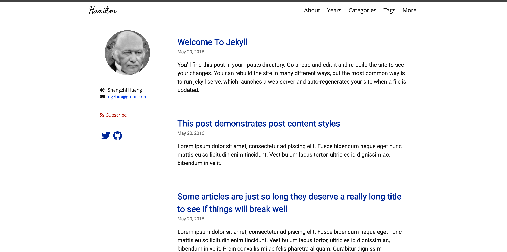
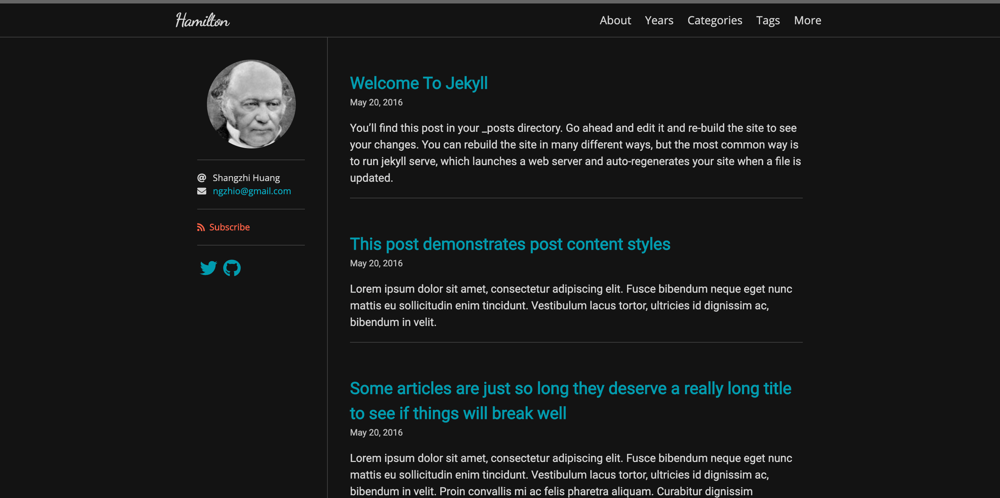

# Hamilton <!-- omit in toc -->

A minimal and beautiful Jekyll theme best for writing and note-taking.

The original purpose of this theme is to be a replacement of the default Jekyll theme -- [Minima](https://github.com/jekyll/minima). Hamilton is an enhancement of Minima but still, keep in minimal.

Please check out the [demo](https://ngzhio.github.io/jekyll-theme-hamilton/).

| Skins | Displays |
| ----- | -------- |
| Daylight |  |
| Sunrise/Sunset |  |
| Midnight |  |

## Features <!-- omit in toc -->

- [Jekyll SEO Tag](https://github.com/jekyll/jekyll-seo-tag)
- [Jekyll Feed](https://github.com/jekyll/jekyll-feed)
- [Jekyll Sitemap](https://github.com/jekyll/jekyll-sitemap)
- [Google Analytics](https://analytics.google.com/)
- [MathJax](https://www.mathjax.org/)
- [Disqus](https://disqus.com/)
- [Font Awesome](https://fontawesome.com/)
- TOC
- Customizable head
- Configurable page navigation
- Customizable styles and skins
- Archive pages implemented in pure Liquid

## Table of Contents <!-- omit in toc -->

- [Installation](#installation)
- [Configuration](#configuration)
  - [Optional Parameters](#optional-parameters)
- [Archive Pages](#archive-pages)
- [MathJax](#mathjax)
- [TOC](#toc)
- [Customization](#customization)
  - [Metadata](#metadata)
  - [Navigation](#navigation)
  - [Social Media](#social-media)
  - [Skins](#skins)
  - [More Customized Styles](#more-customized-styles)
- [License](#license)

## Installation

You can choose one of the following methods to install Hamilton:

- Directly specify the `jekyll-theme-hamilton` gem.

    1. Add `gem 'jekyll-theme-hamilton'` into your `Gemfile`.
    2. Add the below lines into your `_config.yml`.

        ```yml
        plugins:
          - jekyll-theme-hamilton
        ```

- If your site is hosted on GitHub Pages, you can use [`jekyll-remote-theme`](https://github.com/benbalter/jekyll-remote-theme) to import the master branch of Hamilton.

    1. Add `gem 'jekyll-remote-theme'` into your `Gemfile`.
    2. Add the below lines into your `_config.yml`.

        ```yml
        plugins:
          - jekyll-remote-theme

        remote_theme: ngzhio/jekyll-theme-hamilton
        ```

## Configuration

After installation, you can run `jekyll serve` to check out your site, but before that, *make sure* the below **required parameters** are configured in your `_config.yml`.

| Parameters | Types | Specifications |
|:---------- |:----- |:-------------- |
| `title`    | string | The site title |
| `disqus`   | string | The Disqus shortname; Unless you don't want to enable the comments system, you must specify this parameter. It is used in the production environment. |
| `google_analytics` | string | The Google Analytics tracking ID; It is used in the production environment. |

### Optional Parameters

| Parameters | Types | Specifications |
|:---------- |:----- |:-------------- |
| `author`   | string | The name of the author of the site; It would be showed in the copyright statement. |
| `avatar`   | string | The avatar of the author of the site. |
| `email`    | string | The email of the author of the site. |
| `location` | string | The current living location of the author of the site. |
| `skin`     | string | The skin name. See more information on the [Customization](#customization) section. |
| `lang`     | string | The language of the site; The default value is `en`. |
| `paginate` | int    | The number of posts on each page. |
| `date_format` | string | The date format; The default value is `%b %-d, %Y`. |
| `subscribe` | boolean | Show the subsribe feed button. |

## Archive Pages

Hamilton implements some archive templates in pure Liquid. For example, if you want to create a category archive page, set the below parameters on that page:

```yml
---
layout: archive-taxonomies
type: categories
---
```

Or a tag archive page:

```yml
layout: archive-taxonomies
type: tags
```

Or archive by years:

```yml
layout: archive-years
```

## MathJax

You can enable MathJax on each post or page, just set `math: true` on that page.

## TOC

If you want to show the Table of Contents of a post or page on the left sidebar, just set `toc: true` on that page.

## Customization

### Metadata

You can create a file `_includes/custom-head.html` in your repository, and add any metadata into that page, e.g. favicons.

### Navigation

You can create a file `_data/navigation.yml` to configure links to some pages. For example,

```yml
- title: About
  url: /about/
- title: Categories
  url: /categories/
- title: Tags
  url: /tags/
```

The navigation bar also supports dropdown submenus:

```yml
- title: About
  url: /about/
- title: Categories
  url: /categories/
- title: Tags
  url: /tags/
- title: More
  sublinks:
    - title: FAQ
      url: /faq/
    - title: Docs
      url: /docs/
```

### Social Media

You can create a file `_data/social.yml` to configure links to your social media. For example,

```yml
- title: Twitter
  url: https://twitter.com/ngzhio
  icon: fab fa-twitter
- title: GitHub
  url: https://github.com/ngzhio/jekyll-theme-hamilton
  icon: fab fa-github
```

### Skins

You can select a skin by setting `skin` in `_config.yml`. The built-in skins include `daylight`, `midnight`, `sunrise`, and `sunset`. If you don't specify any skin, Hamilton would dynamically select one in these built-in skins according to different hours in a day.

You can also customize a new skin, for example, a skin called `solarized`. You need to copy [`_sass/hamilton/skins/daylight.scss`](_sass/hamilton/skins/daylight.scss) into your repository and then rename it to `solarized.scss`, and adjust some colors in that file. Finally, specify `skin: solarized` in `_config.yml`.

### More Customized Styles

If you want to create more CSS styles in your site, creating a file `_sass/hamilton/custom-styles.scss`, and putting your code in there, Hamilton would automatically refer to them.

## License

The theme is available as open source under the terms of the [MIT License](LICENSE.txt).
