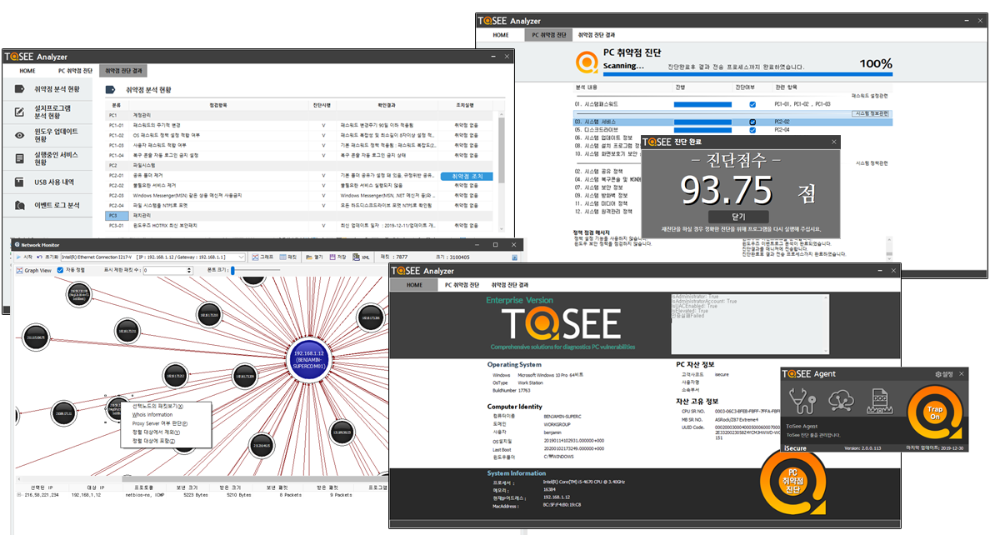

[ToSee Vulnerability Management Tool](https://tosee.isecurekr.com/)
===================================================================

         

ToSee Analyzer 는 개인용 PC 운영체제(Windows 7.0/8.0/8.1/10)의 [취약점](vulnerability.md)을 진단하고 조치하는 기능을 제공합니다.

ToSee FileTrap은 행위 기반 탐지기법을 이용하여 [Ransomware](ransomware.md)를 차단하고, 폴더 및 파일을 보호하는 기능 및 문서의 자동백업기능(로컬 및 클라우드)을 제공합니다. FileTrap은 여타 백신과 동일하게 EV인증 및 Microsoft의 WHQL인증을 받아 최소한의 안전성을 보장합니다.

ToSee 네트워크 모니터링툴 NetMonitor는 사용자가 네트워크 상태를 쉽게 인식할 수 있도록 엘라스틱 벡터그래픽을 이용하여 네트워크의 위상과 패킷에 대한 정보를 보여줍니다.

무료로 제공하는 Personal 버젼과 기업에게 제공하는 Enterprise 버젼이 존재하며 기능의 차이는 없으며 관리적인 부분에서 차이점이 있습니다.:smile:.

:sparkles: 새로 변경된 내용 [New Release](CHANGELOG.md).

**Note:** ToSee 설치시 네트워크 캡쳐를 위한 winpcap을 설치할 수 있습니다.**Note:** ToSee 삭제시 시스템 Driver의 작동과 삭제를 위해 잠시 시간이 소요될 수 있습니다.

#특징
-----

퍼스널 버젼의 기능
------------------

-	일괄 설치 및 업데이트를 통하여 드라이버 서비스등이 모두 설치됩니다.
-	설치 폴더 및 파일 보호. 설치된 ToSee 의 실행파일과 폴더의 삭제가 금지됩니다. 그러나 언인스톨을 하게 되면 모두 삭제가 되며 삭제후 남은 폴더의 경우도 사용자가 삭제할 수 있습니다.
-	삭제방지코드. 다른 프로세스에 의해서 강제삭제가 되지 않도록 삭제코드를 입력해야 언인스톨이 가능합니다.
-	행위기반 탐지에 의한 랜섬웨어 차단.
-	행위기반 탐지에 의한 사용자 지정 폴더 보호.
-	행위기반 탐지에 의한 삭제문서 자동 백업.(퍼스널 버젼에서는 로컬백업만 지원을 합니다.)
-	네트워크 위상 및 패킷 분석.

엔터프라이즈 버젼의 기능
------------------------

-	매니저 사이트를 통한 자산의 관리
-	52시간 근무시간 관리기능
-	USB 차단 및 사용로그 관리 기능(현재 추가중)

Skins (color variations)
------------------------

This theme comes in nine different skins (including the default one).

| `진단가능 OS` | `서비스팩 유무`                    | `EOS`                     |
|---------------|------------------------------------|---------------------------|
| Windows7      | Service Pack 1                     | 2020년 1월 14일           |
| Windows8      | 서비스팩 없음                      | 2016년 1월 12일           |
| Windows8.1    | 업데이트1                          | 2023년 1월 10일           |
| Windows10     | 레드스톤1~5, 19H1,19H2, 20H1, 20H2 | 레드스톤5 2020년 4월 예정 |

#Personal Version Download
--------------------------

[Personal Version](https://tosee.makesecu.com/down/2019-12-30_Setup_ToSee2018_personal.exe)
