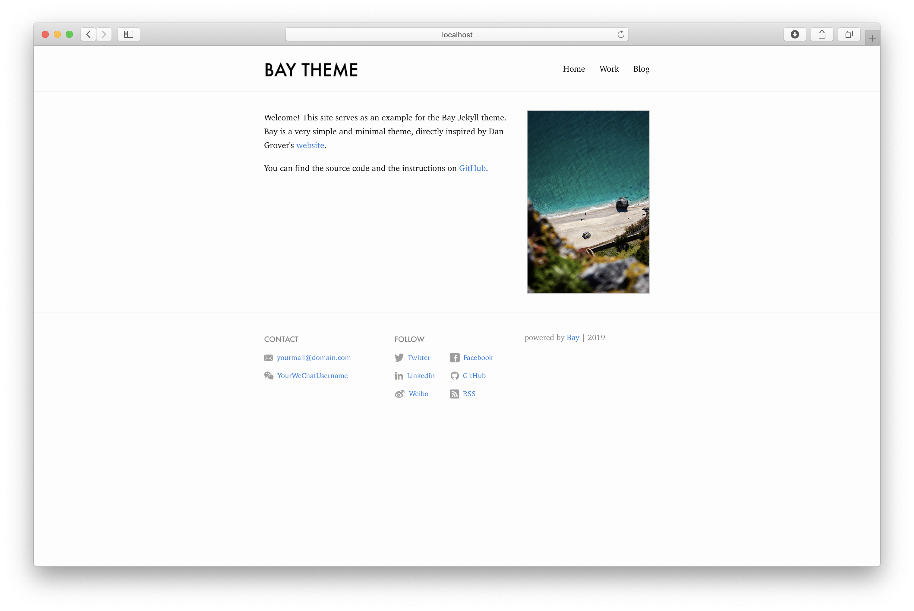

# Junbo Koh — Academic Homepage

[](https://github.com/Ridealist/Ridealist.github.io/actions/workflows/pages.yml)

Source of [ridealist.github.io](https://ridealist.github.io): an academic homepage built with Jekyll. The design is adapted from the [Bay](https://github.com/eliottvincent/bay) theme by Eliott Vincent, with the layout modeled on [jeongeonpark.com](https://jeongeonpark.com/).


*The original [Bay](https://github.com/eliottvincent/bay) theme demo (screenshot from the Bay repository, ISC License).*

## Table of contents

1. [Site structure](#site-structure)
2. [Editing content](#editing-content)
    1. [Header](#header)
    2. [Footer](#footer)
    3. [Home page and news](#home-page-and-news)
    4. [Publications](#publications)
    5. [Blog](#blog)
    6. [CV](#cv)
3. [Development](#development)
4. [Deployment](#deployment)
5. [Credits](#credits)
6. [License](#license)

## Site structure

| Page | Source | Content |
|---|---|---|
| Home `/` | `index.md` | Intro text, profile photo, News |
| Publications `/publications/` | `publications.md` | Generated from `_data/publications.yml` |
| Blog `/blog/` | `blog.md` | Posts in `_posts/`, grouped by year, with a category filter |
| CV `/cv/` | `cv.md` | Embeds `assets/files/cv.pdf` |

Most content lives in YAML files under `_data/`, so day-to-day updates rarely need HTML changes.

## Editing content

> `_config.yml` is not reloaded by `jekyll serve`. Restart the server after editing it. Changes to `_data/`, pages and posts reload automatically.

### Header

The top navigation is set in `_config.yml`. Pages appear in the order listed. `url` is relative to the site root.

```yml
title: "Junbo Koh"
tagline: "EdTech @ SNU"   # shown next to the name

header:
  pages:
    - name: Home
      url: /
    - name: Publications
      url: /publications/
    - name: Blog
      url: /blog/
    - name: CV
      url: /cv/
```

### Footer

The footer has a CONTACT column and a FOLLOW column, also in `_config.yml`. `icon` takes a [Font Awesome 6](https://fontawesome.com/search?ic=free) or [Academicons](https://jpswalsh.github.io/academicons/) class. `value` is the text shown; if omitted, `name` is shown.

```yml
footer:
  contact:
    - name: Email
      value: "gtkobo92@snu.ac.kr"
      url: "mailto:gtkobo92@snu.ac.kr"
      icon: "fas fa-envelope"
  follow:
    - name: Google Scholar
      url: "https://scholar.google.com/citations?user=2hDR1lgAAAAJ&hl=en"
      icon: "ai ai-google-scholar"
    - name: GitHub
      url: "https://github.com/Ridealist/"
      icon: "fab fa-github"
```

### Home page and news

- **Intro text:** edit `index.md`.
- **Profile photo:** set `avatar` in `_data/profile.yml`. It is shown at the top right, 192px wide.
  Strip location metadata before adding a phone photo, for example: `ffmpeg -i photo.jpeg -map_metadata -1 assets/img/profile.jpg`.
- **News:** add items to `_data/news.yml`. They are sorted newest first, and `text` supports Markdown.

```yml
items:
  - date: 2026-06-24
    text: "Paper accepted to [AIED 2026](https://www.aied-conference.org/2026/)!"
```

### Publications

Add entries to `_data/publications.yml`. Each key is one section on the page, shown in this order; empty sections are hidden. Entries appear in the order written.

| Key | Section title |
|---|---|
| `preprints` | Preprints |
| `conferences` | Conference and Journal Papers |
| `demos` | Posters, Demos, Workshop Papers |

```yml
conferences:
  - title: "Paper title"
    authors: "**Junbo Koh**, Coauthor A, and Coauthor B"   # Markdown; bold your name
    venue: "AIED 2026: The 27th International Conference on Artificial Intelligence in Education"
    url: "https://doi.org/..."          # optional; makes the title a link
    note: "Best Paper"                  # optional, shown in orange
    image: "/assets/img/publications/teaser.png"   # optional teaser image
    id: "short-name"                    # optional anchor: /publications/#short-name
    links:                              # optional, shown after the venue
      - label: "DOI"
        url: "https://doi.org/..."
```

### Blog

Posts live in `_posts/` (subfolders are fine) as `YYYY-MM-DD-title.md`. Post URLs are `/<category>/<title>/`.

```yml
---
title: "Post title"
categories:
  - llm
toc: true        # optional: table of contents from h2/h3 headings
use_math: true   # optional: MathJax
comments: false  # optional: comments (utterances) are on by default
---
```

- Category display names (e.g. `llm` → "LLM") are set in `_data/categories.yml`. A category not listed there is shown as its slug.
- Clicking a category opens a filtered list at `/blog/#<category>`.
- Comments use [utterances](https://utteranc.es/) and are stored as issues in this repository.

### CV

The CV page embeds `assets/files/cv.pdf`. To update it, export the Google Doc as PDF (File → Download → PDF) and replace that file. The paths are set in `_data/profile.yml`:

```yml
cv:
  pdf: "/assets/files/cv.pdf"
  url: "https://docs.google.com/document/d/..."   # fallback link if pdf is empty
```

## Development

Requires Ruby 3.1+ and Bundler.

```sh
bundle install
bundle exec jekyll serve            # http://localhost:4000, with live reload
```

Check internal links and images the same way CI does:

```sh
bundle exec jekyll build
bundle exec htmlproofer _site --disable-external --ignore-files "/multi-categorical-classification/"
```

| Path | Purpose |
|---|---|
| `_layouts/` | `default`, `home`, `page`, `post` (`posts` is an alias for older posts) |
| `_includes/` | Head, header, footer, news table, publication entry |
| `_sass/`, `assets/css/main.scss` | Styles; colors and fonts are variables at the top of `main.scss` |
| `assets/js/site.js` | Mobile menu, table of contents, blog category filter |

## Deployment

The site is built and deployed by GitHub Actions ([`.github/workflows/pages.yml`](.github/workflows/pages.yml)), not by the built-in GitHub Pages build, which runs an older Jekyll (3.10).

- **Pull requests to `master`:** build the site and check internal links and images.
- **Pushes to `master`:** build, check, and deploy to GitHub Pages.

The repository setting **Settings → Pages → Build and deployment → Source** must be **GitHub Actions**.

## Credits

- Design adapted from [Bay](https://github.com/eliottvincent/bay) by Eliott Vincent (ISC License).
- Page layout inspired by [jeongeonpark.com](https://jeongeonpark.com/); publication sections inspired by [yoonsu0816.github.io](https://yoonsu0816.github.io/).
- Icons from [Font Awesome](https://fontawesome.com/) and [Academicons](https://jpswalsh.github.io/academicons/).

## License

The source code is released under the [MIT License](LICENSE). This covers the code only: blog posts, publication data, the CV, and images are © Junbo Koh, all rights reserved. Bay's ISC license notice is included in [`LICENSE`](LICENSE).
