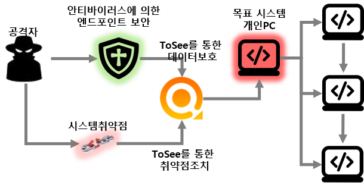
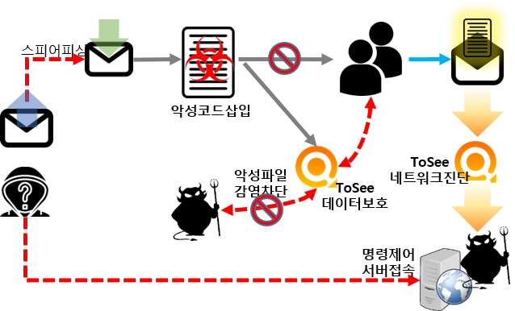
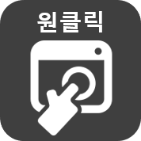
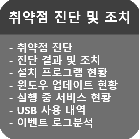
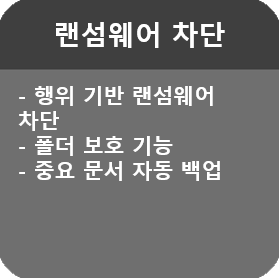
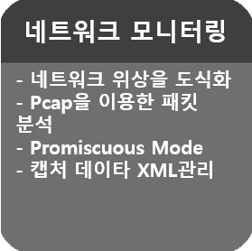
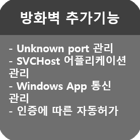

Personal version | Enterprise Version | Latest Version 
-------| ------- | -------
 |  |   

&nbsp;
기술 블로그에서는 Personal 버젼만 다운로드가 가능합니다. 그외에 엔터프라이즈와 관련된 사항은 담당자에게 문의해주세요.

&nbsp;
### 개인 PC 보안 수준 향상
&nbsp;

|  개인 PC 보안 수준 향상  |
|  :-----------------------  |
| 개인이나 일반 기업, 금융기관에 이르기까지 보안의 가장 큰 위협 요소는 개인 PC (업무용 및 개인 단말기)에서 기밀정보나 개인정보   등의 내부정보가 유출되는 것입니다.  즉, 엔드포인트에서의 강력한 보안이 매우 중요합니다.   일반적으로 개인이 사용하고 있는 PC는 인터넷망에 연결되어 있어 웹서핑이나 이메일 , 이동형외장 메모리 등에 의한  악성코드   감염에 노출될 가능성이 높습니다.    또한 개인이 사용하는 PC는 안티바이러스 등의 아주 기본적인 프로그램만을 설치하고 있어 운영체제의 보안 정책 등의 복잡한   보안 점검 및 조치에는 소홀한 경우가 매우 많습니다.    ToSee는 취약점 진단 툴을 이용하여 운영체제의 보안 점검과 조치를 간편하게 해주고, 랜섬웨어의 위협을 차단하며, 지정된 폴더를   보호합니다. 또한, 문서파일을 자동으로 백업하여, 중요한 데이터를 안전하게 지켜주는 기능을 제공합니다. 이처럼 ToSee는   개인 PC의 보안 수준을 편리하고 안전하게 향상시켜줍니다.  |
|   &nbsp;  &nbsp; &nbsp;  &nbsp; &nbsp;  &nbsp;  &nbsp; &nbsp;  &nbsp; &nbsp;  &nbsp;  |

&nbsp;
&nbsp;
### 사용자 편의를 위한 개인 PC 보안솔루션 
&nbsp;

|||||
|-----|-----|-----|-----|
|  | - UUID를 이용한 자산관리   - 매니저를 통한 진단 관리 |  | - 취약점 진단 및 조치   - 네트워크 모니터링   - 랜섬웨어 차단 및 데이터 보호 |
|  | - 원클릭으로 취약점 점검   - 진단 결과에 따라 취약 항목 즉시 조치가능 || - EV 인증서로 신뢰성과 안정성 확보    - Microsoft WHQL  인증을 통한 안정성 확보 |

|||||
|-----|-----|-----|-----|
|  |  |  |  |
