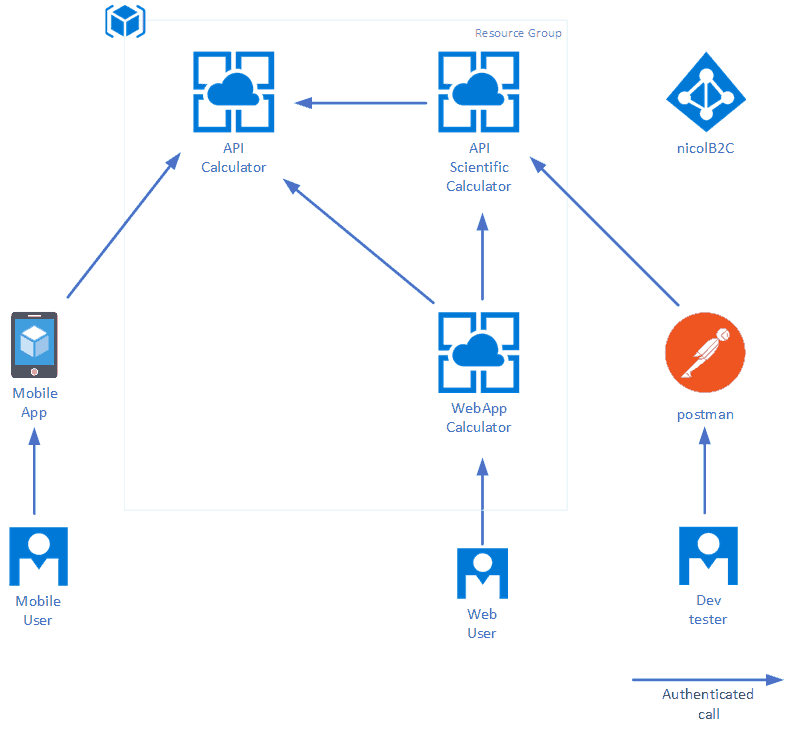

Microservices  is an architectural style that structures an application as a collection of loosely coupled services, which implement business capabilities. The microservice architecture enables the continuous delivery/deployment of large, complex applications. It also enables an organization to evolve its technology stack.

In this context, it is easy to have web solutions composed by dozen of microservices, that exposes indipendent APIs. 

These APIs can provide anonymous access to their services, but in the real world often they must be authenticated. This means that once a user authenticates to an identity provider, an easy way to have a "single sign on" to dozens of microservices is needed.

To add more complexity, a generic API implemented as microservice, could require information from another microservice|API and so on (API to API authenticated call).

At the times of the Active Directory integrated authentication, the solution was quite easy: the developer turned ON the flag "authenticated user only" on IIS and all, magically, was secured but with the *classical* limitation of these old times: all machines must trust a common Active Directory (yes, the scenario can become more *inclusive* with trusted domains and forests but this is not the scope of this post). 

Each time you needed to integrate a 3th party service outside of this trust, the pain begone :-).

In nowadays we are lucky, OpenID Connect and OAUTH2 have changed (or have opened…) the world of authentication and authorization. 

Azure Active Directory B2C, Microsoft's cloud-based identity and access management solution for consumer-facing web and mobile applications now can come in the game. It is an highly-available global service that scales to hundreds of millions of consumer identities. Built on an enterprise-grade secure platform, Azure Active Directory B2C keeps your business and your consumers protected and supports open standards such as OpenID Connect OAUTH2.

If you need to architect a **microservices based solution** that uses the <a href="https://docs.microsoft.com/en-us/office365/enterprise/hybrid-modern-auth-overview#BKMK_WhatisModAuth" target="_blank">modern authentication</a> to provide its services to millions of authenticated users stored on Azure B2C, here you can find a step by step configuration based on .NET Core, Angular and Xamarin.

Whatever the purpose of your service is, you'll have:

* dozen of autheed APIs ( => user authentication)
* different clients and technologies ( => Mobile, Single Page App)
* single sign on cross APIs
* APIs that internally needs to call other APIs ( => preserving the user context)

this means that you'll need to manage how to:

* authenticate users
* call one or more APIs in the user context from mobile
* call one or more APIs in the user context from web app
* nested API calls

as shown in the following schema

In <a href="https://github.com/nicolgit/Azure-B2C-playground" target="_blank">this Github repository</a> you can find the step-by-step instruction to implement a playground that implements all the above components:

* An Azure B2C instance
* A simple Calculator API
* A simple scientific Calculator API that impersonating the calling user calls the Calculator API
* A simple Web Appication (Single Page Application) that authenticates on Azure B2C and calls both Calculator and Scientific Calculator
* A simple Xamarin Form Application that authenticates on Azure B2C and calls both Calculator and Scientific Calculator

While all the detail and the step by step and the code is on github, here I want  only summarize the main steps and few takeaways I have learned in implementing the solution.

# Implement each API as Azure B2C Application
To build an application or an API, that accepts consumer sign-up and sign-in, you first need to register the application with an Azure AD B2C tenant. 
The steps are straightforward, starting from Azure B2C service:

* Select Applications, and then select Add.
* Enter a name for the application. 
* Redirect URI

Depending the scenario you can select "**Implicit flow**" for Single page application, or "**Include Native API**" for mobile application.

# Use library for authentication
For each type of application there is a free (and open source) library that will save your day, avoiding you have to reinventi the wheel.

| Solution | Library Name | Repository
|----------|----------|----------|
| Web API .NET Core | ASP.NET Core OpenId Connect Library | https://www.nuget.org/packages/AspNet.Security.OpenIdConnect.Server |
| Single Page App | MSAL for js (Microsoft Authentication Library) | https://github.com/AzureAD/microsoft-authentication-library-for-js |
| Client Xamarin | MSAL for .NET (Microsoft Authentication Library) | https://www.nuget.org/packages/Microsoft.Identity.Client/ |

# For API2API call Disable ValidateAudience check

**Side note**: All the discussion and the concept we have described are valid ALSO for Azure B2B authenticated applications.

