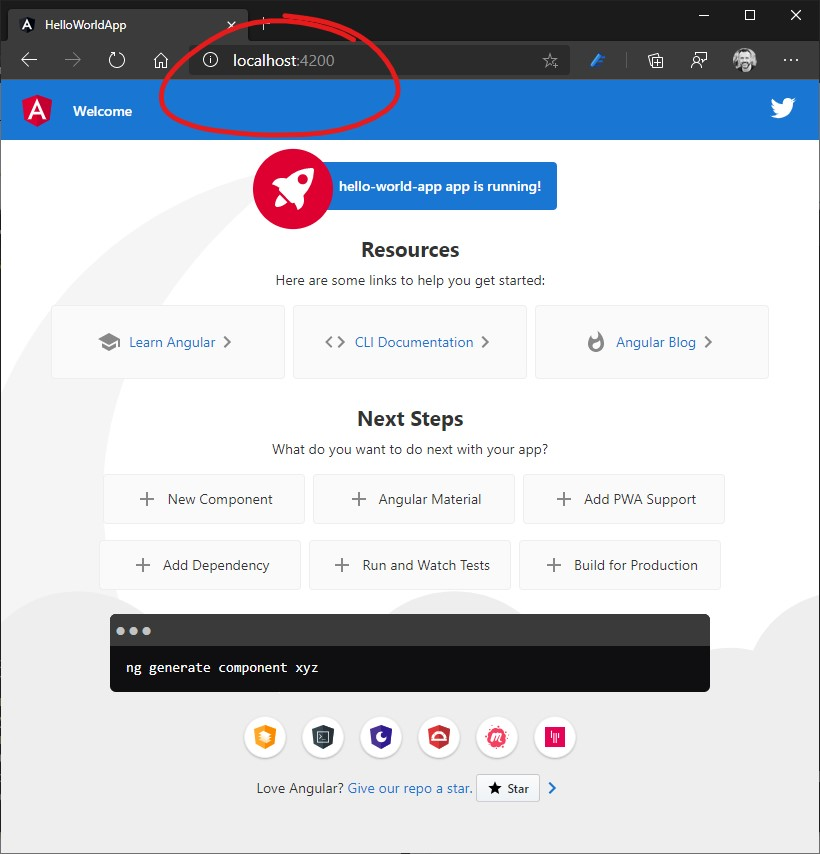
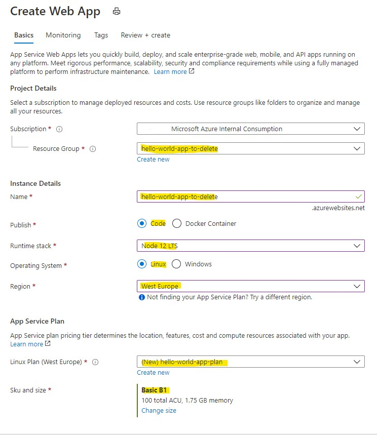
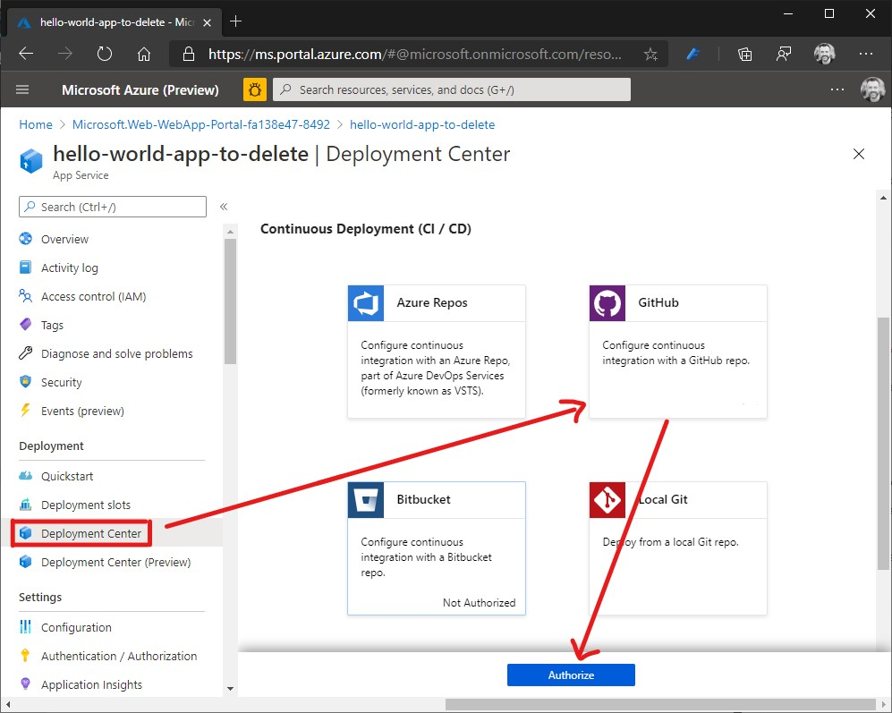
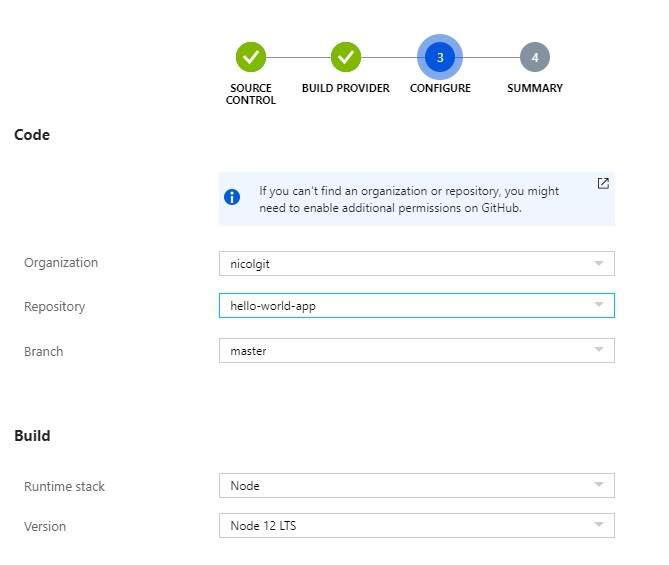
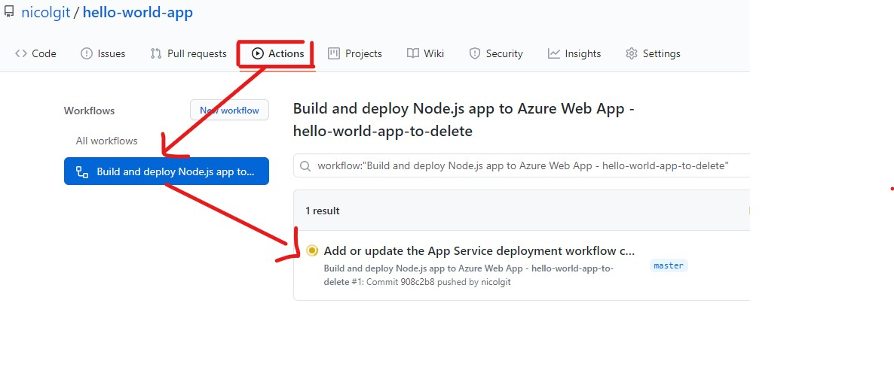
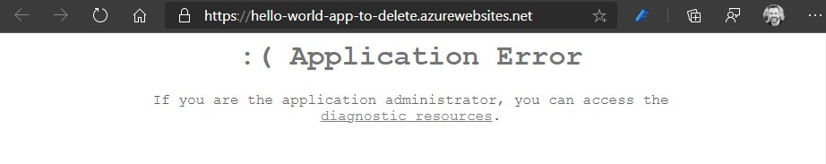
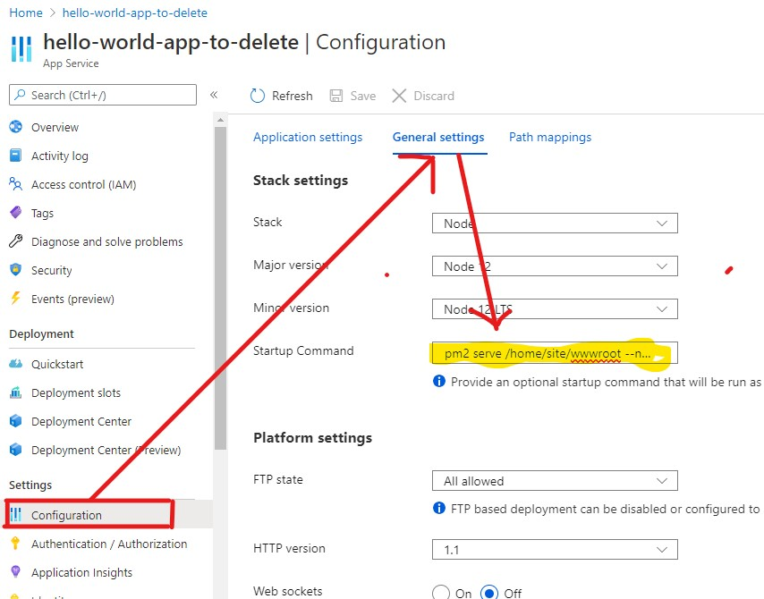
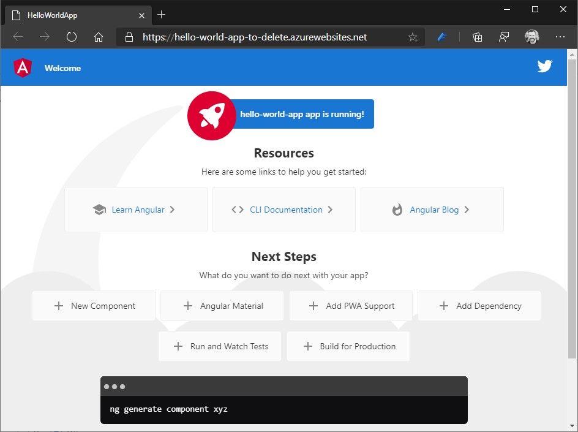

This sample demonstrates how to deploy, from GitHub, an Angular single page application (SPA) to Azure App Service running node on linux. A continuous delivery/continuous integration pipeline will be put in place with Github Action.

This sample demonstrates who to:

* create a sample angular app
* push to a github repository
* create an appservice plan and appservice running linux and node
* deploy angular app to appservice via github action

For more information:

* <a href="https://git-scm.com/" target="_blank">git</a>
* <a href="https://nodejs.org/" target="_blank">node.js</a>
* <a href="https://www.npmjs.com/" target="_blank">npm</a>
* https://blog.angular-university.io/getting-started-with-angular-setup-a-development-environment-with-yarn-the-angular-cli-setup-an-ide/ 

# Logic diagram
the following pictore shows the logic flow from developer's commit to production web on Azure.


# Create sample angular app
First thing to do is install the tools we’re going to need.
If you don’t have **git**, **node.js**, and **npm** installed already, go ahead and install them.

Then go to the command line and run the following command to install Angular CLI, which is a command line tool that we can use to scaffold Angular applications

```powershell
npm install -g yarn
yarn global add @angular/cli
```

Let's then scaffold our first application. create a folder on you computer you will use as container for your project repository, con inside it and type:

```powershell
ng new hello-world-app
```

This is going to take a while, but it will create a new project structure and it will install all the needed dependencies in one go. when done, we are ready to use project: We can run our application by simply doing:

```powershell
cd hello-world-app
ng serve
```

The ng serve command should start a development server on your locahost port 4200, so if you go to your browser and enter the following url:

**http://localhost:4200**

You should see in the browser a blank screen with the message “**ello-world-app app is running!**”.



# Push to a github repository

ng new have created a local git repository for you. Run the following commands to track your files and make the initial commit in the local repository:

```powershell
git add .
git commit -m "my hello world commit"
```

When that’s done, it means that we successfully prepared our new local repository to be pushed to GitHub. You can navigate to the GitHub page for creating new repositories by visiting this link: https://github.com/new

On that page, we first need to specify a Repository name and an optional Description.

For the Repository name, we can specify the same project name (*hello-world-app*) as the local repository that we are using in our example. If you want, you can also write a Description of your repository, but you can also skip that field as we did in the screenshot above.

You can set your repository to be Public or Private. When uploading your code to a public directory, make sure it doesn’t contain any sensitive data not intended to share with others. When creating a Private repository, you’ll manually choose who can access the new repository.

Now switch back to your local terminal and run the specified commands from your project folder:

```powershell
git remote add origin <https://github.com/><your-username>/<your-repo-name>.git
git push -u origin master
```

# Create an appservice plan and appservice running linux and node
on your Azure subscription you have to create:

* a resource group
* an AppService plan
* an AppService

To create all there elementos go to https://ms.portal.azure.com/#create/Microsoft.WebSite and fill all fields as in the following screenshot.



when the resources are ready click on the button [**go to resource**].

# Deploy angular app to appservice via github action
in Azure, in the AppService configuration, select Deployment Center -> GitHub -> Authorize



after connected azure and github, click on continue button. it is the time to select your build provider: so you click on [**GitHub Actions**] and [**continue**]. On the next page select your organization, repository and branch. Leave Node as runtime stack as in the picture below.



click on [**continue**] and [**finish**] will set up your building pipeline on GitHub. In your GitHub repository you will find a .yml file under *.github/workflow*. If you go in Action  menu you will also find a workflow running (yellow circle animation): Azure have created a yml file that will build your app and deploy it to your AppService.



this could require few minutes, and at the end probably all the process will terminate with an error. To understand why it fails and how can we fix it we have to analize the file .github/workflow/master_hello-world-app-to-delete.yml (your file could have a different name, the the file will be the same).

the content of your file will be similar to the following

```powershell
# Docs for the Azure Web Apps Deploy action: https://github.com/Azure/webapps-deploy
# More GitHub Actions for Azure: https://github.com/Azure/actions

name: Build and deploy Node.js app to Azure Web App - hello-world-app-to-delete

on:
  push:
    branches:
      - master

jobs:
  build-and-deploy:
    runs-on: ubuntu-latest

    steps:
    - uses: actions/checkout@master

    - name: Set up Node.js version
      uses: actions/setup-node@v1
      with:
        node-version: '12.x'

    - name: npm install, build, and test
      run: |
        npm install
        npm run build --if-present
        npm run test --if-present

    - name: 'Deploy to Azure Web App'
      uses: azure/webapps-deploy@v2
      with:
        app-name: 'hello-world-app-to-delete'
        slot-name: 'production'
        publish-profile: ${{ secrets.AzureAppService_PublishProfile_a094*****************f8ce }}
        package: .
```

it begins with some comment and a name field. the first interesting part is the following:

```powershell
on:
  push:
    branches:
      - master
```

that means please run this workflow on each commit on master branch. If you prefer to trigger your workflow by hand change it in:

```powershell
on:
  workflow_dispatch:
```

follows the jobs part, containing 1 job "build and deploy" thw will run on ubuntu

```powershell
jobs:
  build-and-deploy:
    runs-on: ubuntu-latest
```

this job runs 4 steps:

first: fetch from the repository the master branch

```powershell
- uses: actions/checkout@master
```

Second: setup a node.js enviroment

```powershell
- name: Set up Node.js version
     uses: actions/setup-node@v1
     with:
       node-version: '12.x'
```

third: install build and run test of the solution. this usually fails

```powershell
- name: npm install, build, and test
      run: |
        npm install
        npm run build --if-present
        npm run test --if-present
```

in order to fix it, remove the test step, and change the build as the following

```powershell
- name: npm install, build, and test
      run: |
        npm install
        npm run build --prod
```

this because test needs chrome, that requires an X display to run.
with this change the build should  work, but if you open your appservice you should continue to receive the following message:

*:( Application Error: If you are the application administrator, you can access the diagnostic resources.*



to fix it you have to work on both workflow, and appservice side.

the deploy task to Azure sholud be changed from this:

```powershell
- name: 'Deploy to Azure Web App'
      uses: azure/webapps-deploy@v2
      with:
        app-name: 'hello-world-app-to-delete'
        slot-name: 'production'
        publish-profile: ${{ secrets.AzureAppService_PublishProfile_a094*****************f8ce }}
        package: .
```

to this:

```powershell
- name: 'Deploy to Azure Web App'
      uses: azure/webapps-deploy@v2
      with:
        app-name: 'hello-world-app-to-delete'
        publish-profile: ${{ secrets.AzureAppService_PublishProfile_a094*****************f8ce }}
        package: ./dist/hello-world-app
```

because the slot-name is not available on B1 AppService plan and the package is located in dist/hello-world-app folder.

As final settings, on AppService -> Settings -> General Settings -> Startup command that is blank, insert the following

**pm2 serve /home/site/wwwroot --no-daemon --spa**



and that's it: run the action again, and enjoy the app running on the cloud.




continuare da quì
.............................................................................repository temporaneo di appoggio C:\MyProjects\GitHub\sample-cd-ci\

