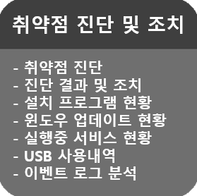
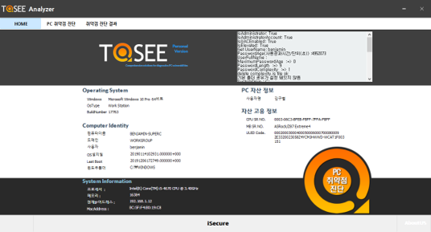

&nbsp;
&nbsp;
### 주요기능 : 취약점 진단 도구 Analyzer.
&nbsp;

|||
|:-----:|:-----|
|  | - 취약점 진단 : 기본 15 가지 항목, USB 사용 내역, 이벤트 로그 분석 등을 통한 PC의 취약점을 진단.   - 진단 결과 및 조치 : 진단 결과에 따라 즉시 조치가 가능한 항목은 조치 버튼을 눌러 즉각적인 조치 가능.   - 설치 프로그램 : 설치된 프로그램명을 가지고 PUP 리스트와 자연어 처리 기법을 이용하여 비교 판단.   - 윈도우 업데이트 현황 : 운영체제의 세부적인 업데이트 현황을 바로 확인 가능.   - 실행중 서비스 현황 : 실행중인 서비스의 정보와 스테이터스를 쉽게 확인 가능.   - USB 사용 내역 : USB 저장 장치의 최근 사용 내역을 확인 가능.   - 이벤트 로그 분석 : 시스템의 에러 로그만을 분리하여 현황을 확인하고, 조치 가능한 경우 조치 방법을 안내. |
|  |  |