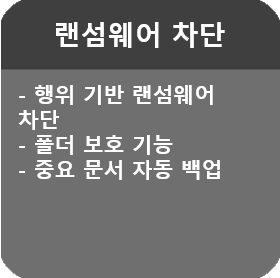
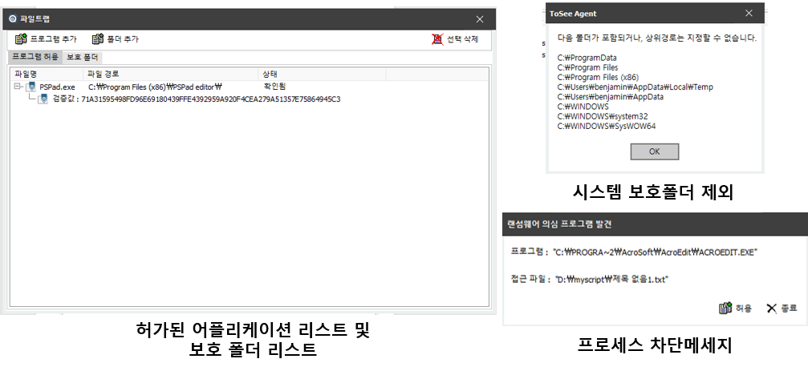

&nbsp;
&nbsp;
### 주요기능 : 랜섬웨어 솔루션 FILETRAP
&nbsp;

|||
|:-----:|:-----|
|  | - 랜섬웨어 차단 :행위 기반을 이용한 랜섬웨어의 확인 및 차단 기능   - 폴더 보호 기능 : 특별히 보호해야 되는 폴더의 경우 해당 폴더를 보호 폴더로 추가하면 해당 폴더 내의 데이터에 대하여 허가된 프로그램만 접근이 가능하도록 설정   - 로컬 자동 백업  : 지정된 파일 형식의 문서인 경우 허가되지 않은 프로그램이 접근하거나 임의로 변경하는 경우 해당 행위 전 파일을 자동으로 백업하여 데이터를 보존함.    - 클라우드 자동백업 : (추가 예정) 로컬 자동 백업과 동일한 동작을 하지만, 데이터 저장을 클라우드상에 하는 기능.  |
|  |  |