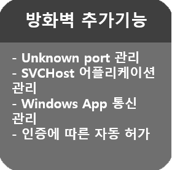
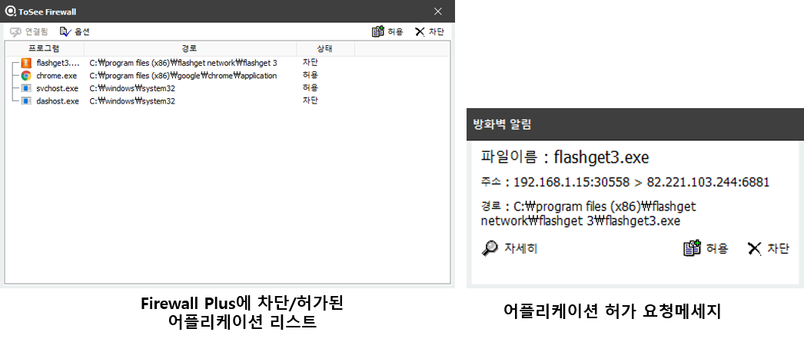

&nbsp;
&nbsp;
### 주요기능 : 윈도우 방화벽 지원 FIREWALL PLUS
&nbsp;

|||
|:-----:|:-----|
|  | - 윈도우 방화벽에서 기본적으로 관리하지 않는 Unknown 포트(1024 이후)를 사용하는 어플리케이션의 네트워크 송/수신 차단 기능   - 윈도우 서비스 관리 모듈인 SVCHOST를 이용하는 어플리케이션의 네트워크 송/수신 내역을 관리.   - 기존 윈도우 어플리케이션이 아닌 윈도우 앱(App)들의 네트워크 송/수신 내역 차단 가능   - 인증된 윈도우 어플리케이션에 대해서는 자동적으로 네트워크 사용을 허가하는 기능(윈도우 8.0부터 제공) |
|  |  |
