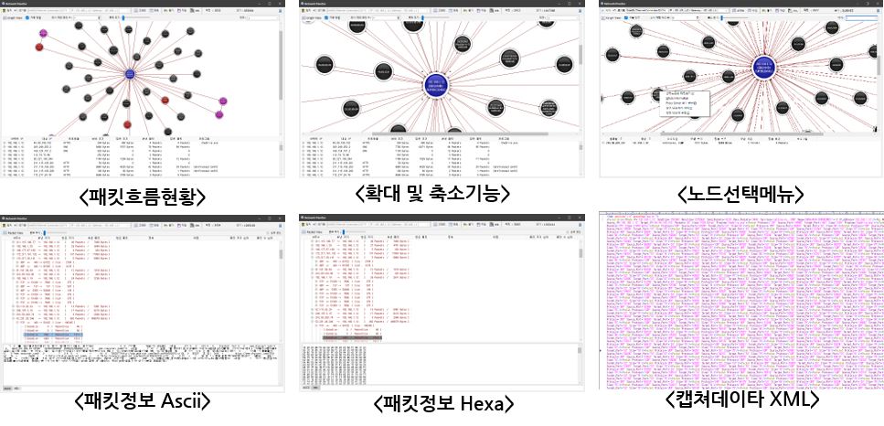

&nbsp;
&nbsp;
### 주요기능 : 네트워크 모니터
&nbsp;

|||
|:-----:|:-----|
|  | - 엘라스틱 벡터 그래픽을 이용하여 PC상에 입/출력되는 네트워크 데이터의 위상을 시각화하여 표현   - Pcap을 이용 아스키코드 및 Machine Language Code를 통한 패킷 분석 가능. Mnemonic Code 지원 예정   - Promiscuous Mode를 지원하여 자신의 PC를 중심으로 주변의 네트워크 상황 확인 가능   - 캡쳐된 데이타를 XML 포멧으로 저장하여 관리 및 분석하는 기능 제공. |
|  |  |
