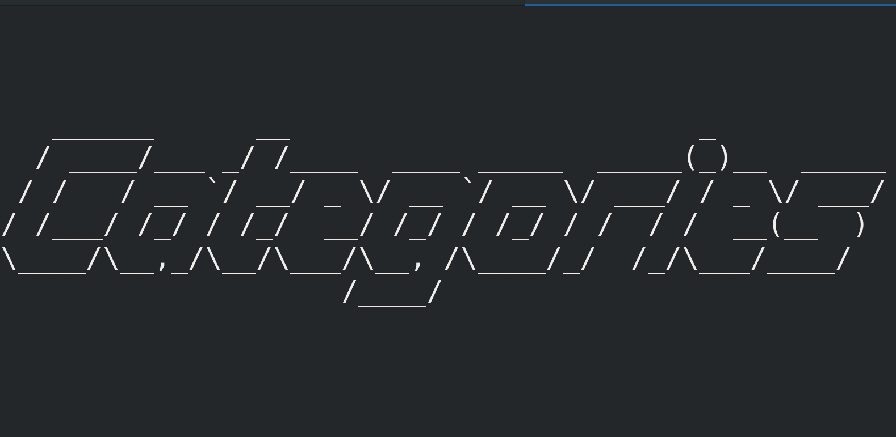

## Below you will find all my main categories

  
    
      

  *   [{{pages.title}}]({{pages.url | prepend:site.baseurl }})

      
    
  

## Below you will find all my sub categories

  
    
      

  *   [{{pages.title}}]({{pages.url | prepend:site.baseurl }})

      
    
  
