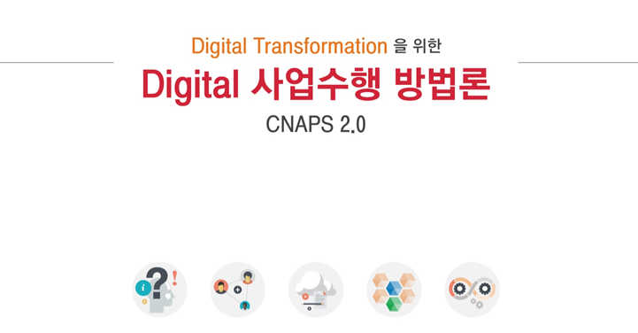

CNAPS 방법론 소개 페이지 입니다.\\
이 곳에서 CNAPS 방법론을 이해하고 프로젝트 적용을 위한 검토를 할 수 있습니다.\\

## Welcome to CNAPS 

{: .center-image}

CNAPS 2.0은 다음과 같이 구성됩니다.

1.  사용자 중심의 빠른 제품/서비스 컨셉 개발을 위한 – Design Thinking
2.  반복/점진적으로 출시하는 – Agile Delivery
3.  독립적인 Microservice 개발을 위한 – CNAPS-Dev

※ "CNAPS" 및 "씨냅스"는 상표법에 따라 상표 등록(등록번호: 제40-1329427호, 제40-1329430호)이 완료되었습니다.

> 본 글은 SK(주) C&C의 CNAPS 방법론 포탈을 참고했습니다.