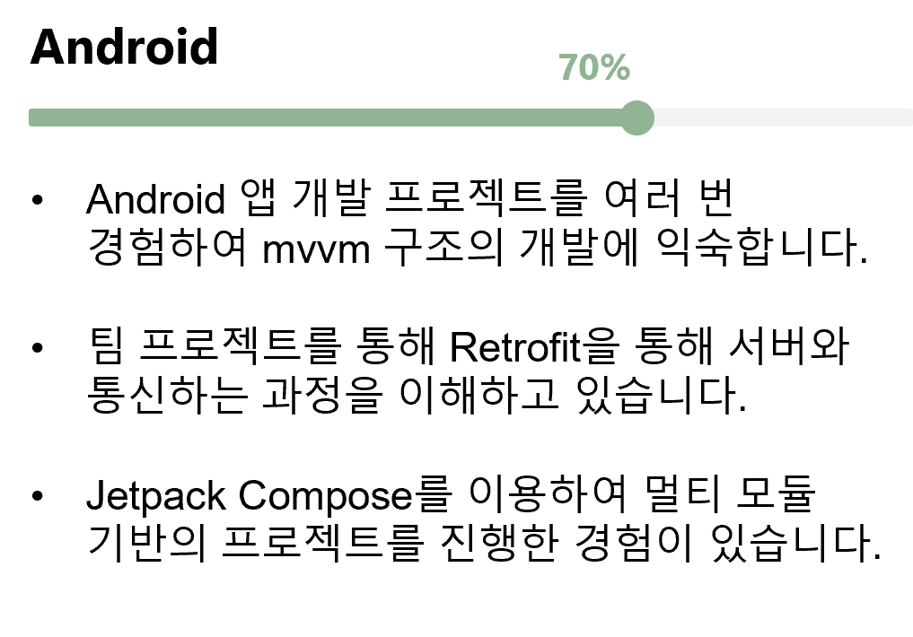

TECH SKILLS 

###  **THE SKILLS THAT I CAN DO**

 

저는 이런 것을 할 수 있습니다.

 

		 &nbsp;&nbsp;&nbsp;&nbsp;&nbsp;		

		 &nbsp;&nbsp;&nbsp;&nbsp;&nbsp;&nbsp;&nbsp;&nbsp;&nbsp;	

  

### **THE SKILLS THAT I'VE EXPERIENCED**

 

저는 이런 것을 경험해 보았습니다.

 

 

 

### **THE SKILLS THAT I'LL STUDY**

 

저는 이런 것을 공부할 계획입니다.

 