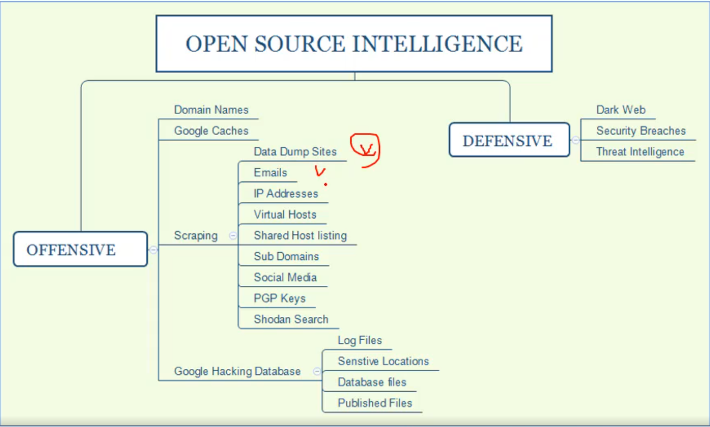
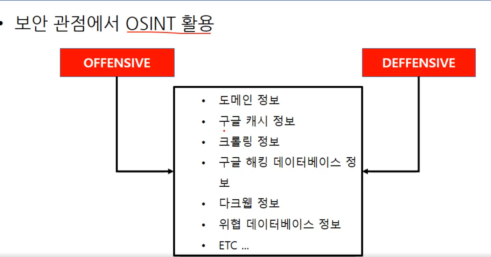

환경분석은 모의해킹에서 매우 중요 하지만 이 부분에서 많이 놓치고 가는 경우가 있다고 한다.

환경분석 중요하다.

SOINT(Open-source intelligence)

대중들이 어떤 어느곳에서든 접속해서 정보를 얻을수있는 오픈된 서비스를 말한다.

ex) Google

https://osintframework.com/

OFFENSIVE관점 : 미리 컨설턴트, 관리자들 환경분석을 통해 취약점이 있는지 미리 파악해서 공격자 입장에서 생각하는 관점(공격입장)

DEFENSIVE관점 : 취약점 분석 관점(버그헌팅)(방어입장) 

보안 관점에서 두개의 정보를 적절히 사용하는게 맞다고 생각 

