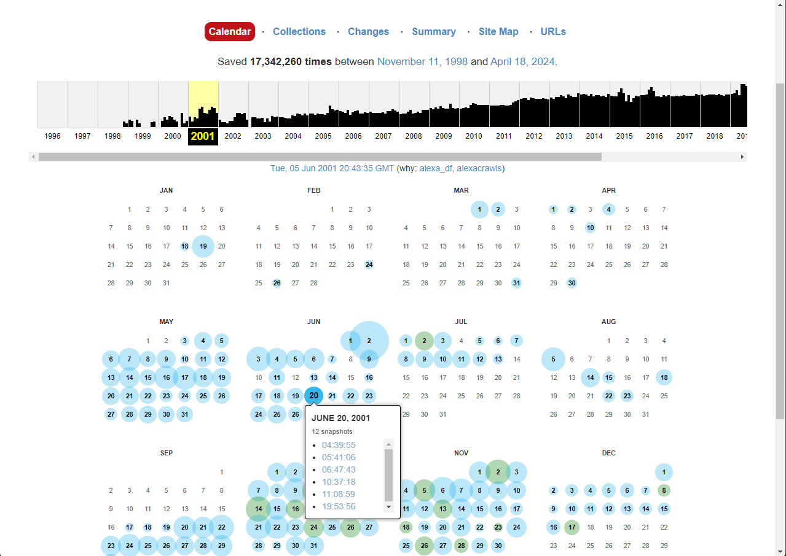
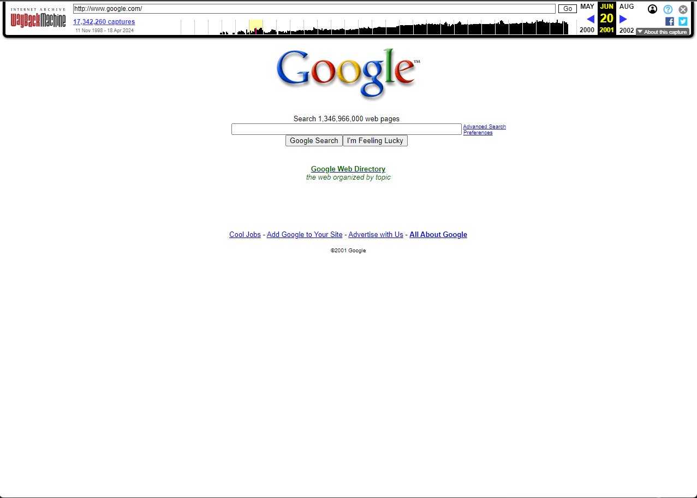
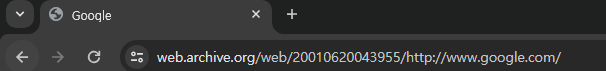
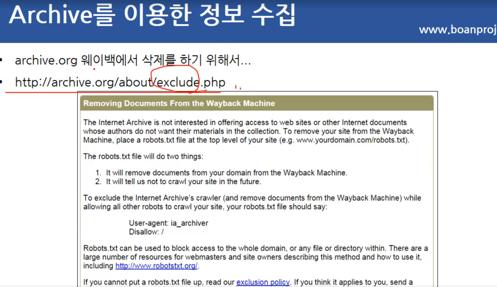

# Netdiscover

ARP(Address Resolution Protocol)를  활용하요 네트워크 세드먼트에서 연결된 클라이언트를 검색하는 스캐너 

명령어 [kali linux 정보 수집 netdiscover 설치 및 활용](https://computerhanashi.tistory.com/entry/kali-linux-%EC%A0%95%EB%B3%B4-%EC%88%98%EC%A7%91-netdiscover-%EC%84%A4%EC%B9%98-%EB%B0%8F-%ED%99%9C%EC%9A%A9)

```
-i 장치: 네트워크 장치
-r range: 자동 스캔 대신 지정된 범위를 스캔합니다. 192.168.6.0/24,/16,/8
-| file: 지정된 파일로 포함된 범위 목록을 검색합니다.
-p 수동 모드: 아무것도 보내지 말고 스니프만 보냅니다.
-m file: 알려진 MAC 및 호스트 이름 목록 검색
-F 필터: pcap 필터 식 사용자 지정(기본값: "arp")
-s 시간: 각 ARP 요청 사이의 절전 시간(밀리초)
-c count: 각 ARP 요청을 보내는 횟수(패킷 손실이 있는 네트의 경우)
-n 노드: 검색에 사용되는 마지막 소스 IP 옥텟(2 ~ 253)
-d 자동 검색 및 고속 모드에 대한 홈 구성 파일 무시
-f 고속 모드 스캔 활성화, 시간 절약, 자동 모드 권장
-P 인쇄 결과를 다른 프로그램에서 구문 분석하기에 적합한 형식으로 인쇄하고 활성 스캔 후 중지
-P와 비슷하지만 활성 스캔이 완료된 후에도 계속 청취합니다.
-N 헤더를 인쇄하지 않습니다. -P 또는 -L이 활성화된 경우에만 유효합니다.
-S 각 요청 간 절전 시간 억제 활성화(하드코어 모드)
```

# 서브도메인 검색 방법

https://urlscan.io/

https://developers.facebook.com/tools/ct?locale=ko_KR

https://dnsdumpster.com/

[subdomain bug hunting - Google 검색](https://www.google.com/search?q=subdomain+bug+hunting&rlz=1C1IBEF_koKR1046KR1046&oq=subdomain+bug&gs_lcrp=EgZjaHJvbWUqCAgBEAAYDRgeMgYIABBFGDkyCAgBEAAYDRgeMgoIAhAAGAgYDRgeMgoIAxAAGAgYDRgeMgoIBBAAGAgYDRgeMgoIBRAAGAUYDRge0gEKMTI4MTZqMGoxNagCCLACAQ&sourceid=chrome&ie=UTF-8)

서브도메인 공부

# Archive를 이용한 정보 수집

internet Archive WayBack Machine이라고 불린다.

모든 보편적인 지식에 접근이 가능할 수있도록 하는 비영리 디지털 도서관

클라이언스크립트(브라우저에서 보이는 페이지들을 전부)의 정보들을 Archive에 저장을 한다.

이 저장한 정보를 볼수 있게 하는 사이트이다.

https://archive.org/

검색할 사이트를 입력후 원하는 년도에 스넵샷으로 클릭하면





해당 스넵샷으로 이동된다

이때 확인해봐야할부분은




