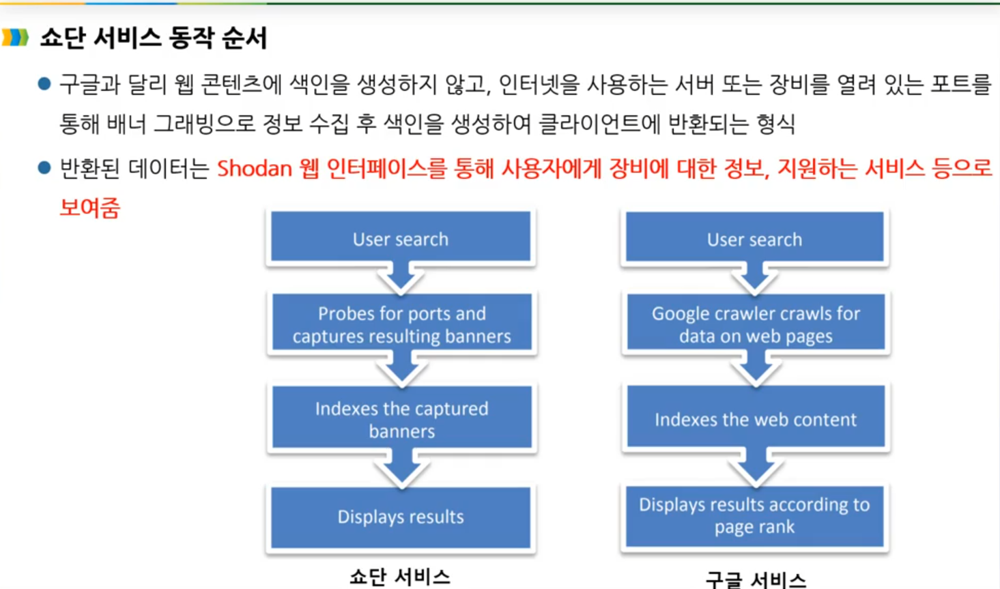
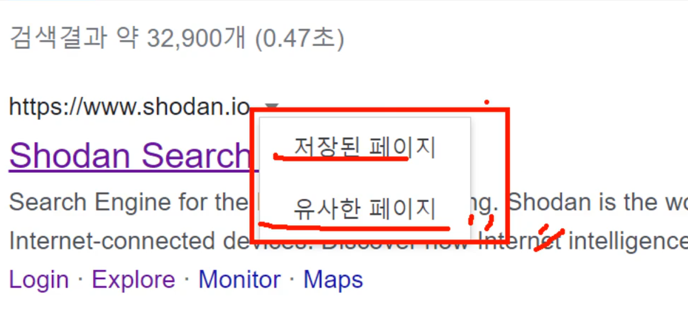
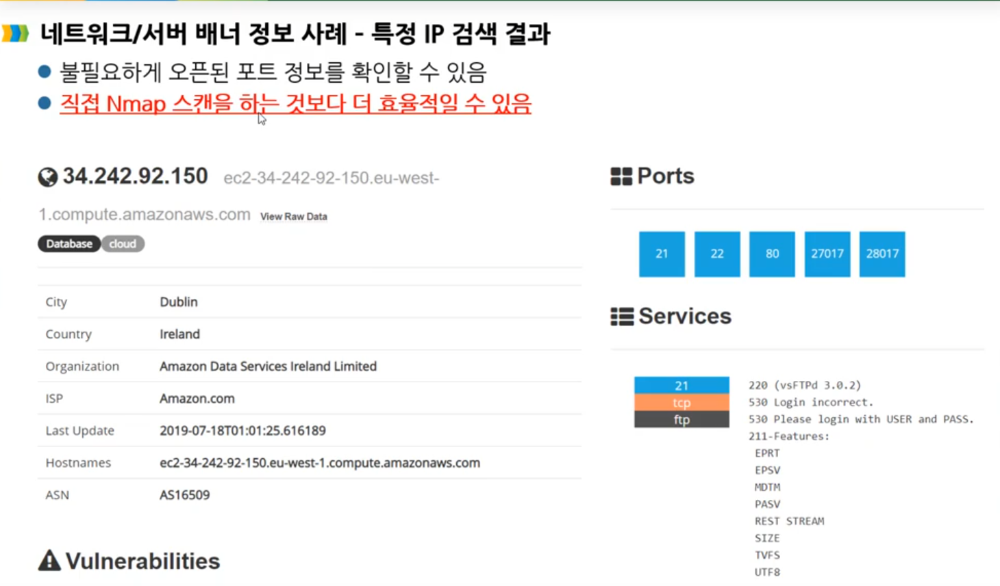
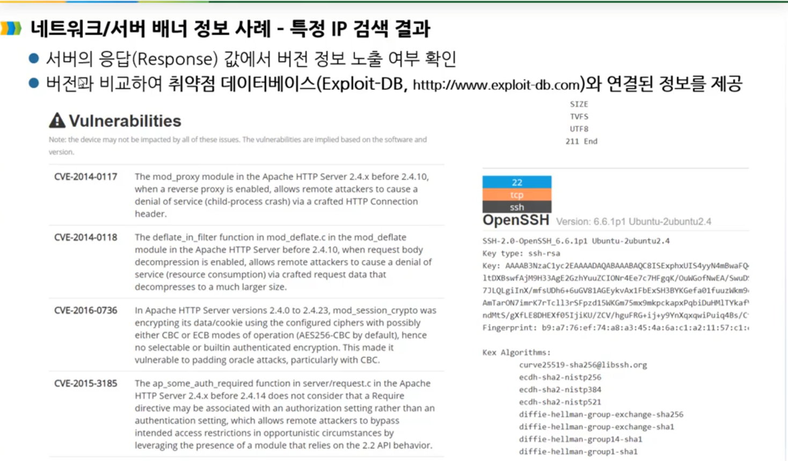
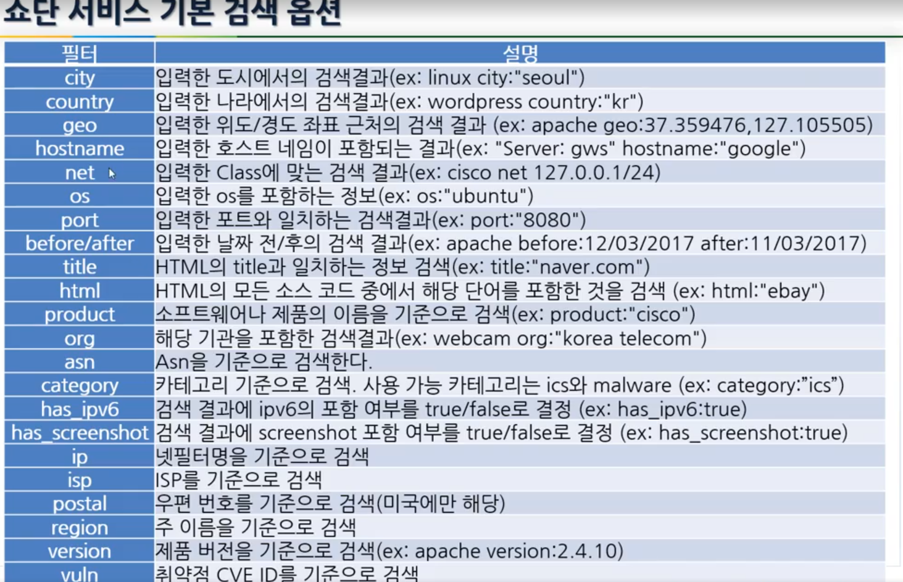

# 쇼단 검색 서비스란 무엇인가?

https://www.shodan.io/

시스템 배너정보로부터 메타데이터들을 이용해서 특정 디바이스,컴퓨터, 라우터, 서버의 정보 검색

특정 시스템 대상으로 공격 대상을 검색할 시에 유용하게 활

## 배너정보란?

요청을 했을때 서버에서 날라오는 응답값(헤더,버전,포트정보 메타정보들) 

쇼단의 서비스 동작 순서

구글의 검색 엔진 동작

000이란걸 검색을 한다고 가정을 할때 미리 000과 관련된 정보들을(캐쉬로) 모아놓는다.

-> 모아놓는것을 Bot(자동으로 무언가를 수집하고 크로링을하는 애들) 이라고 함.  

 

캐쉬정보에 미리 구글에서 사용하고 있는 검색엔진을 통해 나눠준다. 

000이란걸 검색을 하면 링크을 보여주고 그곳을 들어간다. 

쇼단의 검색 엔진 동작

포트정보:프로세스와 연결되어 있는 하나의 게이트이다.

배너정보를 수집한다. 

외부에서 포트 스캔을 직접하지 않아 쇼단을 통해 정보를 확인할 수 있다. 

