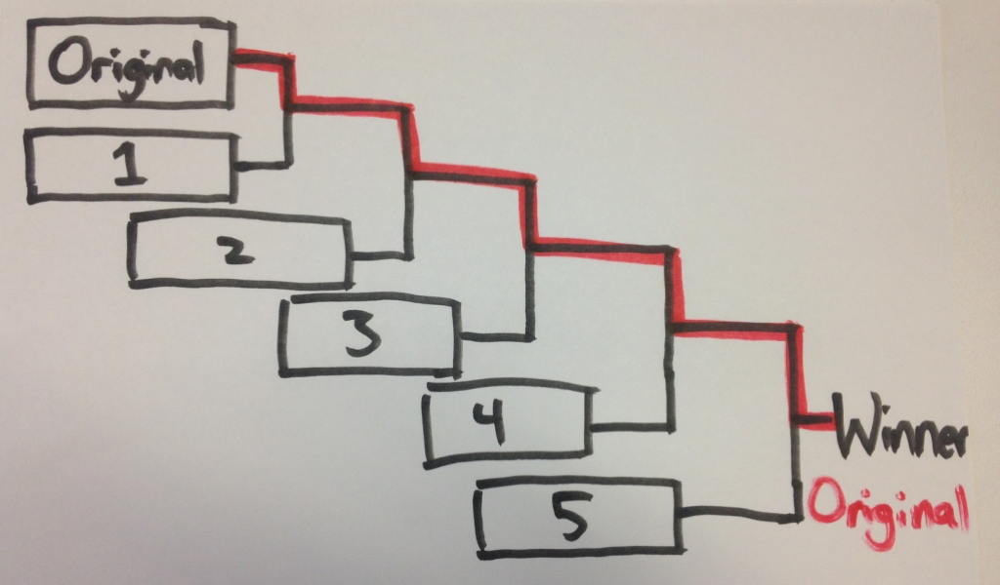

{:right: style="float: right" width="300px"}
{:width="250px"}
{:right}
As a current long-time customer of Netflix (since way before they had streaming) I've found their movie selection lacking, almost as bad as HBO/Cinemax/Showtime. Maybe potential customers saw this too when presented with the variants that showed available movies.

>A lot of potential Netflix users claimed that being able to see the vast library would improve sign-up. However, Netflix's test proved this might not be true.
>
>According to a their data, 46% of survey respondents said that making titles of Netflix content available to browse was the 1 thing they wanted to know more about before signing up.
<!--more-->
>
>The test would start out with the control (not allowing users to browse titles) vs. Variant 1 (where users could scroll different genres, click on a title, get a synopsis, and see all the titles).... 
>
>The team was shocked by the results. The survey data and best practices learned had suggested the exact opposite. Everyone had thought that allowing visitors to preview titles would increase signups. So they dug deep to figure out the reasons why the original performed best.
>
>While survey had shown that 46% of users wanted to browse titles before signing up for Netflix, the tests proved otherwise. Testing reveals our assumptions. That’s why it’s so important to run tests and trust the data. If Netflix had simply followed best practices, they would have been scrambling trying to figure out why their new onboarding was performing so poorly.

Source: <em><a href="https://dzone.com/articles/the-registration-test-results-netflix-never-expect">The Registration Test Results Netflix Never Expected - DZone Mobile</a></em>
