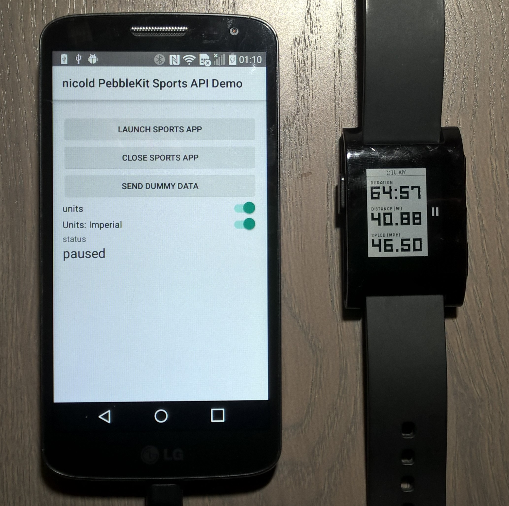

If you are looking for a Xamarin Android sample that show how to manage the Pebble Sport app from a Xamarin Project, I have just released on github a sample for you!:-)

Because I haven't found out there any sample that shows to use Pebble SDK from Xamarin, I decided to write this one.

In order to use latest Pebble aar libary available, go to: <a href="https://oss.sonatype.org/">https://oss.sonatype.org</a> and look for "<strong>com.getpebble</strong>". Download the aar file and use it in a xamarin binding library as shown here.

&nbsp;
<h1>For more information</h1>
<ul>
 	<li><a href="https://developer.xamarin.com/guides/android/advanced_topics/binding-a-java-library/binding-an-aar/" title="https://developer.xamarin.com/guides/android/advanced_topics/binding-a-java-library/binding-an-aar/">https://developer.xamarin.com/guides/android/advanced_topics/binding-a-java-library/binding-an-aar/</a></li>
 	<li><a href="https://developer.pebble.com/guides/communication/using-the-sports-api/" title="https://developer.pebble.com/guides/communication/using-the-sports-api/">https://developer.pebble.com/guides/communication/using-the-sports-api/</a></li>
</ul>
