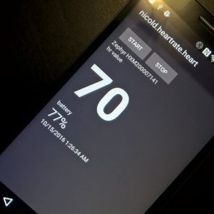

in this sample I use the library found in <a href="https://github.com/xabre/xamarin-bluetooth-le">xamarin-bluetooth-le</a> to read heart rate and battery level from a Polar H7. I have used this sample to test the integration of BLE Heart Rate Characteristics reading for <a href="https://api.caledos.com/">Caledos Runner</a> for android. Hope you enjoy reading it as much as I have enjoyed writing it:-)

All the source code is available here on <a href="https://github.com/nicolgit/demo-xamarin-heartrate-ble">GitHub</a>

