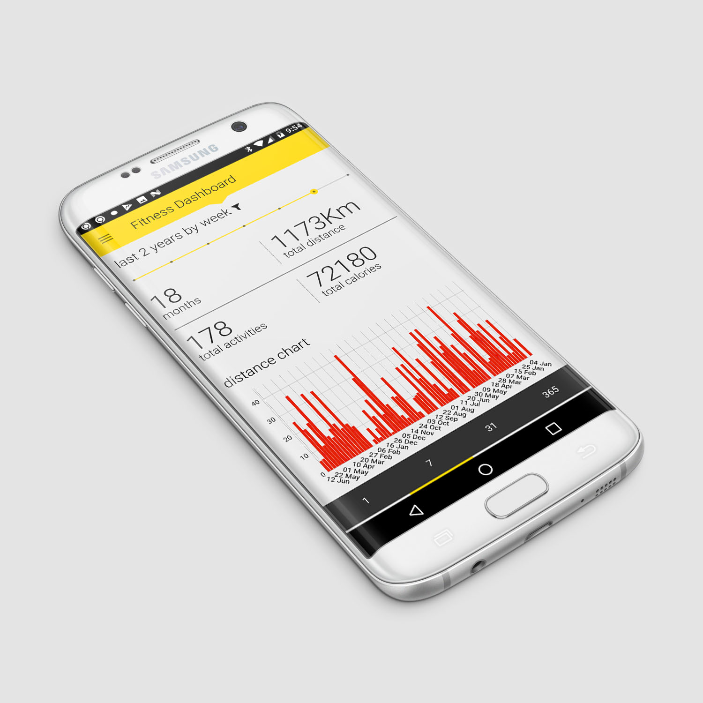
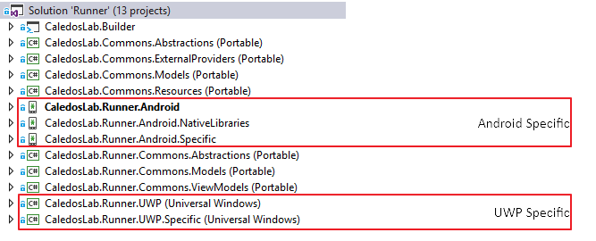
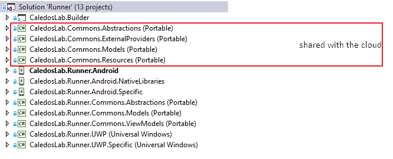
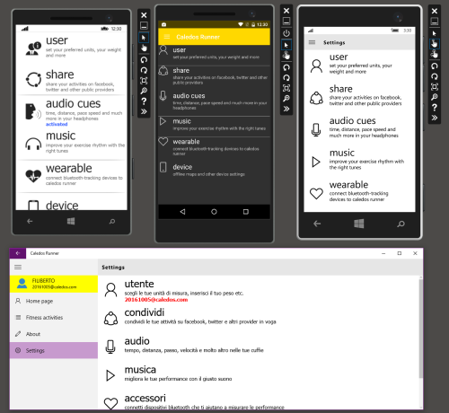
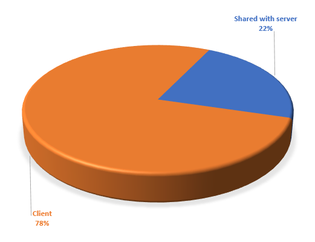
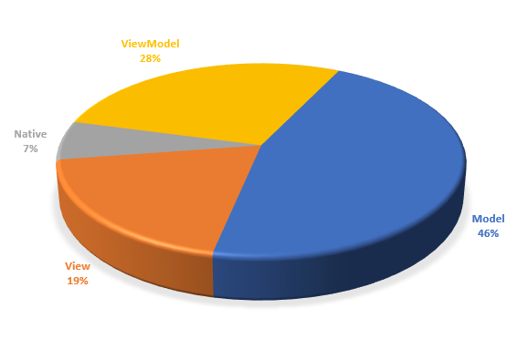

This post is the first of a series with the objective to share the experience on multiplatform development I've collected working on <a href="https://api.caledos.com">Caledos Runner</a>'s: a medium-sized fitness app currently publicly available on the <a href="https://play.google.com/store/apps/details?id=com.caledoslab.runner">Google Play Store</a>. The app is part of a side project on which I and <a href="https://it.linkedin.com/in/domenico-dell-olio-66257417">Domenico</a> have been working for some time, and that it is proving to be a great gym for the study of multiplatform development in general and <a href="https://www.xamarin.com/">Xamarin </a>in particular.

<h1>Background</h1>

<a href="https://www.microsoft.com/en-us/store/p/caledos-runner/9wzdncrfhzwl">Caledos Runner is a fitness tracking application initially developed for Windows Phone (Silverlight)</a>. With over 1 million downloads, it has an Azure-based backend, and uses many of the device's capabilities, such as motion sensors, gyroscope, Bluetooth devices, and GPS, in a very pushy way. Caledos Runner for Android is developed using Xamarin, and it is born as a refactoring and evolution of the code developed for Windows, with the focus on portability and reuse.

<h1>Code Reuse</h1>
Xamarin's distinctive element is the code reuse: in this post I will try to evaluate the amount of code reused between the different platforms. Although we have released only the <a href="https://play.google.com/store/apps/details?id=com.caledoslab.runner">android version</a>, the code refactoring started on Silverlight version, had the goal to maintain the broadest common code base, despite all the interactions with various platform components (Bluetooth, device sensors, GPS etc. ). As "consumer" solution, one of the main features was to have <strong>total control</strong> over the UI.

With these constraints, we have decided to use a native UI (so no <a href="https://www.xamarin.com/forms">Xamarin Forms</a>), <a href="https://en.wikipedia.org/wiki/Model–view–viewmodel">Model-View-ViewModel</a> as an architectural pattern, and <a href="https://www.mvvmcross.com/">MvvmCross</a> as a reference library, as it seemed to be the one that best interacts with a native UI. On Android it also allows the <a href="https://www.mvvmcross.com/documentation/fundamentals/data-binding">binding from XML</a>, in a way very similar to the XAML binding we have used for years in WPF and Windows Phone.

Having said that, in order to "force us" to the order, we have separated in different projects the components:
<ul>
 	<li>Model</li>
 	<li>ViewModel</li>
 	<li>View (platform specific)</li>
</ul>
for all "non view" platform specific components (sensors, text2speech and so on...), we have used the Inversion of Control (IoC) Pattern and in particular the <a href="https://www.mvvmcross.com/documentation/fundamentals/inversion-of-control-ioc">MvvmCross specific approach</a>. So we have declared in a common PCL all the interfaces and implemented them in a platform specific project.

For all Model components, instead, we have used the <a href="https://msdn.microsoft.com/en-us/library/ff650316.aspx">singleton pattern</a>.

Caledos Runner has also another characteristic: it is to have a backend developed in .Net, <a href="https://api.caledos.com">hosted on Azure</a>. We have quickly realized that the most logic thing to do was to share more code possible also with the cloud. Infact there are many functions that are used by both devices and cloud, so we have also defined a portion of Model and libraries, strictly PCL, in common with the cloud.

Initially, the refactoring started in parallel on PCL components, Android specific views and the corresponding UWP. With Microsoft's slowdown on Windows Mobile platform, we also have slowdown our developments on the specific UI for that operating system (after all we already have a <a href="https://www.microsoft.com/en-us/store/p/caledos-runner/9wzdncrfhzwl">fully working silverlight version</a>), and we have focused our efforts on Android, using UWP as tester to verify how the core components work on more than one platform.

<h1>Some Metric</h1>
Visual Studio, thanks to "calculate code metrics" tool, allows to analyze some <a href="https://docs.microsoft.com/en-us/visualstudio/code-quality/code-metrics-values">interesting software metrics</a>.

With this tool I have measured the number of c# lines of code for each project, and in this way I could measure the actual amount of reusable (and reused!) code. Obviously the tool measures only the c# lines of code, not the xml and graphic part, which in this type of solution has a non-negligible dimension.

&nbsp;

total number of lines of code

<h1 style="text-align: center"><strong>10679</strong></h1>

(July 2017 - Shared + Android)

&nbsp;

The following chart shows the relationship between "PCL Shared" code lines vs. Android specific code lines. The solution has &gt;10K lines of code (July 2017)

<h1 style="text-align: center"><strong>74%</strong></h1>

of lines of code are not device specific

Moving to the "shared" part, the following chart shows the relationship between the code shared with the server, and the code in common only between the various clients (droid, UWP).

<h1 style="text-align: center"><strong>42%</strong></h1>

of lines of code shared with server

&nbsp;

the following chart shows instead the relationship between Model, ViewModel, View and Native parts. View and Native are device specific, but while "View" is code related to UI interaction, "Native" is the code needed to interact with device specific components not related with the UI (text 2 speech, sensors, Bluetooth and so on...)

<h1 style="text-align: center"><strong>46% vs 28%</strong></h1>

Model vs ViewModel lines of code

As mentioned above, since the UWP version is a prototype at the moment, at least in terms of the UI and device specific code, in this evaluation, the number of code lines for that operating system has not been taken into account. If Caledos Runner continues to have the interest received on Windows Phone||Mobile, even on Android, the next step will be to implement the iOS UI, then we will probably have still more interesting metrics...

Okay, that's all for now, hope these info are valuable in evaluating the cost/benefit in using Xamarin on a real world consumer app!

I'm going for a run:-)
