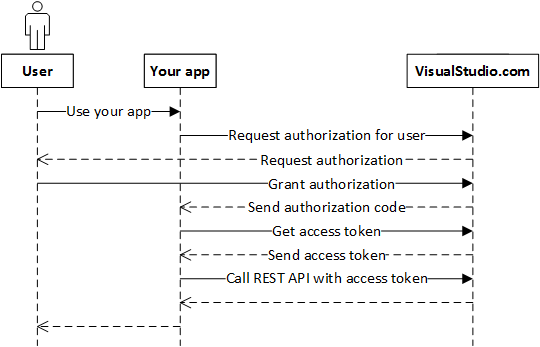
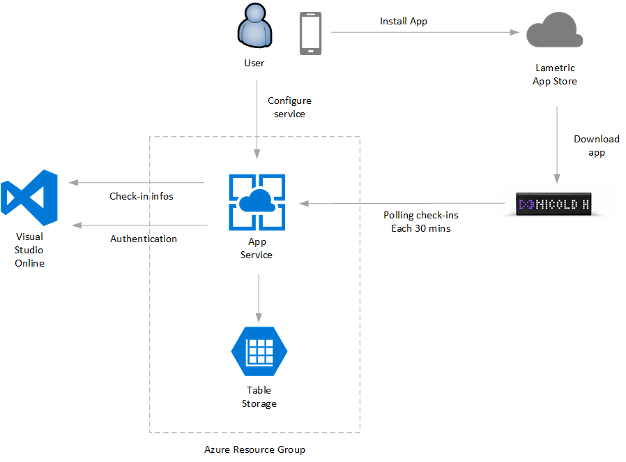
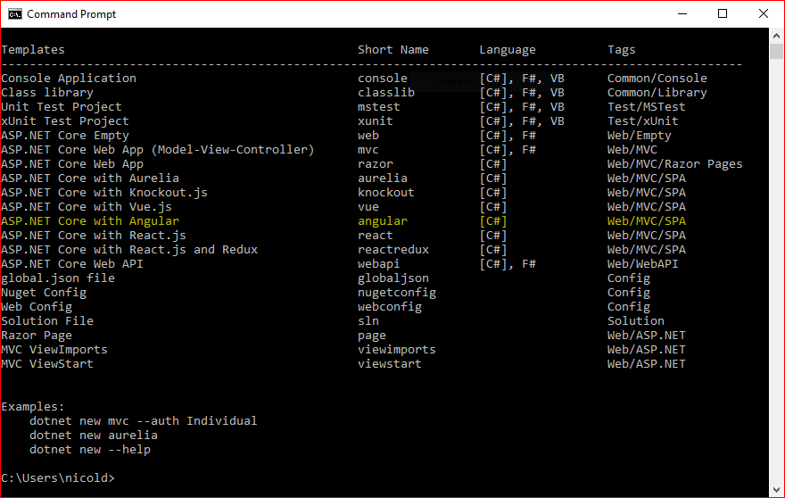

The number of new smart devices to play with grows day after day. The baseline to work with them is essentially always the same set of technologies: federated authentication, OAuth2, REST, AngularJS, Typescript, cloud services... and to operate with a Lametric time (<a href="http://www.lametric.com">www.lametric.com</a>) makes no difference. To build a system that delivers relevant information from a cloud-based Microsoft service like Visual Studio Online (VSO) to Lametric, allows you to have a reference architecture to use as starting point to implement more creative plug-ins for both Lametric and tons of other smart devices available nowadays. In this post, I describe how I have designed and implemented <a href="https://lametric-visualstudio.azurewebsites.net/">https://lametric-visualstudio.azurewebsites.net/</a> an Azure-based sample service that allows to show on your Lametric, check-in information from a TFS project hosted on VSO.
<h1>What's Lametric time?</h1>
LaMetric Time is a smart desktop toy that tracks time, weather, emails, calendar events, tweets, followers, news, deadlines and any other metric needed for your home or business, and displays them almost in real-time! It works as an always-on display for the whole family by showing notifications from smart home devices and allowing anyone to control them with the click of a button. LaMetric Time eliminates the need to check multiple apps or news sites for the information you need. Instead, you receive key information at a glance, all in one place. The possibilities are endless. It also shows real-time notifications from IFTTT-connected services. LaMetric Time is standalone Wi-Fi device, iPhone or Android smartphone is needed for setting it up and configuration only. The interface is easy to use: left and right buttons for navigation between the apps, middle button for taking related actions. The form factor is sized to fit well on a table, shelf, shop-front or a counter.

(more info on their website or on their Kickstarter campaign <a href="https://www.kickstarter.com/projects/smartatoms/lametric-customizable-smart-ticker-for-life-and-bu">https://www.kickstarter.com/projects/smartatoms/lametric-customizable-smart-ticker-for-life-and-bu</a>)

Lametric-Kickstarter[/caption]
<h1>How to deliver information to a Lametric Clock</h1>
Lametric time allows 3 types of interaction:
<ul>
 	<li><strong>Indicator app</strong>: allows to show information coming from "everywhere" in real time (push) or near real-time (periodic polling)</li>
 	<li><strong>Button app</strong>: allows triggering an action (call an external API) with the click of a button</li>
 	<li><strong>Notification app</strong> shows notifications on the clock coming from the local network.</li>
</ul>
Because Visual Studio Online is a SAAS hosted on Azure datacenters, I have opted for an indicator app.

An indicator app can show text and graphs with information coming from an external system. The trick here is to provide a REST endpoint with a specific format that maps 1-1 with the information shown on the clock. In my scenario, I want to show 2 pages, the first with the name of the repository, and the second with a check-in information (check-in username, check-in description, and check-in date). So, the REST data required (as defined on Lametric SDK) must be something like the following:
<pre>{ "frames": [
{ "text": "My Project Repository", "icon": "i9672" },
{ "text": "nicold have checked in 'fixed settings labels' 12 hours ago", "icon": "i9672" }
] }</pre>
Obviously Visual Studio Online have all these information, but they aren't available in this format, so our job is to build a middleware system that does the dirty job to convert VOS information in this format. Both Visual Studio Online and Lametric have the concept of "app". For Visual Studio an app can work on behalf of a specific user and interact with Visual Studio API. The app can be authorized via the classic OAuth 2.0 protocol:

To start, you have to go to [<a href="https://app.vssps.visualstudio.com/app/register">https://app.vssps.visualstudio.com/app/register</a>] and create an app. When you create an app, you need to specify also the scopes the app is authorized to access. VSO provides a huge amount of API, and make no sense to authorize all applications to access to all APIs, so all these are grouped in Scopes. In our scenario, we want to show the last check-in done on a project, so the "<strong>Code (read)</strong>" is where we need to access.

Other information required during the app registration is a name, a description, and an application callback URL app have to call at the end of the authorization flow (in VSO, HTTPS is required). Once created, an App-Id, App-Secret, and Client-Secret are available for you.

For more information on how to implement OAuth 2 authorization flow on visual studio, see <a href="https://docs.microsoft.com/en-us/vsts/integrate/get-started/authentication/oauth">https://docs.microsoft.com/en-us/vsts/integrate/get-started/authentication/oauth</a>

On the other side, a Lametric app is an application that can be installed by the user on the clock via the dedicated app store available via web or mobile app. Here, after you have defined a name, an icon, and a description, you need to define the type of message to show, the endpoint to call and the polling interval. In this sample I have implemented a polling scenario, but a notification implementation is also possible (VSO can send a notification to subscribed apps on check-in events - <a href="https://docs.microsoft.com/en-us/vsts/service-hooks/create-subscription?toc=/vsts/integrate/toc.json&amp;bc=/vsts/integrate/breadcrumb/toc.json">https://docs.microsoft.com/en-us/vsts/service-hooks/create-subscription?toc=/vsts/integrate/toc.json&amp;bc=/vsts/integrate/breadcrumb/toc.json</a> and also Lametric can receive notifications as well).
<h1>Logical Architecture</h1>
In the following schema, you can see the logical architecture for the solution.

After the login flow, the user is authorized to Visual Studio Online. A user can authenticate to Visual Studio Online via a Microsoft account or Azure Active Directory (Azure AD). Once authorized, all relevant user information is stored in an Azure table storage. We keep username, email, OAuth token, OAuth refresh token, and few other stuff.

From a user perspective, he has to go to <a target="_blank" href="https://lametric-visualstudio.azurewebsites.net/" rel="noopener noreferrer">https://lametric-visualstudio.azurewebsites.net/</a> and click on [Access to Visual Studio]. Once authenticated, the app requires permission to access to code scope.

&nbsp;

Once authorized, back on the app, the user has to select the Visual Studio Online TFS project to monitor typing the correct URL and pressing the SAVE button.

After this setup, via the Lametric app store, you have to install the app on the clock and provide the email used above as email parameter: this allows to connect the clock to the correct endpoint. Behind the scene, the clock will pool the following URL: <a href="https://lametric-visualstudio.azurewebsites.net/home/lametric?email=%3cyour-email-address%3e">https://lametric-visualstudio.azurewebsites.net/home/lametric?email=&lt;your-email-address&gt;</a>  The URL is anonymous so you can test it easily in the browser.
<h1>Solution Implementation</h1>
I wanted to implement the solution using the latest generation of Microsoft technologies so I decided to go to a Single Page Application (SPA) hosted on Azure with dot net core API and Azure Table Storage as backend. Luckily there is a fantastic template to use as starting point provided by Microsoft [ <a href="https://blogs.msdn.microsoft.com/webdev/2017/02/14/building-single-page-applications-on-asp-net-core-with-javascriptservices/">https://blogs.msdn.microsoft.com/webdev/2017/02/14/building-single-page-applications-on-asp-net-core-with-javascriptservices/</a> ]:  it does all the boring job of preparing a working project with all these technologies for you. It creates a starting solution with dot net core backend, node, Angular 2 and Typescript client side.

To install the Single Page Application (SPA) templates on your PC, run the following command:
<pre>dotnet new --install Microsoft.AspNetCore.SpaTemplates::*</pre>
Once this is installed, you'll see that '<strong>dotnet new</strong>' now can produce projects based on Angular, Aurelia, Knockout, React, and React + Redux.

Using the highlighted template, we have Client Side Navigation, Server Side pre-rendering, web pack dev middleware, hot module replacement and efficient production builds. More information here [ <a href="https://blogs.msdn.microsoft.com/webdev/2017/02/14/building-single-page-applications-on-asp-net-core-with-javascriptservices/">https://blogs.msdn.microsoft.com/webdev/2017/02/14/building-single-page-applications-on-asp-net-core-with-javascriptservices/</a> ].

Once cleaned the sample from all not required-to-really-work-stuff, the next step is to integrate the authentication. In a perfect world, the best way to proceed is to integrate ASP.NET identity to the solution and connect the ASP.NET identity user to the Visual Studio Online user. This will give you the better and most scalable approach allowing you to have:
<ul>
 	<li>A dedicated user profile database</li>
 	<li>The possibility to add more Visual Studio connected account to a single ASP identity</li>
 	<li>The possibility to add more authentication services</li>
 	<li>Reset password, two-factor authentications, and much more</li>
</ul>
This comes to the cost of setup for the infrastructure, including a storage to keep everything (SQL Azure, SQLite or Azure Tables). In this sample, I decided to not overcomplicate the solution: because this service works only if authenticated from a Visual Studio Online account and I just need to store information for <strong>one</strong> Visual Studio Project, I have decided to implement a "custom" authentication fully based on Visual Studio Online access tokens.

Once authenticated and then authorized by Visual Studio, we have an access_token to Visual Studio APIs. I keep this access code client side and use it in all authenticated post to dot-net core backend. The authenticated calls are just 2: Test-URL and Save-URL. Both calls require in input the URL and the access_token. Checking the validity of the access_token, and so the user identity is verified with a call to a VSO API.

Following the Parameters used on both APIs.

[code language="csharp"]
    public class UrlParameter
    {
        public string url { get; set; }
        public string auth_token { get; set; }
    }
[/code]

The API /Home/Test, is called by the "Test" UI button and its implementation is shown below. It gives a result only if auth_token is not expired and Url is a valid Visual Studio TFS project accessible by the user.

[code language="csharp"]
        [HttpPost]
        async public Task&lt;string&gt; Test([FromBody]UrlParameter input)
        {
            _visualstudio.access_token = input.auth_token;
            var result = await _visualstudio.GetLatestChangesets(input.url);

            if (string.IsNullOrEmpty(result.Error) &amp;&amp; string.IsNullOrEmpty(result.message))
            {
                var output = $&quot;OK, working! query returned {result.count} items.&quot;;
                if (result.count&gt;0)
                {
                    output += $&quot;last check-in by {result.value[0].author.uniqueName}&quot;;
                }

                return output;
            }
            else
            {
                return $&quot;Error {result.Error} - {result.ErrorDescription} - {result.message}&quot;;
            }
        }
[/code]

The API /Home/UpdateURL is called by the "Save" UI button, and it is responsible to save on the Table Storage the project URL. Also here, a call to VSO is done to verify that the user is authorized. After this, the information is stored on the table storage.

[code language="csharp"]
 [HttpPost]
        async public Task&lt;string&gt; UpdateURL([FromBody]UrlParameter input)
        {
            _visualstudio.access_token = input.auth_token;
            var profile = await _visualstudio.GetUserProfileAsync();

            if (string.IsNullOrEmpty(profile.Error) &amp;&amp; string.IsNullOrEmpty(profile.message))
            {
                return await _azureTableManager.UpdateUrl(profile.emailAddress, input.url) ? &quot;OK&quot;: &quot;Error&quot;;
            }
            else
            {
                return $&quot;Error {profile.Error} - {profile.ErrorDescription}&quot;;
            }
        }
[/code]

The 3rd API available from the Home Controller is "Lametric" and is used by the clock to retrieve information to show. ( <a href="https://lametric-visualstudio.azurewebsites.net/home/lametric?email=%3cyour-email-address%3e">https://lametric-visualstudio.azurewebsites.net/home/lametric?email=&lt;your-email-address&gt;</a> ) during this call, the row corresponding to the user email is loaded from the Table Storage, the authentication token to access VSO is refreshed, and then GetLatestChangesets is called.

[code language="csharp"]
        [HttpGet]
        async public Task&lt;LametricMessage&gt; Lametric([FromQuery] string email)
        {
            LametricMessage result = new LametricMessage();

            try
            {
                var infos = await _azureTableManager.GetRow(email);

                var token = await _visualstudio.RefreshAccessCode(infos.RefreshToken);

                if (string.IsNullOrEmpty(token.Error))
                {
                    infos.AccessToken = token.access_token;
                    infos.RefreshToken = token.refresh_token;

                    var repositoryName = infos.VSO_Url.Substring(1 + infos.VSO_Url.LastIndexOf('/'));

                    await _azureTableManager.UpdateRow(infos);

                    _visualstudio.access_token = infos.AccessToken;
                    var changeset = await _visualstudio.GetLatestChangesets(infos.VSO_Url);

                    if (changeset != null &amp;&amp; changeset.count &gt; 0)
                    {
                    /// more stuff here
                    }
                }
            return result;
        }
[/code]

<h1>Conclusions</h1>
Even if this is just a sample, the end 2 end solution is 100% working and shows a reusable approach in integrating different cloud services using dot net core, OAuth, AngularJS and Azure App Service.

All the solution source code is available on GitHub [ <a href="https://github.com/nicolgit/visualstudio-lametric">https://github.com/nicolgit/visualstudio-lametric  </a>], the application is currently hosted on Azure [<a href="https://lametric-visualstudio.azurewebsites.net/">https://lametric-visualstudio.azurewebsites.net/</a>], and the corresponding app is available on Lametric app store [<a href="http://apps.lametric.com/apps/visual_studio_online_checkins/4358">http://apps.lametric.com/apps/visual_studio_online_checkins/4358</a>].

Happy check-ins:-D

   <video  style="display:block; width:100%; height:auto;" controls loop="loop">
       <source src="https://lametric-visualstudio.azurewebsites.net/lametric-visualstudio-final.mp4" type="video/mp4" />
   </video>

