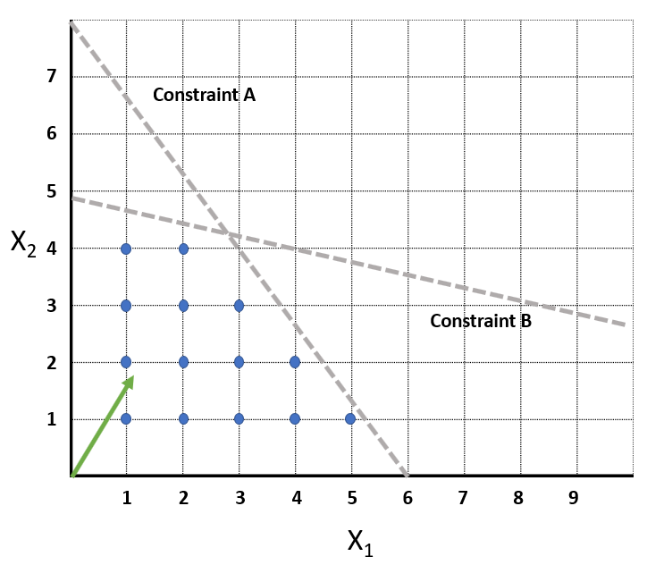

Previously I described how we can perform Discrete Optimization using the Branch and Bound technique. Today I want to describe another foundational technique for Discrete Optimization, Cutting Planes. The idea for Cutting Planes as a way to perform Discrete Optimization comes from Gomory in (date). It is like the Branch and Bound technique in that it uses a series of LP Relaxations to search for solutions. Where it is different from Branch and Bound is in how it refines the LP Formulations. Branch and Bound would subdivide the solution space by branching on a decision variable and creating two subproblems. Instead, what Cutting Planes does is introduce a single new constraint which eliminates the nonintegral solution from the feasible space while not eliminating any feasible integral solutions.

## The Cutting Plane Algorithm

Conceptually the Cutting Plane Algorithm is rather simple. It is made up of the following three steps.

1) Solve the LP Relaxation of the Current Problem
2) Check if the integrality requirements of the original problem have been met. If so, terminate, an optimal solution has been found
3) If the integrality requirements have not been met, add a constraint to the problem which removes the current optimal solution from the feasible space but does not eliminate any of the integer feasible solutions. Return to Step 1

> Obviously you need to check for infeasibility and unboundedness as well. If either one of those conditions arise, terminate.

That is really all there is to this algorithm. The art is in Step 3, generating cuts. A good cut will accelerate the convergence toward an integral solution. Part of the challenge is that there are frequently an infinite number of cuts which could work to reduce the size of the solution space while not eliminating integer feasible solutions. The trick then becomes finding good cuts quickly. The best cut is in of itself an optimization problem. We cannot afford to spend an infinite amount of time searching for the best cut though. There are recipes for being able to calculate good cuts. We will go over some of them in a future post. For now, let's walk through a graphical example of how all this works.

## Graphical Walkthrough of Cutting Planes

Let's say that we have a Discrete Optimization problem with two constraints, Constraint A and Constraint B. These two constraints define a space in which the solution must lie. Our decision variables are $x_1$ and $x_2$. For this scenario they are integer decision variables. Here is a quick sketch of the example problem. This is just a conceptual walkthrough of Cutting Planes so don't fret about exactly what the numbers are. The dotted grey lines are the boundaries of the constraints. The blue dots indicate the integer feasible solutions and the green arrow is the direction in which the objective function is pointing (the direction of greatest improvement).

If we take the LP Relaxation of this problem the optimum would be at the intersection of Constraint A and Constraint B. In the following image this point is indicated by the green dot.

We have labeled the solution to this initial LP $Z^0_{LP}$. The superscript indicates which iteration this is the solution to and the $LP$ subscript indicates it is a solution to the LP Relaxation. We check if the integrality requirements of the original problem have been met. They have not since the optimal solution to the LP does not lie on integer values for $x_1$ and $x_2$. Now we need to generate a new constraint that we can add to the problem which removes $Z^0_{LP}$ from the feasible space but does not eliminate any of the integer feasible solutions.

Later we will go over some methods for calculating these constraints. For now let's just use visual analysis. One of the easiest constraints that we can add is $x_2 \leq 4$. It removes $Z^0_{LP}$ from the feasible space but does not cut off any of our integer feasible solutions. Let's add this constraint and redraw our problem.