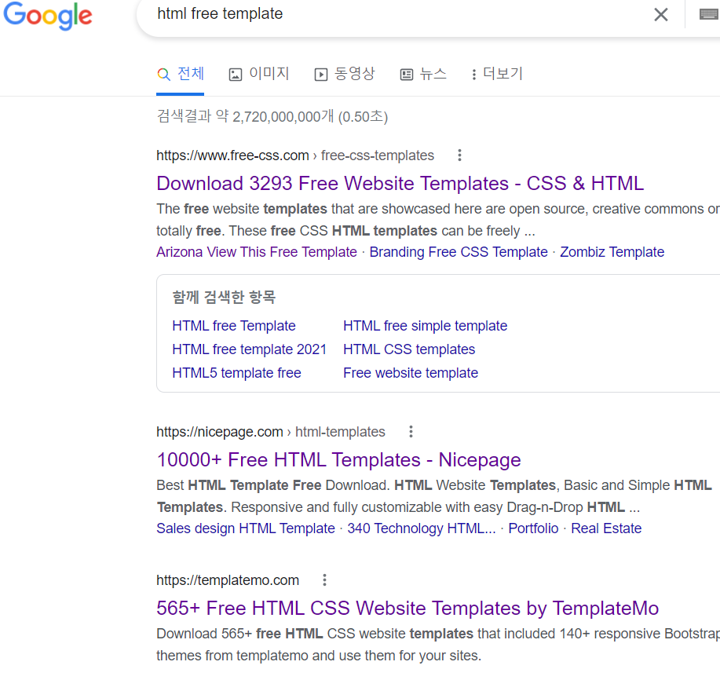
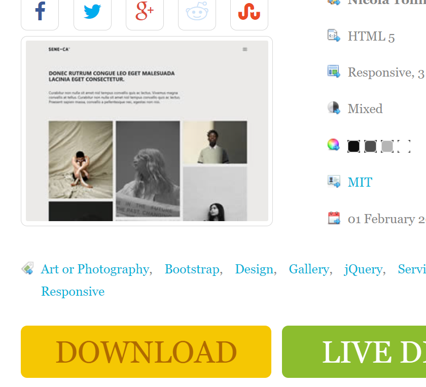
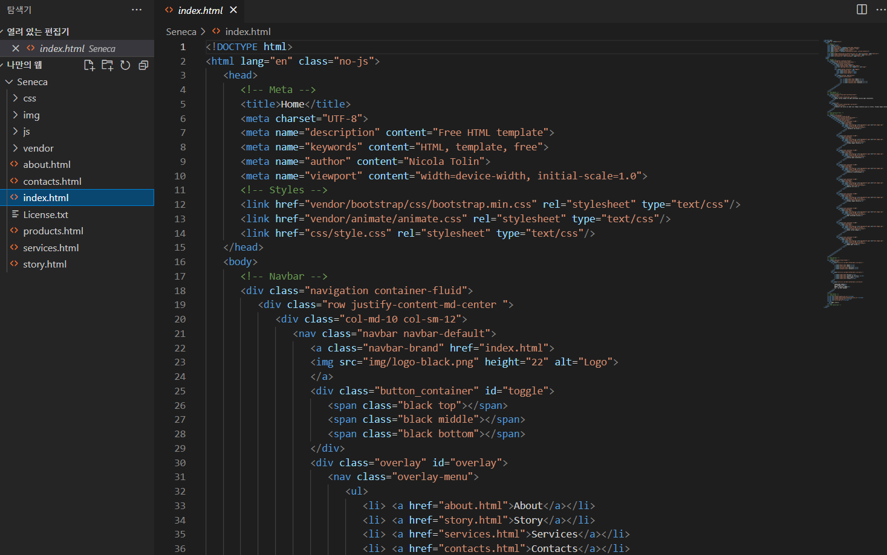

# #1편 - 기본 세팅하기

나만의 덕질 웹페이지 만들기

방학기간 동안 무언가를 만들고 싶다는 생각으로 시작된 프로젝트!

앨범처럼  관심사들을 담은  웹페이지를 만들어 보고 싶다는 생각에 

바로 시작했다

  

우선 페이지의 템플릿을 찾아볼거다

템플릿은 수정 가능하고 새로운 기능 또한 넣을 수  있어서 효율적이다

구글에 들어가서 "html free template"이라고 치면 

이렇게 많이 뜨는 것을 볼 수 있다

이 중에서 마음에 드는 것을 고른다

사진을 많이 넣을 것이기 때문에 이런 템플릿을 골랐다

DOWNLOAD를 누르고

 

 Visual Code로 들어가서 파일을 열면 코드가 쫘르륵 나오는 것을 볼 수 있다

 

처음 뜨는 메인 창은 index.html 이라는 부분이고

 웹의 애니메이션과 디자인 등을  담당하는 부분은 css - style.css 이다

  

Ctrl + F5를 눌러 Chrome 창이 잘 열리는지 확인!

  

잘 열린다 👍

이러면 기본 세팅은 끝이 났다! 

