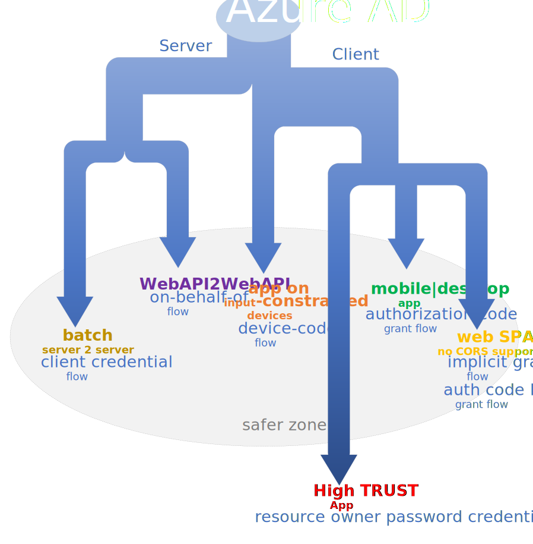

Microsoft Identity Platform: witch OAuth2 flow should I use? My **non-prescriptive** one-page guide in choosing the right auth flow for every situation :-)

<a href="https://docs.microsoft.com/it-it/azure/active-directory/develop/v2-protocols-oidc" target="_blank">OpenID Connect (OIDC)</a> is an authentication protocol built on OAuth 2.0 that you can use to securely sign in a user to an application. OpenID Connect extends the OAuth 2.0 authorization protocol for use as an authentication protocol, so that you can do single sign-on using OAuth 2.0.

OpenID Connect introduces also the concept of an IdToken (a security token that allows the client to verify the identity of the user) and the UserInfo endpoint, an API that returns information about the user.

The first step of OAuth 2.0 is to get authorization from the user. For browser-based or mobile apps, this is usually accomplished by displaying an interface provided by the service to the user.

**Grants are the ways of retrieving an Access Token**. OAuth 2.0 supports **several** different grants. Deciding which one is suited for your case depends mostly on your client's type, but also by the level of trust for the Client and the experience you want your users to have. 

The Azure Active Directory supports the following OAuth 2.0 grants:

* <a href="https://docs.microsoft.com/en-us/azure/active-directory/develop/v2-oauth2-implicit-grant-flow" target="_blank">Implicit Grant flow</a>
* <a href="https://docs.microsoft.com/en-us/azure/active-directory/develop/v2-oauth2-auth-code-flow" target="_blank">Authorization code grant flow</a>
* <a href="https://docs.microsoft.com/en-us/azure/active-directory/develop/v2-oauth2-on-behalf-of-flow" target="_blank">On behalf of flow</a>
* <a href="https://docs.microsoft.com/en-us/azure/active-directory/develop/v2-oauth2-client-creds-grant-flow" target="_blank">Client credential flow</a>
* <a href="https://docs.microsoft.com/en-us/azure/active-directory/develop/v2-oauth2-device-code" target="_blank">Device code flow grant</a>  
* <a href="https://docs.microsoft.com/en-us/azure/active-directory/develop/v2-oauth-ropc" target="_blank">Resource owner password credential grant</a>

How can I decide which OAuth flow *should* I use in my application? 

# Batch (server) applications
In this category we have server-to-server interactions that must run in the background, without immediate interaction with a user. These types of applications are often referred to as daemons or service accounts.

This scenario is well addressed by the **OAuth 2.0 client credentials grant flow** specified in RFC 6749, sometimes called two-legged OAuth, to access web-hosted resources by using the identity of an application.

# WebApi to WebApi interactions
When an application invokes a service/web API, which in turn needs to call another service/web API, the **OAuth 2.0 On-Behalf-Of flow**
(OBO) should be used. The idea is to propagate the delegated user identity and permissions through the request chain. For the middle-tier service to make authenticated requests to the downstream service, it needs to secure an access token from the Microsoft identity platform, on behalf of the user.

# Application running on input constrained devices

Input-constrained devices such as a smart TVs, IoT devices, or printers must support an authentication method that simplify the user interaction. In this context, to type a complex password can be a challenge or almost impossible. **Device code authorization grant**, is here the recommended approach. 

# Mobile or Desktop application
Apps that are installed on a device to gain access to protected resources, such as web APIs should use the **OAuth 2.0 authorization code grant**. This flow enables apps to securely acquire access-tokens that can be used to access resources secured by the Microsoft identity platform endpoint, as well as refresh tokens to get additional access-tokens, and ID tokens for the signed in user.

# Web|Single Page Application
Single-page and other JavaScript apps that run primarily in a browser face a few interesting challenges when it comes to authentication:

* The security characteristics of these apps are significantly different from traditional server-based web applications.
* Many authorization servers and identity providers do not support <a href="https://en.wikipedia.org/wiki/Cross-origin_resource_sharing" target="_blank">CORS</a> requests.
* Full page browser redirects away from the app become particularly invasive to the user experience.

We have 2 grant options suitable here:

* **implicit grant**: In this case, instead of getting an authorization code that needs to be exchanged for an access token, **the application directly retrieves an Access Token**. This means a reduced number round trips, but because the client is not private refresh token is not exchanged because the client can't keep it private.
* **Authorzation code Grant with PKCE**: it **is the recommended approach** because secured via a Prook of key code Exchange (PKCE). When the Client asks for an Authorization Code it generates a code-verifyer and its transformed value called code-challenge. The code-challenge and a code-challenge-method are sent along with the request. When the Client wants to exchange the Authorization Code for an Access Token, it also sends along the code-verifyer. The Authorization Server transforms this and if it matches the originally sent code_challenge, it returns an Access Token.

# High trust application

Applications  that are authorized to **touch** (and see!) user's password falls in this category. To allow an application to sign in the user by directly handling their password is an **high risk behavior** and **should be avoided when possible**. In this case the **Resource Owner password flow** is the choice. In most scenarios, more secure alternatives are available and recommended. This flow requires a very high degree of trust in the application, and carries risks which are not present in other flows. You should only use this flow when other more secure flows can't be used.

