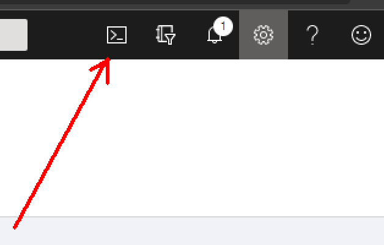
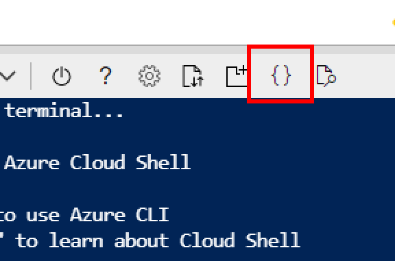
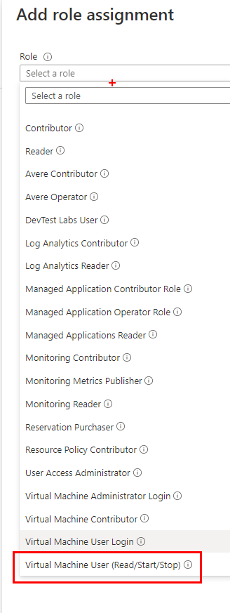

This walktrough  demonstrates how to create a custom role in azure to allow a specific user or group to Start/Stop a Virtual Machine on Azure.

For more information:

* Azure Custom Roles: https://docs.microsoft.com/it-it/azure/role-based-access-control/custom-roles
* Azure Compute Actions:  https://docs.microsoft.com/en-us/azure/role-based-access-control/resource-provider-operations#microsoftcompute

# How to create a custom role

From https://portal.azure.com go to the cloud shell using the toolbar button.



It will open the Azure command line interface. 

Click on "open editor" button.



and paste the following JSON

```json
{
  "Name": "Virtual Machine User (Read/Start/Stop)",
  "IsCustom": true,
  "Description": "Can deallocate, start  and restart virtual machines.",
  "Actions": [
    "Microsoft.Compute/*/read",
    "Microsoft.Compute/virtualMachines/start/action",
    "Microsoft.Compute/virtualMachines/restart/action",
    "Microsoft.Compute/virtualMachines/deallocate/action"
  ],
  "NotActions": [],
  "AssignableScopes": [
    "/subscriptions/XXXXXXX"
  ]
}
```

Replace **XXXXXXX** with your subscription's guid.

Click [save] and as name use "vm-start-stop.json".

In the cloud shell window type:

```bash
az role definition create --role-definition vm-start-stop.json
```

# How to use it

Once created, a new custom role is available in Access Control (IAM) as shown below.

