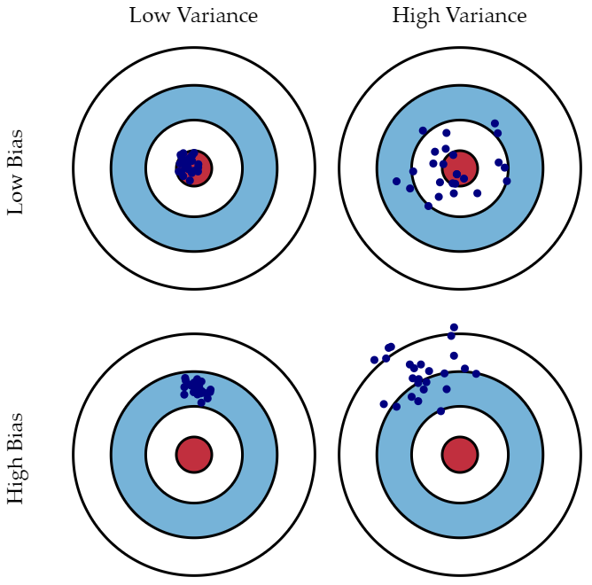

## Gradient Boosting Algorithm

Gradient Boosting Algorithm (GBM) is a technique for regression and classification problems. It is known as the algorithm that has the best predicting performance.

There are some kinds of GBM packages, such as LightGBM, CatBoost, and XGBoost.

Random Forest produces some of decision trees *randomly* and ensembles these to predict new data.

On the other hand, GBM produces decision tress sequently considering and implementing the error(residual) occured by the previous tree.

Boosting means the process that made strong classification model in the form of an ensemble of weak prediction models, typically decision trees.


### Loss function and residual

Let loss function ....

The negative gradient of Loss function is same as residual. It means minimizing residual to produce strong model is same as minimizing negative gradient of loss function. It is similar to gradient descent method. So, GBM is called that it combines gradient descent method and boosting.

<https://3months.tistory.com/368>

### Parameters of function, sklearn.ensemble.GradientBoostingClassifier

- **loss** : 'deviance'(default) = probabilistic outputs / 'exponential' = AdaBoost algorithm
- **learning_rate** : shrinks the contribution of each tree by ```learning_rate```
- **n_estimators** : the number of boosting stages to perform.
- **subsample** : The fraction of samples to be used for fitting the individual base learners.
- **criterion** : 'friedman_mse'(default) is commonly used.
- **min_samples_split** : The minimum number of samples required to split an internal node.
- **min_samples_leaf** : The minimum number of samples required to be at a leaf node. It may have the effect of smoothing the model, especially in regression.
- **min_weight_fraction_leaf** : The minimum weighted fraction of the sum total of weights (of all the input samples) required to be at a leaf node. 
- **max_depth** : The maximum depth of the individual regression estimators.
- *min_impurity_decrease*
- *min_impurity_split*
- *init*
- **random_state** : To give the random seed.
- *max_features* : The number of features to consider when looking for the best split
- **verbose** : '0'(default) / if '1', prints progress and performance once in a while. / if greater than 1, prints progress and performance for every tree.
- **max_leaf_nodes** : If None(default) then unlimited number of leaf nodes.
- *warm_start*
- *validation_fraction*
- *n_iter_no_change*
- **tol** : tolerance for the early stopping.
- *ccp_alpha*

From <https://scikit-learn.org/stable/modules/generated/sklearn.ensemble.GradientBoostingClassifier.html>

### Further explanations

If learning rate is small, target doesn't change much. As a result, consequent trees have similar structure.

To fight this, different randomizations are introduced:
- subsampling (take random part of data to train each tree)
- and random subspaces (take random subset of features to build a tree), only 2 variables in the demo, so random rotations are used instead of random subspaces.

from other demo you can find why large learning rate is a bad idea and small learning rate is recommended.
- did you notice? If you set learning rate to be high (without using Newton-Raphson update) only several first trees make serious contribution, other trees are almost not used

From <http://arogozhnikov.github.io/2016/07/05/gradient_boosting_playground.html>

Plus, in this site, we can simulate the GBM intuitively changing serveral parameters.

### Bias and Variances

From [Wikipedia](https://en.wikipedia.org/wiki/Bias%E2%80%93variance_tradeoff)

The **bias** error is an error from erroneous assumptions in the learning algorithm. High bias can cause an algorithm to miss the relevant relations between features and target outputs (underfitting).

The **variance** is an error from sensitivity to small fluctuations in the training set. High variance can cause an algorithm to model the random noise in the training data, rather than the intended outputs (overfitting).

{: width="500" height="500"}

img from : <https://bkshin.tistory.com/entry/%EB%A8%B8%EC%8B%A0%EB%9F%AC%EB%8B%9D-12-%ED%8E%B8%ED%96%A5Bias%EC%99%80-%EB%B6%84%EC%82%B0Variance-Trade-off?category=1057680>

