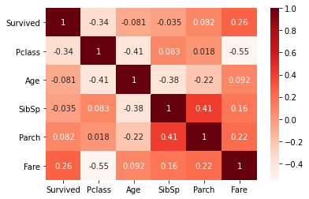
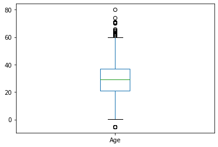
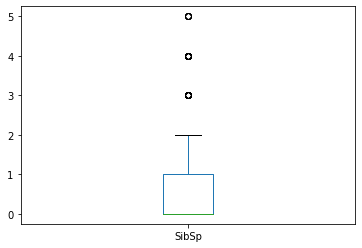
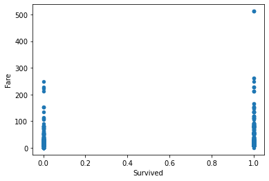
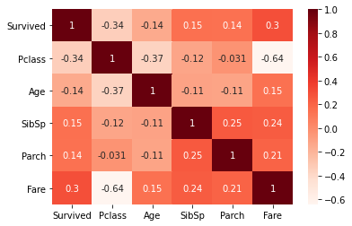

kaggle 타이타닉 data 사용 : https://www.kaggle.com/c/titanic


```python
import warnings
warnings.filterwarnings('ignore')
import pandas as pd
import numpy as np
```

# 데이터 불러오기


```python
train = pd.read_csv("../data/titanic/train.csv")
test = pd.read_csv("../data/titanic/test.csv")
```


```python
train.head()
```


<div>
<style scoped>
    .dataframe tbody tr th:only-of-type {
        vertical-align: middle;
    }

    .dataframe tbody tr th {
        vertical-align: top;
    }
    
    .dataframe thead th {
        text-align: right;
    }
</style>

<table border="1" class="dataframe">
  <thead>
    <tr style="text-align: right;">
      <th></th>
      <th>PassengerId</th>
      <th>Survived</th>
      <th>Pclass</th>
      <th>Name</th>
      <th>Sex</th>
      <th>Age</th>
      <th>SibSp</th>
      <th>Parch</th>
      <th>Ticket</th>
      <th>Fare</th>
      <th>Cabin</th>
      <th>Embarked</th>
    </tr>
  </thead>
  <tbody>
    <tr>
      <th>0</th>
      <td>1</td>
      <td>0</td>
      <td>3</td>
      <td>Braund, Mr. Owen Harris</td>
      <td>male</td>
      <td>22.0</td>
      <td>1</td>
      <td>0</td>
      <td>A/5 21171</td>
      <td>7.2500</td>
      <td>NaN</td>
      <td>S</td>
    </tr>
    <tr>
      <th>1</th>
      <td>2</td>
      <td>1</td>
      <td>1</td>
      <td>Cumings, Mrs. John Bradley (Florence Briggs Th...</td>
      <td>female</td>
      <td>38.0</td>
      <td>1</td>
      <td>0</td>
      <td>PC 17599</td>
      <td>71.2833</td>
      <td>C85</td>
      <td>C</td>
    </tr>
    <tr>
      <th>2</th>
      <td>3</td>
      <td>1</td>
      <td>3</td>
      <td>Heikkinen, Miss. Laina</td>
      <td>female</td>
      <td>26.0</td>
      <td>0</td>
      <td>0</td>
      <td>STON/O2. 3101282</td>
      <td>7.9250</td>
      <td>NaN</td>
      <td>S</td>
    </tr>
    <tr>
      <th>3</th>
      <td>4</td>
      <td>1</td>
      <td>1</td>
      <td>Futrelle, Mrs. Jacques Heath (Lily May Peel)</td>
      <td>female</td>
      <td>35.0</td>
      <td>1</td>
      <td>0</td>
      <td>113803</td>
      <td>53.1000</td>
      <td>C123</td>
      <td>S</td>
    </tr>
    <tr>
      <th>4</th>
      <td>5</td>
      <td>0</td>
      <td>3</td>
      <td>Allen, Mr. William Henry</td>
      <td>male</td>
      <td>35.0</td>
      <td>0</td>
      <td>0</td>
      <td>373450</td>
      <td>8.0500</td>
      <td>NaN</td>
      <td>S</td>
    </tr>
  </tbody>
</table>
</div>


# 숫자형 문자형 컬럼 분류


```python
num = []
cat = []

for i in range(len(train.columns)):
    if train[train.columns[i]].dtype != 'O' :
        num.append(train.columns[i])
    else :
        cat.append(train.columns[i])
```


```python
num
```


    ['PassengerId', 'Survived', 'Pclass', 'Age', 'SibSp', 'Parch', 'Fare']


```python
cat
```


    ['Name', 'Sex', 'Ticket', 'Cabin', 'Embarked']


## 사용하지 않을 컬럼 제외


```python
train.drop(['PassengerId','Name','Ticket'] , axis = 1 , inplace = True)
test.drop(['PassengerId','Name','Ticket'] , axis = 1 , inplace = True)
num.remove('PassengerId')
cat.remove('Name')
cat.remove('Ticket')
```


```python
num , cat
```


    (['Survived', 'Pclass', 'Age', 'SibSp', 'Parch', 'Fare'],
     ['Sex', 'Cabin', 'Embarked'])


# 전처리


```python
train.head()
```


<div>
<style scoped>
    .dataframe tbody tr th:only-of-type {
        vertical-align: middle;
    }

    .dataframe tbody tr th {
        vertical-align: top;
    }
    
    .dataframe thead th {
        text-align: right;
    }
</style>
<table border="1" class="dataframe">
  <thead>
    <tr style="text-align: right;">
      <th></th>
      <th>Survived</th>
      <th>Pclass</th>
      <th>Sex</th>
      <th>Age</th>
      <th>SibSp</th>
      <th>Parch</th>
      <th>Fare</th>
      <th>Cabin</th>
      <th>Embarked</th>
    </tr>
  </thead>
  <tbody>
    <tr>
      <th>0</th>
      <td>0</td>
      <td>3</td>
      <td>male</td>
      <td>22.0</td>
      <td>1</td>
      <td>0</td>
      <td>7.2500</td>
      <td>NaN</td>
      <td>S</td>
    </tr>
    <tr>
      <th>1</th>
      <td>1</td>
      <td>1</td>
      <td>female</td>
      <td>38.0</td>
      <td>1</td>
      <td>0</td>
      <td>71.2833</td>
      <td>C85</td>
      <td>C</td>
    </tr>
    <tr>
      <th>2</th>
      <td>1</td>
      <td>3</td>
      <td>female</td>
      <td>26.0</td>
      <td>0</td>
      <td>0</td>
      <td>7.9250</td>
      <td>NaN</td>
      <td>S</td>
    </tr>
    <tr>
      <th>3</th>
      <td>1</td>
      <td>1</td>
      <td>female</td>
      <td>35.0</td>
      <td>1</td>
      <td>0</td>
      <td>53.1000</td>
      <td>C123</td>
      <td>S</td>
    </tr>
    <tr>
      <th>4</th>
      <td>0</td>
      <td>3</td>
      <td>male</td>
      <td>35.0</td>
      <td>0</td>
      <td>0</td>
      <td>8.0500</td>
      <td>NaN</td>
      <td>S</td>
    </tr>
  </tbody>
</table>
</div>


```python
display(train.isnull().sum())
print('-------------------')
display(test.isnull().sum())
```


    Survived      0
    Pclass        0
    Sex           0
    Age         177
    SibSp         0
    Parch         0
    Fare          0
    Cabin       687
    Embarked      2
    dtype: int64


    -------------------


    Pclass        0
    Sex           0
    Age          86
    SibSp         0
    Parch         0
    Fare          1
    Cabin       327
    Embarked      0
    dtype: int64


```python
train.shape
```


    (891, 9)


```python
train.drop('Cabin' , axis = 1 , inplace = True)
test.drop('Cabin' , axis = 1 , inplace = True)
```


```python
cat.remove('Cabin')
```

## 문자열 -> 숫자형

### Sex


```python
from sklearn.preprocessing import LabelEncoder
le = LabelEncoder()
```


```python
train['Sex'].value_counts()
```


    male      577
    female    314
    Name: Sex, dtype: int64


```python
train['Sex'] = le.fit_transform(train['Sex'])
test['Sex'] = le.fit_transform(test['Sex'])
```


```python
train['Sex'].value_counts() # 1 : male , 0 : female
```


    1    577
    0    314
    Name: Sex, dtype: int64


### Embarked


```python
train['Embarked'].value_counts()
```


    S    644
    C    168
    Q     77
    Name: Embarked, dtype: int64


```python
test['Embarked'].value_counts()
```


    S    270
    C    102
    Q     46
    Name: Embarked, dtype: int64


```python
train['Embarked'] = train['Embarked'].fillna('S')
test['Embarked'] = test['Embarked'].fillna('S')
```


```python
train = pd.get_dummies(train)
```


```python
test = pd.get_dummies(test)
```


```python
len(train.columns) , len(test.columns)       # train 은 Survived 가 있어 column 개수가 1개 더 많아야 한다
```


    (10, 9)


## NAN 값


```python
display(train.isnull().sum())
print('-------------------')
display(test.isnull().sum())
```


    Survived        0
    Pclass          0
    Sex             0
    Age           177
    SibSp           0
    Parch           0
    Fare            0
    Embarked_C      0
    Embarked_Q      0
    Embarked_S      0
    dtype: int64


    -------------------


    Pclass         0
    Sex            0
    Age           86
    SibSp          0
    Parch          0
    Fare           1
    Embarked_C     0
    Embarked_Q     0
    Embarked_S     0
    dtype: int64


```python
from impyute.imputation.cs import mice
```


```python
num
```


    ['Survived', 'Pclass', 'Age', 'SibSp', 'Parch', 'Fare']


```python
num_test = ['Pclass', 'Age', 'SibSp', 'Parch', 'Fare']
```


```python
imputed_training=mice(train[num].values)
train[num] = imputed_training

imputed_training=mice(test[num_test].values)
test[num_test] = imputed_training
```


```python
display(train.isnull().sum())
print('-------------------')
display(test.isnull().sum())
```


    Survived      0
    Pclass        0
    Sex           0
    Age           0
    SibSp         0
    Parch         0
    Fare          0
    Embarked_C    0
    Embarked_Q    0
    Embarked_S    0
    dtype: int64


    -------------------


    Pclass        0
    Sex           0
    Age           0
    SibSp         0
    Parch         0
    Fare          0
    Embarked_C    0
    Embarked_Q    0
    Embarked_S    0
    dtype: int64


## 이상치


```python
import seaborn as sns
import matplotlib.pyplot as plt
```


```python
cor = train[num].corr()
sns.heatmap(cor, annot=True, cmap=plt.cm.Reds)
plt.show()
```





```python
num
```


    ['Survived', 'Pclass', 'Age', 'SibSp', 'Parch', 'Fare']


### Age


```python
train.plot(kind = 'box' , x = "Survived" , y = "Age")
```


    <AxesSubplot:>





```python
q1 = train['Age'].quantile(0.25)
q3 = train['Age'].quantile(0.75)
iqr = q3 - q1
condition = (train['Age'] < q1 - 1.5*iqr) | (train['Age'] > q3 + 1.5*iqr) # or
```


```python
train[condition]
```


<div>
<style scoped>
    .dataframe tbody tr th:only-of-type {
        vertical-align: middle;
    }

    .dataframe tbody tr th {
        vertical-align: top;
    }
    
    .dataframe thead th {
        text-align: right;
    }
</style>
<table border="1" class="dataframe">
  <thead>
    <tr style="text-align: right;">
      <th></th>
      <th>Survived</th>
      <th>Pclass</th>
      <th>Sex</th>
      <th>Age</th>
      <th>SibSp</th>
      <th>Parch</th>
      <th>Fare</th>
      <th>Embarked_C</th>
      <th>Embarked_Q</th>
      <th>Embarked_S</th>
    </tr>
  </thead>
  <tbody>
    <tr>
      <th>33</th>
      <td>0.0</td>
      <td>2.0</td>
      <td>1</td>
      <td>66.000000</td>
      <td>0.0</td>
      <td>0.0</td>
      <td>10.5000</td>
      <td>0</td>
      <td>0</td>
      <td>1</td>
    </tr>
    <tr>
      <th>54</th>
      <td>0.0</td>
      <td>1.0</td>
      <td>1</td>
      <td>65.000000</td>
      <td>0.0</td>
      <td>1.0</td>
      <td>61.9792</td>
      <td>1</td>
      <td>0</td>
      <td>0</td>
    </tr>
    <tr>
      <th>96</th>
      <td>0.0</td>
      <td>1.0</td>
      <td>1</td>
      <td>71.000000</td>
      <td>0.0</td>
      <td>0.0</td>
      <td>34.6542</td>
      <td>1</td>
      <td>0</td>
      <td>0</td>
    </tr>
    <tr>
      <th>116</th>
      <td>0.0</td>
      <td>3.0</td>
      <td>1</td>
      <td>70.500000</td>
      <td>0.0</td>
      <td>0.0</td>
      <td>7.7500</td>
      <td>0</td>
      <td>1</td>
      <td>0</td>
    </tr>
    <tr>
      <th>159</th>
      <td>0.0</td>
      <td>3.0</td>
      <td>1</td>
      <td>-5.349833</td>
      <td>8.0</td>
      <td>2.0</td>
      <td>69.5500</td>
      <td>0</td>
      <td>0</td>
      <td>1</td>
    </tr>
    <tr>
      <th>170</th>
      <td>0.0</td>
      <td>1.0</td>
      <td>1</td>
      <td>61.000000</td>
      <td>0.0</td>
      <td>0.0</td>
      <td>33.5000</td>
      <td>0</td>
      <td>0</td>
      <td>1</td>
    </tr>
    <tr>
      <th>180</th>
      <td>0.0</td>
      <td>3.0</td>
      <td>0</td>
      <td>-5.349833</td>
      <td>8.0</td>
      <td>2.0</td>
      <td>69.5500</td>
      <td>0</td>
      <td>0</td>
      <td>1</td>
    </tr>
    <tr>
      <th>201</th>
      <td>0.0</td>
      <td>3.0</td>
      <td>1</td>
      <td>-5.349833</td>
      <td>8.0</td>
      <td>2.0</td>
      <td>69.5500</td>
      <td>0</td>
      <td>0</td>
      <td>1</td>
    </tr>
    <tr>
      <th>252</th>
      <td>0.0</td>
      <td>1.0</td>
      <td>1</td>
      <td>62.000000</td>
      <td>0.0</td>
      <td>0.0</td>
      <td>26.5500</td>
      <td>0</td>
      <td>0</td>
      <td>1</td>
    </tr>
    <tr>
      <th>275</th>
      <td>1.0</td>
      <td>1.0</td>
      <td>0</td>
      <td>63.000000</td>
      <td>1.0</td>
      <td>0.0</td>
      <td>77.9583</td>
      <td>0</td>
      <td>0</td>
      <td>1</td>
    </tr>
    <tr>
      <th>280</th>
      <td>0.0</td>
      <td>3.0</td>
      <td>1</td>
      <td>65.000000</td>
      <td>0.0</td>
      <td>0.0</td>
      <td>7.7500</td>
      <td>0</td>
      <td>1</td>
      <td>0</td>
    </tr>
    <tr>
      <th>324</th>
      <td>0.0</td>
      <td>3.0</td>
      <td>1</td>
      <td>-5.349833</td>
      <td>8.0</td>
      <td>2.0</td>
      <td>69.5500</td>
      <td>0</td>
      <td>0</td>
      <td>1</td>
    </tr>
    <tr>
      <th>326</th>
      <td>0.0</td>
      <td>3.0</td>
      <td>1</td>
      <td>61.000000</td>
      <td>0.0</td>
      <td>0.0</td>
      <td>6.2375</td>
      <td>0</td>
      <td>0</td>
      <td>1</td>
    </tr>
    <tr>
      <th>438</th>
      <td>0.0</td>
      <td>1.0</td>
      <td>1</td>
      <td>64.000000</td>
      <td>1.0</td>
      <td>4.0</td>
      <td>263.0000</td>
      <td>0</td>
      <td>0</td>
      <td>1</td>
    </tr>
    <tr>
      <th>456</th>
      <td>0.0</td>
      <td>1.0</td>
      <td>1</td>
      <td>65.000000</td>
      <td>0.0</td>
      <td>0.0</td>
      <td>26.5500</td>
      <td>0</td>
      <td>0</td>
      <td>1</td>
    </tr>
    <tr>
      <th>483</th>
      <td>1.0</td>
      <td>3.0</td>
      <td>0</td>
      <td>63.000000</td>
      <td>0.0</td>
      <td>0.0</td>
      <td>9.5875</td>
      <td>0</td>
      <td>0</td>
      <td>1</td>
    </tr>
    <tr>
      <th>493</th>
      <td>0.0</td>
      <td>1.0</td>
      <td>1</td>
      <td>71.000000</td>
      <td>0.0</td>
      <td>0.0</td>
      <td>49.5042</td>
      <td>1</td>
      <td>0</td>
      <td>0</td>
    </tr>
    <tr>
      <th>545</th>
      <td>0.0</td>
      <td>1.0</td>
      <td>1</td>
      <td>64.000000</td>
      <td>0.0</td>
      <td>0.0</td>
      <td>26.0000</td>
      <td>0</td>
      <td>0</td>
      <td>1</td>
    </tr>
    <tr>
      <th>555</th>
      <td>0.0</td>
      <td>1.0</td>
      <td>1</td>
      <td>62.000000</td>
      <td>0.0</td>
      <td>0.0</td>
      <td>26.5500</td>
      <td>0</td>
      <td>0</td>
      <td>1</td>
    </tr>
    <tr>
      <th>570</th>
      <td>1.0</td>
      <td>2.0</td>
      <td>1</td>
      <td>62.000000</td>
      <td>0.0</td>
      <td>0.0</td>
      <td>10.5000</td>
      <td>0</td>
      <td>0</td>
      <td>1</td>
    </tr>
    <tr>
      <th>625</th>
      <td>0.0</td>
      <td>1.0</td>
      <td>1</td>
      <td>61.000000</td>
      <td>0.0</td>
      <td>0.0</td>
      <td>32.3208</td>
      <td>0</td>
      <td>0</td>
      <td>1</td>
    </tr>
    <tr>
      <th>630</th>
      <td>1.0</td>
      <td>1.0</td>
      <td>1</td>
      <td>80.000000</td>
      <td>0.0</td>
      <td>0.0</td>
      <td>30.0000</td>
      <td>0</td>
      <td>0</td>
      <td>1</td>
    </tr>
    <tr>
      <th>672</th>
      <td>0.0</td>
      <td>2.0</td>
      <td>1</td>
      <td>70.000000</td>
      <td>0.0</td>
      <td>0.0</td>
      <td>10.5000</td>
      <td>0</td>
      <td>0</td>
      <td>1</td>
    </tr>
    <tr>
      <th>745</th>
      <td>0.0</td>
      <td>1.0</td>
      <td>1</td>
      <td>70.000000</td>
      <td>1.0</td>
      <td>1.0</td>
      <td>71.0000</td>
      <td>0</td>
      <td>0</td>
      <td>1</td>
    </tr>
    <tr>
      <th>792</th>
      <td>0.0</td>
      <td>3.0</td>
      <td>0</td>
      <td>-5.349833</td>
      <td>8.0</td>
      <td>2.0</td>
      <td>69.5500</td>
      <td>0</td>
      <td>0</td>
      <td>1</td>
    </tr>
    <tr>
      <th>829</th>
      <td>1.0</td>
      <td>1.0</td>
      <td>0</td>
      <td>62.000000</td>
      <td>0.0</td>
      <td>0.0</td>
      <td>80.0000</td>
      <td>0</td>
      <td>0</td>
      <td>1</td>
    </tr>
    <tr>
      <th>846</th>
      <td>0.0</td>
      <td>3.0</td>
      <td>1</td>
      <td>-5.349833</td>
      <td>8.0</td>
      <td>2.0</td>
      <td>69.5500</td>
      <td>0</td>
      <td>0</td>
      <td>1</td>
    </tr>
    <tr>
      <th>851</th>
      <td>0.0</td>
      <td>3.0</td>
      <td>1</td>
      <td>74.000000</td>
      <td>0.0</td>
      <td>0.0</td>
      <td>7.7750</td>
      <td>0</td>
      <td>0</td>
      <td>1</td>
    </tr>
    <tr>
      <th>863</th>
      <td>0.0</td>
      <td>3.0</td>
      <td>0</td>
      <td>-5.349833</td>
      <td>8.0</td>
      <td>2.0</td>
      <td>69.5500</td>
      <td>0</td>
      <td>0</td>
      <td>1</td>
    </tr>
  </tbody>
</table>
</div>


```python
train[condition].index
```


    Int64Index([ 33,  54,  96, 116, 159, 170, 180, 201, 252, 275, 280, 324, 326,
                438, 456, 483, 493, 545, 555, 570, 625, 630, 672, 745, 792, 829,
                846, 851, 863],
               dtype='int64')


```python
train.drop(train[condition].index , inplace = True)
```

### SibSp


```python
train.plot(kind = 'box' , x = "Survived" , y = "SibSp")
```


    <AxesSubplot:>





```python
q1 = train['SibSp'].quantile(0.25)
q3 = train['SibSp'].quantile(0.75)
iqr = q3 - q1
condition = (train['SibSp'] < q1 - 1.5*iqr) | (train['SibSp'] > q3 + 1.5*iqr) # or
```


```python
train[condition]
```


<div>
<style scoped>
    .dataframe tbody tr th:only-of-type {
        vertical-align: middle;
    }

    .dataframe tbody tr th {
        vertical-align: top;
    }
    
    .dataframe thead th {
        text-align: right;
    }
</style>
<table border="1" class="dataframe">
  <thead>
    <tr style="text-align: right;">
      <th></th>
      <th>Survived</th>
      <th>Pclass</th>
      <th>Sex</th>
      <th>Age</th>
      <th>SibSp</th>
      <th>Parch</th>
      <th>Fare</th>
      <th>Embarked_C</th>
      <th>Embarked_Q</th>
      <th>Embarked_S</th>
    </tr>
  </thead>
  <tbody>
    <tr>
      <th>7</th>
      <td>0.0</td>
      <td>3.0</td>
      <td>1</td>
      <td>2.000000</td>
      <td>3.0</td>
      <td>1.0</td>
      <td>21.0750</td>
      <td>0</td>
      <td>0</td>
      <td>1</td>
    </tr>
    <tr>
      <th>16</th>
      <td>0.0</td>
      <td>3.0</td>
      <td>1</td>
      <td>2.000000</td>
      <td>4.0</td>
      <td>1.0</td>
      <td>29.1250</td>
      <td>0</td>
      <td>1</td>
      <td>0</td>
    </tr>
    <tr>
      <th>24</th>
      <td>0.0</td>
      <td>3.0</td>
      <td>0</td>
      <td>8.000000</td>
      <td>3.0</td>
      <td>1.0</td>
      <td>21.0750</td>
      <td>0</td>
      <td>0</td>
      <td>1</td>
    </tr>
    <tr>
      <th>27</th>
      <td>0.0</td>
      <td>1.0</td>
      <td>1</td>
      <td>19.000000</td>
      <td>3.0</td>
      <td>2.0</td>
      <td>263.0000</td>
      <td>0</td>
      <td>0</td>
      <td>1</td>
    </tr>
    <tr>
      <th>50</th>
      <td>0.0</td>
      <td>3.0</td>
      <td>1</td>
      <td>7.000000</td>
      <td>4.0</td>
      <td>1.0</td>
      <td>39.6875</td>
      <td>0</td>
      <td>0</td>
      <td>1</td>
    </tr>
    <tr>
      <th>59</th>
      <td>0.0</td>
      <td>3.0</td>
      <td>1</td>
      <td>11.000000</td>
      <td>5.0</td>
      <td>2.0</td>
      <td>46.9000</td>
      <td>0</td>
      <td>0</td>
      <td>1</td>
    </tr>
    <tr>
      <th>63</th>
      <td>0.0</td>
      <td>3.0</td>
      <td>1</td>
      <td>4.000000</td>
      <td>3.0</td>
      <td>2.0</td>
      <td>27.9000</td>
      <td>0</td>
      <td>0</td>
      <td>1</td>
    </tr>
    <tr>
      <th>68</th>
      <td>1.0</td>
      <td>3.0</td>
      <td>0</td>
      <td>17.000000</td>
      <td>4.0</td>
      <td>2.0</td>
      <td>7.9250</td>
      <td>0</td>
      <td>0</td>
      <td>1</td>
    </tr>
    <tr>
      <th>71</th>
      <td>0.0</td>
      <td>3.0</td>
      <td>0</td>
      <td>16.000000</td>
      <td>5.0</td>
      <td>2.0</td>
      <td>46.9000</td>
      <td>0</td>
      <td>0</td>
      <td>1</td>
    </tr>
    <tr>
      <th>85</th>
      <td>1.0</td>
      <td>3.0</td>
      <td>0</td>
      <td>33.000000</td>
      <td>3.0</td>
      <td>0.0</td>
      <td>15.8500</td>
      <td>0</td>
      <td>0</td>
      <td>1</td>
    </tr>
    <tr>
      <th>88</th>
      <td>1.0</td>
      <td>1.0</td>
      <td>0</td>
      <td>23.000000</td>
      <td>3.0</td>
      <td>2.0</td>
      <td>263.0000</td>
      <td>0</td>
      <td>0</td>
      <td>1</td>
    </tr>
    <tr>
      <th>119</th>
      <td>0.0</td>
      <td>3.0</td>
      <td>0</td>
      <td>2.000000</td>
      <td>4.0</td>
      <td>2.0</td>
      <td>31.2750</td>
      <td>0</td>
      <td>0</td>
      <td>1</td>
    </tr>
    <tr>
      <th>164</th>
      <td>0.0</td>
      <td>3.0</td>
      <td>1</td>
      <td>1.000000</td>
      <td>4.0</td>
      <td>1.0</td>
      <td>39.6875</td>
      <td>0</td>
      <td>0</td>
      <td>1</td>
    </tr>
    <tr>
      <th>171</th>
      <td>0.0</td>
      <td>3.0</td>
      <td>1</td>
      <td>4.000000</td>
      <td>4.0</td>
      <td>1.0</td>
      <td>29.1250</td>
      <td>0</td>
      <td>1</td>
      <td>0</td>
    </tr>
    <tr>
      <th>176</th>
      <td>0.0</td>
      <td>3.0</td>
      <td>1</td>
      <td>16.073606</td>
      <td>3.0</td>
      <td>1.0</td>
      <td>25.4667</td>
      <td>0</td>
      <td>0</td>
      <td>1</td>
    </tr>
    <tr>
      <th>182</th>
      <td>0.0</td>
      <td>3.0</td>
      <td>1</td>
      <td>9.000000</td>
      <td>4.0</td>
      <td>2.0</td>
      <td>31.3875</td>
      <td>0</td>
      <td>0</td>
      <td>1</td>
    </tr>
    <tr>
      <th>229</th>
      <td>0.0</td>
      <td>3.0</td>
      <td>0</td>
      <td>16.073606</td>
      <td>3.0</td>
      <td>1.0</td>
      <td>25.4667</td>
      <td>0</td>
      <td>0</td>
      <td>1</td>
    </tr>
    <tr>
      <th>233</th>
      <td>1.0</td>
      <td>3.0</td>
      <td>0</td>
      <td>5.000000</td>
      <td>4.0</td>
      <td>2.0</td>
      <td>31.3875</td>
      <td>0</td>
      <td>0</td>
      <td>1</td>
    </tr>
    <tr>
      <th>261</th>
      <td>1.0</td>
      <td>3.0</td>
      <td>1</td>
      <td>3.000000</td>
      <td>4.0</td>
      <td>2.0</td>
      <td>31.3875</td>
      <td>0</td>
      <td>0</td>
      <td>1</td>
    </tr>
    <tr>
      <th>266</th>
      <td>0.0</td>
      <td>3.0</td>
      <td>1</td>
      <td>16.000000</td>
      <td>4.0</td>
      <td>1.0</td>
      <td>39.6875</td>
      <td>0</td>
      <td>0</td>
      <td>1</td>
    </tr>
    <tr>
      <th>278</th>
      <td>0.0</td>
      <td>3.0</td>
      <td>1</td>
      <td>7.000000</td>
      <td>4.0</td>
      <td>1.0</td>
      <td>29.1250</td>
      <td>0</td>
      <td>1</td>
      <td>0</td>
    </tr>
    <tr>
      <th>341</th>
      <td>1.0</td>
      <td>1.0</td>
      <td>0</td>
      <td>24.000000</td>
      <td>3.0</td>
      <td>2.0</td>
      <td>263.0000</td>
      <td>0</td>
      <td>0</td>
      <td>1</td>
    </tr>
    <tr>
      <th>374</th>
      <td>0.0</td>
      <td>3.0</td>
      <td>0</td>
      <td>3.000000</td>
      <td>3.0</td>
      <td>1.0</td>
      <td>21.0750</td>
      <td>0</td>
      <td>0</td>
      <td>1</td>
    </tr>
    <tr>
      <th>386</th>
      <td>0.0</td>
      <td>3.0</td>
      <td>1</td>
      <td>1.000000</td>
      <td>5.0</td>
      <td>2.0</td>
      <td>46.9000</td>
      <td>0</td>
      <td>0</td>
      <td>1</td>
    </tr>
    <tr>
      <th>409</th>
      <td>0.0</td>
      <td>3.0</td>
      <td>0</td>
      <td>16.073606</td>
      <td>3.0</td>
      <td>1.0</td>
      <td>25.4667</td>
      <td>0</td>
      <td>0</td>
      <td>1</td>
    </tr>
    <tr>
      <th>480</th>
      <td>0.0</td>
      <td>3.0</td>
      <td>1</td>
      <td>9.000000</td>
      <td>5.0</td>
      <td>2.0</td>
      <td>46.9000</td>
      <td>0</td>
      <td>0</td>
      <td>1</td>
    </tr>
    <tr>
      <th>485</th>
      <td>0.0</td>
      <td>3.0</td>
      <td>0</td>
      <td>16.073606</td>
      <td>3.0</td>
      <td>1.0</td>
      <td>25.4667</td>
      <td>0</td>
      <td>0</td>
      <td>1</td>
    </tr>
    <tr>
      <th>541</th>
      <td>0.0</td>
      <td>3.0</td>
      <td>0</td>
      <td>9.000000</td>
      <td>4.0</td>
      <td>2.0</td>
      <td>31.2750</td>
      <td>0</td>
      <td>0</td>
      <td>1</td>
    </tr>
    <tr>
      <th>542</th>
      <td>0.0</td>
      <td>3.0</td>
      <td>0</td>
      <td>11.000000</td>
      <td>4.0</td>
      <td>2.0</td>
      <td>31.2750</td>
      <td>0</td>
      <td>0</td>
      <td>1</td>
    </tr>
    <tr>
      <th>634</th>
      <td>0.0</td>
      <td>3.0</td>
      <td>0</td>
      <td>9.000000</td>
      <td>3.0</td>
      <td>2.0</td>
      <td>27.9000</td>
      <td>0</td>
      <td>0</td>
      <td>1</td>
    </tr>
    <tr>
      <th>642</th>
      <td>0.0</td>
      <td>3.0</td>
      <td>0</td>
      <td>2.000000</td>
      <td>3.0</td>
      <td>2.0</td>
      <td>27.9000</td>
      <td>0</td>
      <td>0</td>
      <td>1</td>
    </tr>
    <tr>
      <th>683</th>
      <td>0.0</td>
      <td>3.0</td>
      <td>1</td>
      <td>14.000000</td>
      <td>5.0</td>
      <td>2.0</td>
      <td>46.9000</td>
      <td>0</td>
      <td>0</td>
      <td>1</td>
    </tr>
    <tr>
      <th>686</th>
      <td>0.0</td>
      <td>3.0</td>
      <td>1</td>
      <td>14.000000</td>
      <td>4.0</td>
      <td>1.0</td>
      <td>39.6875</td>
      <td>0</td>
      <td>0</td>
      <td>1</td>
    </tr>
    <tr>
      <th>726</th>
      <td>1.0</td>
      <td>2.0</td>
      <td>0</td>
      <td>30.000000</td>
      <td>3.0</td>
      <td>0.0</td>
      <td>21.0000</td>
      <td>0</td>
      <td>0</td>
      <td>1</td>
    </tr>
    <tr>
      <th>787</th>
      <td>0.0</td>
      <td>3.0</td>
      <td>1</td>
      <td>8.000000</td>
      <td>4.0</td>
      <td>1.0</td>
      <td>29.1250</td>
      <td>0</td>
      <td>1</td>
      <td>0</td>
    </tr>
    <tr>
      <th>813</th>
      <td>0.0</td>
      <td>3.0</td>
      <td>0</td>
      <td>6.000000</td>
      <td>4.0</td>
      <td>2.0</td>
      <td>31.2750</td>
      <td>0</td>
      <td>0</td>
      <td>1</td>
    </tr>
    <tr>
      <th>819</th>
      <td>0.0</td>
      <td>3.0</td>
      <td>1</td>
      <td>10.000000</td>
      <td>3.0</td>
      <td>2.0</td>
      <td>27.9000</td>
      <td>0</td>
      <td>0</td>
      <td>1</td>
    </tr>
    <tr>
      <th>824</th>
      <td>0.0</td>
      <td>3.0</td>
      <td>1</td>
      <td>2.000000</td>
      <td>4.0</td>
      <td>1.0</td>
      <td>39.6875</td>
      <td>0</td>
      <td>0</td>
      <td>1</td>
    </tr>
    <tr>
      <th>850</th>
      <td>0.0</td>
      <td>3.0</td>
      <td>1</td>
      <td>4.000000</td>
      <td>4.0</td>
      <td>2.0</td>
      <td>31.2750</td>
      <td>0</td>
      <td>0</td>
      <td>1</td>
    </tr>
  </tbody>
</table>
</div>


```python
train[condition].index
```


    Int64Index([  7,  16,  24,  27,  50,  59,  63,  68,  71,  85,  88, 119, 164,
                171, 176, 182, 229, 233, 261, 266, 278, 341, 374, 386, 409, 480,
                485, 541, 542, 634, 642, 683, 686, 726, 787, 813, 819, 824, 850],
               dtype='int64')


```python
train.drop(train[condition].index , inplace = True)
```

### Fare


```python
train.plot(kind = 'scatter' , x = "Survived" , y = "Fare")
```


    <AxesSubplot:xlabel='Survived', ylabel='Fare'>





```python
train[train['Fare'] > 400].index
```


    Int64Index([258, 679, 737], dtype='int64')


```python
train.drop(train[train['Fare'] > 400].index , inplace = True)
```


```python
cor = train[num].corr()
sns.heatmap(cor, annot=True, cmap=plt.cm.Reds)
plt.show()
```



