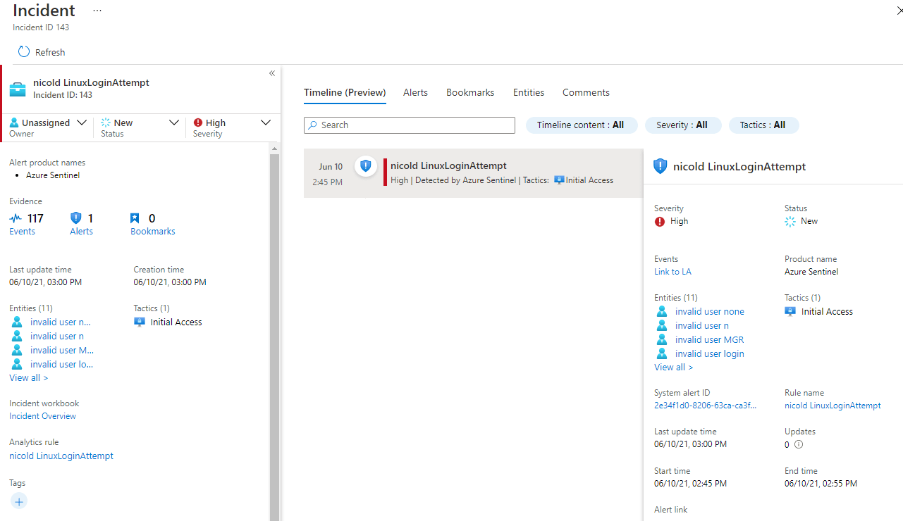

In this post I show how to build **a scheduled query rule** in Azure Sentinel that recognize an ssh login attempt on a Linux machine.

<a href="https://docs.microsoft.com/en-us/azure/sentinel/overview" target="_blank">Microsoft Azure Sentinel</a> is a scalable, cloud-native, security information event management (**SIEM**) and security orchestration automated response (**SOAR**) solution. Azure Sentinel delivers intelligent security analytics and threat intelligence across the enterprise, providing a single solution for alert detection, threat visibility, proactive hunting, and threat response.

Azure Sentinel is your birds-eye view across the enterprise alleviating the stress of increasingly sophisticated attacks, increasing volumes of alerts, and long resolution time frames.

* Collect data at cloud scale across all users, devices, applications, and infrastructure, both on-premises and in multiple clouds. 
* Detect previously undetected threats, and minimize false positives using Microsoft's analytics and unparalleled threat intelligence. 
* Investigate threats with artificial intelligence, and hunt for suspicious activities at scale, tapping into years of cyber security work at Microsoft. 
* Respond to incidents rapidly with built-in orchestration and automation of common tasks.

# Prerequisites
* Install the Log analytics agent for Linux using the followinf guide: https://docs.microsoft.com/en-us/azure/azure-monitor/agents/agent-linux 
* Collect Syslog data sources from auth facility. Select the severity "**info**" in order to see the **failed password** events https://docs.microsoft.com/en-us/azure/azure-monitor/agents/data-sources-syslog 

# SysLog Event
In order to display a list of the failed SSH logins in Linux, the most simple command you can use is shown below.

```bash
grep "Failed password" /var/log/auth.log
```

the output you will have is something like:

```
Jun 10 09:31:10 azLin01 sshd[7131]: Failed password for invalid user MikroTik from 123.27.143.131 port 52452 ssh2
Jun 10 09:31:23 azLin01 sshd[7145]: Failed password for invalid user MikroTik from 123.27.143.131 port 53562 ssh2
Jun 10 09:31:35 azLin01 sshd[7158]: Failed password for invalid user MikroTik from 123.27.143.131 port 54697 ssh2
Jun 10 09:31:47 azLin01 sshd[7172]: Failed password for invalid user MikroTik from 123.27.143.131 port 55655 ssh2
Jun 10 09:31:59 azLin01 sshd[7188]: Failed password for invalid user MikroTik from 123.27.143.131 port 56677 ssh2
Jun 10 09:32:01 azLin01 sshd[7190]: Failed password for invalid user default from 27.72.96.30 port 51470 ssh2
```

when everything is configured, on the Log Anazlytics Workspace you have the same events in syslog table

```
Syslog
| where SyslogMessage startswith "Failed Password"
| order by EventTime desc 
```

as you can see in the picture below, all relevant information are in SyslogMessage field


so in order to project all these information on Azure Sentinel usable fields you can use the following query


```
Syslog
| where SyslogMessage startswith "Failed Password"
| order by EventTime desc 
| extend User = extract("for(?s)(.*)from",1,SyslogMessage)
| extend IPaddr = extract("(([0-9]{1,3})\\.([0-9]{1,3})\\.([0-9]{1,3})\\.(([0-9]{1,3})))",1,SyslogMessage) 
| project HostName, SyslogMessage, EventTime, IPaddr, User
```

here the result, where I have extracted IP, user, hostname and timestamp


# Azure Sentinel Setup
Go to Azure Portal > Sentinel > Log Workspace > Analytics > Create > Scheduled query rule, and use the the following parameters:

Analytics Rule Details
* Name: LinuxLoginAttempt
* Tactics: Initial Access
* Severity: High
* Status: Enabled

Set Rule Logic
* Rule Query
```
Syslog
| where SyslogMessage startswith "Failed Password"
| extend User = extract("for(?s)(.*)from",1,SyslogMessage)
| extend IPaddr = extract("(([0-9]{1,3})\\.([0-9]{1,3})\\.([0-9]{1,3})\\.(([0-9]{1,3})))",1,SyslogMessage) 
| project HostName, SyslogMessage, EventTime, IPaddr, User
```
* Entity Mappings
    * IP > Address : IPaddr
    * Account > Name : User
    * Host > HostName : HostName
* Query Scheduling
    * Run query every: 1 hour
    * Lookup data from: the last 2 hours
* Alert threshold: greather than 5
* Event grouping: group all events into a single alert 
* Suppression: off

Incident Settings
* Incident: Enabled

# Result
After a couple of hours you will see the resuling events in Sentinel

