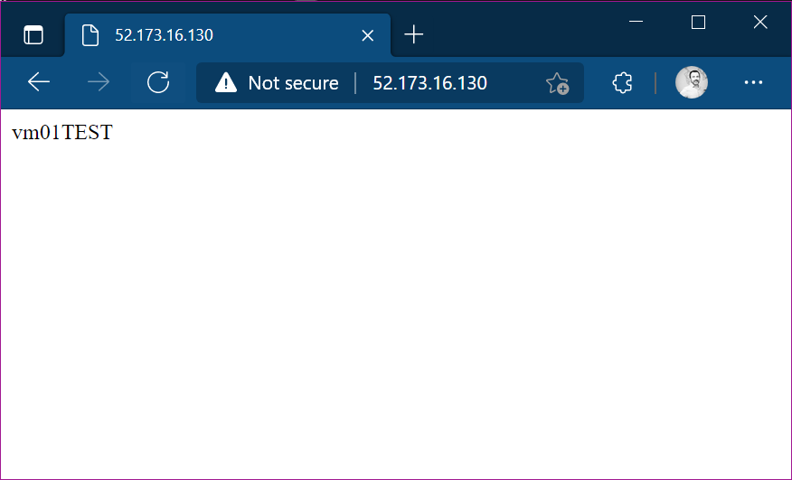

For my **Labs**, I often need to create and build virtual machines. **Many virtual machines** :-). One of the most "popular" machine recently is for me the web server. The requirement for my needs is often very simple: **create a web server that responds on port 80, that is able to make me understand "what machine I’m interacting with"**, so, the ideal response message to the request *http://my-machine-ip* should be "*myMachineName*".

From Azure portal is quick enough to create a virtual machines. In particular I use as the starting image "**windows 2019 datacenter gen1**".

Once the machine is created, you can automate the installation and configuration of a web server in this way:

From the Azure Portal:

1. create an azure storage account, or like me use the azure storage account created by your cloudshell
2. create a container named "scripts"
3. create the file named "install-iis.ps1"
4. put the following in the file just created:

```powershell
powershell.exe Install-WindowsFeature -name Web-Server -IncludeManagementTools
powershell.exe Remove-Item -Path 'C:\inetpub\wwwroot\iisstart.htm'
powershell.exe Add-Content -Path 'C:\inetpub\wwwroot\iisstart.htm' -Value $($env:computername)
```

Go to your virtual machine blade, then go to:
* Extensions 
* +Add 
* CustomScript Extension 
* on "Script file" click browse and select the file created above.

Go to [**Review + Create**] and then [**Create**].

After a couple of minutes the script will be executed, and IIS will be provisioned and working.




