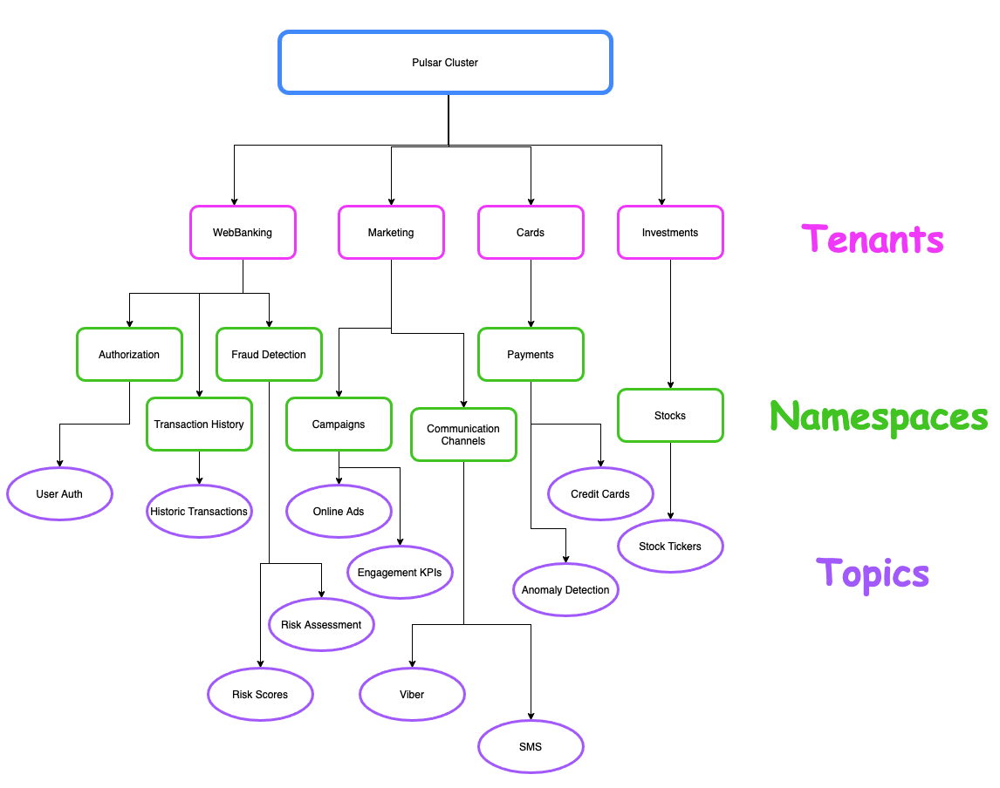
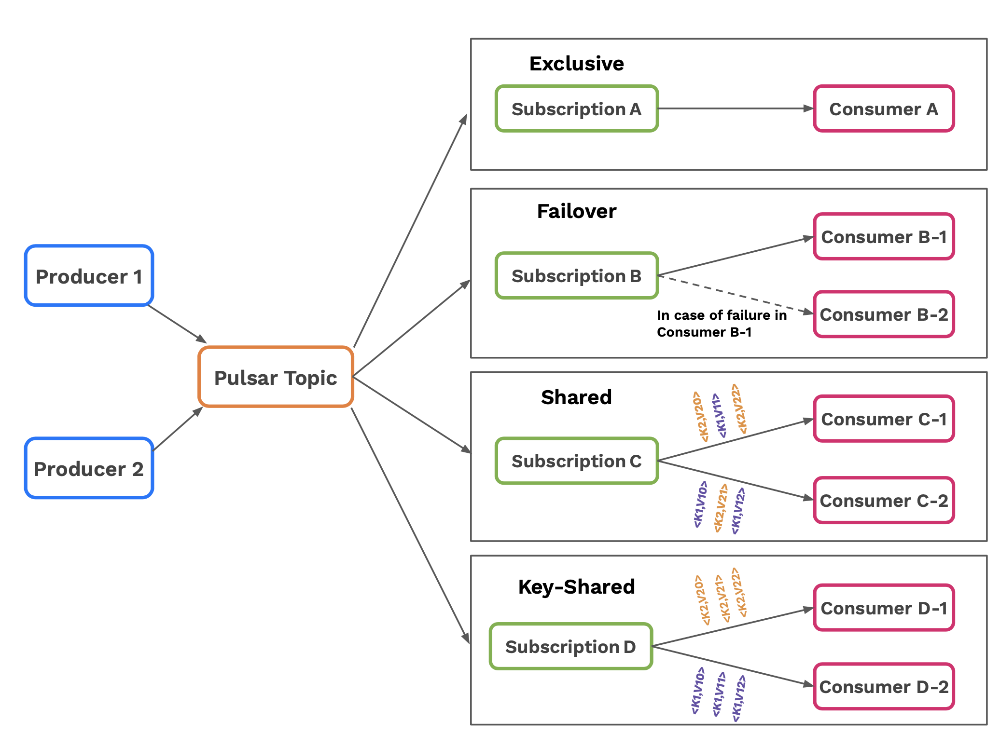

_This article is brought to you by [Giannis Polyzos](https://github.com/polyzos), one of the earliest students of Rock the JVM back in 2017. He's now a senior engineer working on Apache Pulsar, a promising new toolkit for high performance data streaming. In this article, he'll give an overview of what Pulsar is and why it's so good, and then walk you through a quick tutorial to get you started._

_Enter Giannis:_

In today's modern data era there is an ever-increasing demand for delivering data insights as fast as possible. What happens “now”, might be irrelevant a few minutes or even seconds later and so there is an ever-increasing need for events to be ingested and processed as fast as possible, whether it is to improve a business and make it more competitive in a demanding market or make a system grow and adapt itself based on the environment stimulations it receives.

Along with that and the evolution of containers and cloud infrastructure companies seek ways to leverage and adopt cloud-native approaches.
Moving to the cloud and adopting containers for our system means we are most likely leveraging technologies like Kubernetes for all of it’s amazing features.
Having our infrastructure on the cloud and adopting cloud-native solutions means we also want our messaging and streaming solutions to be in-line with these principles.

In this blog post we will go through how you can implement cloud-native event stream processing with Apache Pulsar and Scala. We will review what Apache Pulsar has to offer in this modern data era, what makes it stand out and how you can get started with it by creating some simple Producers and Consumers using Scala and the pulsar4s library.

## 1. What Is Apache Pulsar

As described in the documentation,

> Apache Pulsar is a cloud-native, distributed messaging and streaming platform that manages hundreds of billions of events per day.

It was originally created at Yahoo in 2013 to meet their enormous scaling requirements - the engineering team also reviewed solutions like Apache Kafka at the time (although those systems have grown a lot since), but didn’t quite meet their needs.

They were missing features like geo-replication, multi-tenancy and offset management along with performance under message backlog conditions - and so Apache Pulsar was born.

Let’s take a closer look at what makes it stand out:

1. **Unified Messaging and Streaming:** The first thing you should note about Apache Pulsar is that it serves as a unified platform for both messaging and streaming. These two terms are ofter confused to be the same, but there are fundamental differences. For example in a messaging use case you want to consume a message as soon as it arrives and then the message will be deleted. On the other hand for a streaming use case you might want to keep your messages around and be able to replay them.
2. **Multi-Tenancy:** It was designed from the ground up as a multi-tenant system. You can think of multi-tenancy like different user groups, each operating in it's own isolated environment. Pulsar’s Logical Architecture consists of tenants, namespaces and topics. A namespace is a logical grouping of topics that live within the tenants. You can easily map your organization’s needs with a defined hierarchy and provide isolation, authentication, authorization, quotas as well as apply different policies on the namespace and topic levels. An example of multi-tenancy for an e-commerce business can be as follows, having different departments like WebBanking and Marketing as tenants and then those department members can operate within the tenant.

4. **Geo-replication:** Geo-replication is all about providing disaster tolerance by having different clusters with copies of your data across geographically distributed data centers. Apache Pulsar provides Geo-replication out of the box without the need of external tools. Alternatives like Apache Kafka rely on 3rd party solutions - i.e MirrorMaker - for such use cases which are also known to be problematic. With Pulsar you can overcome these issues with strong built-in Geo-replication and design disaster recovery solutions that meet your needs.
5. **Horizontally Scalable** Apache Pulsar’s Architecture is composed of three components. Pulsar Brokers is a stateless serving layer, Apache BookKeeper (bookie servers) serves as the storage layer and finally Apache Zookeeper as the metadata layer - although 2.8.0 release introduced the metadata layer as an alternative ([reference](https://github.com/apache/pulsar/wiki/PIP-45%3A-Pluggable-metadata-interface)). All the layers are decoupled from each other and this means that you can scale each component independently based on your needs. Apache BookKeeper uses the concept of distributed ledgers instead of a log-based abstraction which makes it really easy to scale, without the need for rebalancing. This makes Apache Pulsar a perfect fit for a cloud-native environments.
6. **Tiered Storage** As you process enormous volumes of data your topic might grow large without limit, which can become quite expensive over time. Apache Pulsar offers tiered storage and so as your topics grow, you can offload older data to some cheaper storage like Amazon S3, while your clients can still access the data and continue serving it as if nothing had changed.
7. **Pulsar Functions** Pulsar Functions are a lightweight serverless compute framework that allow you to deploy your own stream processing logic in a very simple way. Being lightweight it also makes it an excellent choice for iot edge analytics use cases. Combined with [Function Mesh](https://functionmesh.io/) a new project recently open sourced by [StreamNative](https://streamnative.io/) is what makes event stream processing truly cloud native by deploying everything as part of a mesh and leveraging native Kubernetes features like autoscaling.

There are more features of Apache Pulsar like a built-in Schema Registry, support for transactions and Pulsar SQL, but at this point let's see how you can actually get Pulsar up and running and create our very first Producers and Consumers in Scala.

## 2. Example Use Case and Cluster Setup

As a simple example use case we will create a Producer that simulates sensor event readings, sends them over to a topic and then on the other end create a consumer that subscribes to that topic and just reads the incoming events. We will be using the [pulsar4s](https://github.com/sksamuel/pulsar4s) client library for our implementation and we will run a Pulsar cluster using [docker](https://www.docker.com/). In order to start a Pulsar cluster in standalone mode, run the following command within your terminal:
```shell
docker run -it \
  -p 6650:6650 \
  -p 8080:8080 \
  --name pulsar \
  apachepulsar/pulsar:2.8.0 \
  bin/pulsar standalone
```

This command will start Pulsar and bind the necessary ports to your local machine. With our cluster up and running, let's start creating our producers and consumers.

## 3. Apache Pulsar Producers

First, we need the dependencies for the pulsar4s-core and pulsar4s-circe - so let's add the following to our `build.sbt` file:

```scala
val pulsar4sVersion = "2.7.3"

lazy val pulsar4s       = "com.sksamuel.pulsar4s" %% "pulsar4s-core"  % pulsar4sVersion
lazy val pulsar4sCirce  = "com.sksamuel.pulsar4s" %% "pulsar4s-circe" % pulsar4sVersion

libraryDependencies ++= Seq(
  pulsar4s, pulsar4sCirce
)
```

Then we will define the message payload for a sensor event as follows:

```scala
case class SensorEvent(sensorId: String,
                         status: String,
                         startupTime: Long,
                         eventTime: Long,
                         reading: Double)
```

We also need the following imports in scope:

```scala
import com.sksamuel.pulsar4s.{DefaultProducerMessage, EventTime, ProducerConfig, PulsarClient, Topic}
import io.ipolyzos.models.SensorDomain
import io.ipolyzos.models.SensorDomain.SensorEvent
import io.circe.generic.auto._
import com.sksamuel.pulsar4s.circe._
import scala.concurrent.ExecutionContext.Implicits.global
```

The main entry point for all producing and consuming applications is the Pulsar Client, which handles the connection to the brokers. From within the Pulsar client you can also set up the authentication to your cluster as well as other important tuning configurations such as timeout settings and connection pools. You can simply instantiate the client by providing the service url you want to connect to.

```scala
val pulsarClient = PulsarClient("pulsar://localhost:6650")
```

With our client in place let’s take a look at the producer initialization and the producer loop.

```scala
val topic = Topic("sensor-events")

// create the producer
val eventProducer = pulsarClient.producer[SensorEvent](ProducerConfig(
  topic,
  producerName = Some("sensor-producer"),
  enableBatching = Some(true),
  blockIfQueueFull = Some(true))
)

// sent 100 messages
(0 until 100) foreach { _ =>
  val sensorEvent = SensorDomain.generate()
  val message = DefaultProducerMessage(
    Some(sensorEvent.sensorId),
    sensorEvent,
    eventTime = Some(EventTime(sensorEvent.eventTime)))

  eventProducer.sendAsync(message) // use the async method to sent the message
}
```

There are a few things to note here:

 - We create our producer by providing the necessary configuration - both producers and consumers are highly configurable and we can configure based on what makes sense for our use case.
 - Here we provide the topic name, a name for our producer, we enable batching and tell the producer to block if the queue is full.
 - By enabling batching, Pulsar is going to use an internal queue to keep messages (default value is 1000) and send them over to the brokers as a batch after the queue gets full.
 - As you can see on the sample code we are using the `.sendAsync()` method to send the messages to Pulsar. This will send the message without waiting for an acknowledgement and since we buffer messages to the queue this can overwhelm the client.
 - Using the option `blockIfQueueFull` applies backpressure and informs the producer to wait before sending more messages.
 - Finally, we create the message to send. Here we specify the `sensorId` as the key of the message, the value of `sensorEvent` and we also provide the `eventTime` i.e the time the event was produced.

At this point we have our producer in place to start sending messages to Pulsar. A complete implementation can be found [here](https://github.com/polyzos/pulsar-scala-streams/blob/main/src/main/scala/io/ipolyzos/producers/SensorEventProducer.scala).

## 4. Apache Pulsar Consumers

Now let’s switch our focus to the consuming side. Much like we did with the producing side, the consuming side needs to have a Pulsar Client in scope.

```scala
val consumerConfig = ConsumerConfig(
  Subscription("sensor-event-subscription"),
  Seq(Topic("sensor-events")),
  consumerName = Some("sensor-event-consumer"),
  subscriptionInitialPosition = Some(SubscriptionInitialPosition.Earliest),
  subscriptionType = Some(SubscriptionType.Exclusive)
)

val consumerFn = pulsarClient.consumer[SensorEvent](consumerConfig)

var totalMessageCount = 0
while (true) {
  consumerFn.receive match {
    case Success(message) =>
      consumerFn.acknowledge(message.messageId)
      totalMessageCount += 1
      println(s"Total Messages '$totalMessageCount - Acked Message: ${message.messageId}")
    case Failure(exception) =>
      println(s"Failed to receive message: ${exception.getMessage}")
  }
}
```

Let's take things in turn:

- Again, first we create our consumer configuration. Here we specify a subscription name, the topic we want to subscribe to, a name for our consumer, the position we want our consumer to start consuming messages from - here we specify Earliest - which means the subscription will start reading after the last message it has acknowledged.
- Finally, we specify the SubscriptionType - here it is of type Exclusive which is also the default subscription type (more on subscription types in a bit).
- With our configuration in place, we set up a new Consumer using the configuration we have created and then we have a simple consumer loop - all we do is read a new message using the receive method, which blocks until a message is available, then we acknowledge the message and finally we print the total messages received so far along with the messageId that was acknowledged.
- Note here that when a new message is received you need to acknowledge it back to the client if everything was successful, otherwise you need to provide a negative acknowledgement for the message using the negativeAcknowledge(<messageId>) method.
- With our consuming implementation in place we have a working publish-subscribe application that generates sensor events to a pulsar topic and a consumer that subscribes to it and consumes those messages.
- A complete implementation of the consumer can be found [here](https://github.com/polyzos/pulsar-scala-streams/blob/main/src/main/scala/io/ipolyzos/consumers/SensorEventConsumer.scala).

## 5. Apache Pulsar Subscription Types

As mentioned during the blog post, Apache Pulsar provides unification of both messaging and streaming patterns and it does so, by providing different subscription types.

We have the following subscription types:

* **Exclusive Subscription:** only one consumer is allowed to read messages using the subscription at any point in time
* **Failover Subscription:** only one consumer is allowed to read messages using the subscription at any point in time, but you can have multiple standby consumers to pick up the work in case the active one fails
* **Shared Subscription:** multiple consumers can be attached to the subscription and the work is shared among them in a Round Robin fashion.
* **KeyShared Subscription:** multiple consumers can be attached to the subscription and each consumer is assigned a unique set of keys. That consumer is responsible for processing that set of keys it is assigned. In case of failure another consumer will be assigned that set of keys.



Different Subscription types are used for different use cases. For example in order to implement a typical fan-out messaging pattern you can use the exclusive or failover subscription types. For message queueing and work queues a good candidate is Shared Subscription in order to share the work among multiple consumers. On the other hand for streaming use cases and/or key-based stream processing the Failover and KeyShared subscriptions can be a good candidate that can allow for ordered consumption or scale your processing based on some key.

## 6. Conclusion and Further Reading

In this blog post we made a brief introduction at what Apache Pulsar is, what makes it stand out as a new messaging and streaming platform alternative, how you can create some really simple producing and consuming applications and finally we highlighted how it unified messaging and streaming through different subscription modes.

If this overview sparked your interest and want to learn more, I encourage you to take a look at [Pulsar IO](https://pulsar.apache.org/docs/en/io-overview/) (moves data in and out of Pulsar easily), [Pulsar Functions](http://pulsar.apache.org/docs/en/functions-overview/) (Pulsar’s serverless and lightweight compute framework), which you can use to apply your processing logic on your Pulsar topics, reduce all the boilerplate code needed for producing and consuming applications and combined with [Function Mesh](https://functionmesh.io/) make your event streaming truly cloud-native, by leveraging Kubernetes native features like deployments and autoscaling.
