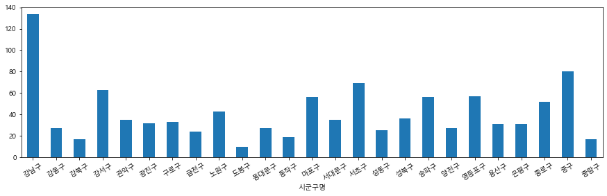
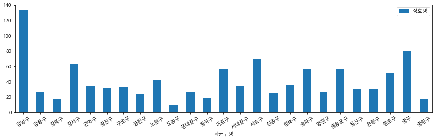
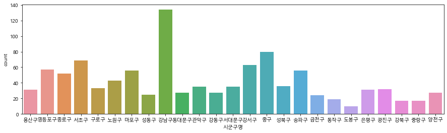
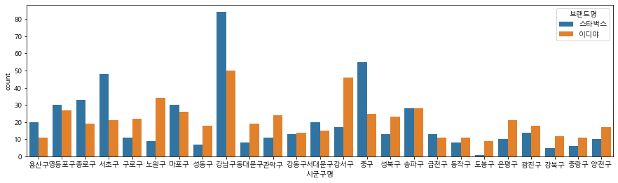
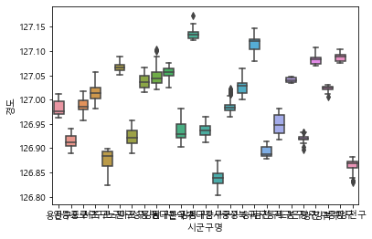
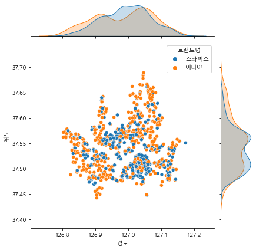

# Seaborn을 활용해 다양한 시각화를 공부해보자

* 카페정보 데이터를 활용하여 Seaborn에서 제공하는 다양한 시각화 공부


```python
# 라이브러리 로드
import pandas as pd
import numpy as np
import seaborn as sns

# 시각화를 위한 한글폰트 설정
import matplotlib.pyplot as plt

plt.rc("font", family="Malgun Gothic")
plt.rc("axes", unicode_minus=False)
```


```python
# 데이터로드
df = pd.read_csv("df_cafe.csv")
df.head()
```


<div>
<style scoped>
    .dataframe tbody tr th:only-of-type {
        vertical-align: middle;
    }

    .dataframe tbody tr th {
        vertical-align: top;
    }
    
    .dataframe thead th {
        text-align: right;
    }
</style>
<table border="1" class="dataframe">
  <thead>
    <tr style="text-align: right;">
      <th></th>
      <th>Unnamed: 0</th>
      <th>상호명</th>
      <th>상권업종대분류명</th>
      <th>상권업종중분류명</th>
      <th>상권업종소분류명</th>
      <th>시도명</th>
      <th>시군구명</th>
      <th>행정동명</th>
      <th>법정동명</th>
      <th>도로명주소</th>
      <th>경도</th>
      <th>위도</th>
      <th>상호명_소문자</th>
      <th>브랜드명</th>
    </tr>
  </thead>
  <tbody>
    <tr>
      <th>0</th>
      <td>1104</td>
      <td>스타벅스</td>
      <td>음식</td>
      <td>커피점/카페</td>
      <td>커피전문점/카페/다방</td>
      <td>서울특별시</td>
      <td>용산구</td>
      <td>이태원1동</td>
      <td>이태원동</td>
      <td>서울특별시 용산구 이태원로 188</td>
      <td>126.994781</td>
      <td>37.534303</td>
      <td>스타벅스</td>
      <td>스타벅스</td>
    </tr>
    <tr>
      <th>1</th>
      <td>1675</td>
      <td>이디야커피</td>
      <td>음식</td>
      <td>커피점/카페</td>
      <td>커피전문점/카페/다방</td>
      <td>서울특별시</td>
      <td>영등포구</td>
      <td>신길1동</td>
      <td>신길동</td>
      <td>서울특별시 영등포구 영등포로 353</td>
      <td>126.918062</td>
      <td>37.515118</td>
      <td>이디야커피</td>
      <td>이디야</td>
    </tr>
    <tr>
      <th>2</th>
      <td>2023</td>
      <td>스타벅스종로3가점</td>
      <td>음식</td>
      <td>커피점/카페</td>
      <td>커피전문점/카페/다방</td>
      <td>서울특별시</td>
      <td>종로구</td>
      <td>종로1.2.3.4가동</td>
      <td>종로3가</td>
      <td>서울특별시 종로구 종로 113-1</td>
      <td>126.990207</td>
      <td>37.570585</td>
      <td>스타벅스종로3가점</td>
      <td>스타벅스</td>
    </tr>
    <tr>
      <th>3</th>
      <td>2770</td>
      <td>스타벅스</td>
      <td>음식</td>
      <td>커피점/카페</td>
      <td>커피전문점/카페/다방</td>
      <td>서울특별시</td>
      <td>서초구</td>
      <td>잠원동</td>
      <td>잠원동</td>
      <td>서울특별시 서초구 강남대로 581</td>
      <td>127.019763</td>
      <td>37.513663</td>
      <td>스타벅스</td>
      <td>스타벅스</td>
    </tr>
    <tr>
      <th>4</th>
      <td>2957</td>
      <td>이디야커피</td>
      <td>음식</td>
      <td>커피점/카페</td>
      <td>커피전문점/카페/다방</td>
      <td>서울특별시</td>
      <td>구로구</td>
      <td>구로3동</td>
      <td>구로동</td>
      <td>서울특별시 구로구 디지털로32길 43</td>
      <td>126.897870</td>
      <td>37.484385</td>
      <td>이디야커피</td>
      <td>이디야</td>
    </tr>
  </tbody>
</table>
</div>


```python
# 데이터 기본 정보 확인
df.info()
```

    <class 'pandas.core.frame.DataFrame'>
    RangeIndex: 1036 entries, 0 to 1035
    Data columns (total 14 columns):
     #   Column      Non-Null Count  Dtype  
    ---  ------      --------------  -----  
     0   Unnamed: 0  1036 non-null   int64  
     1   상호명         1036 non-null   object 
     2   상권업종대분류명    1036 non-null   object 
     3   상권업종중분류명    1036 non-null   object 
     4   상권업종소분류명    1036 non-null   object 
     5   시도명         1036 non-null   object 
     6   시군구명        1036 non-null   object 
     7   행정동명        1036 non-null   object 
     8   법정동명        1036 non-null   object 
     9   도로명주소       1036 non-null   object 
     10  경도          1036 non-null   float64
     11  위도          1036 non-null   float64
     12  상호명_소문자     1036 non-null   object 
     13  브랜드명        1036 non-null   object 
    dtypes: float64(2), int64(1), object(11)
    memory usage: 113.4+ KB


https://seaborn.pydata.org/index.html#


## 비교를 위해 groupby와 pivot_table로  연산 후 그래프 시각화


```python
# 구 에따라서 카페 수 비교 groupby
# 연산이 필요

df.groupby(["시군구명"])["상호명"].count().plot.bar(figsize=(15, 4), rot=30)
```


    <AxesSubplot:xlabel='시군구명'>




```python
# 구 에따라서 카페 수 비교 pivot_table

pd.pivot_table(data=df, index="시군구명", values="상호명", aggfunc='count').plot.bar(figsize=(15, 4), rot=30)
```


    <AxesSubplot:xlabel='시군구명'>





## (참고!)groupby 값을 Dataframe으로 만들때 방법 2가지

* 일반적으로 to_frame() 과 reset_index 두가지 방법이 존재


```python
# 여기서 multiindex로 접근하는 방법이 있지만 불편함
# df_cafe_vs = df_cafe_vs.to_frame()
# df_cafe_vs.head()
df_sr = df.groupby(["시군구명", "브랜드명"])["상호명"].count()
df_sr.to_frame().head()
```


<div>
<style scoped>
    .dataframe tbody tr th:only-of-type {
        vertical-align: middle;
    }

    .dataframe tbody tr th {
        vertical-align: top;
    }
    
    .dataframe thead th {
        text-align: right;
    }
</style>
<table border="1" class="dataframe">
  <thead>
    <tr style="text-align: right;">
      <th></th>
      <th></th>
      <th>상호명</th>
    </tr>
    <tr>
      <th>시군구명</th>
      <th>브랜드명</th>
      <th></th>
    </tr>
  </thead>
  <tbody>
    <tr>
      <th rowspan="2" valign="top">강남구</th>
      <th>스타벅스</th>
      <td>84</td>
    </tr>
    <tr>
      <th>이디야</th>
      <td>50</td>
    </tr>
    <tr>
      <th rowspan="2" valign="top">강동구</th>
      <th>스타벅스</th>
      <td>13</td>
    </tr>
    <tr>
      <th>이디야</th>
      <td>14</td>
    </tr>
    <tr>
      <th>강북구</th>
      <th>스타벅스</th>
      <td>5</td>
    </tr>
  </tbody>
</table>
</div>


```python
# reset_index 활용
# 일반적으로 column으로 지정하는게 활용하기 편하기 때문에 reset_index를 활용하는 경우가 많음

df_sr.reset_index().head()
```


<div>
<style scoped>
    .dataframe tbody tr th:only-of-type {
        vertical-align: middle;
    }

    .dataframe tbody tr th {
        vertical-align: top;
    }
    
    .dataframe thead th {
        text-align: right;
    }
</style>
<table border="1" class="dataframe">
  <thead>
    <tr style="text-align: right;">
      <th></th>
      <th>시군구명</th>
      <th>브랜드명</th>
      <th>상호명</th>
    </tr>
  </thead>
  <tbody>
    <tr>
      <th>0</th>
      <td>강남구</td>
      <td>스타벅스</td>
      <td>84</td>
    </tr>
    <tr>
      <th>1</th>
      <td>강남구</td>
      <td>이디야</td>
      <td>50</td>
    </tr>
    <tr>
      <th>2</th>
      <td>강동구</td>
      <td>스타벅스</td>
      <td>13</td>
    </tr>
    <tr>
      <th>3</th>
      <td>강동구</td>
      <td>이디야</td>
      <td>14</td>
    </tr>
    <tr>
      <th>4</th>
      <td>강북구</td>
      <td>스타벅스</td>
      <td>5</td>
    </tr>
  </tbody>
</table>
</div>


## Seaborn으로 시각화 해보기


```python
# 구 에따라서 카페 수 비교 seaborn

plt.figure(figsize=(15, 4))
sns.countplot(data=df, x="시군구명")
```


    <AxesSubplot:xlabel='시군구명', ylabel='count'>





```python
# hue 값을 활용해서 브랜드명에 따라 구분되어서 보이도록

plt.figure(figsize=(15, 4))
sns.countplot(data=df, x="시군구명", hue="브랜드명")
```


    <AxesSubplot:xlabel='시군구명', ylabel='count'>





## seaborn의 다양한 시각화 활용해보기


```python
# boxplot 활용 -> y값에 숫자 데이터가 있어야함!! 

sns.boxplot(data=df, x="시군구명", y="경도")
```


    <AxesSubplot:xlabel='시군구명', ylabel='경도'>


 


```python
# jointplot 활용
sns.jointplot(data=df, x="경도", y="위도", hue="브랜드명")
```


    <seaborn.axisgrid.JointGrid at 0x2829008db20>





21-10-16 Comments

> 데이터 시각화의 방법인 groupby, pivot_table을 활용한 방법과 seaborn을 활용하는 방법 공부! 실제로 다양한 문제를 해결하는 과정에서 seaborn을 활용하면 자연스럽게 공부가 될 듯!! 


