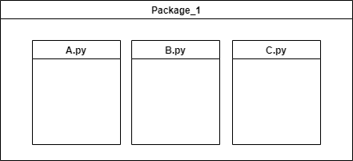
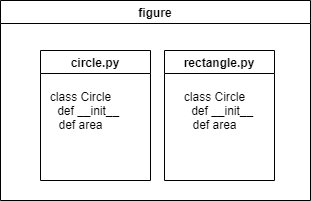

#### Contents

- 모듈이란?
- 모듈의 기능
- 모듈의 경로
- 패키지와 모듈 만들어보기
- `__init__.py`의 기능
- `__all__`의 기능 

---

**대규모 시스템**은 여러개의 애플리케이션으로 구성되며 애플리케이션 내부에는 여러 컴포넌트가 있다. 컴포넌트 코드는 `모듈`이나 `패키지`와 같은 하위 컴포넌트로 나뉘며 모듈은 클래스나 함수로 나눌 수 있다. 

<br>
<div style="display: block; width: 60%; margin: 0px auto;">

</div>

<br>


### 모듈이란?
---

모듈은 파이썬 정의와 문장들을 담고 있는 파일이다. 파일의 이름은 모듈 이름에 확장자 .py 를 붙이면 된다. 모듈 내에서, 모듈의 이름은 전역 변수 `__name__` 으로 제공된다. 

### 패키지란?
---
파이썬 패키지는 간단하게 파이썬 모듈들의 집합체 라고 할 수 있다. 여기서 파이썬 모듈은 간단히 하나의 파이썬 파일이다.

```
Python 3.8.10 (default, Sep 28 2021, 16:10:42) 
[GCC 9.3.0] on linux
Type "help", "copyright", "credits" or "license" for more information.
>>> from figure import circle
>>> circle.__name__
'figure.circle'
>>> 
```

### 모듈의 기능
---
모듈은 프로그램을 구성하는 기능 중에서 `독립적`으로 구별할 수 있는 것을 모아 분리해 둔 것이다. 프로그램을 모듈로 나누면, 많은 기능을 담은 프로그램이라도 만들고 `관리하기가 수월`해진다. 그리고 나누어 둔 모듈은 그 모듈의 기능이 필요한 다른 프로그램을 만들 때 `재사용`할 수도 있다.


### 모듈의 검색 경로
---

```
import sys
print(sys.path)

['/home/hoon/Desktop/make_package', '/usr/lib/python38.zip', '/usr/lib/python3.8', '/usr/lib/python3.8/lib-dynload', '/home/hoon/.local/lib/python3.8/site-packages', '/usr/local/lib/python3.8/dist-packages', '/usr/lib/python3/dist-packages']
```

`circle` 라는 이름의 모듈이 임포트될 때, 인터프리터는 먼저 그 이름의 내장 모듈을 찾는다. 발견되지 않으면, 변수 sys.path 로 주어지는 디렉터리들에서 `circle.py` 라는 이름의 파일을 찾습니다. `sys.path` 는 이 위치들로 초기화됩니다:

- 현재 실행파일이 있는 폴더

- `PYTHONPATH` 환경변수 안의 경로

- 파이썬 설치 경로 (by convention including a site-packages directory, handled by the site module).


### 스탠다드 라이브러리
---
- C언어로 만들어진 built-in 바이너리 모듈
    - 소스코드는 github에서 확인 가능
    - [https://github.com/python/cpython/tree/main/Modules](https://github.com/python/cpython/tree/main/Modules)
    - 내장 함수 dir() 은 모듈이 정의하는 이름들을 찾는 데 사용된다.
  ```
  print(dir())
  ['__annotations__', '__builtins__', '__cached__', '__doc__', '__file__', '__loader__', '__name__', '__package__', '__spec__']
  ```
  ```
  print(dir(__builtins__))
  [..., 'min', 'next', 'object', 'oct', 'open', 'ord', 'pow', 'print', 'property', 'quit', 'range', 'repr', 'reversed', 'round', 'set', 'setattr', 'slice', 'sorted', 'staticmethod', 'str', 'sum', 'super', 'tuple', 'type', 'vars', 'zip']
  ```

- `파이썬`으로 만들어진 `일반` 모듈
  - 파이썬 설치 폴더 안의 `lib/site-packages`에 저장되고 `import`하여 사용가능
  
  ```
  hoon@ubuntu:~/Desktop/make_package$ pip install numpy
  Collecting numpy
    Downloading numpy-1.21.2-cp38-cp38-manylinux_2_12_x86_64.manylinux2010_x86_64.whl (15.8 MB)
      |████████████████████████████████| 15.8 MB 1.1 MB/s 
  Installing collected packages: numpy
  Successfully installed numpy-1.21.2
  hoon@ubuntu:~/Desktop/make_package$ ls -l /home/hoon/.local/lib/python3.8/site-packages
  합계 68
  drwxrwxr-x  2 hoon hoon  4096  9월 25 16:43 __pycache__
  drwxrwxr-x  3 hoon hoon  4096  9월 25 16:43 backports
  drwxrwxr-x  2 hoon hoon  4096  9월 25 16:43 backports.entry_points_selectable-1.1.0.dist-info
  drwxrwxr-x  4 hoon hoon  4096  9월 25 16:43 distlib
  drwxrwxr-x  2 hoon hoon  4096  9월 25 16:43 distlib-0.3.3.dist-info
  drwxrwxr-x  2 hoon hoon  4096  9월 25 16:43 filelock-3.0.12.dist-info**
  -rw-rw-r--  1 hoon hoon 13229  9월 25 16:43 filelock.py
  drwxrwxr-x 18 hoon hoon  4096 10월 20 03:05 numpy
  drwxrwxr-x  2 hoon hoon  4096 10월 20 03:05 numpy-1.21.2.dist-info

  ```

  
---

### 패키지와 모듈 만들어보기
---
<div style="display: block; width: 60%;">

</div>

<br>
```
# 디렉토리 구조
.
├── figure
│   ├── __init__.py
│   ├── circle.py
│   └── rectangle.py
└── main.py
```
<br>

패키지와 모듈의 개념을 이해하기 위해 간단한 예시를 들어보자. 디렉토리의 구조를 보면 `figure` 폴더에 `circle.py`, `rectangle.py`, `__init__.py`를 생성하고 `main.py`에서 `figure` 패키지를 `import`하여 기능을 사용하는 구조이다. 

<br>
```
# figure/circle.py

from math import pi

class Circle:
    """
    radius를 받아 원의 넓이를 구하는 모듈
    """
    def __init__(self, radius):
        self.radius = radius
    
    def area(self):
        return pi * self.radius ** 2

```
```
# figure/rectangle.py

class Rectangle:
    """
    width, height를 받아 사각형의 넓이를 구하는 모듈
    """
    def __init__(self, width, height):
        self.width = width
        self.height = height
    
    def area(self):
        return self.width * self.height
```

```
# figure/__init__.py

# 상대경로. 파이썬3 부터 relative import 가능
from .circle import Circle
from .rectangle import Rectangle

# 절대경로.
# from figure.circle import Circle
# from figure.rectangle import Rectangle 
```
<br>

- `__init__.py` 파일은 해당 디렉터리가 패키지의 일부임을 알려주는 역할을 한다.
- 디렉터리에 `__init__.py` 파일이 없다면 패키지로 인식되지 않을 수 있다.
    - [Python으로 개발하던 과정에서 패키지가 다른 경우 참조하지 못하는 문제](https://nesoy.github.io/articles/2018-07/Python-init-all)
- 상대경로 혹은 절대경로로 모듈에서 `import`할 기능을 설정할 수 있다.
- `figure` 디렉토리가 하나의 패키지로써 기능할 수 있도록 한다.
</div>
<br>

```
"""
# main.py
figure 패키지에서 필요한 기능을 선택하여 사용할 수 있음
"""
from figure import Circle
from figure import Rectangle

c = Circle(4)
r = Rectangle(1,2)

if __name__ == "__main__":
    print(c)
    print(c.area())
    print(r)
    print(r.area())
```

```
"""
# main.py
figure 패키지 전체를 import하여 사용할 수 있음
"""
import figure

c = figure.Circle(4)
r = figure.Rectangle(1,2)

if __name__ == "__main__":
    print(c)
    print(c.area())
    print(r)
    print(r.area())
```
```
hoon@ubuntu:~/Desktop/make_package$ python main.py
<figure.circle.Circle object at 0x7f4cfa57b790>
50.26548245743669
<figure.rectangle.Rectangle object at 0x7f4cfa57b4f0>
2
```
- 외부에서 해당 패키지(`figure`)를 import 할 경우 패키지의 하위 디렉토리의 경로를 모두 입력하지 않고 간단하게 사용할 기능만 import 할 수 있다.
- 만약 figure 폴더에 `__init__.py`에 `import`할 기능을 설정하지 않았다면 `Circle`을 사용하기 위해 다음과 같이 접근해야한다. 만약 어플리케이션이 복잡해져서 하위 디렉토리와 사용할 기능이 많아진다면 이렇게 절대경로로 모듈을 `import`할 경우 코드가 상당히 복잡해질 수 있다.
    <br>
    ```
    # from figure.circle import Circle
    # import figure.circle.Circle
    ``` 

