# 전국 신규 민간 아파트 분양가격 동향
2015년부터 최근까지 부동산 가격 변동 추세가 아파트 분양가에도 반영될지?

데이터 분석 목적
- pandas, numpy 기본 사용법, plot, seaborn을 활용하여 데이터 시각화


```python
# 라이브러리 로드

import pandas as pd
import numpy as np
import seaborn as sns
import matplotlib.pyplot as plt
```


```python
# 한글 폰트

plt.rc("font", family="Malgun Gothic")
plt.rc("axes", unicode_minus=False)
```

## 데이터 로드 & 확인


```python
# 데이터 로드
# encoding="cp949" 공공데이터에서 한글이 깨지는 경우 encoding 설정이 필요 

df = pd.read_csv("data/주택도시보증공사_전국 신규 민간아파트 분양가격 동향_20210831.csv", encoding="cp949")
df.head()
```


<div>
<style scoped>
    .dataframe tbody tr th:only-of-type {
        vertical-align: middle;
    }

    .dataframe tbody tr th {
        vertical-align: top;
    }
    
    .dataframe thead th {
        text-align: right;
    }
</style>
<table border="1" class="dataframe">
  <thead>
    <tr style="text-align: right;">
      <th></th>
      <th>지역명</th>
      <th>규모구분</th>
      <th>연도</th>
      <th>월</th>
      <th>분양가격(제곱미터)</th>
    </tr>
  </thead>
  <tbody>
    <tr>
      <th>0</th>
      <td>서울</td>
      <td>모든면적</td>
      <td>2015</td>
      <td>10</td>
      <td>5841</td>
    </tr>
    <tr>
      <th>1</th>
      <td>서울</td>
      <td>전용면적 60제곱미터이하</td>
      <td>2015</td>
      <td>10</td>
      <td>5652</td>
    </tr>
    <tr>
      <th>2</th>
      <td>서울</td>
      <td>전용면적 60제곱미터초과 85제곱미터이하</td>
      <td>2015</td>
      <td>10</td>
      <td>5882</td>
    </tr>
    <tr>
      <th>3</th>
      <td>서울</td>
      <td>전용면적 85제곱미터초과 102제곱미터이하</td>
      <td>2015</td>
      <td>10</td>
      <td>5721</td>
    </tr>
    <tr>
      <th>4</th>
      <td>서울</td>
      <td>전용면적 102제곱미터초과</td>
      <td>2015</td>
      <td>10</td>
      <td>5879</td>
    </tr>
  </tbody>
</table>
</div>


```python
# 데이터 확인

df.tail()
```


<div>
<style scoped>
    .dataframe tbody tr th:only-of-type {
        vertical-align: middle;
    }

    .dataframe tbody tr th {
        vertical-align: top;
    }
    
    .dataframe thead th {
        text-align: right;
    }
</style>

<table border="1" class="dataframe">
  <thead>
    <tr style="text-align: right;">
      <th></th>
      <th>지역명</th>
      <th>규모구분</th>
      <th>연도</th>
      <th>월</th>
      <th>분양가격(제곱미터)</th>
    </tr>
  </thead>
  <tbody>
    <tr>
      <th>6030</th>
      <td>제주</td>
      <td>모든면적</td>
      <td>2021</td>
      <td>8</td>
      <td>8356</td>
    </tr>
    <tr>
      <th>6031</th>
      <td>제주</td>
      <td>전용면적 60제곱미터이하</td>
      <td>2021</td>
      <td>8</td>
      <td>NaN</td>
    </tr>
    <tr>
      <th>6032</th>
      <td>제주</td>
      <td>전용면적 60제곱미터초과 85제곱미터이하</td>
      <td>2021</td>
      <td>8</td>
      <td>8410</td>
    </tr>
    <tr>
      <th>6033</th>
      <td>제주</td>
      <td>전용면적 85제곱미터초과 102제곱미터이하</td>
      <td>2021</td>
      <td>8</td>
      <td>NaN</td>
    </tr>
    <tr>
      <th>6034</th>
      <td>제주</td>
      <td>전용면적 102제곱미터초과</td>
      <td>2021</td>
      <td>8</td>
      <td>7727</td>
    </tr>
  </tbody>
</table>
</div>


```python
# 데이터 확인

df.shape
```


    (6035, 5)


```python
# 결측치 확인

df.isna().sum()
```


    지역명             0
    규모구분            0
    연도              0
    월               0
    분양가격(제곱미터)    471
    dtype: int64


## 데이터 전처리


```python
df.info()
```

    <class 'pandas.core.frame.DataFrame'>
    RangeIndex: 6035 entries, 0 to 6034
    Data columns (total 5 columns):
     #   Column      Non-Null Count  Dtype 
    ---  ------      --------------  ----- 
     0   지역명         6035 non-null   object
     1   규모구분        6035 non-null   object
     2   연도          6035 non-null   int64 
     3   월           6035 non-null   int64 
     4   분양가격(제곱미터)  5564 non-null   object
    dtypes: int64(2), object(3)
    memory usage: 235.9+ KB


```python
# 분양가격을 계산해야하지만 현재 object 타입이기 때문에 변환 필요
# pd.to_numeric(arg, errors='raise', downcast=None)

df["분양가격"] = pd.to_numeric(df["분양가격(제곱미터)"], errors="coerce").copy()
df.info()
```

    <class 'pandas.core.frame.DataFrame'>
    RangeIndex: 6035 entries, 0 to 6034
    Data columns (total 6 columns):
     #   Column      Non-Null Count  Dtype  
    ---  ------      --------------  -----  
     0   지역명         6035 non-null   object 
     1   규모구분        6035 non-null   object 
     2   연도          6035 non-null   int64  
     3   월           6035 non-null   int64  
     4   분양가격(제곱미터)  5564 non-null   object 
     5   분양가격        5548 non-null   float64
    dtypes: float64(1), int64(2), object(3)
    memory usage: 283.0+ KB


```python
# 규모구분보다는 전용면적이 직관적이고 데이터 용량을 줄이도록 수정

df["규모구분"].unique()
```


    array(['모든면적', '전용면적 60제곱미터이하', '전용면적 60제곱미터초과 85제곱미터이하',
           '전용면적 85제곱미터초과 102제곱미터이하', '전용면적 102제곱미터초과'], dtype=object)


```python
df["전용면적"] = df["규모구분"].str.replace("전용면적", "").copy()
df["전용면적"] = df["전용면적"].str.replace("제곱미터이하", "")
df["전용면적"] = df["전용면적"].str.replace("제곱미터초과", " ~")
df["전용면적"] = df["전용면적"].str.replace("모든면적", "전체")
df["전용면적"].unique()
```


    array(['전체', ' 60', ' 60 ~ 85', ' 85 ~ 102', ' 102 ~'], dtype=object)


```python
df.info()
```

    <class 'pandas.core.frame.DataFrame'>
    RangeIndex: 6035 entries, 0 to 6034
    Data columns (total 7 columns):
     #   Column      Non-Null Count  Dtype  
    ---  ------      --------------  -----  
     0   지역명         6035 non-null   object 
     1   규모구분        6035 non-null   object 
     2   연도          6035 non-null   int64  
     3   월           6035 non-null   int64  
     4   분양가격(제곱미터)  5564 non-null   object 
     5   분양가격        5548 non-null   float64
     6   전용면적        6035 non-null   object 
    dtypes: float64(1), int64(2), object(4)
    memory usage: 330.2+ KB


```python
df = df.drop(axis=1, columns=["분양가격(제곱미터)", "규모구분"])
df
```


<div>
<style scoped>
    .dataframe tbody tr th:only-of-type {
        vertical-align: middle;
    }

    .dataframe tbody tr th {
        vertical-align: top;
    }
    
    .dataframe thead th {
        text-align: right;
    }
</style>
<table border="1" class="dataframe">
  <thead>
    <tr style="text-align: right;">
      <th></th>
      <th>지역명</th>
      <th>연도</th>
      <th>월</th>
      <th>분양가격</th>
      <th>전용면적</th>
    </tr>
  </thead>
  <tbody>
    <tr>
      <th>0</th>
      <td>서울</td>
      <td>2015</td>
      <td>10</td>
      <td>5841.0</td>
      <td>전체</td>
    </tr>
    <tr>
      <th>1</th>
      <td>서울</td>
      <td>2015</td>
      <td>10</td>
      <td>5652.0</td>
      <td>60</td>
    </tr>
    <tr>
      <th>2</th>
      <td>서울</td>
      <td>2015</td>
      <td>10</td>
      <td>5882.0</td>
      <td>60 ~ 85</td>
    </tr>
    <tr>
      <th>3</th>
      <td>서울</td>
      <td>2015</td>
      <td>10</td>
      <td>5721.0</td>
      <td>85 ~ 102</td>
    </tr>
    <tr>
      <th>4</th>
      <td>서울</td>
      <td>2015</td>
      <td>10</td>
      <td>5879.0</td>
      <td>102 ~</td>
    </tr>
    <tr>
      <th>...</th>
      <td>...</td>
      <td>...</td>
      <td>...</td>
      <td>...</td>
      <td>...</td>
    </tr>
    <tr>
      <th>6030</th>
      <td>제주</td>
      <td>2021</td>
      <td>8</td>
      <td>8356.0</td>
      <td>전체</td>
    </tr>
    <tr>
      <th>6031</th>
      <td>제주</td>
      <td>2021</td>
      <td>8</td>
      <td>NaN</td>
      <td>60</td>
    </tr>
    <tr>
      <th>6032</th>
      <td>제주</td>
      <td>2021</td>
      <td>8</td>
      <td>8410.0</td>
      <td>60 ~ 85</td>
    </tr>
    <tr>
      <th>6033</th>
      <td>제주</td>
      <td>2021</td>
      <td>8</td>
      <td>NaN</td>
      <td>85 ~ 102</td>
    </tr>
    <tr>
      <th>6034</th>
      <td>제주</td>
      <td>2021</td>
      <td>8</td>
      <td>7727.0</td>
      <td>102 ~</td>
    </tr>
  </tbody>
</table>
<p>6035 rows × 5 columns</p>
</div>


# 데이터 집계 연습

## grounby로 데이터 집계하기


```python
# 지역명으로 분양가격의 평균을 구하고 선그래프로 시각화 합니다.

g = df.groupby(["지역명"])["분양가격"].mean()
g.plot()
```


    <AxesSubplot:xlabel='지역명'>

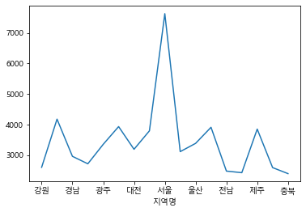

```python
# 전용면적으로 분양가격의 평균을 구하고 시각화

df.groupby(["전용면적"])["분양가격"].mean().plot.bar(rot=0)
```


    <AxesSubplot:xlabel='전용면적'>


```python
# 지역명, 전용면적으로 분양가격의 평균을 구하기

df.groupby(["지역명", "전용면적"])["분양가격"].mean()
```


    지역명  전용면적     
    강원    102 ~       2921.746479
          60          2507.042254
          60 ~ 85     2427.633803
          85 ~ 102    2698.000000
         전체           2436.802817
                         ...     
    충북    102 ~       2562.098592
          60          2248.338028
          60 ~ 85     2287.169014
          85 ~ 102    2578.623188
         전체           2271.873239
    Name: 분양가격, Length: 85, dtype: float64


```python
# 연도, 지역명으로 분양가격의 평균을 구하기

df.groupby(["연도", "지역명"])["분양가격"].mean()
```


    연도    지역명
    2015  강원     2178.200000
          경기     3351.800000
          경남     2563.400000
          경북     2261.866667
          광주     2399.000000
                    ...     
    2021  전남     3009.333333
          전북     2667.230769
          제주     6854.384615
          충남     2922.921053
          충북     2668.225000
    Name: 분양가격, Length: 119, dtype: float64


## pivot table 로 데이터 집계하기
* groupby 로 했던 작업을 pivot_table로 똑같이 해봅니다.


```python
# 지역명을 index 로 분양가격 을 values 로 구하기

df.pivot_table(index="지역명", values="분양가격")
```


<div>
<style scoped>
    .dataframe tbody tr th:only-of-type {
        vertical-align: middle;
    }

    .dataframe tbody tr th {
        vertical-align: top;
    }
    
    .dataframe thead th {
        text-align: right;
    }
</style>
<table border="1" class="dataframe">
  <thead>
    <tr style="text-align: right;">
      <th></th>
      <th>분양가격</th>
    </tr>
    <tr>
      <th>지역명</th>
      <th></th>
    </tr>
  </thead>
  <tbody>
    <tr>
      <th>강원</th>
      <td>2594.755102</td>
    </tr>
    <tr>
      <th>경기</th>
      <td>4174.312676</td>
    </tr>
    <tr>
      <th>경남</th>
      <td>2955.829480</td>
    </tr>
    <tr>
      <th>경북</th>
      <td>2710.954955</td>
    </tr>
    <tr>
      <th>광주</th>
      <td>3349.097643</td>
    </tr>
    <tr>
      <th>대구</th>
      <td>3930.002890</td>
    </tr>
    <tr>
      <th>대전</th>
      <td>3186.765152</td>
    </tr>
    <tr>
      <th>부산</th>
      <td>3791.197183</td>
    </tr>
    <tr>
      <th>서울</th>
      <td>7631.946176</td>
    </tr>
    <tr>
      <th>세종</th>
      <td>3109.516667</td>
    </tr>
    <tr>
      <th>울산</th>
      <td>3380.734783</td>
    </tr>
    <tr>
      <th>인천</th>
      <td>3907.227920</td>
    </tr>
    <tr>
      <th>전남</th>
      <td>2471.505747</td>
    </tr>
    <tr>
      <th>전북</th>
      <td>2419.452991</td>
    </tr>
    <tr>
      <th>제주</th>
      <td>3848.003484</td>
    </tr>
    <tr>
      <th>충남</th>
      <td>2586.086310</td>
    </tr>
    <tr>
      <th>충북</th>
      <td>2388.549575</td>
    </tr>
  </tbody>
</table>
</div>


```python
# df_last.groupby(["전용면적"])["평당분양가격"].mean()
# 전용면적을 index 로 분양가격 을 values 로 구합니다.

df.pivot_table(index="전용면적", values="분양가격")
```


<div>
<style scoped>
    .dataframe tbody tr th:only-of-type {
        vertical-align: middle;
    }

    .dataframe tbody tr th {
        vertical-align: top;
    }
    
    .dataframe thead th {
        text-align: right;
    }
</style>
<table border="1" class="dataframe">
  <thead>
    <tr style="text-align: right;">
      <th></th>
      <th>분양가격</th>
    </tr>
    <tr>
      <th>전용면적</th>
      <th></th>
    </tr>
  </thead>
  <tbody>
    <tr>
      <th>102 ~</th>
      <td>3705.612093</td>
    </tr>
    <tr>
      <th>60</th>
      <td>3336.824779</td>
    </tr>
    <tr>
      <th>60 ~ 85</th>
      <td>3324.004205</td>
    </tr>
    <tr>
      <th>85 ~ 102</th>
      <td>3601.343035</td>
    </tr>
    <tr>
      <th>전체</th>
      <td>3330.388423</td>
    </tr>
  </tbody>
</table>
</div>


```python
df.groupby(["전용면적", "지역명"])["분양가격"].mean().unstack().round()
```


<div>
<style scoped>
    .dataframe tbody tr th:only-of-type {
        vertical-align: middle;
    }

    .dataframe tbody tr th {
        vertical-align: top;
    }
    
    .dataframe thead th {
        text-align: right;
    }
</style>
<table border="1" class="dataframe">
  <thead>
    <tr style="text-align: right;">
      <th>지역명</th>
      <th>강원</th>
      <th>경기</th>
      <th>경남</th>
      <th>경북</th>
      <th>광주</th>
      <th>대구</th>
      <th>대전</th>
      <th>부산</th>
      <th>서울</th>
      <th>세종</th>
      <th>울산</th>
      <th>인천</th>
      <th>전남</th>
      <th>전북</th>
      <th>제주</th>
      <th>충남</th>
      <th>충북</th>
    </tr>
    <tr>
      <th>전용면적</th>
      <th></th>
      <th></th>
      <th></th>
      <th></th>
      <th></th>
      <th></th>
      <th></th>
      <th></th>
      <th></th>
      <th></th>
      <th></th>
      <th></th>
      <th></th>
      <th></th>
      <th></th>
      <th></th>
      <th></th>
    </tr>
  </thead>
  <tbody>
    <tr>
      <th>102 ~</th>
      <td>2922.0</td>
      <td>4606.0</td>
      <td>3144.0</td>
      <td>2938.0</td>
      <td>3742.0</td>
      <td>4235.0</td>
      <td>4508.0</td>
      <td>4043.0</td>
      <td>7630.0</td>
      <td>3170.0</td>
      <td>3492.0</td>
      <td>4579.0</td>
      <td>2744.0</td>
      <td>2552.0</td>
      <td>3697.0</td>
      <td>2715.0</td>
      <td>2562.0</td>
    </tr>
    <tr>
      <th>60</th>
      <td>2507.0</td>
      <td>4085.0</td>
      <td>2729.0</td>
      <td>2580.0</td>
      <td>3127.0</td>
      <td>3884.0</td>
      <td>2976.0</td>
      <td>3626.0</td>
      <td>7478.0</td>
      <td>3035.0</td>
      <td>3309.0</td>
      <td>3700.0</td>
      <td>2313.0</td>
      <td>2379.0</td>
      <td>4303.0</td>
      <td>2457.0</td>
      <td>2248.0</td>
    </tr>
    <tr>
      <th>60 ~ 85</th>
      <td>2428.0</td>
      <td>3937.0</td>
      <td>2746.0</td>
      <td>2591.0</td>
      <td>3244.0</td>
      <td>3870.0</td>
      <td>3079.0</td>
      <td>3754.0</td>
      <td>7250.0</td>
      <td>3100.0</td>
      <td>3455.0</td>
      <td>3744.0</td>
      <td>2373.0</td>
      <td>2304.0</td>
      <td>3859.0</td>
      <td>2475.0</td>
      <td>2287.0</td>
    </tr>
    <tr>
      <th>85 ~ 102</th>
      <td>2698.0</td>
      <td>4294.0</td>
      <td>3414.0</td>
      <td>2913.0</td>
      <td>3511.0</td>
      <td>3773.0</td>
      <td>2751.0</td>
      <td>3764.0</td>
      <td>8513.0</td>
      <td>3107.0</td>
      <td>2916.0</td>
      <td>3831.0</td>
      <td>2558.0</td>
      <td>2556.0</td>
      <td>3245.0</td>
      <td>2874.0</td>
      <td>2579.0</td>
    </tr>
    <tr>
      <th>전체</th>
      <td>2437.0</td>
      <td>3949.0</td>
      <td>2758.0</td>
      <td>2597.0</td>
      <td>3269.0</td>
      <td>3867.0</td>
      <td>3095.0</td>
      <td>3769.0</td>
      <td>7289.0</td>
      <td>3113.0</td>
      <td>3431.0</td>
      <td>3720.0</td>
      <td>2371.0</td>
      <td>2313.0</td>
      <td>3893.0</td>
      <td>2468.0</td>
      <td>2272.0</td>
    </tr>
  </tbody>
</table>
</div>


```python
# 지역명, 전용면적으로 분양가격의 평균을 구합니다.
# df_last.groupby(["전용면적", "지역명"])["분양가격"].mean().unstack().round()
# df.pivot_table(index="전용면적", columns="지역명", values="분양가격").mean().round()
# pivot_table 안에 aggfunc= 형태로 있어야 표형태. pivot table은 멀티 인덱스가 불가하기 때문에 unstack이 불가!!

df.pivot_table(index="전용면적", columns="지역명", values="분양가격", aggfunc="mean").round()
```


<div>
<style scoped>
    .dataframe tbody tr th:only-of-type {
        vertical-align: middle;
    }

    .dataframe tbody tr th {
        vertical-align: top;
    }
    
    .dataframe thead th {
        text-align: right;
    }
</style>
<table border="1" class="dataframe">
  <thead>
    <tr style="text-align: right;">
      <th>지역명</th>
      <th>강원</th>
      <th>경기</th>
      <th>경남</th>
      <th>경북</th>
      <th>광주</th>
      <th>대구</th>
      <th>대전</th>
      <th>부산</th>
      <th>서울</th>
      <th>세종</th>
      <th>울산</th>
      <th>인천</th>
      <th>전남</th>
      <th>전북</th>
      <th>제주</th>
      <th>충남</th>
      <th>충북</th>
    </tr>
    <tr>
      <th>전용면적</th>
      <th></th>
      <th></th>
      <th></th>
      <th></th>
      <th></th>
      <th></th>
      <th></th>
      <th></th>
      <th></th>
      <th></th>
      <th></th>
      <th></th>
      <th></th>
      <th></th>
      <th></th>
      <th></th>
      <th></th>
    </tr>
  </thead>
  <tbody>
    <tr>
      <th>102 ~</th>
      <td>2922.0</td>
      <td>4606.0</td>
      <td>3144.0</td>
      <td>2938.0</td>
      <td>3742.0</td>
      <td>4235.0</td>
      <td>4508.0</td>
      <td>4043.0</td>
      <td>7630.0</td>
      <td>3170.0</td>
      <td>3492.0</td>
      <td>4579.0</td>
      <td>2744.0</td>
      <td>2552.0</td>
      <td>3697.0</td>
      <td>2715.0</td>
      <td>2562.0</td>
    </tr>
    <tr>
      <th>60</th>
      <td>2507.0</td>
      <td>4085.0</td>
      <td>2729.0</td>
      <td>2580.0</td>
      <td>3127.0</td>
      <td>3884.0</td>
      <td>2976.0</td>
      <td>3626.0</td>
      <td>7478.0</td>
      <td>3035.0</td>
      <td>3309.0</td>
      <td>3700.0</td>
      <td>2313.0</td>
      <td>2379.0</td>
      <td>4303.0</td>
      <td>2457.0</td>
      <td>2248.0</td>
    </tr>
    <tr>
      <th>60 ~ 85</th>
      <td>2428.0</td>
      <td>3937.0</td>
      <td>2746.0</td>
      <td>2591.0</td>
      <td>3244.0</td>
      <td>3870.0</td>
      <td>3079.0</td>
      <td>3754.0</td>
      <td>7250.0</td>
      <td>3100.0</td>
      <td>3455.0</td>
      <td>3744.0</td>
      <td>2373.0</td>
      <td>2304.0</td>
      <td>3859.0</td>
      <td>2475.0</td>
      <td>2287.0</td>
    </tr>
    <tr>
      <th>85 ~ 102</th>
      <td>2698.0</td>
      <td>4294.0</td>
      <td>3414.0</td>
      <td>2913.0</td>
      <td>3511.0</td>
      <td>3773.0</td>
      <td>2751.0</td>
      <td>3764.0</td>
      <td>8513.0</td>
      <td>3107.0</td>
      <td>2916.0</td>
      <td>3831.0</td>
      <td>2558.0</td>
      <td>2556.0</td>
      <td>3245.0</td>
      <td>2874.0</td>
      <td>2579.0</td>
    </tr>
    <tr>
      <th>전체</th>
      <td>2437.0</td>
      <td>3949.0</td>
      <td>2758.0</td>
      <td>2597.0</td>
      <td>3269.0</td>
      <td>3867.0</td>
      <td>3095.0</td>
      <td>3769.0</td>
      <td>7289.0</td>
      <td>3113.0</td>
      <td>3431.0</td>
      <td>3720.0</td>
      <td>2371.0</td>
      <td>2313.0</td>
      <td>3893.0</td>
      <td>2468.0</td>
      <td>2272.0</td>
    </tr>
  </tbody>
</table>
</div>


```python
# 연도, 지역명으로 분양가격의 평균을 구합니다.
# g = df_last.groupby(["연도", "지역명"])["분양가격"].mean()

df.pivot_table(index="연도", columns="지역명", values="분양가격", aggfunc="mean").round()
```


<div>
<style scoped>
    .dataframe tbody tr th:only-of-type {
        vertical-align: middle;
    }

    .dataframe tbody tr th {
        vertical-align: top;
    }
    
    .dataframe thead th {
        text-align: right;
    }
</style>
<table border="1" class="dataframe">
  <thead>
    <tr style="text-align: right;">
      <th>지역명</th>
      <th>강원</th>
      <th>경기</th>
      <th>경남</th>
      <th>경북</th>
      <th>광주</th>
      <th>대구</th>
      <th>대전</th>
      <th>부산</th>
      <th>서울</th>
      <th>세종</th>
      <th>울산</th>
      <th>인천</th>
      <th>전남</th>
      <th>전북</th>
      <th>제주</th>
      <th>충남</th>
      <th>충북</th>
    </tr>
    <tr>
      <th>연도</th>
      <th></th>
      <th></th>
      <th></th>
      <th></th>
      <th></th>
      <th></th>
      <th></th>
      <th></th>
      <th></th>
      <th></th>
      <th></th>
      <th></th>
      <th></th>
      <th></th>
      <th></th>
      <th></th>
      <th></th>
    </tr>
  </thead>
  <tbody>
    <tr>
      <th>2015</th>
      <td>2178.0</td>
      <td>3352.0</td>
      <td>2563.0</td>
      <td>2262.0</td>
      <td>2399.0</td>
      <td>2733.0</td>
      <td>2482.0</td>
      <td>3145.0</td>
      <td>6156.0</td>
      <td>2656.0</td>
      <td>2839.0</td>
      <td>3326.0</td>
      <td>2060.0</td>
      <td>2155.0</td>
      <td>2409.0</td>
      <td>2330.0</td>
      <td>2069.0</td>
    </tr>
    <tr>
      <th>2016</th>
      <td>2171.0</td>
      <td>3541.0</td>
      <td>2575.0</td>
      <td>2350.0</td>
      <td>2785.0</td>
      <td>3116.0</td>
      <td>2700.0</td>
      <td>3256.0</td>
      <td>6592.0</td>
      <td>2684.0</td>
      <td>2904.0</td>
      <td>3363.0</td>
      <td>2102.0</td>
      <td>2093.0</td>
      <td>2899.0</td>
      <td>2412.0</td>
      <td>2162.0</td>
    </tr>
    <tr>
      <th>2017</th>
      <td>2218.0</td>
      <td>3726.0</td>
      <td>2669.0</td>
      <td>2512.0</td>
      <td>2909.0</td>
      <td>3695.0</td>
      <td>3004.0</td>
      <td>3527.0</td>
      <td>6625.0</td>
      <td>2768.0</td>
      <td>3221.0</td>
      <td>3537.0</td>
      <td>2246.0</td>
      <td>2244.0</td>
      <td>3827.0</td>
      <td>2472.0</td>
      <td>2261.0</td>
    </tr>
    <tr>
      <th>2018</th>
      <td>2491.0</td>
      <td>4321.0</td>
      <td>2827.0</td>
      <td>2631.0</td>
      <td>2887.0</td>
      <td>3679.0</td>
      <td>3101.0</td>
      <td>3906.0</td>
      <td>7031.0</td>
      <td>3133.0</td>
      <td>3103.0</td>
      <td>3600.0</td>
      <td>2403.0</td>
      <td>2477.0</td>
      <td>3617.0</td>
      <td>2485.0</td>
      <td>2469.0</td>
    </tr>
    <tr>
      <th>2019</th>
      <td>2707.0</td>
      <td>4747.0</td>
      <td>3242.0</td>
      <td>2742.0</td>
      <td>3670.0</td>
      <td>4267.0</td>
      <td>3824.0</td>
      <td>4102.0</td>
      <td>8572.0</td>
      <td>3424.0</td>
      <td>3096.0</td>
      <td>4015.0</td>
      <td>2491.0</td>
      <td>2586.0</td>
      <td>3584.0</td>
      <td>2651.0</td>
      <td>2415.0</td>
    </tr>
    <tr>
      <th>2020</th>
      <td>3122.0</td>
      <td>4578.0</td>
      <td>3309.0</td>
      <td>3030.0</td>
      <td>4063.0</td>
      <td>4641.0</td>
      <td>3406.0</td>
      <td>4046.0</td>
      <td>9025.0</td>
      <td>3524.0</td>
      <td>3890.0</td>
      <td>4540.0</td>
      <td>2898.0</td>
      <td>2594.0</td>
      <td>4301.0</td>
      <td>2770.0</td>
      <td>2533.0</td>
    </tr>
    <tr>
      <th>2021</th>
      <td>3117.0</td>
      <td>4421.0</td>
      <td>3415.0</td>
      <td>3386.0</td>
      <td>4156.0</td>
      <td>4705.0</td>
      <td>3558.0</td>
      <td>4212.0</td>
      <td>8712.0</td>
      <td>3800.0</td>
      <td>4297.0</td>
      <td>4814.0</td>
      <td>3009.0</td>
      <td>2667.0</td>
      <td>6854.0</td>
      <td>2923.0</td>
      <td>2668.0</td>
    </tr>
  </tbody>
</table>
</div>


# 데이터 시각화 연습

## pandas로 데이터 시각화 연습


```python
# 지역명으로 분양가격의 평균을 구하고 선그래프로 시각화 합니다.

df.groupby(["지역명"])["분양가격"].mean().plot()
```


    <AxesSubplot:xlabel='지역명'>


​    
​    


```python
# 지역명으로 분양가격의 평균을 구하고 막대그래프(bar)로 시각화 합니다.

df.groupby(["지역명"])["분양가격"].mean().plot.bar(rot=30)
```


    <AxesSubplot:xlabel='지역명'>

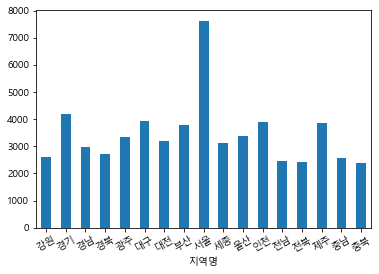
    


전용면적별 분양가격의 평균값을 구하고 그래프로 그려봅니다.


```python
# 전용면적으로 분양가격의 평균을 구하고 막대그래프(bar)로 시각화 합니다.

df.groupby(["전용면적"])["분양가격"].mean().plot.bar(rot=30)
```


    <AxesSubplot:xlabel='전용면적'>

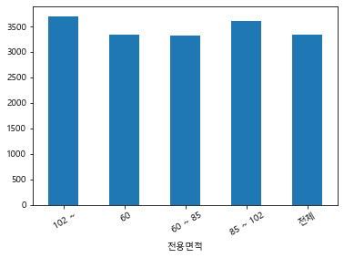


```python
# 연도별 분양가격의 평균을 구하고 막대그래프(bar)로 시각화 합니다.

df.pivot_table(index="연도", values="분양가격", aggfunc="mean").plot.bar(rot=0)
```


    <AxesSubplot:xlabel='연도'>

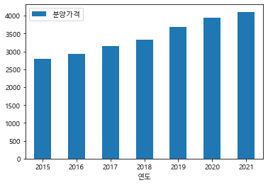


    


### box-and-whisker plot | diagram

* https://pandas.pydata.org/pandas-docs/stable/user_guide/visualization.html
* https://pandas.pydata.org/pandas-docs/stable/reference/api/pandas.DataFrame.boxplot.html

* [상자 수염 그림 - 위키백과, 우리 모두의 백과사전](https://ko.wikipedia.org/wiki/%EC%83%81%EC%9E%90_%EC%88%98%EC%97%BC_%EA%B7%B8%EB%A6%BC)
* 가공하지 않은 자료 그대로를 이용하여 그린 것이 아니라, 자료로부터 얻어낸 통계량인 5가지 요약 수치로 그린다.
* 5가지 요약 수치란 기술통계학에서 자료의 정보를 알려주는 아래의 다섯 가지 수치를 의미한다.


1. 최솟값
1. 제 1사분위수
1. 제 2사분위수( ), 즉 중앙값
1. 제 3 사분위 수( )
1. 최댓값

* Box plot 이해하기 : 
    * [박스 플롯에 대하여 :: -[|]- Box and Whisker](https://boxnwhis.kr/2019/02/19/boxplot.html)
    * [Understanding Boxplots – Towards Data Science](https://towardsdatascience.com/understanding-boxplots-5e2df7bcbd51)


```python
# index를 월, columns 를 연도로 구하고 분양가격 으로 pivot_table 을 구하고 상자수염그림을 그립니다.


df.pivot_table(index="월", columns="연도", values="분양가격").plot.box()
```


    <AxesSubplot:>

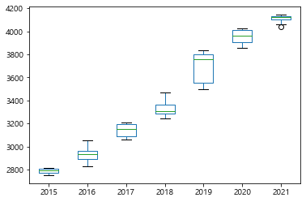


```python

```


```python
# columns 에 "연도", "전용면적"을 추가해서 pivot_table 을 만들고 시각화 합니다.

df.pivot_table(index="월", columns=["연도", "전용면적"], values="분양가격").plot.box()
```


    <AxesSubplot:>

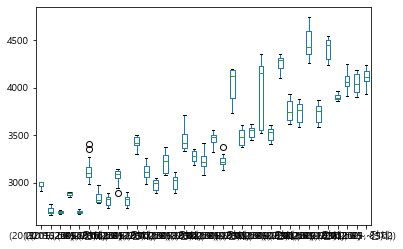
    

```python
# index를 월, columns 를 지역명으로 구하고 분양가격 으로 pivot_table 을 구하고 선그래프를 그립니다.


df.pivot_table(index="월", columns="지역명", values="분양가격").plot()
```


    <AxesSubplot:xlabel='월'>

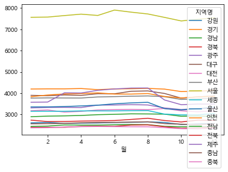
    


## seaborn으로 시각화 연습


```python
df.head(1)
```


<div>
<style scoped>
    .dataframe tbody tr th:only-of-type {
        vertical-align: middle;
    }

    .dataframe tbody tr th {
        vertical-align: top;
    }
    
    .dataframe thead th {
        text-align: right;
    }
</style>
<table border="1" class="dataframe">
  <thead>
    <tr style="text-align: right;">
      <th></th>
      <th>지역명</th>
      <th>연도</th>
      <th>월</th>
      <th>분양가격</th>
      <th>전용면적</th>
    </tr>
  </thead>
  <tbody>
    <tr>
      <th>0</th>
      <td>서울</td>
      <td>2015</td>
      <td>10</td>
      <td>5841.0</td>
      <td>전체</td>
    </tr>
  </tbody>
</table>
</div>


```python
# barplot으로 지역별 분양가격을 그려봅니다.

plt.figure(figsize=(8, 6))
sns.barplot(data=df, x="지역명", y="분양가격", ci=None)
```


    <AxesSubplot:xlabel='지역명', ylabel='분양가격'>

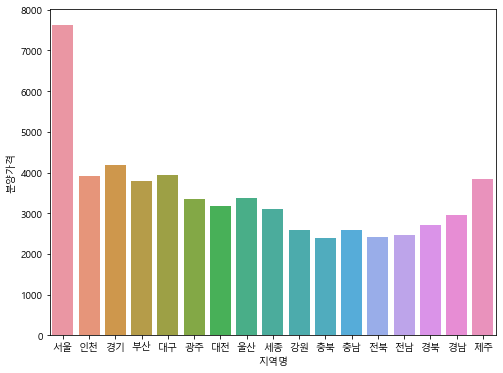
    


```python
# barplot으로 연도별 평당분양가격을 그려봅니다.

plt.figure(figsize=(8, 6))
sns.barplot(data=df, x="연도", y="분양가격", ci=None)
```


    <AxesSubplot:xlabel='연도', ylabel='분양가격'>

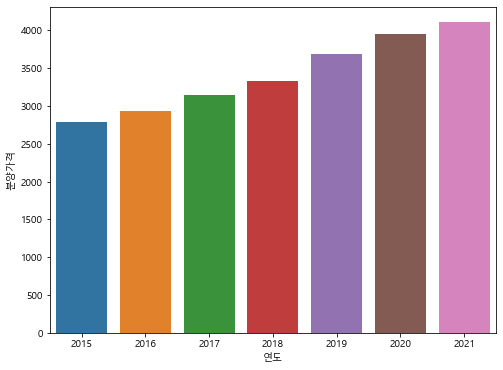


```python
# catplot 으로 서브플롯 그리기

plt.figure(figsize=(8, 6))
sns.catplot(data=df, x="지역명", y="분양가격", ci=None)
```


    <seaborn.axisgrid.FacetGrid at 0x1b884994df0>


    <Figure size 576x432 with 0 Axes>


https://stackoverflow.com/questions/30490740/move-legend-outside-figure-in-seaborn-tsplot


```python
# lineplot으로 연도별 평당분양가격을 그려봅니다.
# hue 옵션을 통해 지역별로 다르게 표시해 봅니다.

sns.lineplot(data=df, x="연도", y="분양가격", hue="지역명")
```


    <AxesSubplot:xlabel='연도', ylabel='분양가격'>

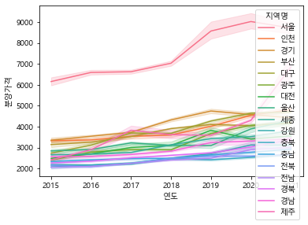

```python
# relplot 으로 서브플롯 그리기

sns.relplot(data=df, x="연도", y="분양가격", hue="지역명")
```


    <seaborn.axisgrid.FacetGrid at 0x1b8fc529a90>

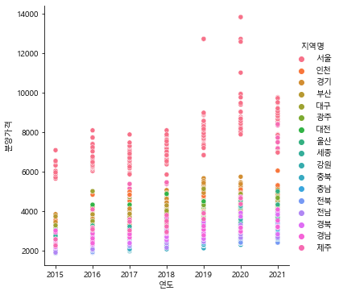


### boxplot과 violinplot


```python
# 연도별 평당분양가격을 boxplot으로 그려봅니다.
# 최솟값
# 제 1사분위수
# 제 2사분위수( ), 즉 중앙값
# 제 3 사분위 수( )
# 최댓값

sns.boxplot(data=df, x="연도", y="분양가격")
```


    <AxesSubplot:xlabel='연도', ylabel='분양가격'>

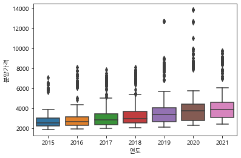


```python
# hue옵션을 주어 전용면적별로 다르게 표시해 봅니다.

plt.figure(figsize=(15, 5))
sns.boxplot(data=df, x="연도", y="분양가격", hue="전용면적")
```


    <AxesSubplot:xlabel='연도', ylabel='분양가격'>

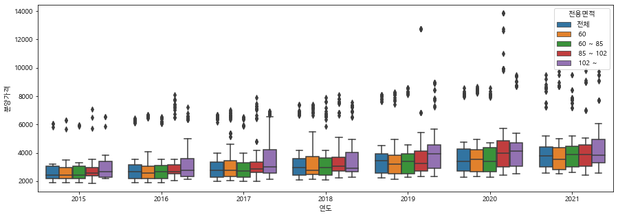

```python
# 연도별 평당분양가격을 violinplot으로 그려봅니다.

sns.violinplot(data=df, x="연도", y="분양가격")
```


    <AxesSubplot:xlabel='연도', ylabel='분양가격'>

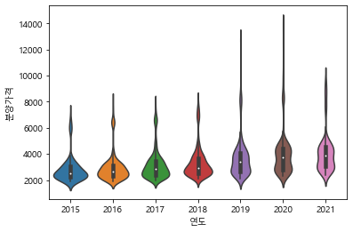


### lmplot과 swarmplot 


```python
# 연도별 평당분양가격을 lmplot으로 그려봅니다. 
# hue 옵션으로 전용면적을 표현해 봅니다.

sns.lmplot(data=df, x="연도", y="분양가격", hue="전용면적")
```


    <seaborn.axisgrid.FacetGrid at 0x1b8833a5850>

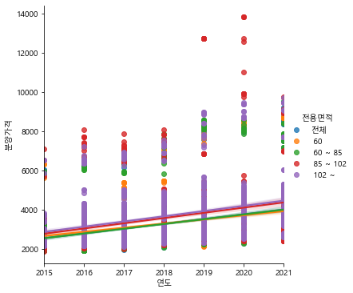

```python
# 연도별 평당분양가격을 swarmplot 으로 그려봅니다. 
# swarmplot은 범주형(카테고리) 데이터의 산점도를 표현하기에 적합합니다.

sns.swarmplot(data=df, x="연도", y="분양가격", hue="전용면적")
```

    C:\ProgramData\Anaconda3\lib\site-packages\seaborn\categorical.py:1296: UserWarning: 70.2% of the points cannot be placed; you may want to decrease the size of the markers or use stripplot.
      warnings.warn(msg, UserWarning)
    C:\ProgramData\Anaconda3\lib\site-packages\seaborn\categorical.py:1296: UserWarning: 86.6% of the points cannot be placed; you may want to decrease the size of the markers or use stripplot.
      warnings.warn(msg, UserWarning)
    C:\ProgramData\Anaconda3\lib\site-packages\seaborn\categorical.py:1296: UserWarning: 83.9% of the points cannot be placed; you may want to decrease the size of the markers or use stripplot.
      warnings.warn(msg, UserWarning)
    C:\ProgramData\Anaconda3\lib\site-packages\seaborn\categorical.py:1296: UserWarning: 78.8% of the points cannot be placed; you may want to decrease the size of the markers or use stripplot.
      warnings.warn(msg, UserWarning)
    C:\ProgramData\Anaconda3\lib\site-packages\seaborn\categorical.py:1296: UserWarning: 76.7% of the points cannot be placed; you may want to decrease the size of the markers or use stripplot.
      warnings.warn(msg, UserWarning)
    C:\ProgramData\Anaconda3\lib\site-packages\seaborn\categorical.py:1296: UserWarning: 74.5% of the points cannot be placed; you may want to decrease the size of the markers or use stripplot.
      warnings.warn(msg, UserWarning)
    C:\ProgramData\Anaconda3\lib\site-packages\seaborn\categorical.py:1296: UserWarning: 75.3% of the points cannot be placed; you may want to decrease the size of the markers or use stripplot.
      warnings.warn(msg, UserWarning)


    <AxesSubplot:xlabel='연도', ylabel='분양가격'>

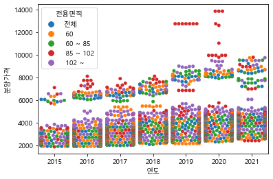


### 이상치 보기


```python
# 분양가격의 최대값을 구해서 max_price 라는 변수에 담습니다.

max_price = df["분양가격"].max()
```


```python
# 서울의 분양가격이 특히 높은 데이터가 있습니다. 해당 데이터를 가져옵니다.

[df["분양가격"] == max_price]
```


    [0       False
     1       False
     2       False
     3       False
     4       False
             ...  
     6030    False
     6031    False
     6032    False
     6033    False
     6034    False
     Name: 분양가격, Length: 6035, dtype: bool]


### 수치데이터 히스토그램 그리기

distplot은 결측치가 있으면 그래프를 그릴 때 오류가 납니다. 
따라서 결측치가 아닌 데이터만 따로 모아서 평당분양가격을 시각화하기 위한 데이터를 만듭니다.
데이터프레임의 .loc를 활용하여 결측치가 없는 데이터에서 평당분양가격만 가져옵니다.


```python
# 결측치가 없는 데이터에서 분양가격만 가져옵니다. 그리고 price라는 변수에 담습니다.
# .loc[행]
# .loc[행, 열]

price = df.loc[~df["분양가격"].isnull(), "분양가격"]
price
```


    0       5841.0
    1       5652.0
    2       5882.0
    3       5721.0
    4       5879.0
             ...  
    6028    4087.0
    6029    3526.0
    6030    8356.0
    6032    8410.0
    6034    7727.0
    Name: 분양가격, Length: 5548, dtype: float64


```python
# distplot으로 분양가격을 표현해 봅니다.

sns.distplot(price)
```

    C:\ProgramData\Anaconda3\lib\site-packages\seaborn\distributions.py:2557: FutureWarning: `distplot` is a deprecated function and will be removed in a future version. Please adapt your code to use either `displot` (a figure-level function with similar flexibility) or `histplot` (an axes-level function for histograms).
      warnings.warn(msg, FutureWarning)


    <AxesSubplot:xlabel='분양가격', ylabel='Density'>

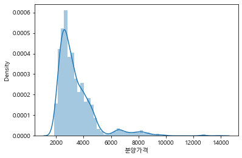


```python
# sns.distplot(price, hist=False, rug=True)

sns.distplot(price, hist=False, rug=True)
```

    C:\ProgramData\Anaconda3\lib\site-packages\seaborn\distributions.py:2557: FutureWarning: `distplot` is a deprecated function and will be removed in a future version. Please adapt your code to use either `displot` (a figure-level function with similar flexibility) or `kdeplot` (an axes-level function for kernel density plots).
      warnings.warn(msg, FutureWarning)
    C:\ProgramData\Anaconda3\lib\site-packages\seaborn\distributions.py:2056: FutureWarning: The `axis` variable is no longer used and will be removed. Instead, assign variables directly to `x` or `y`.
      warnings.warn(msg, FutureWarning)


    <AxesSubplot:xlabel='분양가격', ylabel='Density'>

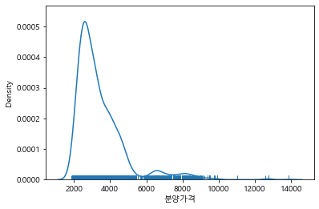

```python
sns.kdeplot(price, cumulative=True)
```


    <AxesSubplot:xlabel='분양가격', ylabel='Density'>

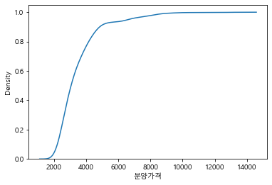


* distplot을 산마루 형태의 ridge plot으로 그리기
* https://seaborn.pydata.org/tutorial/axis_grids.html#conditional-small-multiples
* https://seaborn.pydata.org/examples/kde_ridgeplot.html


```python
# subplot 으로 표현해 봅니다.

g = sns.FacetGrid(df, row="지역명", height=1.7, aspect=4)
g.map(sns.distplot, "분양가격", hist=False, rug=True)
```

    C:\ProgramData\Anaconda3\lib\site-packages\seaborn\distributions.py:2557: FutureWarning: `distplot` is a deprecated function and will be removed in a future version. Please adapt your code to use either `displot` (a figure-level function with similar flexibility) or `kdeplot` (an axes-level function for kernel density plots).
      warnings.warn(msg, FutureWarning)
    C:\ProgramData\Anaconda3\lib\site-packages\seaborn\distributions.py:2056: FutureWarning: The `axis` variable is no longer used and will be removed. Instead, assign variables directly to `x` or `y`.
      warnings.warn(msg, FutureWarning)
    C:\ProgramData\Anaconda3\lib\site-packages\seaborn\distributions.py:2557: FutureWarning: `distplot` is a deprecated function and will be removed in a future version. Please adapt your code to use either `displot` (a figure-level function with similar flexibility) or `kdeplot` (an axes-level function for kernel density plots).
      warnings.warn(msg, FutureWarning)
    C:\ProgramData\Anaconda3\lib\site-packages\seaborn\distributions.py:2056: FutureWarning: The `axis` variable is no longer used and will be removed. Instead, assign variables directly to `x` or `y`.
      warnings.warn(msg, FutureWarning)
    C:\ProgramData\Anaconda3\lib\site-packages\seaborn\distributions.py:2557: FutureWarning: `distplot` is a deprecated function and will be removed in a future version. Please adapt your code to use either `displot` (a figure-level function with similar flexibility) or `kdeplot` (an axes-level function for kernel density plots).
      warnings.warn(msg, FutureWarning)
    C:\ProgramData\Anaconda3\lib\site-packages\seaborn\distributions.py:2056: FutureWarning: The `axis` variable is no longer used and will be removed. Instead, assign variables directly to `x` or `y`.
      warnings.warn(msg, FutureWarning)
    C:\ProgramData\Anaconda3\lib\site-packages\seaborn\distributions.py:2557: FutureWarning: `distplot` is a deprecated function and will be removed in a future version. Please adapt your code to use either `displot` (a figure-level function with similar flexibility) or `kdeplot` (an axes-level function for kernel density plots).
      warnings.warn(msg, FutureWarning)
    C:\ProgramData\Anaconda3\lib\site-packages\seaborn\distributions.py:2056: FutureWarning: The `axis` variable is no longer used and will be removed. Instead, assign variables directly to `x` or `y`.
      warnings.warn(msg, FutureWarning)
    C:\ProgramData\Anaconda3\lib\site-packages\seaborn\distributions.py:2557: FutureWarning: `distplot` is a deprecated function and will be removed in a future version. Please adapt your code to use either `displot` (a figure-level function with similar flexibility) or `kdeplot` (an axes-level function for kernel density plots).
      warnings.warn(msg, FutureWarning)
    C:\ProgramData\Anaconda3\lib\site-packages\seaborn\distributions.py:2056: FutureWarning: The `axis` variable is no longer used and will be removed. Instead, assign variables directly to `x` or `y`.
      warnings.warn(msg, FutureWarning)
    C:\ProgramData\Anaconda3\lib\site-packages\seaborn\distributions.py:2557: FutureWarning: `distplot` is a deprecated function and will be removed in a future version. Please adapt your code to use either `displot` (a figure-level function with similar flexibility) or `kdeplot` (an axes-level function for kernel density plots).
      warnings.warn(msg, FutureWarning)
    C:\ProgramData\Anaconda3\lib\site-packages\seaborn\distributions.py:2056: FutureWarning: The `axis` variable is no longer used and will be removed. Instead, assign variables directly to `x` or `y`.
      warnings.warn(msg, FutureWarning)
    C:\ProgramData\Anaconda3\lib\site-packages\seaborn\distributions.py:2557: FutureWarning: `distplot` is a deprecated function and will be removed in a future version. Please adapt your code to use either `displot` (a figure-level function with similar flexibility) or `kdeplot` (an axes-level function for kernel density plots).
      warnings.warn(msg, FutureWarning)
    C:\ProgramData\Anaconda3\lib\site-packages\seaborn\distributions.py:2056: FutureWarning: The `axis` variable is no longer used and will be removed. Instead, assign variables directly to `x` or `y`.
      warnings.warn(msg, FutureWarning)
    C:\ProgramData\Anaconda3\lib\site-packages\seaborn\distributions.py:2557: FutureWarning: `distplot` is a deprecated function and will be removed in a future version. Please adapt your code to use either `displot` (a figure-level function with similar flexibility) or `kdeplot` (an axes-level function for kernel density plots).
      warnings.warn(msg, FutureWarning)
    C:\ProgramData\Anaconda3\lib\site-packages\seaborn\distributions.py:2056: FutureWarning: The `axis` variable is no longer used and will be removed. Instead, assign variables directly to `x` or `y`.
      warnings.warn(msg, FutureWarning)
    C:\ProgramData\Anaconda3\lib\site-packages\seaborn\distributions.py:2557: FutureWarning: `distplot` is a deprecated function and will be removed in a future version. Please adapt your code to use either `displot` (a figure-level function with similar flexibility) or `kdeplot` (an axes-level function for kernel density plots).
      warnings.warn(msg, FutureWarning)
    C:\ProgramData\Anaconda3\lib\site-packages\seaborn\distributions.py:2056: FutureWarning: The `axis` variable is no longer used and will be removed. Instead, assign variables directly to `x` or `y`.
      warnings.warn(msg, FutureWarning)
    C:\ProgramData\Anaconda3\lib\site-packages\seaborn\distributions.py:2557: FutureWarning: `distplot` is a deprecated function and will be removed in a future version. Please adapt your code to use either `displot` (a figure-level function with similar flexibility) or `kdeplot` (an axes-level function for kernel density plots).
      warnings.warn(msg, FutureWarning)
    C:\ProgramData\Anaconda3\lib\site-packages\seaborn\distributions.py:2056: FutureWarning: The `axis` variable is no longer used and will be removed. Instead, assign variables directly to `x` or `y`.
      warnings.warn(msg, FutureWarning)
    C:\ProgramData\Anaconda3\lib\site-packages\seaborn\distributions.py:2557: FutureWarning: `distplot` is a deprecated function and will be removed in a future version. Please adapt your code to use either `displot` (a figure-level function with similar flexibility) or `kdeplot` (an axes-level function for kernel density plots).
      warnings.warn(msg, FutureWarning)
    C:\ProgramData\Anaconda3\lib\site-packages\seaborn\distributions.py:2056: FutureWarning: The `axis` variable is no longer used and will be removed. Instead, assign variables directly to `x` or `y`.
      warnings.warn(msg, FutureWarning)
    C:\ProgramData\Anaconda3\lib\site-packages\seaborn\distributions.py:2557: FutureWarning: `distplot` is a deprecated function and will be removed in a future version. Please adapt your code to use either `displot` (a figure-level function with similar flexibility) or `kdeplot` (an axes-level function for kernel density plots).
      warnings.warn(msg, FutureWarning)
    C:\ProgramData\Anaconda3\lib\site-packages\seaborn\distributions.py:2056: FutureWarning: The `axis` variable is no longer used and will be removed. Instead, assign variables directly to `x` or `y`.
      warnings.warn(msg, FutureWarning)
    C:\ProgramData\Anaconda3\lib\site-packages\seaborn\distributions.py:2557: FutureWarning: `distplot` is a deprecated function and will be removed in a future version. Please adapt your code to use either `displot` (a figure-level function with similar flexibility) or `kdeplot` (an axes-level function for kernel density plots).
      warnings.warn(msg, FutureWarning)
    C:\ProgramData\Anaconda3\lib\site-packages\seaborn\distributions.py:2056: FutureWarning: The `axis` variable is no longer used and will be removed. Instead, assign variables directly to `x` or `y`.
      warnings.warn(msg, FutureWarning)
    C:\ProgramData\Anaconda3\lib\site-packages\seaborn\distributions.py:2557: FutureWarning: `distplot` is a deprecated function and will be removed in a future version. Please adapt your code to use either `displot` (a figure-level function with similar flexibility) or `kdeplot` (an axes-level function for kernel density plots).
      warnings.warn(msg, FutureWarning)
    C:\ProgramData\Anaconda3\lib\site-packages\seaborn\distributions.py:2056: FutureWarning: The `axis` variable is no longer used and will be removed. Instead, assign variables directly to `x` or `y`.
      warnings.warn(msg, FutureWarning)
    C:\ProgramData\Anaconda3\lib\site-packages\seaborn\distributions.py:2557: FutureWarning: `distplot` is a deprecated function and will be removed in a future version. Please adapt your code to use either `displot` (a figure-level function with similar flexibility) or `kdeplot` (an axes-level function for kernel density plots).
      warnings.warn(msg, FutureWarning)
    C:\ProgramData\Anaconda3\lib\site-packages\seaborn\distributions.py:2056: FutureWarning: The `axis` variable is no longer used and will be removed. Instead, assign variables directly to `x` or `y`.
      warnings.warn(msg, FutureWarning)
    C:\ProgramData\Anaconda3\lib\site-packages\seaborn\distributions.py:2557: FutureWarning: `distplot` is a deprecated function and will be removed in a future version. Please adapt your code to use either `displot` (a figure-level function with similar flexibility) or `kdeplot` (an axes-level function for kernel density plots).
      warnings.warn(msg, FutureWarning)
    C:\ProgramData\Anaconda3\lib\site-packages\seaborn\distributions.py:2056: FutureWarning: The `axis` variable is no longer used and will be removed. Instead, assign variables directly to `x` or `y`.
      warnings.warn(msg, FutureWarning)
    C:\ProgramData\Anaconda3\lib\site-packages\seaborn\distributions.py:2557: FutureWarning: `distplot` is a deprecated function and will be removed in a future version. Please adapt your code to use either `displot` (a figure-level function with similar flexibility) or `kdeplot` (an axes-level function for kernel density plots).
      warnings.warn(msg, FutureWarning)
    C:\ProgramData\Anaconda3\lib\site-packages\seaborn\distributions.py:2056: FutureWarning: The `axis` variable is no longer used and will be removed. Instead, assign variables directly to `x` or `y`.
      warnings.warn(msg, FutureWarning)


    <seaborn.axisgrid.FacetGrid at 0x1b88797f4c0>

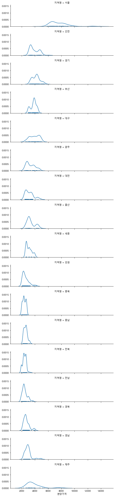


```python
# pairplot

df_notnull = df.loc[df["분양가격"].notnull(), ["연도", "월", "분양가격", "지역명", "전용면적"]]
sns.pairplot(df_notnull, hue="지역명")
```


    <seaborn.axisgrid.PairGrid at 0x1b8f2297130>

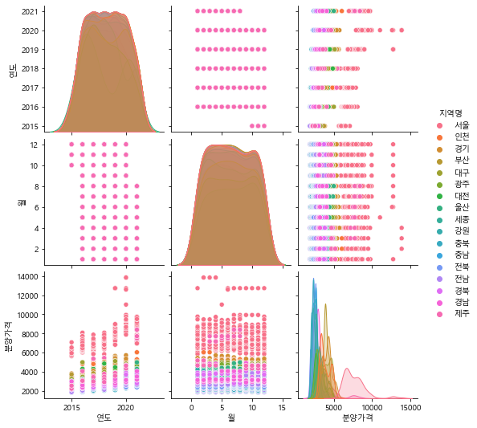


```python

```


```python

```


```python

```
