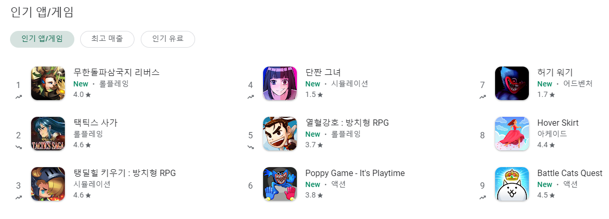
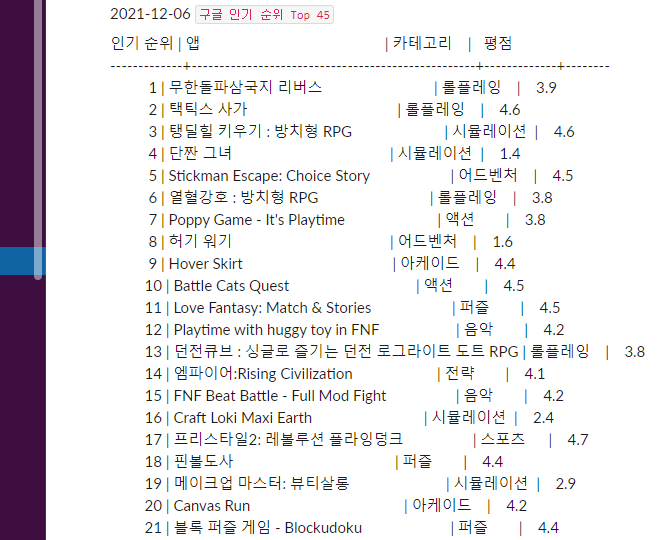
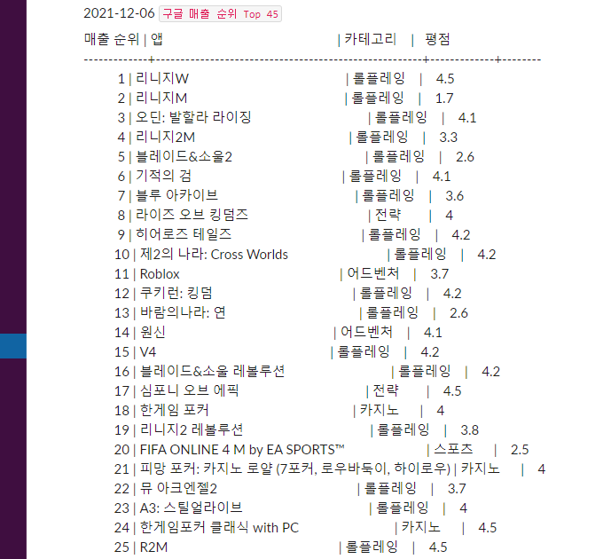
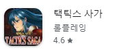

**구글플레이 UI 개편**

- 중간에 랭킹이 있고
- 인기 앱/ 게임이 디폴트, 최고 매출을 클릭해야 랭킹이 바뀜




```python
from selenium import webdriver
import pandas as pd
from bs4 import BeautifulSoup, element
from datetime import datetime, timedelta
import time

url = 'https://play.google.com/store/apps/category/GAME'

driver = webdriver.Chrome('크롬 드라이버 주소')

driver.get(url)
result_html = driver.page_source
result_soup = BeautifulSoup(result_html, 'html.parser')

text1 = result_soup.find_all('a', {'class' : 'Si6A0c itIJzb'})

app_list=[]

for contents in text1 :
    app_name = contents.find('span', {'class':'sT93pb DdYX5 OnEJge '}).get_text()
    genre = contents.find('span',{'class':'sT93pb w2kbF '}).get_text()
    if str(contents.find_all('span', {'class':'w2kbF'})[0].get_text()) == 'New' :
        grade = contents.find_all('span', {'class':'w2kbF'})[2].get_text()
    else :
        grade =contents.find_all('span', {'class':'w2kbF'})[1].get_text()
    app_list.append((app_name, genre, grade))

app_list = pd.DataFrame(app_list)
app_list.columns = ['앱', '카테고리', '평점']
app_list['인기 순위'] = (app_list.index + 1)

app_list = app_list[['인기 순위','앱', '카테고리', '평점']]
# print(app_list)

# 최고 매출 항목으로 바꾸기
top_grossing = driver.find_element_by_xpath('//*[@id="ct|apps_topgrossing"]')
top_grossing.click()
time.sleep(5) #최고 매출 항목으로 페이지가 바뀌게 기다리기

result_html2 = driver.page_source
result_soup2 = BeautifulSoup(result_html2, 'html.parser')
time.sleep(5) #한 번 더 기다리기

text2 = result_soup2.find_all('a', {'class' : 'Si6A0c itIJzb'})

app_list2=[]

for contents2 in text2 :
    app_name2 = contents2.find('span', {'class':'sT93pb DdYX5 OnEJge '}).get_text()
    genre2 = contents2.find('span',{'class':'sT93pb w2kbF '}).get_text()
    if str(contents2.find_all('span', {'class':'w2kbF'})[0].get_text()) == 'New' :
        grade2 = contents2.find_all('span', {'class':'w2kbF'})[2].get_text()
    else :
        grade2 =contents2.find_all('span', {'class':'w2kbF'})[1].get_text()
    app_list2.append((app_name2, genre2, grade2))

app_list2 = pd.DataFrame(app_list2)
app_list2.columns = ['앱', '카테고리', '평점']
app_list2['매출 순위'] = (app_list2.index + 1)

app_list2 = app_list2[['매출 순위','앱', '카테고리', '평점']]

# print(app_list2)

driver.quit()

import slack
from slacker import Slacker
from tabulate import tabulate

slack_token = "슬랙 토큰 키"
slack = Slacker(slack_token)

today = datetime.today()
today = today.strftime("%Y-%m-%d")

message1 = app_list
text = tabulate(message1, headers ='keys', tablefmt='presto', showindex=False)

slack.chat.post_message("#bot_test", str(f'{today}') + " `구글 인기 순위 Top 45`", as_user=True)
slack.chat.post_message("#bot_test", text, as_user=True)


message2 = app_list2
text2 = tabulate(message2, headers ='keys', tablefmt='presto', showindex=False)

slack.chat.post_message("#슬랙 채널명", str(f'{today}') + " `구글 매출 순위 Top 45`", as_user=True)
slack.chat.post_message("#슬랙 채널명", text2, as_user=True)

print("문제 없이 보냈습니다.")
```







평점 긁어 오는데 헤맸는데 야매로 처리해 버렸다


구글 플레이 평점은 텍스트가 아니라 <div aria-label> 로 되어 있어서 get_text()가 안 먹힘

문자 처리한 contents.find_all('span', {'class':'w2kbF'})[0].get_text()가 New면 아래와 같이


앱 이름 다음에 신규라서 "New"가 뜬 앱이고 아니면 New 표시가 없어서 if문으로 처리



[0],[1],[2]가 각각 New, 롤플레잉, 4.0 // 롤플레잉, 4.6 이런 식