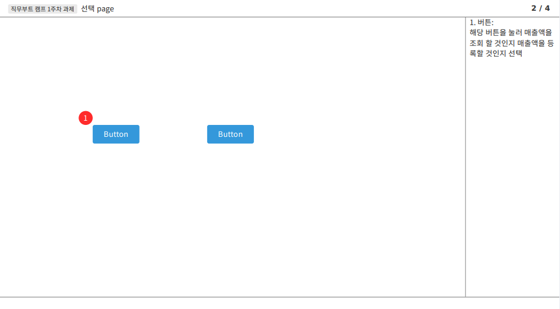
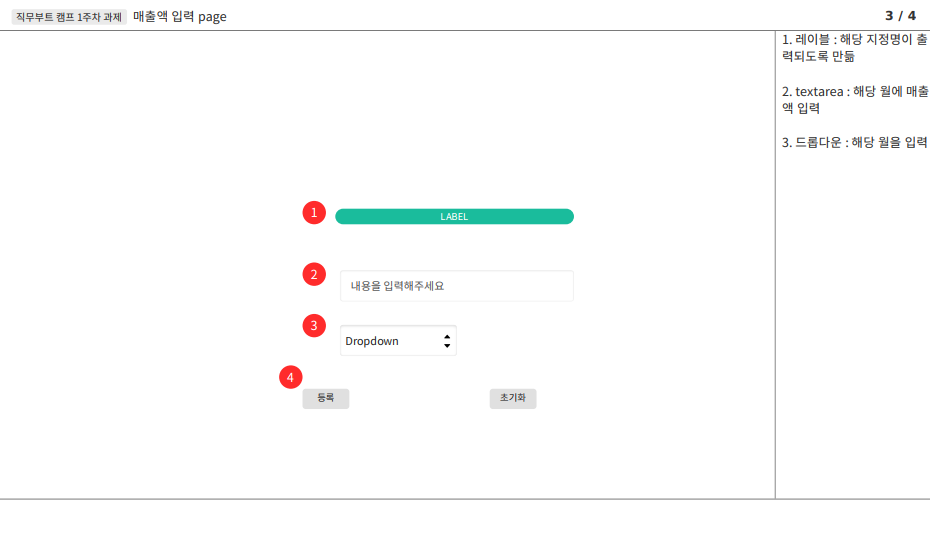
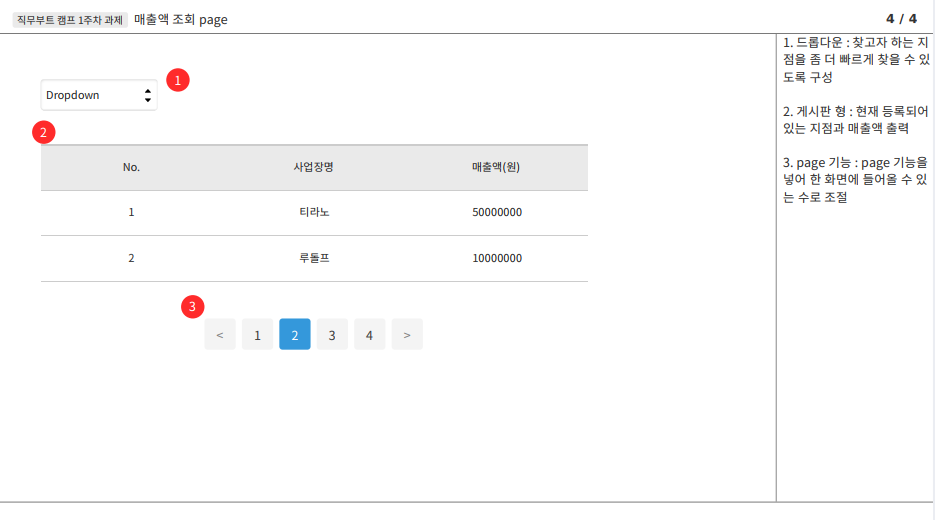

## 직무 부트 캠프 1주차

#### 간단 후기

- 첫 주차에 맨토님과 민티들 간에 간단한 자기 소개 후, it 에서는 어떤 일을 하는지 어떻게 분류 되는지 등, 어느정도 취업에 있어 조사가 끝난 상황이라면 알 수 있는 내용들을 들을 수 있다. 아마 해당 내용은 학생들에게 좀 더 유익한 내용들이라고 생각한다.
- 개인적으로 가장 마음에 들었던 부분은 수업 중간 중간에 질문 시간을 가질 수 있다는 것이었다. 또한 수업이 끝나고도 질문 할 수 있었으며 이때 남아서 다른 멘티의 질문과 멘토님의 답변을 듣기만 해도 굉장히 도움이 많이 된다.

 

#### 과제

- 과제 내용은 수업하던 도중에 등장 했다. 해당 과제의 내용을 요약하면 다음과 같다
  **사업장 별로 12/20일까지 매출액 자료를 취합 받아 올것, 사업장은 1만개 이상**
  국비지원으로 교육을 들을때는 내가 혹은 팀원끼기 상의해서 만들고 싶은 것만 만들었기에 이건 당연히 있어야지 하면서 프로그램 계획을 짰다면 해당 과제는 "해줘"여서 도대체 어느정도로 만들어주어야 할지 감이 잘 오지 않았다. 단순하게 만들면 요구사항만 구현하면 끝이지만, 기능에 대해 욕심이 생긴다면 사업장 월별 매출액 그래프 등의 기능을 추가 할 수 있겠다. 이렇게 기능을 하나하나씩 추가하면 못끝 낼 수도 있을것 같다
- 일단 계획서에는 필수적인 요구사항만을 구현해 놓고 시간이 남으면 살을 더 붙이는 방향으로 진행하는 것이 좋은 방향이라 생각한다.

#####  요구사항 정의

- 사업장 별로 매출액 자료를 취합
- 사업장은 1만개 이상

##### 프로세스

- 작동 방식은 간단하다. 로그인 후, 매출액을 입력할 것인지 조회할 것인지만 선택하면 된다. 로그인 아이디에 따라 매출액을 조회만 하게 만들 수도 있지만 굳이 그렇게까지 구현할 필요성을 아직 느끼지 못하고 있다.

   

##### 화면 정의서

- 화면 정의서는 다음과 같이 page를 분류해서 구성하였다.

