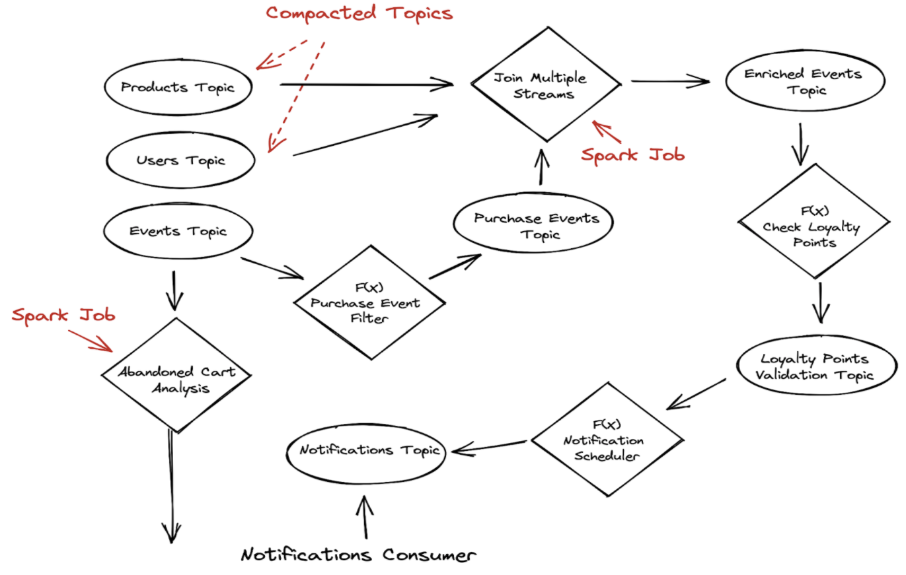

Stream processing is one of the most important requirements in modern data infrastructure. Typically streaming data pipelines require a streaming storage layer like Apache Pulsar or Apache Kafka
and then you in order to perform more advanced stream processing tasks you would use stream compute engines like Apache Flink and Spark Structured Streaming.
Modern data requiring unified batch processing and streaming in cloud deployments makes Apache Pulsar an excellent candidate to support the needs of these compute engines.
Apache Pulsar is designed for cloud-native infrastructure as well as a unified batch and stream data strategy in mind.

## The Role of Apache Pulsar in Streaming Data Pipelines
> Apache Pulsar excels at storing event streams and performing lightweight stream computing tasks. It's a great fit for long term storage of data and can also be used to store results to some downstream applications.

A unified batch and stream processing engine requires the support from a unified data messaging and storage layer to achieve its full potential. In other words, the messaging system needs to not only move data in the pipelines, but to store data in streams for long periods of time and serves as the single source-of-truth for the processing engine.

Apache Pulsar’s tiered storage architecture enables it to store data streams indefinitely.

Pulsar is a great fit for long term storage of data and can be used to store results to some downstream applications.

Apache Pulsar is a distributed append-only log that can easily scale out.
Topics or topic partitions can be spread across multiple brokers, supporting high throughput parallel reads of topics across multiple machines and partitions.

Pulsar topics also employ a segment-based architecture, which means that each of these individual topics also has a sequence of segments with segments periodically closing and becoming immutable.

These segments are stored in the underlying mechanism of Apache BookKeeper, but  can be offloaded to long-term, inexpensive storage, such as Amazon S3, leveraging Pulsar’s tiered storage.

This flexibility also makes Pulsar’s underlying storage architecture ideal for batch access. Historical data can be stored and accessed in a batch mechanism, with the appropriate stream processing layer on top.
Pulsar offers both low-latency and high bandwidth streaming APIs, with architecture capable of supporting modern data infrastructures seeking to unify Batch and Stream Processing.
Pulsar Functions is a lightweight serverless stream processing framework - but note the term **lightweight** here.

Apache Pulsar isn’t an advanced stream computing engine but gives you the flexibility to implement many common stream processing use cases; let’s zoom a little more on that.

With Pulsar Functions you can implement common use cases on streaming data, like:
- Simple data aggregations, i.e counters
- Routing patterns:
  - Dynamic or Content-based routing
  - Splitter pattern
- Message Transformations:
  - Data masking for privacy concerns
  - Data enrichment from external systems
  - Validation of data payloads
  - Content filtering
- Realtime Machine Learning model deployment and scoring

Lightweight also means that Apache Pulsar is an excellent candidate for Edge Analytics - with limited resources edge devices can benefit from such a framework and analytics can truly be taken on the edge for simple analytical tasks like univariate/multivariate time series analysis.

But for use cases that require more sophisticated computations like:
- Grouping aggregates
- Joining different data streams
- Using advanced time windowing to perform computations
- Support for advanced watermarks for handling late arriving events
- Handling large amounts of state
  You should leverage sophisticated stream compute engines like Spark Structured Streaming and Apache Flink that Pulsar aims to provide an excellent integration so you can leverage their advanced capabilities to a full extent.

## 2. Example Use Case: Realtime User Engagement
Let’s take a closer look now with an example use case to better understand the role of all these different components in a streaming data pipeline.
Imagine a popular e-commerce website; the users click on different products, add products to their carts and (hopefully) they purchase the items.
From a business perspective that aims to be data-driven there a few things we can do here by leveraging stream processing:
1. If the user is a subscribed customer that collects royalty points: Upon a new purchase we might want to calculate in real time the total loyalty points he has collected and offer a big discount for his next purchase.
2. If the user added multiple items to the cart, clicked the cart, but never actually completed checkout, we might want to send a followup email (maybe with some small discount coupon code if he is not a registered user) to remind him to complete the order.

Here is a sample visual representation of this data pipeline:



We have events being generated from the website, - including user information and product information, as well the user click events. Notice that the topics storing product and user information are compacted, which means that we specify a key for the topic and that key is each user’s (or product’s) unique identifier.
We are only interested in the latest values of those records and a compacted topic provides just that - having the latest update for each record based on the key.

> Note  at the Spark Job that joins multiple data streams. Now imagine for a moment that instead of having the user and product information inside pulsar topics, we had them stored in an external database, such as MySQL.

In this scenario, a Pulsar Function that reads the records and performs a lookup in the external system to grab the necessary user and product information could be a better solution.

## Using the Apache Pulsar/Spark Connector
Let's take our example use case and zoom-in the abandoned cart implementation by combining Apache Pulsar and Spark Structured Streaming.

In order to integrate Apache Pulsar and Apache Spark, we will use the [pulsar-spark connector](https://github.com/streamnative/pulsar-spark) - developed and maintained by Streamnative.

The first thing we need to do is setup the dependencies within our project - so let's add the following to our `build.sbt` file:
```shell
lazy val root = (project in file("."))
  .settings(
    name := "pulsar-spark-streaming-analytics",

    libraryDependencies ++= Seq(
      "org.apache.spark" %% "spark-sql" % "3.2.0",
      "io.streamnative.connectors" % "pulsar-spark-connector_2.12" % "3.1.1.3"
    )
  )
```

Imagine we have the following click events inside Pulsar:
```shell
----- got message -----
key:[536638900], properties:[], content:{"eventTime":1572559255,"eventType":"view","productId":1307519,"categoryId":2053013558920217191,"categoryCode":"computers.notebook","brand":"acer","price":"1209.55","userId":536638900,"userSession":"e1e8125d-da26-49ee-a6fa-78b3ff8dc341"}
----- got message -----
key:[532364121], properties:[], content:{"eventTime":1572559256,"eventType":"view","productId":12708937,"categoryId":2053013553559896355,"categoryCode":"","brand":"michelin","price":"72.72","userId":532364121,"userSession":"0a899268-31eb-46de-898d-09b2da950b24"}
----- got message -----
key:[513998949], properties:[], content:{"eventTime":1572559256,"eventType":"view","productId":50600085,"categoryId":2134905044833666047,"categoryCode":"auto.accessories.compressor","brand":"laston","price":"113.93","userId":513998949,"userSession":"a7b196d9-afe5-4dc8-9648-d578fef55abf"}
----- got message -----
key:[544501248], properties:[], content:{"eventTime":1572559256,"eventType":"view","productId":1003316,"categoryId":2053013555631882655,"categoryCode":"electronics.smartphone","brand":"apple","price":"928.38","userId":544501248,"userSession":"e330d051-37ad-4dc3-b1ee-ff16a28b7998"}
----- got message -----
key:[515240495], properties:[], content:{"eventTime":1572559256,"eventType":"view","productId":30000218,"categoryId":2127425436764865054,"categoryCode":"construction.tools.welding","brand":"magnetta","price":"254.78","userId":515240495,"userSession":"0253151d-5c84-4809-ba02-38ac405494e1"}
----- got message -----
key:[566280567], properties:[], content:{"eventTime":1572559258,"eventType":"view","productId":1004322,"categoryId":2053013555631882655,"categoryCode":"electronics.smartphone","brand":"huawei","price":"334.37","userId":566280567,"userSession":"8cd74350-34e7-423b-ab02-53108a89354b"}
----- got message -----
key:[559033632], properties:[], content:{"eventTime":1572559258,"eventType":"view","productId":22700084,"categoryId":2053013556168753601,"categoryCode":"","brand":"force","price":"244.28","userId":559033632,"userSession":"fe9544f7-0c09-4c85-a2f7-1d978a2710be"}
----- got message -----
key:[531148230], properties:[], content:{"eventTime":1572559259,"eventType":"view","productId":1004767,"categoryId":2053013555631882655,"categoryCode":"electronics.smartphone","brand":"samsung","price":"242.63","userId":531148230,"userSession":"57a91bce-a1fb-4609-bb26-d53430dc6618"}
```
For our simple example implementation, we will consider a cart as **abandoned**, if inside a user session we have `cart` events but no `purchase` events.
Spark Structured Streaming as a stream computing engine provides more advanced features that are helpful to our use case:

1. support for Session Windows - we can create session windows based on the eventTime and the userSession id.
2. support for groupBy aggregations - we want to aggregate the eventTypes on the user session windows.
3. watermarking support - allows for late event handling.
4. filtering on complex data types - filter rows based on a list filtering predicate.

With our dependencies in place, let's first connect to Pulsar and start reading events from out **click-events** topic.
```scala
 val clickEventsDF = spark
        .readStream
        .format("pulsar")
        .option("service.url", "pulsar://localhost:6650")
        .option("admin.url", "http://localhost:8080")
        .option("topic", "persistent://public/default/click-events")
        .option("pulsar.client.authPluginClassName","org.apache.pulsar.client.impl.auth.AuthenticationToken")
        .option("pulsar.client.authParams","token:you-token<>")
        .load()
```
We can easily connect to Pulsar with Spark with the connection URLs, input topic name, and preferred security method if  security is enabled. Token authentication is used in our example, so we need to specify our token.

You can check the full list of the available configuration options on connector github repo.

With the connection in place now let's see an example implementation
```scala
val checkoutEvents = clickEventsDF
        .select("brand", "categoryCode", "categoryId", "eventTime", "eventType", "price", "productId", "userId", "userSession")
        .withColumn("eventTime", from_unixtime(col("eventTime")).cast("timestamp")  )
        .withWatermark("eventTime", "30 minutes")
        .groupBy(col("userSession"), col("userId"),  session_window(col("eventTime"), "60 minutes"))
        .agg(collect_list("eventType").`as`("eventTypes"))
        .filter(array_contains(col("eventTypes"),"cart"))
```

The output should look something like the following
```shell
+-------------------+-------------------+---------+------------------------------------+------------------------------------------------------------------------------------------------------------------------------+
|sessionWindowStart |sessionWindowEnd   |userId   |userSession                         |eventTypes                                                                                                                    |
+-------------------+-------------------+---------+------------------------------------+------------------------------------------------------------------------------------------------------------------------------+
|2019-11-01 02:21:03|2019-11-01 02:56:28|564133858|ef95cac1-6580-44f0-a10b-c7e836982154|[view, view, cart, cart, purchase, view, view, view, cart, view]                                                    |
|2019-11-01 00:59:55|2019-11-01 01:34:27|566286947|b86c0313-d0cd-4222-888f-2ed03a1d697f|[view, view, view, cart, purchase, view]                                                                                      |
|2019-11-01 02:22:39|2019-11-01 02:54:45|528271890|b425dd2d-dae4-4915-8e8f-b1d4d2717471|[view, cart, view, view]                                                                                                      |
|2019-11-01 01:49:20|2019-11-01 02:21:31|553414803|5006939e-fbe7-4e1c-809c-ffa3b16eb20c|[view, view, view, cart, view]                                                                                                |
|2019-11-01 01:54:59|2019-11-01 02:29:24|556325945|ad789442-8756-41d7-b05a-11b90124032d|[view, view, view, cart, purchase, view, cart, cart, cart, cart, cart, cart, cart, cart, cart, cart, cart]                    |
|2019-11-01 00:37:42|2019-11-01 01:14:30|549630515|8847ab0c-1f0b-42fb-9ff4-f44b9f523b4b|[view, view, view, view, view, cart, view, view, view, view, cart, view, view, view]                                          |
|2019-11-01 00:13:32|2019-11-01 00:44:49|563558500|e0729b6c-eafe-4b0f-9d66-6ee777d08488|[view, cart, view, view, view, view, view]                                                                                    |
|2019-11-01 02:15:30|2019-11-01 02:49:24|512411198|64a9195f-e4ee-448f-9241-9b4d23467f5d|[view, cart, view, view, cart, view]                                                                                          |
|2019-11-01 01:44:05|2019-11-01 02:15:30|515742799|ca33e1b9-ecf5-4b50-ba76-007248bad43d|[view, cart, cart, cart, cart, view]                                                                                          |
|2019-11-01 00:41:39|2019-11-01 01:12:36|557332447|70c0ccdf-9452-49cc-bfa5-568096d64680|[view, cart, view]                                                                                                            |
|2019-11-01 01:40:47|2019-11-01 02:34:50|520761071|6dad05da-a718-4f05-92bc-1ed9796404cd|[view, view, view, view, view, view, view, view, view, view, view, cart, purchase]                                            |
|2019-11-01 00:37:04|2019-11-01 01:08:52|562200921|ca5a71f1-33c8-4fcd-b793-5fcea6f260c0|[view, cart, purchase, view]                                                                                                  |
|2019-11-01 00:10:07|2019-11-01 00:46:10|516426931|ef4867dd-b922-4d92-abec-9a75acb2b769|[view, view, view, cart, purchase, view, cart, cart, view, view]                                                    |
|2019-11-01 02:07:33|2019-11-01 02:45:30|554459781|c43b43dd-dc54-4d1c-bfd8-3bcbdfb94870|[view, cart, purchase, view, view]                                                                                            |
|2019-11-01 02:11:34|2019-11-01 02:52:13|539100846|365b1088-8a4f-47e4-a6e9-e66d56b1b998|[view, cart, cart, cart, view, cart, view, view, view, view, view]                                                            |
|2019-11-01 01:34:14|2019-11-01 02:08:51|519456951|f2136bd5-a50d-4e05-8a90-27b288065459|[view, cart, cart, purchase]                                                                                                  |
|2019-11-01 01:47:49|2019-11-01 02:26:31|515561413|98a12974-b589-48fe-b6f5-a55cd844cdd8|[view, view, view, view, cart, view]                                                                                          |
|2019-11-01 01:29:06|2019-11-01 02:00:39|518913698|afa1ad69-55bb-4ef8-9d02-6648596ca5ec|[view, cart, purchase, view]                                                                                                  |
|2019-11-01 01:53:53|2019-11-01 02:36:26|556601011|45658f52-9e11-45fa-a8d6-9414d349aa4d|[view, view, view, view, view, view, cart, cart, view, view, view, view, view, view, view, view, view, view, view, view, view]|
|2019-11-01 01:01:28|2019-11-01 01:34:04|538178630|9cf447dc-7aa8-47f2-8c3b-44318cf5608a|[view, view, view, cart, cart, cart, purchase, view]                                                                          |
+-------------------+-------------------+---------+------------------------------------+------------------------------------------------------------------------------------------------------------------------------+
```
Note here that we are using session windows.
- A Session window sizes dynamically based on the window length, depending on the inputs.
- A Session window starts with an input, and expands itself if the following input is received within gap duration.
- For static gap duration, a session window closes when there’s no input received within gap duration after receiving the latest input.

By using session windows and grouping on the user sessions, we can easily see if a user has a cart event type, but no purchase event. This makes it easy to filter the events we consider as **abandoned cart** and forward them to a downstream topic for further processing; like sending out a reminder notification to the users after some period of time, like one hour.

## Conclusion
In this blog post we discussed the role of Apache Pulsar as a backbone of a modern data infrastructure, the streaming use cases Pulsar can support, and how you can use it along with Spark Structured Streaming to implement more advanced stream processing use cases by leveraging the Pulsar Spark Connector. Along the way we also
reviewed a real world use case, demonstrated a sample streaming data pipeline, and examined the role of Apache Pulsar and Spark Structured Streaming within the pipeline.

