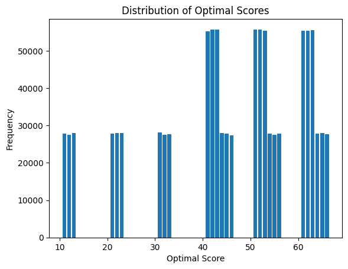

### 선형 회귀와 로지스틱 회귀

    선형 회귀는 (x, y) 점들의 특징을 가장 잘 나타내는 선을 그리는 과정입니다.

- 독립변수 x 하나의 값만으로 y값을 설명할 수 있다면 단순 선형 회귀

<br/>

- 여러개의 x값이 필요할 땐 다중 선형 회귀

#### 최소 제곱법
    최소 제곱법은 주어진 x의 값이 하나일 때 적용이 가능합니다. (단순 선형 회귀일 때)
    여러개의 x가 주어지는 경우(다중 선형 회귀) 경사하강법을 적용합니다.
<br/>


<br/>

##### 최소제곱법을 이용하여 a, b 구하기
    구하려는 직선이 y = ax + b라고 가정한다면,
    
    a = (x - x평균) * (y - y평균)의 합 / (x - x평균)^2의 합
    
    b = y - ax이므로
      = (y의 평균) - (a * x의 평균)


```python
import numpy as np

x = [2, 4, 6, 8]
y = [81, 93, 91, 97]

mx = np.mean(x)  # x의 평균
my = np.mean(y)  # y의 평균

# 기울기 공식의 분모
divisor = sum([(i - mx)**2 for i in x])

# 기울기 공식의 분자
def top(x, y, mx, my):
    d = 0
    
    for i in range(len(x)):
        d += (x[i] - mx) * (y[i] - my)
    
    return d
divided = top(x, y, mx, my)

a = divided / divisor
b = my - mx * a

print(f"기울기 : {a}")
print(f"y절편 : {b}")
```

    기울기 : 2.3
    y절편 : 79.0


    하지만, 모든 딥러닝 프로젝트는 여러개의 입력변수를 다룹니다.
    
    따라서 최소제곱법이 아닌 다른 방법이 필요한데, 가장 많이 사용하는 방법은
    '일단 그리고 조금씩 수정해 나가기' 방식입니다.
    
    즉, 나중에 그린선이 먼저 그린 선보다 더 좋은지 나쁜지를 판단해야 하는데,
    각 선의 오차를 계산하여 오차가 작은 쪽으로 바꾸는 알고리즘이 필요합니다.

#### 평균 제곱 오차(MSE)
    여러개의 x에 대해 오차가 존재하므로 모든 x에 대한 평균 오차를 평균 제곱 오차라고 합니다.

<br/>
    


<br/>

    따라서, 선형 회귀란 임의의 직선을 그어 이에 대한 평균 제곱 오차(MSE)를 구하고,
    이 값을 가장 작게 만들어 주는 a와 b 값을 찾아가는 작업입니다.


```python
# 위의 y = ax + b 활용

fake_a_b = [a, b]

# 위에서 구한 직선으로 y값 예측
def predict(x):
    return fake_a_b[0] * x + fake_a_b[1]

# MSE 함수
def mse(y, y_hat):  # y_hat: y의 평균
    return ((y - y_hat)**2).mean()

# MSE 함수를 각 y값에 대입하여 최종 값을 구하는 함수
def mse_val(y, predict_result):
    
    # 리스트의 각 원소끼리 -연산을 하기 위해 np.array형태
    return mse(np.array(y), np.array(predict_result))

# 예측값이 들어갈 리스트
predict_result = []

# 예측값 구하기
for i in range(len(x)):
    predict_result.append(predict(x[i]))
    print(f"x값 : {x[i]}, 실제 y값 : {y[i]}, 예측 y값 : {predict_result[i]}")
    
# 최종 MSE 출력
print(f"MSE : {mse_val(predict_result, y)}")
```

    x값 : 2, 실제 y값 : 81, 예측 y값 : 83.6
    x값 : 4, 실제 y값 : 93, 예측 y값 : 88.2
    x값 : 6, 실제 y값 : 91, 예측 y값 : 92.8
    x값 : 8, 실제 y값 : 97, 예측 y값 : 97.4
    MSE : 8.299999999999985


#### 오차 수정하기
    기울기 a를 너무 크게 잡거나 너무 작게 잡으면 오차가 커집니다.
    이러한 기울기 a와 오차의 관계는 이차 함수 그래프로 표현할 수 있습니다.

<br/>


<br/>

    오차가 가장 작을 때는 아래쪽의 볼록한 부분 m일때 입니다.
    
    컴퓨터를 이용해 m의 값을 구하려면 임의의 한점(a1)을 찍고,
    이점을 m에 가까운 쪽으로 점점 이동(a1 -> a2)시키는 과정이 필요합니다.
    
    이러한 방법을 미분 기울기를 이용하는 경사 하강법이라고 합니다.

##### 경사 하강법
    최솟값 m에서의 순간 기울기는 0입니다.
    즉, 경사 하강법에서는 미분값이 0인 지점을 찾는 것이 됩니다.

+ 경사 하강법의 과정
    1. a1에서 미분을 구합니다.
    2. 구해진 기울기의 반대 방향(기울기가 +면 음의 방향, -면 양의 방향)으로    
        이동시킨 a2에서 미분을 구합니다.
    3. 구한 미분 값이 0이 될때까지 반복합니다.
    

<br/>


##### 학습률
    기울기의 부호를 바꿔 이동시킬 때 적절한 거리를 찾지 못해 너무 멀리 이동시키면
    a 값이 한점으로 모이지 않고 위로 치솟아 버립니다.
    
    따라서 어느 만큼 이동시킬지를 신중히 결정해야 하는데, 이때 이동 거리를 정해주는 것이 바로 학습률입니다.
    
    딥러닝에서 학습률의 값을 적절히 바꾸면서 최적의 학습률을 찾는 것은 중요한 최적화 과정 중 하나입니다.

<br/>
    
+ 따라서, 경사하강법은 오차의 변화에 따라 이차 함수 그래프를 만들고 적절한 학습률을 설정해    
미분 값이 0인 지점을 구하는 것입니다.

<br/>

+ y절편 b값도 이와 같은 성질을 가지고 있기 때문에 최적의 b값을 구할 때 역시 경사하강법을 사용합니다.


```python
import pandas as pd
import matplotlib.pyplot as plt

# 그래프로 나타내기
plt.figure(figsize=(8, 5))
plt.scatter(x, y)
plt.show()

x_data = np.array(x)
y_data = np.array(y)

# 기울기 a와 절편 b의 값 초기화
a, b = 0, 0

lr = 0.03   # 적절한 학습률 정하기
epochs = 2001   # 몇 번 반복할지 설정

# 경사 하강법 시작
for i in range(epochs):
    y_pred = a * x_data + b    # y예측값 구하기
    error = y_data - y_pred
    
    # 오차 함수를 a로 미분한 값
    a_diff = -(2 / len(x_data)) * sum(x_data * error)
    
    # 오차 함수를 b로 미분한 값
    b_diff = -(2 / len(x_data)) * sum(error)
    
    a = a - lr * a_diff
    b = b - lr * b_diff
    
    if i % 100 == 0:  # 100q번째 반복때마다 출력
        print(f"epochs = {i}, 기울기 = {a}, 절편 = {b}")
        
# 그래프 다시 그리기
y_pred = a * x_data + b
plt.scatter(x, y)
plt.plot([min(x_data), max(x_data)], [min(y_pred), max(y_pred)])
plt.show()

```


​    

​    


    epochs = 0, 기울기 = 27.84, 절편 = 5.43
    epochs = 100, 기울기 = 7.073858435872394, 절편 = 50.51166161138297
    epochs = 200, 기울기 = 4.095999380762421, 절편 = 68.28224379060177
    epochs = 300, 기울기 = 2.9756829100119027, 절편 = 74.96781336233505
    epochs = 400, 기울기 = 2.5542024233262106, 절편 = 77.48302865233052
    epochs = 500, 기울기 = 2.3956349066513707, 절편 = 78.42929177728175
    epochs = 600, 기울기 = 2.3359793398132864, 절편 = 78.78529068727728
    epochs = 700, 기울기 = 2.313535987420573, 절편 = 78.91922301600925
    epochs = 800, 기울기 = 2.3050924490666174, 절편 = 78.96961044185792
    epochs = 900, 기울기 = 2.3019158585694823, 절편 = 78.98856697541248
    epochs = 1000, 기울기 = 2.3007207758016315, 절편 = 78.99569871827002
    epochs = 1100, 기울기 = 2.300271167070735, 절편 = 78.99838179089187
    epochs = 1200, 기울기 = 2.3001020172709508, 절편 = 78.9993912045567
    epochs = 1300, 기울기 = 2.300038380484562, 절편 = 78.99977096168232
    epochs = 1400, 기울기 = 2.3000144393354365, 절편 = 78.9999138322214
    epochs = 1500, 기울기 = 2.3000054323026444, 절편 = 78.99996758234106
    epochs = 1600, 기울기 = 2.300002043716771, 절편 = 78.99998780397235
    epochs = 1700, 기울기 = 2.3000007688780433, 절편 = 78.99999541166466
    epochs = 1800, 기울기 = 2.300000289263884, 절편 = 78.99999827379686
    epochs = 1900, 기울기 = 2.3000001088255795, 절편 = 78.9999993505755
    epochs = 2000, 기울기 = 2.3000000409418653, 절편 = 78.99999975567644


    


#### 다중 선형 회귀

    여러 독립 변수(x)가 존재하는 선형 회귀입니다.


```python
data = [[2, 0, 81], [4, 4, 93], [6, 2, 91], [8, 3, 97]]  # [x1, x2, y]

# data로 부터 x1, x2, y의 리스트 만들기
x1 = [i[0] for i in data]
x2 = [i[1] for i in data]
y = [i[2] for i in data]

# 그래프로 확인(점 찍어보기)
ax = plt.axes(projection='3d')  # 3차원 그래프
ax.set_xlabel('x1')
ax.set_ylabel('x2')
ax.set_zlabel('y')
ax.dist = 11
ax.scatter(x1, x2, y)
plt.show()

# 리스트 -> numpy 배열
x1_data = np.array(x1)
x2_data = np.array(x2)
y_data = np.array(y)

a1, a2, b = 0, 0, 0  # 기울기 a1, a2와 절편 b 초기화
lr = 0.05  # 학습률
epochs = 2001  # 반복 횟수

for i in range(epochs):   # epochs만큼 반복
    y_pred = a1 * x1_data + a2 * x2_data + b
    error = y_data - y_pred    # 예측값에 대한 오차
    
    # 미분
    a1_diff = -(1 / len(x1_data)) * sum(x1_data * error)
    a2_diff = -(1 / len(x2_data)) * sum(x2_data * error)
    b_diff = -(1 / len(x1_data)) * sum(error)
    
    a1 = a1 - lr * a1_diff  # 학습률을 곱해 a1, a2, b값 업데이트
    a2 = a2 - lr * a2_diff
    b = b - lr * b_diff
    
    if i % 100 == 0:
        print(f"epochs = {i}, a1 = {a1}, a2 = {a2}, b = {b}")
```

#### 로지스틱 회귀
+ 참과 거짓(예/ 아니오)중에 하나를 내놓는 과정에서 사용하는 원리입니다.

<br/>

+ 참(1)과 거짓(0)사이를 구분하는 S자 형태입니다.

#### Sigmoid 함수
    Sigmoid를 이용해 로지스틱 회귀를 풀어나갑니다.

<br/>


<br/>

    지수부분이 (a * x + b)라고 했을 때,
    
    a는 그래프의 경사도를 결정합니다. a값이 커지면 경사가 커지고 a값이 작아지면 경사가 작아집니다.
    
    b는 그래의 좌우 이동을 의미합니다. b값이 크면 왼쪽, 작으면 오른쪽으로 이동합니다.
    
    따라서, a와 b의 값에 따라 오차가 변합니다.


```python
# sigmoid 구현

x_data = [2, 4, 6, 8, 10, 12, 14]
y_data = [0, 0, 0, 1, 1, 1, 1]

# 그래프로에 점 찍어보기
plt.scatter(x_data, y_data)
plt.xlim(0, 15)
plt.ylim(-0.1, 1.1)

a, b = 0, 0   # 기울기, 절편 초기화
lr = 0.05     # 학습률

def sigmoid(x):
    return 1 / (1 + np.e**(-x))

# 경사 하강법 실행
for epoch in range(2001):
    for i in range(len(x_data)):
        # 미분                 오차 : 예측값 - 실제값
        a_diff = x_data[i] * (sigmoid(a * x_data[i] + b) - y_data[i])
        b_diff = sigmoid(a * x_data[i] + b) - y_data[i]
        
        # a, b값 업데이트
        a -= lr * a_diff
        b -= lr * b_diff
        
        if epoch % 1000 == 0:
            print(f"epoch = {epoch}, 기울기 a = {a}, 절편 b = {b}")
```

    epoch = 0, 기울기 a = -0.05, 절편 b = -0.025
    epoch = 0, 기울기 a = -0.13879722189107602, 절편 b = -0.047199305472769
    epoch = 0, 기울기 a = -0.2267516349901771, 절편 b = -0.06185837432261918
    epoch = 0, 기울기 a = 0.12010284223274431, 절편 b = -0.018501564669754007
    epoch = 0, 기울기 a = 0.23740192458962306, 절편 b = -0.006771656434066131
    epoch = 0, 기울기 a = 0.27045811205658526, 절편 b = -0.004016974145152613
    epoch = 0, 기울기 a = 0.2860409628939473, 절편 b = -0.0029039133710553225
    epoch = 1000, 기울기 a = 1.497824502953391, 절편 b = -9.940123304992555
    epoch = 1000, 기울기 a = 1.4940419536789271, 절편 b = -9.94106894231117
    epoch = 1000, 기울기 a = 1.4119848217717417, 절편 b = -9.954745130962369
    epoch = 1000, 기울기 a = 1.4949143121842228, 절편 b = -9.944378944660809
    epoch = 1000, 기울기 a = 1.498244938547387, 절편 b = -9.944045882024492
    epoch = 1000, 기울기 a = 1.4984392510394648, 절편 b = -9.94402968931682
    epoch = 1000, 기울기 a = 1.4984505498747405, 절편 b = -9.944028882257157
    epoch = 2000, 기울기 a = 1.9064689962225458, 절편 b = -12.948894836795326
    epoch = 2000, 기울기 a = 1.9054981310086199, 절편 b = -12.949137553098806
    epoch = 2000, 기울기 a = 1.8514893310246738, 절편 b = -12.958139019762797
    epoch = 2000, 기울기 a = 1.9056614126778697, 절편 b = -12.951367509556148
    epoch = 2000, 기울기 a = 1.9067744947792462, 절편 b = -12.95125620134601
    epoch = 2000, 기울기 a = 1.9068037073321078, 절편 b = -12.951253766966605
    epoch = 2000, 기울기 a = 1.9068044592233457, 절편 b = -12.951253713260089


    

