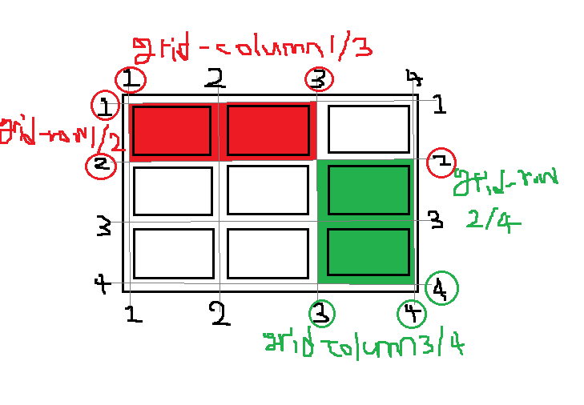

# Grid(그리드) 란? #

- Flex가 한 방향 레이아웃 시스템이면 (1차원) Grid는 두 방향(가로-세로) 레이아웃의 시스템이다. (2차원)


Grid 레이아웃을 만들기 위한 기본적인 HTML 구조는 다음과 같다.

```HTML
<div class="container">
	<div class="item">A</div>
	<div class="item">B</div>
	<div class="item">C</div>
	<div class="item">D</div>
	<div class="item">E</div>
	<div class="item">F</div>
	<div class="item">G</div>
	<div class="item">H</div>
	<div class="item">I</div>
</div>
```

부모 요소인 div.container를 **Grid Container(그리드 컨테이너)**라고 부르고,
자식 요소인 div.item들을 **Grid Item(그리드 아이템)**이라고 부른다.
“컨테이너가 Grid의 영향을 받는 전체 공간이고, 설정된 속성에 따라 각각의 아이템들이 어떤 형태로 배치되는 것”이라고 생각하면 된다.

Flex와 마찬가지로, Grid는 컨테이너에 display: grid; 를 설정하는 것으로 시작한다.

```CSS
.container {
	display: grid;
}
```

- **그리드 컨테이너 (Grid Container)**
  display: grid를 적용하는, Grid의 전체 영역이다. Grid 컨테이너 안의 요소들이 Grid 규칙의 영향을 받아 정렬된다고 생각하면 된다. 
  
  위 코드 <div class="container"></div>가 Grid 컨테이너이다.
  
- **그리드 아이템 (Grid** **Item)**
  Grid 컨테이너의 자식 요소들이다. 바로 이 아이템들이 Grid 규칙에 의해 배치되는 거다. 
  
  위 코드에서 <div class="item"></div>들이 Grid 아이템입니다.
  
- **그리드 트랙 (Grid Track)**
  Grid의 행(Row) 또는 열(Column)
  
- **그리드 셀 (Grid Cell)**
  Grid의 한 칸을 가리키는 말이다. <div>같은 실제 html 요소는 그리드 아이템이고, 이런 Grid 아이템 하나가 들어가는 “가상의 칸(틀)”이라고 생각하면 된다.
  
- **그리드 라인(Grid Line)**
  Grid 셀을 구분하는 선이다.
  
- **그리드 번호(Grid Number)**
  Grid 라인의 각 번호이다.
  
- **그리드 갭(Grid Gap)**
  Grid 셀 사이의 간격이다.
  
- **그리드 영역(Grid Area)**
  Grid 라인으로 둘러싸인 사각형 영역으로, 그리드 셀의 집합이다.


### Grid의 속성들은 Flex와 마찬가지로,

- 컨테이너에 적용하는 속성
- 아이템에 적용하는 속성

이렇게 두 가지로 나뉜다.


## display: grid;

Grid 컨테이너에 display: grid;를 적용하는게 시작이다.
아이템들이 block 요소라면 이 한 줄 만으로는 딱히 변화는 없다.

```css
.container {
	display: grid;
	/* display: inline-grid; */
}
/* 그리고 아무 일도 일어나지 않았다 */
```

**inline-grid**도 있는데, 이건 block과 inline-block의 관계를 생각면 된다.
아이템의 배치와 관련이 있다기 보다는, 컨테이너가 주변 요소들과 어떻게 어우러질지 결정하는 값이다. inline-grid는 inline-block처럼 동작한다. 

## 그리드 형태 정의 grid-template-rows grid-template-columns

컨테이너에 Grid 트랙의 크기들을 지정해주는 속성이다.
여러가지 단위를 사용할 수 있고 섞어서 쓸 수도 있다.

```CSS
.container {
	grid-template-columns: 200px 200px 500px;
	/* grid-template-columns: 1fr 1fr 1fr */
	/* grid-template-columns: repeat(3, 1fr) */
	/* grid-template-columns: 200px 1fr */
	/* grid-template-columns: 100px 200px auto */

	grid-template-rows: 200px 200px 500px;
	/* grid-template-rows: 1fr 1fr 1fr */
	/* grid-template-rows: repeat(3, 1fr) */
	/* grid-template-rows: 200px 1fr */
	/* grid-template-rows: 100px 200px auto */
}
```

- grid-template-rows는 행(row)의 배치
- grid-template-columns는 열(column)의 배치

를 결정한다.

예를 들어

```CSS
grid-template-columns: 200px 200px 500px;
```

는 column을 200px, 200px, 500px로 만든다는 의미이다.

```css
grid-template-columns: 1fr 1fr 1fr;
```

fr은 fraction([뜻은 여기로](https://dic.daum.net/word/view.do?wordid=ekw000066112&q=fraction))인데, 숫자 비율대로 트랙의 크기를 나눈다.
즉 위의 1fr 1fr 1fr은 균일하게 1:1:1 비율인 3개의 column을 만들겠다는 의미이다.

```css
grid-template-columns: 100px 2fr 1fr;
```

이렇게 하면 왼쪽의 첫번째 column은 100px로 고정되고, 나머지 두번째 세번째 column은 2:1의 비율로 유연하게 움직이게 된다.


## repeat 함수

```css
.container {
	grid-template-columns: repeat(5, 1fr);
	/* grid-template-columns: 1fr 1fr 1fr 1fr 1fr */
}
```

repeat은 반복되는 반복되는 값을 자동으로 처리할 수 있는 함수이다.

**repeat(반복횟수, 반복값)**
즉, 위 코드의 **repeat(5, 1fr)**은 **1fr 1fr 1fr 1fr 1fr**과 같아요.
repeat(3, 1fr 4fr 2fr); 이런 식의 패턴도 가능하다.


## minmax 함수

최솟값과 최댓값을 지정할 수 있는 함수이다.
**minmax(100px, auto)**의 의미는 **최소한 100px**, **최대는 자동으로(auto) 늘어나게 한다는 의미이다**. 즉 아무리 내용의 양이 적더라도 **최소한 높이 100px**은 확보하고, 내용이 많아 100px이 넘어가면 알아서 늘어나도록 처리해 준 예시이다.

```css
.container {
	grid-template-columns: repeat(3, 1fr);
	grid-template-rows: repeat(3, minmax(100px, auto));
}
```


## auto-fill과 auto-fit

auto-fill과 auto-fit은 column의 개수를 미리 정하지 않고 설정된 너비가 허용하는 한 최대한 셀을 채운다.

```css
.container {
	grid-template-columns: repeat(auto-fill, minmax(20%, auto));
}
```

auto-fill의 크기를 20%로 설정했으므로, 1개의 row에는 5개의 셀이 들어간다.

만약 셀의 개수가 5개보다 모자라면, 공간이 남게 된다.

이때 auto-fill 대신 **auto-fit**을  사용하면, 남는 공간을 채운다.


## 간격 만들기 row-gap column-gap gap

그리드 셀 사이의 **간격**을 설정한다.

```css
.container {
	row-gap: 10px;
	/* row의 간격을 10px로 */
	column-gap: 20px;
	/* column의 간격을 20px로 */
}
```

```css
.container {
	gap: 10px 20px;
	/* row-gap: 10px; column-gap: 20px; */
}
```

```css
.container {
	gap: 20px;
	/* row-gap: 20px; column-gap: 20px; */
}
```


## 그리드 형태를 자동으로 정의 grid-auto-columns grid-auto-rows

grid-template-columns(또는 grid-template-rows)의 통제를 벗어난 위치에 있는 트랙의 크기를 지정하는 속성이다.
속성 이름이 헷갈린다면 -template- 자리에 – auto-가 들어간다고 생각하면된다.

“통제를 벗어난”이 무슨 의미일까? 아까 이 코드 기억해본다면

```css
container {
	grid-template-rows: repeat(3, minmax(100px, auto));
}
```

각 셀마다 최소 100px의 높이를 확보하고, 컨텐츠가 높이 100px을 넘어가면 알아서 자동으로 늘어나도록(auto) 하려고 저 코드를 썼는데, 우리가 만든 예시가 row가 3개였기 때문에 repeat 회수를 3으로 지정해 줬는데 만약 row 개수를 미리 알 수 없는 경우면 어떻게 할까? 바로 이 grid-auto-rows가 그 해결책이다.

```css
.container {
	grid-auto-rows: minmax(100px, auto);
}
```

이렇게 grid-auto-rows를 써주면, 굳이 횟수를 지정해서 반복할 필요 없이 “알아서” 처리된다. 즉, grid-template-rows로 미리 세팅해 둔 것이 없이 때문에 여기있는 모든 row들은 grid-template-rows의 통제를 벗어난 row가 되는 것이고, 바로 grid-auto-rows가 처리를 하는 거다! “통제를 벗어난”의 의미는 바로 이런거다.


### 각 셀의 영역 지정 

### grid-column-start 

### grid-column-end 

### grid-column 

### grid-row-start 

### grid-row-end 

### grid-row



1부터 4까지의 Grid 라인 번호가 매겨져 있는데, 바로 그 번호를 이용해서 column과 row의 범위를 결정하는 거다.
column으로 살펴보면, grid-column-start가 시작 번호, grid-column-end가 끝 번호이다. grid-column은 start와 end 속성을 한번에 쓰는 축약형이다.
위의 빨간색 영역을 코드로 쓰면 아래와 같다. 

```css
.item:nth-child(1) {
	grid-column-start: 1;
	grid-column-end: 3;
	grid-row-start: 1;
	grid-row-end: 2;
}
```

```css
.item:nth-child(1) {
	grid-column: 1 / 3;
	grid-row: 1 / 2;
}
```

시작번호 / 끝번호를 지정하는 방법 외에, **몇 개의 셀을 차지하게 할 것인지**를 지정해줄 수도 있다.

```css
.item:nth-child(1) {
	/* 1번 라인에서 2칸 */
	grid-column: 1 / span 2;
	/* 1번 라인에서 3칸 */
	grid-row: 1 / span 3;
}
```

여기서 잠깐 위에서 공부했던 grid-auto-columns를 다시 보면
grid-auto-columns는 grid-template-columns의 통제를 받지 않는 column들의 배치를 결정하는 규칙이라고 했는데, 이 grid-column을 이용해 ‘통제받지 않는’ column들을 만들 수 있다.

```css
.container {
	grid-template-columns: 50px;
	grid-auto-columns: 1fr 2fr;
}
.item:nth-child(1) { grid-column: 2; }
.item:nth-child(2) { grid-column: 3; }
.item:nth-child(3) { grid-column: 4; }
.item:nth-child(4) { grid-column: 5; }
.item:nth-child(5) { grid-column: 6; }
.item:nth-child(6) { grid-column: 7; }
/* end를 생략하면 그냥 한 칸임 */
```

이렇게 하면, 첫번째 column(G)만 grid-template-columns의 통제를 받아 50px로 되고, 나머지 column들은 grid-auto-columns의 규칙에 따라 1:2의 비율이 반복된다.


## 영역 이름으로 그리드 정의 grid-template-areas

각 영역(Grid Area)에 이름을 붙이고, 그 이름을 이용해서 배치하는 직관적인 방법이다.

```css
.container {
	grid-template-areas:
		"header header header"
		"   a    main    b   "
		"   .     .      .   "               /* . 은 공백 */
		"footer footer footer";
}  
```

위의 형태로 각자 차지하는 셀의 개수만큼 해당 위치에 이름을 써주면 된다.
각 셀마다 공백을 하나씩 넣어서 구분해면 되고 header는 첫번째 row에서 3개의 column을 차지하니 맨 위에 3번 쓴 것이다.
빈칸은 마침표 또는 “none”을 사용하면 되고, 마침표의 개수는 여러개를 써도 상관 없다.

그럼 각 영역의 이름은 어떻게 매칭할까? **해당 아이템** 요소에 **grid-area** 속성으로 이름을 지정해주면 된다.

```css
.header { grid-area: header; }
.sidebar-a { grid-area: a; }
.main-content { grid-area: main; }
.sidebar-b { grid-area: b; }
.footer { grid-area: footer; }
/* 이름 값에 따옴표가 없는 것에 주의하세요 */
```


## 자동 배치 grid-auto-flow

아이템이 자동 배치되는 흐름을 결정하는 속성이다.

```css
.container {
	display: grid;
	grid-template-columns: repeat(auto-fill, minmax(25%, auto));
	grid-template-rows: repeat(5, minmax(50px,auto));
	grid-auto-flow: dense;
}
item:nth-child(2) { grid-column: auto / span 3; }
item:nth-child(5) { grid-column: auto / span 3; }
item:nth-child(7) { grid-column: auto / span 2; }
```

B, E, G는 각각 셀을 3개 또는 2개를 점유하도록 설정했는데, 그 때문에 셀에 들어갈 자리가 없어서 빈 셀들이 생겼다. Grid 배치의 기본 설정은 아이템이 **row**를 기준으로 순서대로 배치가 되다가 들어갈 자리가 없으면 그 칸은 비워두고 아래로 배치가 된다.
**dense**는 기본적으로 빈 셀을 채우는 알고리즘이며, row와 column에 따라 기준이 달라진다.


## 세로 방향 정렬 align-items

아이템들을 세로(column축) 방향으로 정렬한다. 컨테이너에 적용한다.

```css
.container {
	align-items: stretch;
	/* align-items: start; */
	/* align-items: center; */
	/* align-items: end; */
}
```


## 가로 방향 정렬 justify-items

아이템들을 가로(row축) 방향으로 정렬한다. 컨테이너에 적용한다.

```css
.container {
	justify-items: stretch;
	/* justify-items: start; */
	/* justify-items: center; */
	/* justify-items: end; */
}
```


## place-items

align-items와 justify-items를 같이 쓸 수 있는 단축 속성이다.
align-items, justify-items의 순서로 작성하고, 하나의 값만 쓰면 두 속성 모두에 적용된다.

```css
.container {
	place-items: center start;
}
```


## 아이템 그룹 세로 정렬 align-content

Grid 아이템들의 높이를 모두 합한 값이 Grid 컨테이너의 높이보다 작을 때 Grid 아이템들을 통째로 정렬한다.

```css
.container {
	align-content: stretch;
	/* align-content: start; */
	/* align-content: center; */
	/* align-content: end; */
	/* align-content: space-between; */
	/* align-content: space-around; */
	/* align-content: space-evenly; */
}
```


## 아이템 그룹 가로 정렬 justify-content

Grid 아이템들의 너비를 모두 합한 값이 Grid 컨테이너의 너비보다 작을 때 Grid 아이템들을 통째로 정렬한다.

```css
.container {
	justify-content: stretch;
	/* justify-content: start; */
	/* justify-content: center; */
	/* justify-content: end; */
	/* justify-content: space-between; */
	/* justify-content: space-around; */
	/* justify-content: space-evenly; */
}
```

## place-content

align-content와 justify-content를 같이 쓸 수 있는 단축 속성이다.
align-content, justify-content의 순서로 작성하고, 하나의 값만 쓰면 두 속성 모두에 적용된다.

```css
.container {
	place-content: space-between center;
}
```


## 개별 아이템 세로 정렬 align-self

해당 아이템을 세로(column축) 방향으로 정렬한다. 아이템에 적용한다.

```css
.item {
	justify-self: stretch;
	/* justify-self: start; */
	/* justify-self: center; */
	/* justify-self: end; */
}
```


## 개별 아이템 가로 정렬 justify-self

해당 아이템을 가로(row축) 방향으로 정렬한다. 아이템에 적용한다.

```css
.item {
	justify-self: stretch;
	/* justify-self: start; */
	/* justify-self: center; */
	/* justify-self: end; */
}
```

## place-self

align-self와 justify-self를 같이 쓸 수 있는 단축 속성이다.
align-self, justify-self의 순서로 작성하고, 하나의 값만 쓰면 두 속성 모두에 적용된다.

```css
.item {
	place-self: start center;
}
```


## 배치 순서 order

각 아이템들의 시각적 나열 순서를 결정하는 속성이다.
숫자값이 들어가며, 작은 숫자일 수록 먼저 배치된다. "시각적" 순서일 뿐, HTML 자체의 구조를 바꾸는 것은 아니므로 접근성 측면에서 사용에 주의해야 한다. 시각 장애인분들이 사용하는 스크린 리더로 화면을 읽을 때, order를 이용해 순서를 바꾼 것은 의미가 없다는 것을 기억해라.

```css
.item:nth-child(1) { order: 3; } /* A */
.item:nth-child(2) { order: 1; } /* B */
.item:nth-child(3) { order: 2; } /* C */
```

===> B C A

## z-index

z-index로 Z축 정렬을 할 수 있다. 숫자가 클 수록 위로 올라온다.
(position에서의 z-index랑 똑같이 생각하면 된다.)

```css
item:nth-child(5) {
	z-index: 1;
	transform: scale(2);
}
/* z-index를 설정 안하면 0이므로, 1만 설정해도 나머지 아이템을 보다 위로 올라온다 */
```

