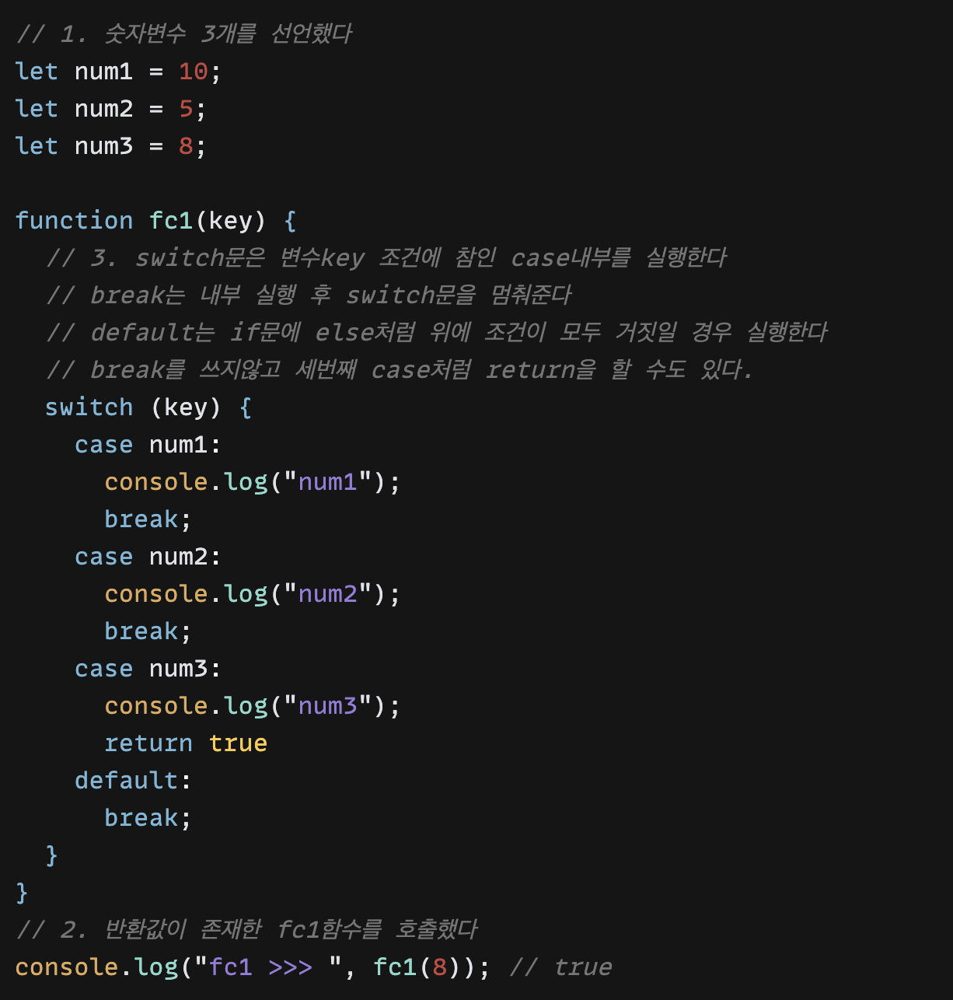

##### - 목차

##### 1. 변수가 필요한 이유

##### 2. 자바스크립트 데이터 타입 종류

##### 3. number와 string 자주쓰는 메서드 소개

##### 4. 함수가 필요한 이유

##### 5. 함수의 정의와 호출의 차이점

##### 6. 조건문이 필요한 이유

---

##### 1. 변수가 필요한 이유

week1에 가장 첫번째로 변수에 대해 알아보았다.

변수가 필요한 이유를 이해하는것은 중요하다 생각하며

크게 세가지 정도로 생각하고있다.

1. 코드의 재활용
2. 중복값 방지
3. 유지보수 용이

###### 코드의 재활용

###### 중복값 방지

###### 유지보수 용이

---

##### 2. 자바스크립트 데이터 타입 종류

자바스크립트 데이터 타입의 종류를 정리해보았다.

데이터 타입 중 1-5번은 정말 자주 사용하는 타입이기 때문에 꼭 알아둬야 될 것 같다.

5번 타입은 스터디 그룹에서 팀원에 좋은 예시를 가져왔다.

1. number
2. string
3. array
4. object
5. undefined , null
6. bigInt

###### number

###### string

###### array

###### object

###### null, undefined

###### bigInt

---

##### 3. number와 string 자주쓰는 메서드 소개

실제로 유용하게 쓰일만한 메서드를 사용해봤다.

string 메서드 3가지와 number 메서드 3가지를 만들어봤다.

###### string replace

###### string slice

###### string toLowerCase, toUpperCase

###### number Number

###### number toString

###### number Math

---

##### 5. 함수의 정의와 호출의 차이점

일단 함수가 필요한 이유

1. 특정 시점을 설정하여 일일히 손을 대지않고 함수를 자동으로 실행할 수 있다.
2. 재사용에 용이하다.
3. 협업을 할 때 가독성있게 만들었다면 다른사람도 쉽고 편리하게 내가만든 함수를 사용할 수 있다.
4. 모듈화를 통해 쉽고 빠르게 선언하여 사용할 수 있다.

###### 함수는 함수표현식(function)을 사용하여 정의 할 수 있다. 반환값 유무 기준으로 2개의 함수를 정의 하고 콘솔로 호출해보았다.

---

##### 6. 조건문이 필요한 이유

조건문이 필요한 이유는 한가지 예를들어 개발자가 고의적으로 사용자에게 보여줄 수 없는 권한의 정보나 사용자 등급에 따라 보여지는 정보를 나누기 위해서 사용할 수있다.

또한 사용자가 앱을 사용할 때 사람마다 선택은 모두 다르기 때문에 조건문을 둔다고 생각한다.

조건문은 다양한 방식이 있다.

1. if문
2. switch
3. 삼항연산자

###### 1. if문

if문도 방식에 여러 방식이 있다. 첫번째는 if문을 각각 따로썼을 때

두번째는 if else문을 사용했을 때

###### 2. switch

###### 3. 삼항연산자

