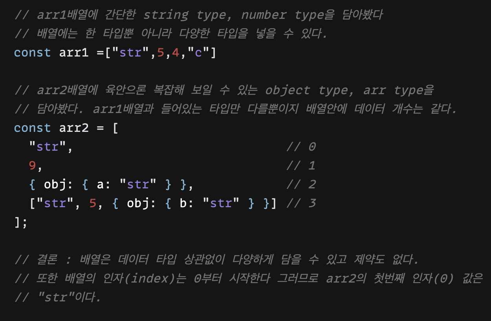
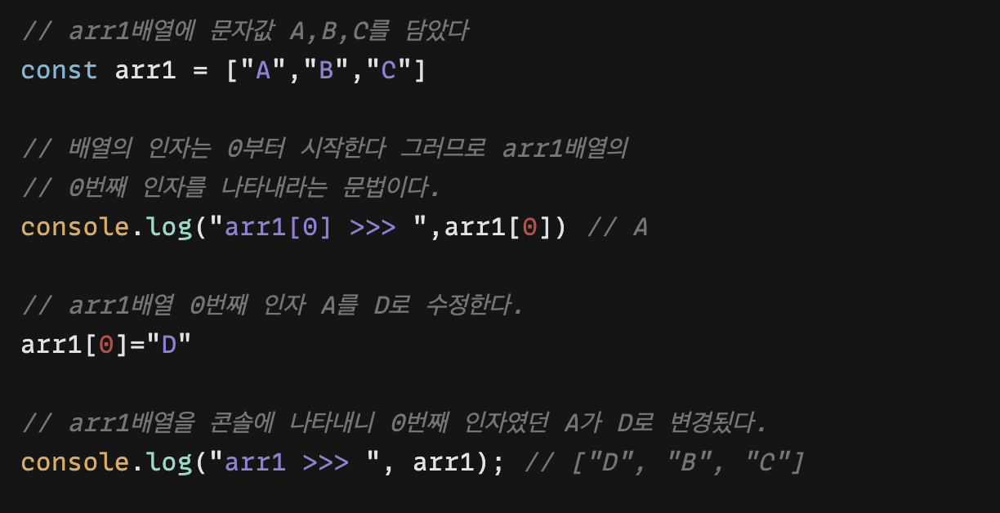
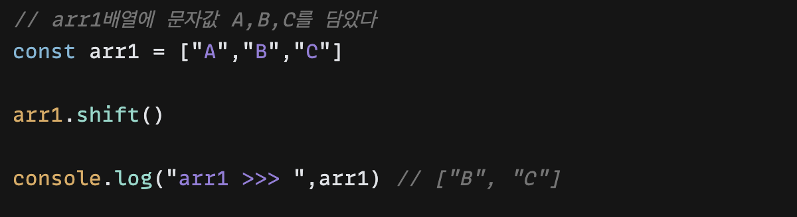
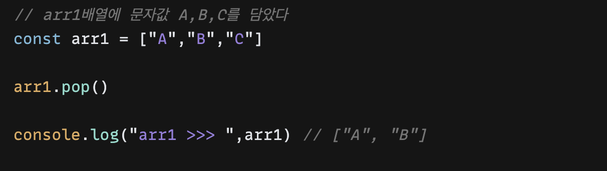
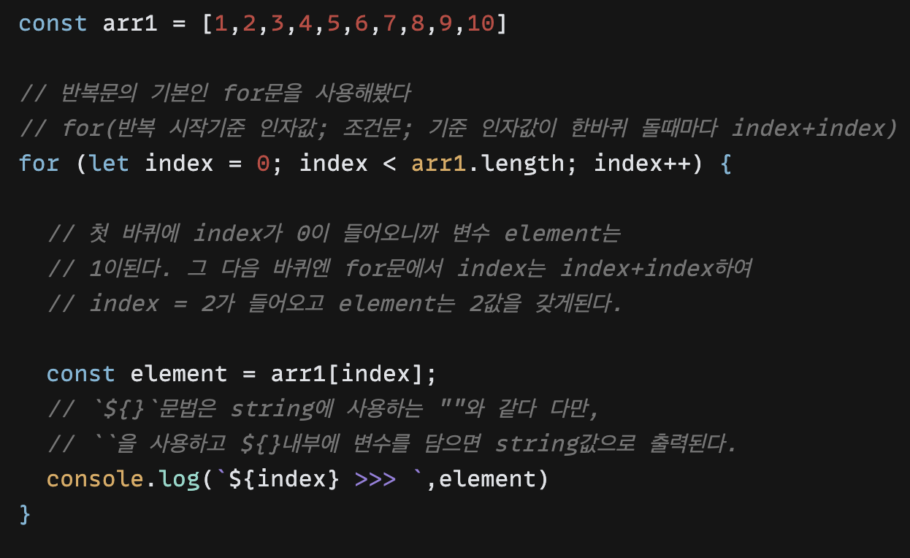

today I learned week 2

- 목차

1. 배열이 필요한 이유와 선언하는 방법
2. 배열의 값을 추가, 수정, 삭제하는 방법
3. 반복문이 필요한 이유와 사용하는 방법
4. 배열과 반복문을 함께 자주 사용하는 이유
5. 배열의 메서드 5가지와 사용방법

---

#### 1. 배열이 필요한 이유와 선언하는 방법

week2가 다가왔고 드디어 본격적으로 자바스크립트에서 가장 자주쓰이고 가장 중요한

배열의 시간이 왔다. 배열이 필요한 이유는 **다양한 데이터 타입**을 한곳에 담을 수 있다.

선언하는 방법은 대괄호를 사용하여 원하는 타입에 데이터를 계속해서 담을 수 있다.

---

#### 2. 배열의 값을 추가, 수정, 삭제하는 방법

웹 사이트를 개발할 때 대부분의 퍼포먼스는 CRUD로 이뤄져있다고 생각한다.

Create  	생성

Read 		조회

Update 	수정

Delete       삭제

그중에 배열을 추가, 수정, 삭제하는법을 알아봤다.

###### Create  push

###### Update  Array[index]

###### Delete shift, pop, splice, delete 

shift : 배열에 첫번째 인자를 삭제한다

pop : 배열에 마지막 인자를 삭제한다

splice : 삭제할 데이터 인자 범위를 지정하여 삭제한다

delete : 삭제할 데이터의 인자를 배열에 넣어서 삭제한다

---

#### 3. 반복문이 필요한 이유와 사용하는 방법

반복문이 없이 데이터를 출력할 경우 우리는 모든 데이터를 코드로 모두 나열 할 것이다.

그래서 많은 데이터를 배열에 담고 반복문으로 간결하게 출력하는 것이다.

for문을 사용한 코드를 보기 앞서, for문은 반복문으로서 조건문이 참(true)일 경우 돌게된다.

*for(반복 시작기준 인자값 (index); 조건문; 기준 인자값이 한바퀴 돌때마다 index+index)*

