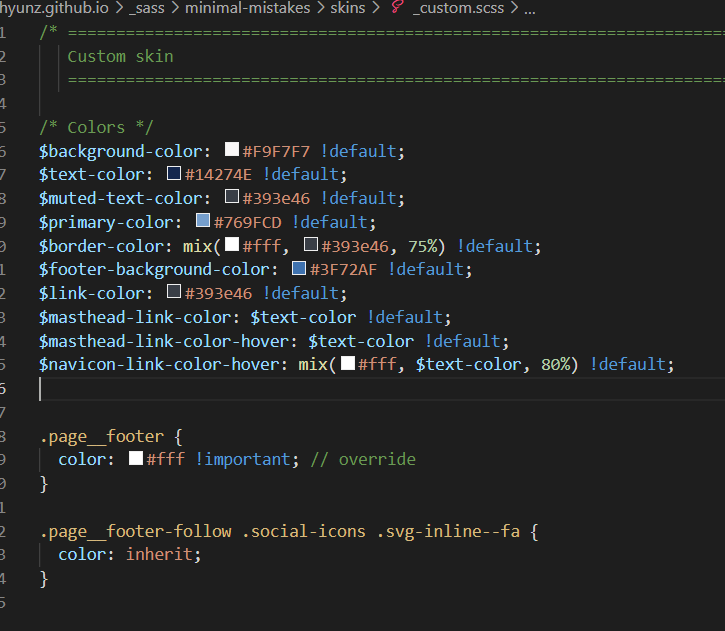
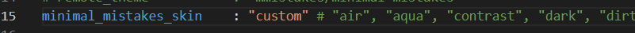
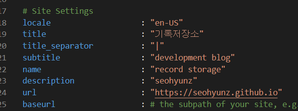
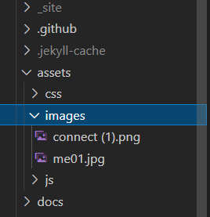
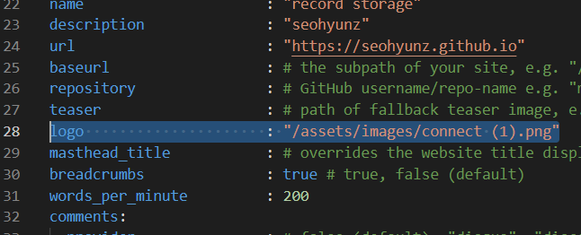
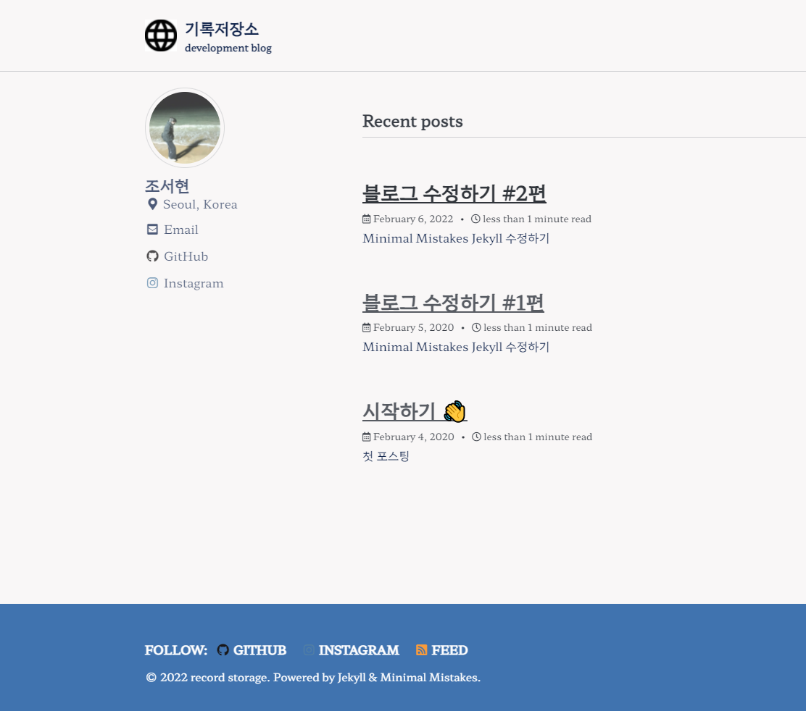

# Minimal Mistakes Jekyll 수정하기

## skin 설정

기존에 나와있는 다양한 스킨들이 들로 설정할 수 있지만,  나는 새운 색상의 테마을 만들기로 했다 

visual code로 들어간 다음 검색을 스킨들이 들어가 있는 파일을 찾는다

 

skins 아래에 다양한 테마들이 들어있는 것이 보인다 

skins에 새로운  _custom.scss 파일을 생성한 다음

 자신이 원하는 색깔로 저장하면 된다

파란색을 좋아해서 전책적으로 파랑파랑한 색상으로 바꾸어 주었다 

 _config.yml 파일에 와서 

minimal_mistakes_skin 을 custom으로 바꾸어 주면 끝이다

## 개인소개 바꾸기

_config.yml 파일 17째 불 부터 블로그의 제목과 부제목 등 을 바꿀 수 있다. 

자신이 원하는 내용으로 쓰면 되고,  url은 자신의 블로그 주소를 넣으면 된다

### 아이콘 넣기

assets 파일에 들어가서 새로운 images 폴더를 생성해 준다

그 안에 자신이 원하는 로고의 사진을 넣어준다

 

다시 _config.yml 파일로 돌아와서  logo 줄에 

사진이 들어가 있는 경로를 써준다

이런식으로 페이지가 수정된 것을 볼 수 있다. 👍

