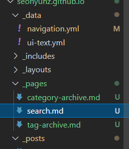
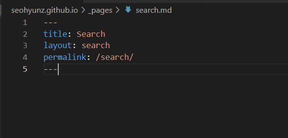
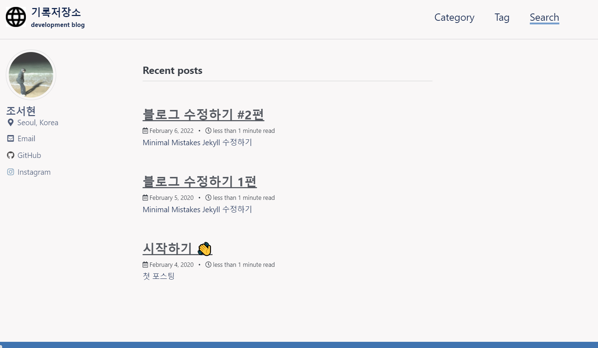
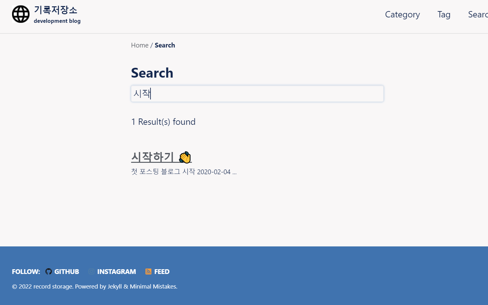

# Minimal Mistakes Jekyll 수정하기

## 검색기능 넣기

_pages에 search.md 파일을 만들어 준다

내용을 작성해주고 

 

_data에 navigation.yml 파일로 들어가준다 

여기에 Search를 추가해주고 저장해준다 

그러면 위에 Search가 뜬 것을 볼 수 있다 

 

들어가보면 

이런식으로 검색이 가능한 것을 볼 수 있다

