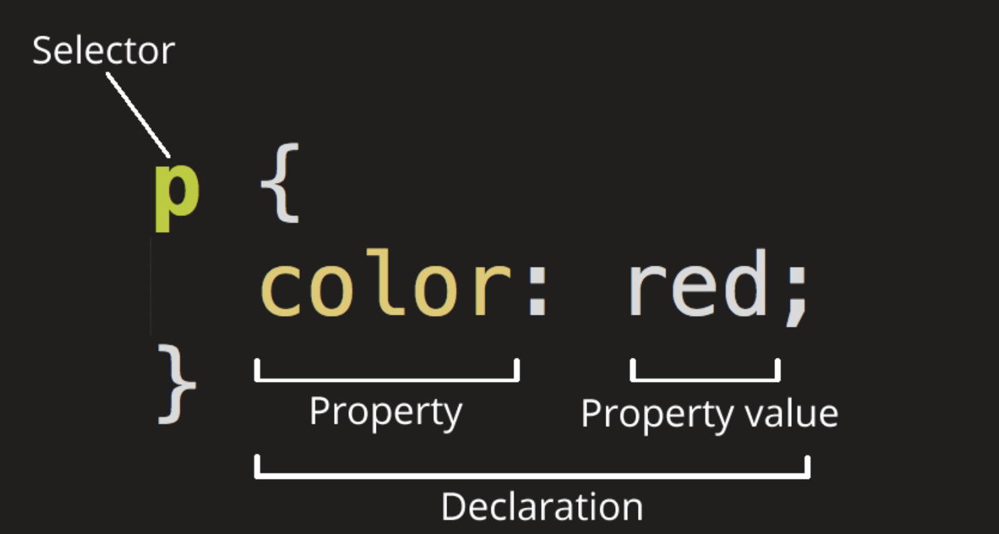
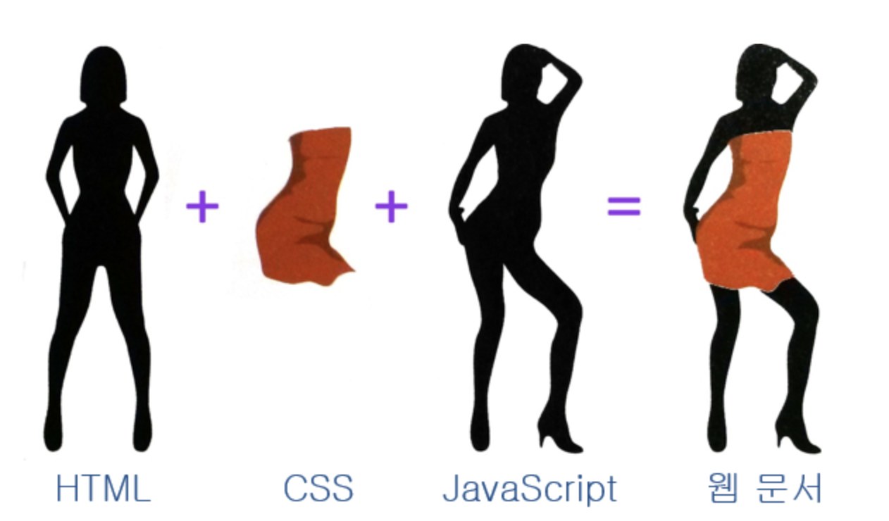
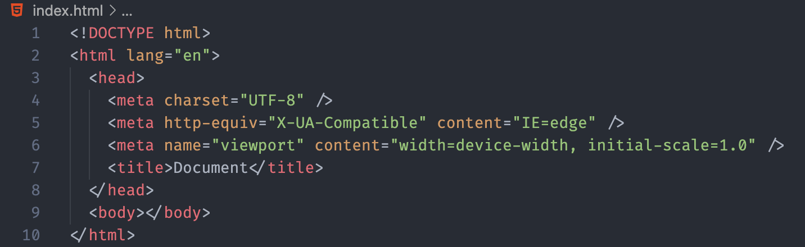
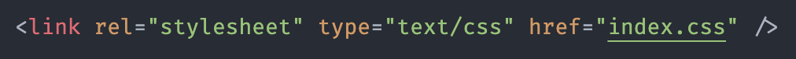
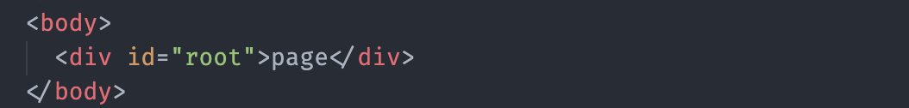
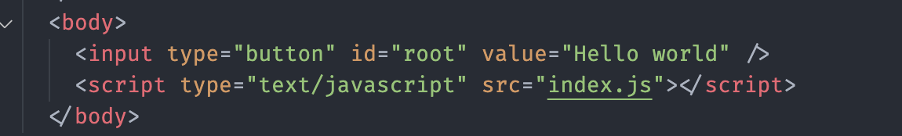
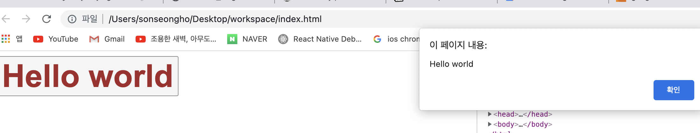

today I learned week 4

- 목차

1. HTML, CSS란 무엇이며 필요한 이유
2. HTML, CSS, JavaScript의 관계
3. .html, .css, .js 세 종류의 파일을 연결하는 방법
4. script 태그의 위치에 따른 차이점
5. 웹 페이지에서 일어날 수 있는 이벤트의 종류
6. 이벤트와 자바스크립트 함수와의 관계

---

#### 1. HTML, CSS란 무엇이며 필요한 이유

**HTML** 이란 마크업 언어이다. 웹페이지가 어떻게 구조화되어 있는지 브라우저로 알 수 있도록 하는게 마크업 언어이다. elements로 구성되어 있으며, 컨텐츠를 감싸고 마크업 한다. tag로 웹 상에 다른 페이지로 이동하게 하는 링크를 생성하거나 단어를 강조할 수 있다.

**CSS** 란 웹페이지를 꾸미려고 작성하는 코드이다. Style sheet 언어이며 HTML문서에 있는 요소들(elements)에게 선택적으로 스타일을 적용할 수 있다. 글자색을 변경하거나, 크게 만들거나, 컨텐츠의 사이즈를 줄이는 등 꾸미는 일을 한다.

---

#### 2. HTML, CSS, Javascript의 관계

셋의 관계를 건물에 비유하자면 **HTML** 은 건물의 뼈대를 세우고 벽을 만든다.

**CSS** 로 벽지를 그리고 무늬를 넣는 등 칙칙한 건물에 생동감을 준다.

마지막으로 **Javascript** 로 사람들이 사용할 수 있는 엘레베이터, 에스컬레이터 등을 만들었다.

---

#### 3. .html / .css / .js 세 종류의 파일을 연결하는 방법

우선 웹문서의 뼈대가 되는 html파일을 생성한다. 메모지로도 생성할 수 있지만 vscode 툴을 사용하여 html파일 자동완성 기능을 사용하면 아래 이미지처럼 기본 엘리먼트들이 생성된다.

css를 html에 연결하는 방법은 2가지가 있다.

###### 1. link element 사용하기

css의 rel과 type은 아래 이미지대로 써도되지만  href는 실제 css파일의 위치를 넣어야한다. 만약 다른 폴더에 있다면 forder/index.css 이런식으로 위치를 선언한다.

###### 2. import 사용하기

import 방식도 url 내부에 실제 css파일의 위치를 넣어야한다.

link element를 사용하는 방법을 추천한다. 다음으론 css파일을 html파일을 바라보게 했으니 실제 스타일을 적용해보자

html파일에 컨텐츠를 넣을 때 body element 내부에 담는다. div element를 생성하고 id값을 주었다. id 또는 class 프로퍼티를 사용하고 이름(root)을 선언하면 해당 id, class이름인 element만 스타일이 적용된다.

css 파일에서 id 가 root인 element에게 스타일을 선언했다. class는 . 문자를 사용하고 id는 # 문자를 사용한다.

다 되었다면 index.html 파일을 웹브라우저를 연다음에 브라우저에 파일을 드랍하면 index.html파일이 띄어진다.

마지막으로 js 파일을 연결해보자.

body element 안에 input tag를 생성했다 버튼을 클릭 하면 팝업이 뜨는 동작을 할것이다.

input tag에 id를 지정하고 button type에 기본제공되는 value 프로퍼티는 버튼의 글씨를 나타내준다.

팝업이 뜨는 동작을 하기위해 script element를 사용하고 src부분에 js파일 위치를 넣는다.

index.js 파일 내부이다. document 메서드를 사용하여 버튼의 id 값을 담고 root라는 변수로 선언했다

객체 타입인 변수 root에 버튼 root의 값이 담겼고 addEventListener 함수를 사용해서 클릭 기능을 만들었다.

버튼을 클릭하니 팝업이 나타나는걸 볼수 있다.

---

