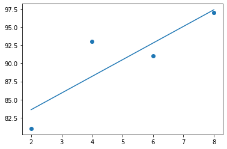
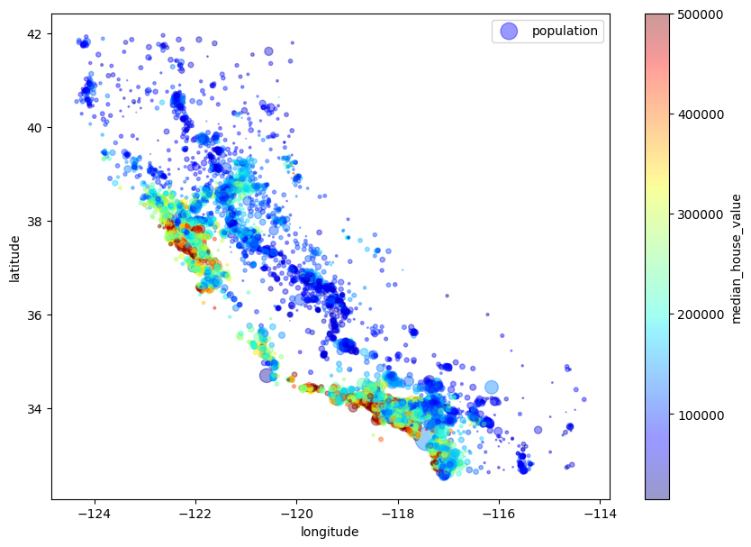
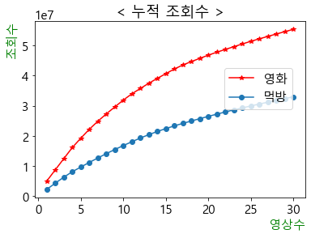

Consider the following image.

<p align='center'>
    
</p>

Most of us clearly recognize the famous [*Mona Lisa*](https://en.wikipedia.org/wiki/Mona_Lisa) by Leonardo da Vinci.

<p align='center'>
    
</p>

However, the style of the image looks quite a bit different from the original painting. The art connoisseurs among us will recognize that the style is actually borrowed from [*The Great Wave off Kanagawa*](https://en.wikipedia.org/wiki/The_Great_Wave_off_Kanagawa) by Hokusai.

<p align='center'>
    
</p>

Such a crossover between art masterpieces is possible thanks to [neural style transfer](https://en.wikipedia.org/wiki/Neural_style_transfer) algorithms.

# Neural Style Transfer Algorithm

The problem of merging the contents of one image with the style of another image is not trivial. For us, humans, it is easy to see what constitutes contents of a given image. For example, we would be looking for distinct objects, geometric figures or general scenery. Similarly, when thinking about style of an image, we would pay attention to colors, brush strokes, shades, etc. However, describing all of that programmatically is no easy task. At the end of the day, computers can only see numeric pixel representation of an image. Thus, the same numeric pixel values represent both contents and style of an image at the same time. How then should we approach the problem?

Recently, there has been a great deal of progress made in our understanding of deep neural network architectures. We now know that deep [convolutional neural networks](https://en.wikipedia.org/wiki/Convolutional_neural_network) (CNNs), trained on the problem of image classification, do a great job of extracting high-level semantic information from images. Moreover, this information is represented in generic form that generalizes well across various datasets. As it turns out, there is a way to utilize these generic feature representations to manipulate contents and style of images.

In this post, we will implement the Neural Algorithm of Artistic Style  proposed by Gatys et al. (2016). According to the authors, the algorithm "can separate and recombine the image content and style of natural images. The algorithm allows us to produce new images of high perceptual quality that combine the content of an arbitrary photograph with the appearance of numerous well-known artworks." The algorithm utilizes a single CNN. This reduces the problem to an optimization problem within a single neural network.

The authors used the VGG-19 neural network that was trained to classify images in the well-known ImageNet Large Scale Visual Recognition Challenge. This network has the following architecture.

<p align='center'>
    
</p>

The network can be viewed as consisting of two parts:
* The first part includes 5 convolutional blocks each followed by max pooling layer. Rectified linear unit (ReLU) activation is applied to outputs of each of the individual convolutional layers. This part is responsible for extracting feature representations of an image.
* The second part consists of three fully connected layers. The first two layers again use the ReLU activation and the final layer uses softmax activation. This part of the VGG-19 network is responsible for image classification.

Given that we are only interested in feature representations of images, we actually do not care about the second part of the VGG-19 network. Therefore, it can be safely discarded.

For any input image $x$ that goes through the network, the feature represenation of the image after application of convolutional layer $l$ can be stored in a feature representation matrix $F^l \in \mathbb{R}^{N_l \times M_l}$, where $N_l$ represents the number of filters used in the layer and $M_l$ is the height times the width of the feature map. Now let $t$ represent the target image, i.e., the image that should have semantic contents of the content image $c$ and style of the style image $s$. We can define the content loss between the target image and the content image as follows:

\begin{equation}
\mathbb{L}\_{content}(t, c, l) = \frac{1}{2} \sum_{i, j}\left(T_{ij}^{l} - C_{ij}^{l}\right)^2,
\end{equation}

where $T^l$ and $C^l$ are feature representation matrices of the target and content images after convolutional layer $l$ of the network, respectively.

# PyTorch Implementation

```python
# Load dependencies
import numpy as np
import pandas as pd
import matplotlib.pyplot as plt
from PIL import Image
import torch
from torch import optim, nn
from torch.nn import functional as F
import torchvision
from torchvision import datasets, transforms
```


```python
# Load pre-trained VGG-19 model
model = torchvision.models.vgg19(pretrained=True)
model
```


    VGG(
      (features): Sequential(
        (0): Conv2d(3, 64, kernel_size=(3, 3), stride=(1, 1), padding=(1, 1))
        (1): ReLU(inplace=True)
        (2): Conv2d(64, 64, kernel_size=(3, 3), stride=(1, 1), padding=(1, 1))
        (3): ReLU(inplace=True)
        (4): MaxPool2d(kernel_size=2, stride=2, padding=0, dilation=1, ceil_mode=False)
        (5): Conv2d(64, 128, kernel_size=(3, 3), stride=(1, 1), padding=(1, 1))
        (6): ReLU(inplace=True)
        (7): Conv2d(128, 128, kernel_size=(3, 3), stride=(1, 1), padding=(1, 1))
        (8): ReLU(inplace=True)
        (9): MaxPool2d(kernel_size=2, stride=2, padding=0, dilation=1, ceil_mode=False)
        (10): Conv2d(128, 256, kernel_size=(3, 3), stride=(1, 1), padding=(1, 1))
        (11): ReLU(inplace=True)
        (12): Conv2d(256, 256, kernel_size=(3, 3), stride=(1, 1), padding=(1, 1))
        (13): ReLU(inplace=True)
        (14): Conv2d(256, 256, kernel_size=(3, 3), stride=(1, 1), padding=(1, 1))
        (15): ReLU(inplace=True)
        (16): Conv2d(256, 256, kernel_size=(3, 3), stride=(1, 1), padding=(1, 1))
        (17): ReLU(inplace=True)
        (18): MaxPool2d(kernel_size=2, stride=2, padding=0, dilation=1, ceil_mode=False)
        (19): Conv2d(256, 512, kernel_size=(3, 3), stride=(1, 1), padding=(1, 1))
        (20): ReLU(inplace=True)
        (21): Conv2d(512, 512, kernel_size=(3, 3), stride=(1, 1), padding=(1, 1))
        (22): ReLU(inplace=True)
        (23): Conv2d(512, 512, kernel_size=(3, 3), stride=(1, 1), padding=(1, 1))
        (24): ReLU(inplace=True)
        (25): Conv2d(512, 512, kernel_size=(3, 3), stride=(1, 1), padding=(1, 1))
        (26): ReLU(inplace=True)
        (27): MaxPool2d(kernel_size=2, stride=2, padding=0, dilation=1, ceil_mode=False)
        (28): Conv2d(512, 512, kernel_size=(3, 3), stride=(1, 1), padding=(1, 1))
        (29): ReLU(inplace=True)
        (30): Conv2d(512, 512, kernel_size=(3, 3), stride=(1, 1), padding=(1, 1))
        (31): ReLU(inplace=True)
        (32): Conv2d(512, 512, kernel_size=(3, 3), stride=(1, 1), padding=(1, 1))
        (33): ReLU(inplace=True)
        (34): Conv2d(512, 512, kernel_size=(3, 3), stride=(1, 1), padding=(1, 1))
        (35): ReLU(inplace=True)
        (36): MaxPool2d(kernel_size=2, stride=2, padding=0, dilation=1, ceil_mode=False)
      )
      (avgpool): AdaptiveAvgPool2d(output_size=(7, 7))
      (classifier): Sequential(
        (0): Linear(in_features=25088, out_features=4096, bias=True)
        (1): ReLU(inplace=True)
        (2): Dropout(p=0.5, inplace=False)
        (3): Linear(in_features=4096, out_features=4096, bias=True)
        (4): ReLU(inplace=True)
        (5): Dropout(p=0.5, inplace=False)
        (6): Linear(in_features=4096, out_features=1000, bias=True)
      )
    )


```python
# Retain only the part of the VGG-19 model responsible for identifying features in an image
feature_model = model.features
feature_model
```


    Sequential(
      (0): Conv2d(3, 64, kernel_size=(3, 3), stride=(1, 1), padding=(1, 1))
      (1): ReLU(inplace=True)
      (2): Conv2d(64, 64, kernel_size=(3, 3), stride=(1, 1), padding=(1, 1))
      (3): ReLU(inplace=True)
      (4): MaxPool2d(kernel_size=2, stride=2, padding=0, dilation=1, ceil_mode=False)
      (5): Conv2d(64, 128, kernel_size=(3, 3), stride=(1, 1), padding=(1, 1))
      (6): ReLU(inplace=True)
      (7): Conv2d(128, 128, kernel_size=(3, 3), stride=(1, 1), padding=(1, 1))
      (8): ReLU(inplace=True)
      (9): MaxPool2d(kernel_size=2, stride=2, padding=0, dilation=1, ceil_mode=False)
      (10): Conv2d(128, 256, kernel_size=(3, 3), stride=(1, 1), padding=(1, 1))
      (11): ReLU(inplace=True)
      (12): Conv2d(256, 256, kernel_size=(3, 3), stride=(1, 1), padding=(1, 1))
      (13): ReLU(inplace=True)
      (14): Conv2d(256, 256, kernel_size=(3, 3), stride=(1, 1), padding=(1, 1))
      (15): ReLU(inplace=True)
      (16): Conv2d(256, 256, kernel_size=(3, 3), stride=(1, 1), padding=(1, 1))
      (17): ReLU(inplace=True)
      (18): MaxPool2d(kernel_size=2, stride=2, padding=0, dilation=1, ceil_mode=False)
      (19): Conv2d(256, 512, kernel_size=(3, 3), stride=(1, 1), padding=(1, 1))
      (20): ReLU(inplace=True)
      (21): Conv2d(512, 512, kernel_size=(3, 3), stride=(1, 1), padding=(1, 1))
      (22): ReLU(inplace=True)
      (23): Conv2d(512, 512, kernel_size=(3, 3), stride=(1, 1), padding=(1, 1))
      (24): ReLU(inplace=True)
      (25): Conv2d(512, 512, kernel_size=(3, 3), stride=(1, 1), padding=(1, 1))
      (26): ReLU(inplace=True)
      (27): MaxPool2d(kernel_size=2, stride=2, padding=0, dilation=1, ceil_mode=False)
      (28): Conv2d(512, 512, kernel_size=(3, 3), stride=(1, 1), padding=(1, 1))
      (29): ReLU(inplace=True)
      (30): Conv2d(512, 512, kernel_size=(3, 3), stride=(1, 1), padding=(1, 1))
      (31): ReLU(inplace=True)
      (32): Conv2d(512, 512, kernel_size=(3, 3), stride=(1, 1), padding=(1, 1))
      (33): ReLU(inplace=True)
      (34): Conv2d(512, 512, kernel_size=(3, 3), stride=(1, 1), padding=(1, 1))
      (35): ReLU(inplace=True)
      (36): MaxPool2d(kernel_size=2, stride=2, padding=0, dilation=1, ceil_mode=False)
    )


```python
# Set the parameters of the feature model to be non-trainable
for param in feature_model.parameters():
    param.requires_grad = False
```


```python
# Load content image
content_img = Image.open('img/input/city.jpeg')
fig = plt.figure(figsize=(10, 15))
plt.axis('off')
plt.imshow(content_img);
```


    

    


```python
# Load style image
style_img = Image.open('img/input/starry_night.jpeg')
fig = plt.figure(figsize=(10, 15))
plt.axis('off')
plt.imshow(style_img);
```


    

    


```python
# Print image resolutions
print('Resolution of the content image is {}.\nResolution of the style image is {}.'.format(content_img.size, style_img.size))
```

    Resolution of the content image is (1200, 798).
    Resolution of the style image is (970, 768).


```python
# Function that converts images to pytorch tensors
def img_to_tensor(img, width=768, height=768):
    transform = transforms.Compose([transforms.Scale((width, height)),
                                    transforms.ToTensor(),
                                    transforms.Normalize(mean=[0.485, 0.456, 0.406],
                                                         std=[0.229, 0.224, 0.225])])
    tensor = transform(img)
    tensor = tensor.reshape((1, -1, width, height))
    return tensor
```


```python
# Convert images to tensors
content_tensor = img_to_tensor(content_img, 500, 768)
style_tensor = img_to_tensor(style_img, 500, 768)
```

    /Users/chingismaximov/anaconda3/lib/python3.7/site-packages/torchvision/transforms/transforms.py:317: UserWarning: The use of the transforms.Scale transform is deprecated, please use transforms.Resize instead.
      warnings.warn("The use of the transforms.Scale transform is deprecated, " +


```python
# Print shapes of the resulting tensors. The two must be the same
print('Dimenstions of the content tensor are {}.\nDimensions of the style tensor are {}'.format(content_tensor.shape, style_tensor.shape))
assert content_tensor.shape == style_tensor.shape, 'The two tensors must thave the same shape'
```

    Dimenstions of the content tensor are torch.Size([1, 3, 500, 768]).
    Dimensions of the style tensor are torch.Size([1, 3, 500, 768])


```python
# Function that converts pytorch tensor to image
def tensor_to_image(tensor):
    img = tensor.clone().detach()
    img = img.numpy().squeeze()
    img = img.transpose(1,2,0)
    img = img * np.array((0.229, 0.224, 0.225)) + np.array((0.485, 0.456, 0.406))
    img = img.clip(0, 1)
    return img
```


```python
# Convert content tensor to image
fig = plt.figure(figsize=(10, 15))
plt.axis('off')
plt.imshow(tensor_to_image(content_tensor));
```


    

    


```python
# Convert style tensor to image
fig = plt.figure(figsize=(10, 15))
plt.axis('off')
plt.imshow(tensor_to_image(style_tensor));
```


    

    


```python
# Layers of the VGG-19 network responsible for the content representation
content_layers = {21: 'conv4_2'}
```


```python
# Layers of the VGG-19 network responsible for the style representation
style_layers = {0: 'conv1_1',
                5: 'conv2_1',
                10: 'conv3_1',
                19: 'conv4_1',
                28: 'conv5_1'}
```


```python
# Function that returns a dictionary of layer outputs from given layers
def get_layer_representation(tensor, model, layers):
    repr_dict = {}
    x = tensor.clone()
    for name, layer in model._modules.items(): # iterate over layers of the model
        x = layer(x) # Get output from each layer of the feature model
        if int(name) in layers.keys(): # Retain features only from the specified layers 
            repr_dict[int(name)] = x
    return repr_dict
```


```python
# Get content representation of the content image
content_repr = get_layer_representation(content_tensor, feature_model, content_layers)
content_repr
```


    {21: tensor([[[[ 1.6440,  0.0000,  0.0000,  ...,  0.0000,  0.0000,  0.0000],
               [ 0.0000,  0.0000,  0.0000,  ...,  0.0000,  0.0000,  0.0000],
               [ 0.0000,  0.0000,  0.0000,  ...,  0.0000,  0.0000,  0.0000],
               ...,
               [ 0.0000,  0.0000,  0.0000,  ...,  0.0000,  0.0000,  0.0000],
               [ 0.0000,  0.0000,  0.0000,  ...,  0.0000,  0.0000,  2.9825],
               [ 0.0000,  0.0000,  0.0000,  ...,  0.0000,  0.0000,  2.2155]],
     
              [[ 0.0000,  0.0000,  0.0000,  ...,  0.0000,  0.0000,  0.0000],
               [ 0.0000,  0.0000,  0.0000,  ...,  0.0000,  0.0000,  0.0000],
               [ 0.0000,  0.0000,  0.0000,  ...,  0.0000,  0.0000,  0.0000],
               ...,
               [ 9.0763,  5.5177,  1.5615,  ...,  0.0000,  0.0000,  2.3801],
               [ 0.1226,  0.0000,  1.3814,  ...,  0.0000,  0.0000,  0.0000],
               [ 1.9603,  0.0000,  1.4441,  ...,  0.0000,  0.0000,  0.2631]],
     
              [[ 0.0000,  0.0000,  0.0000,  ...,  0.0000,  0.0000,  0.0000],
               [ 0.0000,  0.0000,  0.0000,  ...,  0.0000,  0.0000,  0.0000],
               [ 2.9680,  0.0000,  0.0000,  ...,  0.0000,  0.0000,  0.0000],
               ...,
               [ 0.0000,  0.0000,  0.0000,  ...,  0.0000,  0.0000,  0.0000],
               [ 0.0000,  0.0000,  0.0000,  ...,  0.0000,  0.0000,  0.0000],
               [ 0.0000,  0.0000,  4.6392,  ...,  0.0000,  0.0000,  0.0000]],
     
              ...,
     
              [[15.7495,  0.0000,  0.0000,  ...,  1.1622,  0.5065,  0.0000],
               [ 2.6286,  0.0000,  0.0000,  ...,  0.0000,  0.0000,  0.0000],
               [ 0.0000,  0.0000,  0.0000,  ...,  0.0000,  0.0000,  0.0000],
               ...,
               [ 0.0000,  0.0000,  0.0000,  ..., 13.2547,  0.0000,  0.0000],
               [ 0.0000,  0.0000,  0.0000,  ...,  5.0570,  0.0000,  0.0000],
               [ 0.0000,  0.0000,  0.0000,  ...,  0.0000,  0.0000,  0.0000]],
     
              [[ 0.0000,  0.0000,  0.0000,  ...,  0.0000,  7.5661,  3.7305],
               [ 0.1565,  0.1193,  0.0000,  ...,  0.0000,  4.2926,  0.0000],
               [ 0.0000,  6.3766,  1.4473,  ...,  0.0000,  5.8737,  0.0000],
               ...,
               [ 0.0000,  0.0000,  0.0000,  ...,  0.0000,  0.0000,  0.0000],
               [ 0.0000,  0.0000,  0.0000,  ...,  0.0000,  0.0000,  0.0000],
               [ 0.0000,  0.0000,  0.0000,  ...,  3.3958,  0.0000,  0.0000]],
     
              [[ 0.0000,  0.0000,  0.0000,  ...,  0.0000,  0.0000,  0.0000],
               [ 0.0000,  0.0000,  0.0000,  ...,  0.0000,  0.0000,  0.0000],
               [ 0.0000,  0.0000,  0.0000,  ...,  0.0000,  0.0000,  0.5970],
               ...,
               [ 9.3876,  3.3276,  0.0000,  ...,  6.0363,  0.0000,  0.0000],
               [ 1.2211,  0.0000,  0.0000,  ...,  0.0000,  0.0000,  0.0000],
               [ 0.0000,  0.0000,  0.0000,  ...,  0.0000,  0.0000,  0.0000]]]])}


```python
# Get style representations of the style image
style_repr = get_layer_representation(style_tensor, feature_model, style_layers)
style_repr
```


    {0: tensor([[[[0.0000, 0.0000, 0.0000,  ..., 0.0000, 0.0543, 0.0000],
               [0.0000, 0.0000, 0.0000,  ..., 0.0000, 0.0000, 0.0000],
               [0.0000, 0.0000, 0.0000,  ..., 0.2207, 0.1534, 0.0000],
               ...,
               [0.0000, 0.0000, 0.0000,  ..., 0.0000, 0.0000, 0.0000],
               [0.0000, 0.0000, 0.0000,  ..., 0.0000, 0.0000, 0.0000],
               [0.0000, 0.0000, 0.0000,  ..., 0.0000, 0.0000, 0.0000]],
     
              [[1.9981, 0.0000, 0.0000,  ..., 0.9973, 0.7509, 2.4403],
               [3.8316, 1.2739, 0.2565,  ..., 1.0284, 0.5287, 2.2908],
               [3.7652, 0.5257, 0.0000,  ..., 0.5880, 1.3117, 2.7761],
               ...,
               [1.8447, 2.2151, 1.7151,  ..., 0.0510, 0.0000, 1.0339],
               [0.7927, 1.3272, 0.1080,  ..., 1.1167, 0.2213, 1.8099],
               [0.0000, 0.1533, 0.0867,  ..., 0.0000, 0.0000, 0.0489]],
     
              [[0.0000, 0.0000, 0.0000,  ..., 0.0000, 0.0000, 0.0000],
               [0.0000, 0.0000, 0.0000,  ..., 0.0000, 0.0000, 0.0000],
               [0.0000, 0.0000, 0.0000,  ..., 0.1902, 0.0000, 0.0000],
               ...,
               [0.0000, 0.0000, 0.0000,  ..., 0.0000, 0.0000, 0.0000],
               [0.0000, 0.0000, 0.0000,  ..., 0.0000, 0.0000, 0.0000],
               [0.0000, 0.0000, 0.0000,  ..., 0.0000, 0.0000, 0.0000]],
     
              ...,
     
              [[0.0000, 0.4961, 0.7458,  ..., 0.0000, 0.0000, 0.0000],
               [0.0962, 0.8559, 1.1059,  ..., 0.0000, 0.0000, 0.0000],
               [0.2499, 1.1306, 1.2994,  ..., 0.0000, 0.0000, 0.0000],
               ...,
               [0.0000, 0.0000, 0.0000,  ..., 0.0000, 0.0000, 0.0000],
               [0.0000, 0.0000, 0.0000,  ..., 0.0000, 0.0000, 0.0000],
               [0.0000, 0.0000, 0.0000,  ..., 0.0000, 0.0000, 0.0000]],
     
              [[0.6157, 1.9737, 2.3436,  ..., 0.0000, 0.0000, 0.0000],
               [0.0000, 0.0000, 0.1073,  ..., 0.4173, 0.6561, 0.0000],
               [0.0000, 0.2494, 0.2398,  ..., 0.0000, 0.0000, 0.0000],
               ...,
               [0.0886, 0.0000, 0.0000,  ..., 1.1916, 1.0191, 0.3021],
               [0.8968, 0.1152, 0.0000,  ..., 0.7777, 0.2731, 0.0000],
               [0.3210, 0.0000, 0.4453,  ..., 0.0000, 0.0000, 0.0000]],
     
              [[0.0000, 0.0000, 0.0000,  ..., 1.4588, 1.8513, 1.7176],
               [0.0000, 0.0000, 0.0000,  ..., 0.1857, 0.3113, 0.9322],
               [0.0000, 0.0000, 0.3332,  ..., 0.5875, 0.4444, 0.7312],
               ...,
               [1.7491, 1.3631, 2.2294,  ..., 0.6985, 0.8415, 1.2250],
               [0.9607, 0.2210, 0.8041,  ..., 0.5921, 0.1424, 0.8493],
               [0.0000, 0.0000, 0.0000,  ..., 0.0000, 0.0000, 0.1883]]]]),
     5: tensor([[[[ 0.0000,  0.0000,  0.0000,  ...,  0.0000,  0.0000,  0.0000],
               [ 0.5965,  0.0000,  0.0000,  ...,  0.0000,  0.0000,  0.0000],
               [ 0.0762,  0.0000,  0.0000,  ...,  0.0000,  0.0000,  0.0000],
               ...,
               [ 0.0000,  0.0000,  0.0000,  ...,  0.0000,  0.0000,  0.0000],
               [ 3.0051,  0.0000,  0.0000,  ...,  0.0000,  0.0000,  0.0000],
               [ 4.7052,  0.0000,  0.0254,  ...,  0.0000,  0.0000,  0.0000]],
     
              [[ 0.0000,  0.4974,  0.0000,  ...,  0.0000,  0.0000,  0.0000],
               [ 0.0000,  1.4849,  1.2406,  ...,  0.0000,  0.0000,  0.0000],
               [ 0.0000,  0.0000,  1.7637,  ...,  0.0000,  0.0000,  0.0000],
               ...,
               [ 0.0000,  0.0000,  0.0000,  ...,  2.0509,  3.0079,  0.0000],
               [ 0.0000,  0.5482,  0.0000,  ...,  0.1564,  1.0513,  0.0000],
               [ 0.0000,  0.0000,  1.3195,  ...,  3.3289,  0.0000,  0.0000]],
     
              [[ 0.0000,  0.0000,  0.0000,  ...,  0.0000,  0.0000,  0.0000],
               [ 0.0000,  1.2598,  2.4182,  ...,  2.7788,  2.6508,  0.0000],
               [ 0.0000,  0.0000,  1.4222,  ...,  2.3292,  4.3948,  0.6061],
               ...,
               [ 0.0000,  1.2012,  1.8109,  ...,  0.8898,  0.0000,  2.0362],
               [ 1.0701,  0.0000,  0.0000,  ...,  3.3271,  1.5185,  0.0000],
               [ 1.7429,  5.8309,  4.6371,  ...,  0.0000,  0.0000,  0.0000]],
     
              ...,
     
              [[ 0.0000,  0.0000,  0.0000,  ...,  0.0000,  0.0000,  0.0000],
               [ 2.8502,  5.6792,  7.8799,  ...,  0.0000,  0.0000,  0.0000],
               [ 1.7579,  4.4394,  3.6900,  ...,  0.0000,  0.0000,  0.0000],
               ...,
               [ 0.0000,  0.4571,  4.6050,  ..., 11.9595,  6.3863,  2.4506],
               [ 0.0000,  0.0000,  2.1422,  ...,  0.0000,  0.0000,  0.0000],
               [ 0.0000,  0.0000,  0.0000,  ...,  0.8520,  0.0000,  0.0000]],
     
              [[ 0.0000,  0.0000,  0.0000,  ...,  0.0000,  0.0000,  0.0000],
               [ 0.0000,  0.0000,  0.0000,  ...,  0.0000,  0.0000,  0.0000],
               [ 2.9332,  0.7779,  0.0000,  ...,  0.0000,  0.0000,  0.0000],
               ...,
               [ 0.2246,  0.3226,  0.0000,  ...,  0.0000,  0.0000,  0.0000],
               [ 0.0000,  0.0000,  0.0000,  ...,  0.0000,  0.0000,  0.4879],
               [ 0.0000,  0.0000,  0.0000,  ...,  0.0000,  0.0000,  0.0000]],
     
              [[ 0.0000,  0.0000,  0.0000,  ...,  3.1936,  0.9553,  0.0000],
               [ 0.0000,  0.0000,  0.0000,  ...,  1.7400,  0.2950,  0.0000],
               [ 0.0000,  0.0000,  0.0000,  ...,  0.0000,  1.0451,  0.0000],
               ...,
               [ 1.5579,  0.0000,  0.0000,  ...,  0.0000,  0.0000,  0.0000],
               [ 2.2462,  0.0000,  0.0000,  ...,  1.9225,  0.0000,  0.0000],
               [ 1.4137,  1.0584,  0.1769,  ...,  0.0000,  0.0000,  0.0000]]]]),
     10: tensor([[[[ 0.0000,  2.9916,  7.3292,  ...,  1.9689,  3.3017,  0.1164],
               [ 0.0000,  0.0000,  0.9546,  ...,  8.0733,  0.0000,  0.0000],
               [ 0.0000,  0.0000,  0.0000,  ...,  7.1921,  0.0000,  0.0000],
               ...,
               [ 0.0000,  0.0000,  0.4598,  ...,  0.0000,  1.5005,  6.4935],
               [ 1.7809,  2.6328,  6.4578,  ...,  0.0000,  5.6842,  7.0264],
               [ 2.5785,  2.5102,  7.0110,  ...,  0.0000,  0.0000,  0.0000]],
     
              [[ 0.0000,  0.0000,  0.0000,  ...,  0.0000,  0.0000,  0.0000],
               [ 1.3453,  0.0000,  0.0000,  ...,  4.0090,  9.0879,  3.0459],
               [ 0.5590,  0.0000,  0.0000,  ...,  0.3830, 16.1526,  0.0000],
               ...,
               [ 0.0000,  0.0000,  0.0000,  ...,  0.0000,  0.0000,  9.4762],
               [ 0.0000,  0.0000,  0.0000,  ...,  0.0000,  0.0000, 13.9704],
               [ 4.4878,  0.6180,  3.2162,  ...,  0.1667, 14.4451, 21.6376]],
     
              [[ 5.4303,  0.0000,  0.0000,  ...,  0.0000,  3.8024,  0.0000],
               [ 8.6125,  0.0000,  0.0000,  ...,  0.0000, 12.1394,  0.0000],
               [ 3.6260,  0.0000,  0.0000,  ...,  0.0000,  8.8906,  0.5236],
               ...,
               [10.1597,  0.0000,  0.0000,  ...,  0.0000,  0.0000,  0.0000],
               [12.9789,  0.3242,  0.0000,  ...,  7.6690,  3.3441,  8.5349],
               [25.6155, 21.8265, 12.9744,  ..., 16.5399, 15.9840, 12.8729]],
     
              ...,
     
              [[ 0.0000,  0.0000,  0.0000,  ...,  0.0000,  1.8725,  0.0000],
               [ 0.0000,  0.0000,  0.0000,  ..., 11.3226, 22.9888,  0.0000],
               [ 0.0000,  0.0000,  0.0000,  ...,  0.0000,  0.0000,  0.0000],
               ...,
               [ 0.0000,  0.0000,  0.0000,  ...,  0.0000,  0.0000,  0.0000],
               [ 0.0000,  0.0000,  0.0000,  ...,  0.0000,  0.0000,  6.1776],
               [ 0.0000,  0.0000,  0.0000,  ...,  0.0000,  0.0000,  1.6763]],
     
              [[ 2.6472,  0.0000,  4.3210,  ..., 11.7251,  1.6567,  0.0000],
               [ 0.0000,  0.0000,  0.0000,  ...,  4.7450,  0.0000,  0.0000],
               [ 0.8004,  0.0000,  0.0000,  ..., 23.0159,  2.8302,  0.0000],
               ...,
               [ 2.2063,  0.0000,  6.6859,  ...,  6.3566, 12.7104,  0.0000],
               [ 3.0937,  6.1959,  8.3821,  ...,  0.0000,  9.8852,  3.2153],
               [ 0.0000,  5.5278,  8.6108,  ...,  1.3285,  0.0000,  1.3105]],
     
              [[ 1.9379,  0.3144,  0.0000,  ...,  0.0000,  0.0000,  4.2956],
               [ 0.0000,  0.0000,  0.0000,  ...,  0.0000,  0.0000,  3.0025],
               [ 0.0000,  0.0000,  0.0000,  ...,  0.0000,  0.0000,  5.0302],
               ...,
               [ 0.0000,  9.6327,  1.7321,  ...,  0.0000,  0.0000,  0.0000],
               [ 0.0000,  4.3398,  0.0000,  ...,  0.0000,  1.2830,  0.0000],
               [ 2.1618,  6.3942,  0.0000,  ...,  6.9623, 11.2990,  5.0782]]]]),
     19: tensor([[[[ 0.0000,  5.7946,  0.0000,  ...,  0.0000,  0.6058,  0.0000],
               [ 0.0000,  0.0000,  0.0000,  ...,  1.8816,  0.0000,  0.0000],
               [ 0.0000,  0.0000,  0.0000,  ...,  0.0000,  0.0000,  0.0000],
               ...,
               [ 0.0000,  4.3220,  2.1332,  ...,  0.0000,  0.0000,  0.0000],
               [ 0.0000, 10.8335, 12.2395,  ...,  0.0000,  0.0000,  0.0000],
               [ 0.0000,  0.0000,  0.0000,  ...,  0.0000,  0.0000,  0.0000]],
     
              [[ 0.0000,  0.0000,  0.0000,  ...,  0.0000,  0.0000, 38.8597],
               [ 0.0000,  0.0000,  0.0000,  ...,  0.0000,  0.0000, 35.5179],
               [ 0.0000,  0.0000,  0.0000,  ...,  0.0000,  0.0000, 29.9862],
               ...,
               [ 0.0000,  0.0000,  0.0000,  ...,  0.0000,  0.0000,  0.0000],
               [ 0.0000,  0.0000,  0.9677,  ...,  0.0000,  0.0000,  7.8056],
               [ 0.0000,  0.0000, 10.8489,  ...,  0.0000,  0.0000, 16.4970]],
     
              [[ 0.0000,  0.0000,  0.0000,  ...,  0.0000,  0.0000,  0.0000],
               [ 0.0000,  0.0000,  0.0000,  ...,  0.0000,  0.0000,  0.7014],
               [ 0.0000,  0.0000,  0.0000,  ...,  0.0000,  0.0000,  1.4769],
               ...,
               [ 0.0000,  0.0000,  0.0000,  ...,  3.5403,  0.0000,  0.0000],
               [ 0.0000,  0.0000,  0.0000,  ...,  0.0000,  0.0000,  0.0000],
               [ 0.0000,  0.0000,  0.0000,  ...,  1.7394,  0.0000,  9.3728]],
     
              ...,
     
              [[ 0.0000,  0.0000,  0.0000,  ...,  0.0000,  0.0000,  0.0000],
               [ 0.0000,  0.6224,  2.6861,  ...,  2.4944,  0.0000,  0.0000],
               [ 2.2883,  6.7713,  0.0000,  ...,  6.0853,  0.0000,  0.0000],
               ...,
               [ 0.0000,  0.0000,  0.0000,  ...,  0.0000,  0.0000,  0.0000],
               [ 0.0000,  0.0000,  0.0000,  ...,  0.0000,  0.0000,  0.0000],
               [ 7.8629, 11.0132,  0.0000,  ...,  0.0000,  0.0000,  0.0000]],
     
              [[ 0.0000,  0.0000,  0.0000,  ...,  0.0000,  0.0000,  0.0000],
               [ 0.0000,  0.0000,  0.0000,  ...,  0.0000,  0.0000,  0.0000],
               [ 0.0000,  0.0000,  0.0000,  ...,  0.0000,  0.0000,  0.0000],
               ...,
               [ 0.0000,  1.2761,  5.2418,  ...,  0.0000,  0.0000,  0.0000],
               [ 0.0000,  0.0000,  0.0000,  ...,  0.0000,  0.0000,  0.0000],
               [ 0.0000,  0.0000,  0.0000,  ...,  0.0000,  0.0000,  0.0000]],
     
              [[ 0.0000,  0.0000,  0.0000,  ...,  0.0000,  0.0000,  0.0000],
               [10.0582, 10.0475,  0.0000,  ...,  8.9467,  0.1031,  0.0000],
               [ 9.5686, 11.8172,  3.6297,  ...,  6.8208,  3.2431,  0.0000],
               ...,
               [ 0.0000,  0.0000,  1.8426,  ...,  7.3491,  1.3105,  0.0000],
               [ 0.0000,  0.0000,  0.0000,  ...,  9.4047,  0.0000,  0.0000],
               [ 0.0000,  0.0000,  0.0000,  ...,  8.0318,  0.0000,  0.0000]]]]),
     28: tensor([[[[1.9133, 0.7901, 0.0000,  ..., 0.0000, 0.0000, 0.0000],
               [5.1665, 2.9823, 0.0000,  ..., 0.0000, 0.0000, 0.5130],
               [4.1105, 3.6651, 0.7440,  ..., 1.2358, 2.3428, 2.9783],
               ...,
               [0.0000, 0.0000, 0.0000,  ..., 0.0000, 0.0000, 0.0000],
               [0.0000, 0.0000, 0.0000,  ..., 0.0000, 0.0000, 0.0000],
               [0.0000, 0.0000, 0.0000,  ..., 2.8600, 0.0000, 0.0000]],
     
              [[0.8573, 0.1103, 0.0000,  ..., 1.3887, 5.6928, 6.8348],
               [0.0000, 0.0000, 0.0000,  ..., 2.3136, 8.0745, 7.0699],
               [0.6862, 0.0000, 0.0000,  ..., 2.4610, 3.1582, 0.8029],
               ...,
               [0.8264, 3.6252, 5.0129,  ..., 4.2711, 2.5838, 0.0000],
               [0.3498, 0.0000, 2.3361,  ..., 1.9911, 1.8755, 1.8451],
               [3.5081, 2.3307, 3.1744,  ..., 2.3606, 4.6639, 3.4229]],
     
              [[0.0000, 0.0000, 0.0000,  ..., 1.1723, 2.7010, 5.6470],
               [0.0000, 0.0000, 0.0000,  ..., 0.3364, 3.8687, 5.7564],
               [0.0000, 0.0000, 0.0000,  ..., 0.0000, 1.2537, 2.5001],
               ...,
               [3.2412, 0.0000, 0.0000,  ..., 0.0000, 0.0000, 4.4140],
               [1.3991, 0.0000, 0.0000,  ..., 0.0000, 0.0000, 1.7097],
               [2.5908, 0.0000, 0.0000,  ..., 2.2125, 0.6314, 1.9719]],
     
              ...,
     
              [[0.0000, 0.0000, 0.0000,  ..., 0.0000, 0.0000, 0.0000],
               [0.0000, 0.0000, 0.0000,  ..., 0.0000, 0.0000, 0.0000],
               [0.0000, 0.0000, 0.0000,  ..., 0.0000, 0.0000, 0.0000],
               ...,
               [0.0000, 0.0000, 0.0000,  ..., 0.0000, 0.0000, 0.0000],
               [0.0000, 0.0000, 0.0000,  ..., 0.0000, 0.0000, 0.0000],
               [0.0000, 0.0000, 0.0000,  ..., 0.0000, 0.0000, 0.0000]],
     
              [[0.0000, 0.0000, 0.0000,  ..., 0.0000, 0.0000, 0.0000],
               [0.0000, 0.0000, 0.0000,  ..., 0.0000, 0.0000, 0.0000],
               [0.0000, 0.0000, 0.0000,  ..., 0.0000, 0.0000, 0.0000],
               ...,
               [0.0000, 0.0000, 0.0000,  ..., 0.0000, 0.0000, 0.0000],
               [0.0000, 0.0000, 0.0000,  ..., 0.0000, 0.0000, 0.0000],
               [0.0000, 0.0000, 0.0000,  ..., 0.0000, 0.8352, 0.0000]],
     
              [[0.0000, 0.0000, 0.0000,  ..., 0.0000, 0.8462, 3.4323],
               [0.0000, 0.0000, 0.0000,  ..., 0.0000, 0.0000, 0.0000],
               [0.0000, 0.0000, 0.0000,  ..., 0.0000, 0.0000, 0.0000],
               ...,
               [0.0393, 0.2658, 0.0000,  ..., 0.0375, 0.0000, 0.0000],
               [0.0000, 0.0000, 0.0000,  ..., 0.0000, 0.0000, 0.0000],
               [3.3345, 0.0000, 0.0000,  ..., 0.0000, 0.0000, 0.0000]]]])}


```python
# Function that estimates gram matrices
def gram_matrix(tensor):
    x = tensor.clone()
    x = torch.squeeze(x)
    x = x.reshape(x.shape[0], -1)
    gram_matrix = torch.mm(x, x.T)
    return gram_matrix
```


```python
# Obtain gram matrices for the layers of the style image
style_gram_matrices = {key: gram_matrix(value) for (key, value) in style_repr.items()}
style_gram_matrices
```


    {0: tensor([[4.3211e+03, 5.6657e+03, 9.5734e+02,  ..., 2.4224e+03, 2.1565e+03,
              7.5132e+03],
             [5.6657e+03, 3.1305e+05, 7.8867e+02,  ..., 2.1792e+05, 6.1291e+04,
              1.4804e+05],
             [9.5734e+02, 7.8867e+02, 1.1843e+03,  ..., 2.8536e+01, 7.2121e+02,
              1.9913e+03],
             ...,
             [2.4224e+03, 2.1792e+05, 2.8536e+01,  ..., 8.1138e+05, 1.7169e+05,
              2.4589e+05],
             [2.1565e+03, 6.1291e+04, 7.2121e+02,  ..., 1.7169e+05, 1.0719e+05,
              5.3756e+04],
             [7.5132e+03, 1.4804e+05, 1.9913e+03,  ..., 2.4589e+05, 5.3756e+04,
              2.8502e+05]]),
     5: tensor([[ 180523.1562,   30849.2930,  145012.7188,  ...,  120204.7422,
                 5807.8335,   47651.1016],
             [  30849.2930,  371611.5938,  148257.5156,  ...,  494360.5312,
                30569.3203,   66500.5547],
             [ 145012.7188,  148257.5156,  573556.1875,  ...,  396549.3438,
                16399.8848,   99831.8984],
             ...,
             [ 120204.7422,  494360.5625,  396549.3125,  ..., 1833808.0000,
                63631.5977,  195700.8906],
             [   5807.8340,   30569.3223,   16399.8848,  ...,   63631.5977,
                64009.3672,   37829.9492],
             [  47651.1016,   66500.5469,   99831.8906,  ...,  195700.8906,
                37829.9492,  253942.6250]]),
     10: tensor([[249019.3281,  69899.0000,  33603.1914,  ...,  55605.4727,
              130947.9922,  11131.9932],
             [ 69899.0000, 181347.0625,  50921.9961,  ...,  41167.8320,
               73032.6953,  14173.2207],
             [ 33603.1914,  50921.9961, 160286.2656,  ...,  24741.3926,
               76627.1172,  21610.1445],
             ...,
             [ 55605.4727,  41167.8320,  24741.3926,  ..., 261820.5938,
               84755.7266,  20711.5918],
             [130947.9922,  73032.6953,  76627.1172,  ...,  84755.7266,
              619435.5625,  28566.1758],
             [ 11131.9932,  14173.2207,  21610.1445,  ...,  20711.5918,
               28566.1758,  59504.9023]]),
     19: tensor([[74454.3750,  1036.2327,  1457.0802,  ...,  4297.2847,  6882.6953,
              18787.2070],
             [ 1036.2327, 22669.7461,  3116.9133,  ...,   825.8220,   608.0436,
               2772.4192],
             [ 1457.0802,  3116.9133, 21329.6504,  ...,   142.0469,  8106.6572,
               6942.2773],
             ...,
             [ 4297.2847,   825.8220,   142.0469,  ..., 43532.0156,  3256.5493,
               5488.2827],
             [ 6882.6953,   608.0436,  8106.6572,  ...,  3256.5493, 78735.9844,
              16389.4219],
             [18787.2070,  2772.4192,  6942.2773,  ...,  5488.2827, 16389.4219,
              91715.1328]]),
     28: tensor([[1.9027e+03, 4.8118e+02, 3.4581e+02,  ..., 2.5132e+01, 6.2043e+01,
              1.6003e+02],
             [4.8118e+02, 6.5253e+03, 9.0957e+02,  ..., 5.0561e+01, 5.9875e+01,
              3.6743e+02],
             [3.4581e+02, 9.0957e+02, 2.5390e+03,  ..., 8.8157e+01, 1.3041e+02,
              5.3252e+02],
             ...,
             [2.5132e+01, 5.0561e+01, 8.8157e+01,  ..., 3.9132e+02, 5.0304e-01,
              1.0878e+01],
             [6.2043e+01, 5.9875e+01, 1.3041e+02,  ..., 5.0304e-01, 5.5653e+02,
              2.5168e+01],
             [1.6003e+02, 3.6743e+02, 5.3252e+02,  ..., 1.0878e+01, 2.5168e+01,
              1.9355e+03]])}


```python
# Initialize the target vector
target_tensor = content_tensor.clone()
target_tensor.requires_grad = True # The target tensor will be modified via training
```


```python
# Save tensor as image
def save_image(tensor, path, name):
    img = Image.fromarray((tensor_to_image(tensor) * 255).astype(np.uint8))
    img.save(path + name)
```


```python
# Parameters for training
optimizer = optim.Adam([target_tensor], lr=0.005)
MSE_loss = nn.MSELoss()

# Weights for losses from each of the style layers
style_layer_weights = {0: 0.2,
                       5: 0.2,
                       10: 0.2,
                       19: 0.2,
                       28: 0.2}
alpha = 1 # The weight of the content loss
beta = 100 # The weight of the style loss
```


```python
# Training process
epochs = 3000
save_every = 50
for e in range(1, epochs + 1):
    loss = 0
    target_content_repr = get_layer_representation(target_tensor, feature_model, content_layers)
    target_style_repr = get_layer_representation(target_tensor, feature_model, style_layers)
    
    feature_model.train()
    optimizer.zero_grad()
    
    content_loss = 0
    for name in content_layers.keys():
        content_loss += MSE_loss(target_content_repr[name], content_repr[name])
    
    style_loss = 0
    for name in style_layers.keys():
        style_loss += MSE_loss(gram_matrix(target_style_repr[name]), style_gram_matrices[name]) * style_layer_weights[name]
        
    loss = alpha * content_loss + beta * style_loss
    
    loss.backward()
    optimizer.step()
    
    print('Epoch {} is over. The loss is {}.'.format(e, loss))
    if e % save_every == 0:
        fig, axs = plt.subplots(1, 3, figsize=(15, 5))
        axs[0].imshow(tensor_to_image(content_tensor))
        axs[0].axis('off')
        axs[1].imshow(tensor_to_image(target_tensor))
        axs[1].axis('off')
        axs[2].imshow(tensor_to_image(style_tensor))
        axs[2].axis('off')
        plt.show();
        
        fig.savefig('img/output/training_progress_{}.png'.format(e))
        save_image(target_tensor, path='img/output/', name='target_img_{}.jpeg'.format(e))
```

    Epoch 1 is over. The loss is 347533443072.0.
    Epoch 2 is over. The loss is 335643181056.0.
    Epoch 3 is over. The loss is 324627300352.0.
    Epoch 4 is over. The loss is 314388643840.0.
    Epoch 5 is over. The loss is 304836313088.0.
    Epoch 6 is over. The loss is 295884783616.0.
    Epoch 7 is over. The loss is 287461801984.0.
    Epoch 8 is over. The loss is 279512154112.0.
    Epoch 9 is over. The loss is 271976628224.0.
    Epoch 10 is over. The loss is 264811544576.0.
    Epoch 11 is over. The loss is 257980792832.0.
    Epoch 12 is over. The loss is 251454619648.0.
    Epoch 13 is over. The loss is 245211398144.0.
    Epoch 14 is over. The loss is 239229059072.0.
    Epoch 15 is over. The loss is 233490661376.0.
    Epoch 16 is over. The loss is 227987226624.0.
    Epoch 17 is over. The loss is 222710038528.0.
    Epoch 18 is over. The loss is 217653051392.0.
    Epoch 19 is over. The loss is 212813332480.0.
    Epoch 20 is over. The loss is 208186261504.0.
    Epoch 21 is over. The loss is 203767463936.0.
    Epoch 22 is over. The loss is 199549566976.0.
    Epoch 23 is over. The loss is 195527376896.0.
    Epoch 24 is over. The loss is 191693537280.0.
    Epoch 25 is over. The loss is 188038397952.0.
    Epoch 26 is over. The loss is 184549638144.0.
    Epoch 27 is over. The loss is 181214756864.0.
    Epoch 28 is over. The loss is 178020614144.0.
    Epoch 29 is over. The loss is 174954283008.0.
    Epoch 30 is over. The loss is 172002918400.0.
    Epoch 31 is over. The loss is 169154576384.0.
    Epoch 32 is over. The loss is 166398803968.0.
    Epoch 33 is over. The loss is 163728850944.0.
    Epoch 34 is over. The loss is 161138753536.0.
    Epoch 35 is over. The loss is 158625431552.0.
    Epoch 36 is over. The loss is 156185788416.0.
    Epoch 37 is over. The loss is 153817546752.0.
    Epoch 38 is over. The loss is 151517577216.0.
    Epoch 39 is over. The loss is 149284061184.0.
    Epoch 40 is over. The loss is 147115098112.0.
    Epoch 41 is over. The loss is 145008525312.0.
    Epoch 42 is over. The loss is 142961131520.0.
    Epoch 43 is over. The loss is 140970082304.0.
    Epoch 44 is over. The loss is 139032248320.0.
    Epoch 45 is over. The loss is 137144844288.0.
    Epoch 46 is over. The loss is 135304355840.0.
    Epoch 47 is over. The loss is 133507907584.0.
    Epoch 48 is over. The loss is 131753279488.0.
    Epoch 49 is over. The loss is 130038153216.0.
    Epoch 50 is over. The loss is 128361046016.0.


    

    


    Epoch 51 is over. The loss is 126720540672.0.
    Epoch 52 is over. The loss is 125115203584.0.
    Epoch 53 is over. The loss is 123543887872.0.
    Epoch 54 is over. The loss is 122005659648.0.
    Epoch 55 is over. The loss is 120499060736.0.
    Epoch 56 is over. The loss is 119023165440.0.
    Epoch 57 is over. The loss is 117576384512.0.
    Epoch 58 is over. The loss is 116157784064.0.
    Epoch 59 is over. The loss is 114765758464.0.
    Epoch 60 is over. The loss is 113399103488.0.
    Epoch 61 is over. The loss is 112056745984.0.
    Epoch 62 is over. The loss is 110737743872.0.
    Epoch 63 is over. The loss is 109441417216.0.
    Epoch 64 is over. The loss is 108167004160.0.
    Epoch 65 is over. The loss is 106913693696.0.
    Epoch 66 is over. The loss is 105680846848.0.
    Epoch 67 is over. The loss is 104467759104.0.
    Epoch 68 is over. The loss is 103273848832.0.
    Epoch 69 is over. The loss is 102098501632.0.
    Epoch 70 is over. The loss is 100941430784.0.
    Epoch 71 is over. The loss is 99801751552.0.
    Epoch 72 is over. The loss is 98678775808.0.
    Epoch 73 is over. The loss is 97572143104.0.
    Epoch 74 is over. The loss is 96481427456.0.
    Epoch 75 is over. The loss is 95406252032.0.
    Epoch 76 is over. The loss is 94346051584.0.
    Epoch 77 is over. The loss is 93300137984.0.
    Epoch 78 is over. The loss is 92268388352.0.
    Epoch 79 is over. The loss is 91250180096.0.
    Epoch 80 is over. The loss is 90245152768.0.
    Epoch 81 is over. The loss is 89252986880.0.
    Epoch 82 is over. The loss is 88273207296.0.
    Epoch 83 is over. The loss is 87305551872.0.
    Epoch 84 is over. The loss is 86349529088.0.
    Epoch 85 is over. The loss is 85405040640.0.
    Epoch 86 is over. The loss is 84471709696.0.
    Epoch 87 is over. The loss is 83549265920.0.
    Epoch 88 is over. The loss is 82637389824.0.
    Epoch 89 is over. The loss is 81735892992.0.
    Epoch 90 is over. The loss is 80844505088.0.
    Epoch 91 is over. The loss is 79963037696.0.
    Epoch 92 is over. The loss is 79091056640.0.
    Epoch 93 is over. The loss is 78228275200.0.
    Epoch 94 is over. The loss is 77374603264.0.
    Epoch 95 is over. The loss is 76529852416.0.
    Epoch 96 is over. The loss is 75693793280.0.
    Epoch 97 is over. The loss is 74866204672.0.
    Epoch 98 is over. The loss is 74046816256.0.
    Epoch 99 is over. The loss is 73235496960.0.
    Epoch 100 is over. The loss is 72432099328.0.


    

    


    Epoch 101 is over. The loss is 71636418560.0.
    Epoch 102 is over. The loss is 70848266240.0.
    Epoch 103 is over. The loss is 70067478528.0.
    Epoch 104 is over. The loss is 69293973504.0.
    Epoch 105 is over. The loss is 68527669248.0.
    Epoch 106 is over. The loss is 67768365056.0.
    Epoch 107 is over. The loss is 67015864320.0.
    Epoch 108 is over. The loss is 66270040064.0.
    Epoch 109 is over. The loss is 65530765312.0.
    Epoch 110 is over. The loss is 64797937664.0.
    Epoch 111 is over. The loss is 64071397376.0.
    Epoch 112 is over. The loss is 63351099392.0.
    Epoch 113 is over. The loss is 62636986368.0.
    Epoch 114 is over. The loss is 61928906752.0.
    Epoch 115 is over. The loss is 61226811392.0.
    Epoch 116 is over. The loss is 60530597888.0.
    Epoch 117 is over. The loss is 59840147456.0.
    Epoch 118 is over. The loss is 59155365888.0.
    Epoch 119 is over. The loss is 58476122112.0.
    Epoch 120 is over. The loss is 57802412032.0.
    Epoch 121 is over. The loss is 57134206976.0.
    Epoch 122 is over. The loss is 56471429120.0.
    Epoch 123 is over. The loss is 55813976064.0.
    Epoch 124 is over. The loss is 55161901056.0.
    Epoch 125 is over. The loss is 54515089408.0.
    Epoch 126 is over. The loss is 53873471488.0.
    Epoch 127 is over. The loss is 53237039104.0.
    Epoch 128 is over. The loss is 52605767680.0.
    Epoch 129 is over. The loss is 51979489280.0.
    Epoch 130 is over. The loss is 51358240768.0.
    Epoch 131 is over. The loss is 50741985280.0.
    Epoch 132 is over. The loss is 50130673664.0.
    Epoch 133 is over. The loss is 49524285440.0.
    Epoch 134 is over. The loss is 48922763264.0.
    Epoch 135 is over. The loss is 48326041600.0.
    Epoch 136 is over. The loss is 47734038528.0.
    Epoch 137 is over. The loss is 47146774528.0.
    Epoch 138 is over. The loss is 46564286464.0.
    Epoch 139 is over. The loss is 45986549760.0.
    Epoch 140 is over. The loss is 45413478400.0.
    Epoch 141 is over. The loss is 44845035520.0.
    Epoch 142 is over. The loss is 44281196544.0.
    Epoch 143 is over. The loss is 43722002432.0.
    Epoch 144 is over. The loss is 43167440896.0.
    Epoch 145 is over. The loss is 42617438208.0.
    Epoch 146 is over. The loss is 42072047616.0.
    Epoch 147 is over. The loss is 41531244544.0.
    Epoch 148 is over. The loss is 40995041280.0.
    Epoch 149 is over. The loss is 40463351808.0.
    Epoch 150 is over. The loss is 39936221184.0.


    

    


    Epoch 151 is over. The loss is 39413641216.0.
    Epoch 152 is over. The loss is 38895562752.0.
    Epoch 153 is over. The loss is 38382043136.0.
    Epoch 154 is over. The loss is 37873098752.0.
    Epoch 155 is over. The loss is 37368750080.0.
    Epoch 156 is over. The loss is 36868976640.0.
    Epoch 157 is over. The loss is 36373790720.0.
    Epoch 158 is over. The loss is 35883147264.0.
    Epoch 159 is over. The loss is 35397066752.0.
    Epoch 160 is over. The loss is 34915540992.0.
    Epoch 161 is over. The loss is 34438586368.0.
    Epoch 162 is over. The loss is 33966182400.0.
    Epoch 163 is over. The loss is 33498341376.0.
    Epoch 164 is over. The loss is 33035083776.0.
    Epoch 165 is over. The loss is 32576393216.0.
    Epoch 166 is over. The loss is 32122259456.0.
    Epoch 167 is over. The loss is 31672688640.0.
    Epoch 168 is over. The loss is 31227693056.0.
    Epoch 169 is over. The loss is 30787260416.0.
    Epoch 170 is over. The loss is 30351394816.0.
    Epoch 171 is over. The loss is 29920061440.0.
    Epoch 172 is over. The loss is 29493334016.0.
    Epoch 173 is over. The loss is 29071149056.0.
    Epoch 174 is over. The loss is 28653543424.0.
    Epoch 175 is over. The loss is 28240504832.0.
    Epoch 176 is over. The loss is 27832023040.0.
    Epoch 177 is over. The loss is 27428114432.0.
    Epoch 178 is over. The loss is 27028725760.0.
    Epoch 179 is over. The loss is 26633844736.0.
    Epoch 180 is over. The loss is 26243479552.0.
    Epoch 181 is over. The loss is 25857634304.0.
    Epoch 182 is over. The loss is 25476304896.0.
    Epoch 183 is over. The loss is 25099452416.0.
    Epoch 184 is over. The loss is 24727140352.0.
    Epoch 185 is over. The loss is 24359356416.0.
    Epoch 186 is over. The loss is 23996084224.0.
    Epoch 187 is over. The loss is 23637303296.0.
    Epoch 188 is over. The loss is 23283036160.0.
    Epoch 189 is over. The loss is 22933225472.0.
    Epoch 190 is over. The loss is 22587893760.0.
    Epoch 191 is over. The loss is 22247051264.0.
    Epoch 192 is over. The loss is 21910685696.0.
    Epoch 193 is over. The loss is 21578776576.0.
    Epoch 194 is over. The loss is 21251295232.0.
    Epoch 195 is over. The loss is 20928253952.0.
    Epoch 196 is over. The loss is 20609624064.0.
    Epoch 197 is over. The loss is 20295385088.0.
    Epoch 198 is over. The loss is 19985514496.0.
    Epoch 199 is over. The loss is 19680040960.0.
    Epoch 200 is over. The loss is 19378927616.0.


    

    


    Epoch 201 is over. The loss is 19082139648.0.
    Epoch 202 is over. The loss is 18789638144.0.
    Epoch 203 is over. The loss is 18501416960.0.
    Epoch 204 is over. The loss is 18217455616.0.
    Epoch 205 is over. The loss is 17937739776.0.
    Epoch 206 is over. The loss is 17662246912.0.
    Epoch 207 is over. The loss is 17390936064.0.
    Epoch 208 is over. The loss is 17123791872.0.
    Epoch 209 is over. The loss is 16860780544.0.
    Epoch 210 is over. The loss is 16601897984.0.
    Epoch 211 is over. The loss is 16347087872.0.
    Epoch 212 is over. The loss is 16096338944.0.
    Epoch 213 is over. The loss is 15849634816.0.
    Epoch 214 is over. The loss is 15606914048.0.
    Epoch 215 is over. The loss is 15368152064.0.
    Epoch 216 is over. The loss is 15133298688.0.
    Epoch 217 is over. The loss is 14902340608.0.
    Epoch 218 is over. The loss is 14675231744.0.
    Epoch 219 is over. The loss is 14451937280.0.
    Epoch 220 is over. The loss is 14232419328.0.
    Epoch 221 is over. The loss is 14016671744.0.
    Epoch 222 is over. The loss is 13804626944.0.
    Epoch 223 is over. The loss is 13596257280.0.
    Epoch 224 is over. The loss is 13391540224.0.
    Epoch 225 is over. The loss is 13190410240.0.
    Epoch 226 is over. The loss is 12992846848.0.
    Epoch 227 is over. The loss is 12798804992.0.
    Epoch 228 is over. The loss is 12608252928.0.
    Epoch 229 is over. The loss is 12421138432.0.
    Epoch 230 is over. The loss is 12237416448.0.
    Epoch 231 is over. The loss is 12057049088.0.
    Epoch 232 is over. The loss is 11879976960.0.
    Epoch 233 is over. The loss is 11706172416.0.
    Epoch 234 is over. The loss is 11535588352.0.
    Epoch 235 is over. The loss is 11368197120.0.
    Epoch 236 is over. The loss is 11203954688.0.
    Epoch 237 is over. The loss is 11042814976.0.
    Epoch 238 is over. The loss is 10884729856.0.
    Epoch 239 is over. The loss is 10729664512.0.
    Epoch 240 is over. The loss is 10577562624.0.
    Epoch 241 is over. The loss is 10428388352.0.
    Epoch 242 is over. The loss is 10282098688.0.
    Epoch 243 is over. The loss is 10138650624.0.
    Epoch 244 is over. The loss is 9997995008.0.
    Epoch 245 is over. The loss is 9860098048.0.
    Epoch 246 is over. The loss is 9724904448.0.
    Epoch 247 is over. The loss is 9592371200.0.
    Epoch 248 is over. The loss is 9462446080.0.
    Epoch 249 is over. The loss is 9335098368.0.
    Epoch 250 is over. The loss is 9210277888.0.


    

    


    Epoch 251 is over. The loss is 9087936512.0.
    Epoch 252 is over. The loss is 8968041472.0.
    Epoch 253 is over. The loss is 8850532352.0.
    Epoch 254 is over. The loss is 8735380480.0.
    Epoch 255 is over. The loss is 8622535680.0.
    Epoch 256 is over. The loss is 8511975936.0.
    Epoch 257 is over. The loss is 8403649024.0.
    Epoch 258 is over. The loss is 8297506304.0.
    Epoch 259 is over. The loss is 8193508864.0.
    Epoch 260 is over. The loss is 8091617792.0.
    Epoch 261 is over. The loss is 7991800832.0.
    Epoch 262 is over. The loss is 7894007296.0.
    Epoch 263 is over. The loss is 7798212096.0.
    Epoch 264 is over. The loss is 7704359424.0.
    Epoch 265 is over. The loss is 7612417024.0.
    Epoch 266 is over. The loss is 7522341376.0.
    Epoch 267 is over. The loss is 7434100224.0.
    Epoch 268 is over. The loss is 7347663872.0.
    Epoch 269 is over. The loss is 7262984192.0.
    Epoch 270 is over. The loss is 7180032000.0.
    Epoch 271 is over. The loss is 7098763264.0.
    Epoch 272 is over. The loss is 7019152896.0.
    Epoch 273 is over. The loss is 6941160960.0.
    Epoch 274 is over. The loss is 6864752640.0.
    Epoch 275 is over. The loss is 6789888000.0.
    Epoch 276 is over. The loss is 6716539904.0.
    Epoch 277 is over. The loss is 6644673024.0.
    Epoch 278 is over. The loss is 6574272000.0.
    Epoch 279 is over. The loss is 6505284096.0.
    Epoch 280 is over. The loss is 6437688320.0.
    Epoch 281 is over. The loss is 6371441664.0.
    Epoch 282 is over. The loss is 6306523648.0.
    Epoch 283 is over. The loss is 6242910208.0.
    Epoch 284 is over. The loss is 6180570624.0.
    Epoch 285 is over. The loss is 6119471104.0.
    Epoch 286 is over. The loss is 6059581952.0.
    Epoch 287 is over. The loss is 6000873472.0.
    Epoch 288 is over. The loss is 5943328768.0.
    Epoch 289 is over. The loss is 5886913536.0.
    Epoch 290 is over. The loss is 5831607808.0.
    Epoch 291 is over. The loss is 5777376768.0.
    Epoch 292 is over. The loss is 5724204544.0.
    Epoch 293 is over. The loss is 5672056320.0.
    Epoch 294 is over. The loss is 5620917248.0.
    Epoch 295 is over. The loss is 5570758144.0.
    Epoch 296 is over. The loss is 5521560576.0.
    Epoch 297 is over. The loss is 5473294336.0.
    Epoch 298 is over. The loss is 5425945088.0.
    Epoch 299 is over. The loss is 5379489280.0.
    Epoch 300 is over. The loss is 5333906432.0.


    

    


    Epoch 301 is over. The loss is 5289184768.0.
    Epoch 302 is over. The loss is 5245285376.0.
    Epoch 303 is over. The loss is 5202206208.0.
    Epoch 304 is over. The loss is 5159915008.0.
    Epoch 305 is over. The loss is 5118402560.0.
    Epoch 306 is over. The loss is 5077639680.0.
    Epoch 307 is over. The loss is 5037614592.0.
    Epoch 308 is over. The loss is 4998311424.0.
    Epoch 309 is over. The loss is 4959712256.0.
    Epoch 310 is over. The loss is 4921796608.0.
    Epoch 311 is over. The loss is 4884556800.0.
    Epoch 312 is over. The loss is 4847968256.0.
    Epoch 313 is over. The loss is 4812014592.0.
    Epoch 314 is over. The loss is 4776686080.0.
    Epoch 315 is over. The loss is 4741969920.0.
    Epoch 316 is over. The loss is 4707838464.0.
    Epoch 317 is over. The loss is 4674290176.0.
    Epoch 318 is over. The loss is 4641307648.0.
    Epoch 319 is over. The loss is 4608873984.0.
    Epoch 320 is over. The loss is 4576980480.0.
    Epoch 321 is over. The loss is 4545613312.0.
    Epoch 322 is over. The loss is 4514763264.0.
    Epoch 323 is over. The loss is 4484413440.0.
    Epoch 324 is over. The loss is 4454552576.0.
    Epoch 325 is over. The loss is 4425169920.0.
    Epoch 326 is over. The loss is 4396258304.0.
    Epoch 327 is over. The loss is 4367801344.0.
    Epoch 328 is over. The loss is 4339787776.0.
    Epoch 329 is over. The loss is 4312213504.0.
    Epoch 330 is over. The loss is 4285062912.0.
    Epoch 331 is over. The loss is 4258326528.0.
    Epoch 332 is over. The loss is 4231992832.0.
    Epoch 333 is over. The loss is 4206054912.0.
    Epoch 334 is over. The loss is 4180501504.0.
    Epoch 335 is over. The loss is 4155328512.0.
    Epoch 336 is over. The loss is 4130521600.0.
    Epoch 337 is over. The loss is 4106077184.0.
    Epoch 338 is over. The loss is 4081981696.0.
    Epoch 339 is over. The loss is 4058232064.0.
    Epoch 340 is over. The loss is 4034815488.0.
    Epoch 341 is over. The loss is 4011731712.0.
    Epoch 342 is over. The loss is 3988964352.0.
    Epoch 343 is over. The loss is 3966512128.0.
    Epoch 344 is over. The loss is 3944366080.0.
    Epoch 345 is over. The loss is 3922526720.0.
    Epoch 346 is over. The loss is 3900979968.0.
    Epoch 347 is over. The loss is 3879718400.0.
    Epoch 348 is over. The loss is 3858736896.0.
    Epoch 349 is over. The loss is 3838033664.0.
    Epoch 350 is over. The loss is 3817598720.0.


    

    


    Epoch 351 is over. The loss is 3797431296.0.
    Epoch 352 is over. The loss is 3777516032.0.
    Epoch 353 is over. The loss is 3757858048.0.
    Epoch 354 is over. The loss is 3738446848.0.
    Epoch 355 is over. The loss is 3719270400.0.
    Epoch 356 is over. The loss is 3700334336.0.
    Epoch 357 is over. The loss is 3681623552.0.
    Epoch 358 is over. The loss is 3663139328.0.
    Epoch 359 is over. The loss is 3644876288.0.
    Epoch 360 is over. The loss is 3626826752.0.
    Epoch 361 is over. The loss is 3608990720.0.
    Epoch 362 is over. The loss is 3591360512.0.
    Epoch 363 is over. The loss is 3573935104.0.
    Epoch 364 is over. The loss is 3556709888.0.
    Epoch 365 is over. The loss is 3539681536.0.
    Epoch 366 is over. The loss is 3522843904.0.
    Epoch 367 is over. The loss is 3506193664.0.
    Epoch 368 is over. The loss is 3489727232.0.
    Epoch 369 is over. The loss is 3473440000.0.
    Epoch 370 is over. The loss is 3457330688.0.
    Epoch 371 is over. The loss is 3441398784.0.
    Epoch 372 is over. The loss is 3425634048.0.
    Epoch 373 is over. The loss is 3410038016.0.
    Epoch 374 is over. The loss is 3394604800.0.
    Epoch 375 is over. The loss is 3379333120.0.
    Epoch 376 is over. The loss is 3364220416.0.
    Epoch 377 is over. The loss is 3349264384.0.
    Epoch 378 is over. The loss is 3334459392.0.
    Epoch 379 is over. The loss is 3319810048.0.
    Epoch 380 is over. The loss is 3305300480.0.
    Epoch 381 is over. The loss is 3290945024.0.
    Epoch 382 is over. The loss is 3276726272.0.
    Epoch 383 is over. The loss is 3262648576.0.
    Epoch 384 is over. The loss is 3248707840.0.
    Epoch 385 is over. The loss is 3234903808.0.
    Epoch 386 is over. The loss is 3221229568.0.
    Epoch 387 is over. The loss is 3207686144.0.
    Epoch 388 is over. The loss is 3194269696.0.
    Epoch 389 is over. The loss is 3180976896.0.
    Epoch 390 is over. The loss is 3167808000.0.
    Epoch 391 is over. The loss is 3154762240.0.
    Epoch 392 is over. The loss is 3141832704.0.
    Epoch 393 is over. The loss is 3129021696.0.
    Epoch 394 is over. The loss is 3116322816.0.
    Epoch 395 is over. The loss is 3103739648.0.
    Epoch 396 is over. The loss is 3091267072.0.
    Epoch 397 is over. The loss is 3078904320.0.
    Epoch 398 is over. The loss is 3066649088.0.
    Epoch 399 is over. The loss is 3054494208.0.
    Epoch 400 is over. The loss is 3042447872.0.


    

    


    Epoch 401 is over. The loss is 3030498816.0.
    Epoch 402 is over. The loss is 3018657024.0.
    Epoch 403 is over. The loss is 3006907904.0.
    Epoch 404 is over. The loss is 2995259392.0.
    Epoch 405 is over. The loss is 2983706624.0.
    Epoch 406 is over. The loss is 2972251392.0.
    Epoch 407 is over. The loss is 2960890368.0.
    Epoch 408 is over. The loss is 2949619712.0.
    Epoch 409 is over. The loss is 2938438912.0.
    Epoch 410 is over. The loss is 2927350272.0.
    Epoch 411 is over. The loss is 2916345088.0.
    Epoch 412 is over. The loss is 2905427968.0.
    Epoch 413 is over. The loss is 2894594304.0.
    Epoch 414 is over. The loss is 2883848192.0.
    Epoch 415 is over. The loss is 2873181696.0.
    Epoch 416 is over. The loss is 2862597632.0.
    Epoch 417 is over. The loss is 2852096000.0.
    Epoch 418 is over. The loss is 2841673216.0.
    Epoch 419 is over. The loss is 2831327744.0.
    Epoch 420 is over. The loss is 2821063936.0.
    Epoch 421 is over. The loss is 2810870528.0.
    Epoch 422 is over. The loss is 2800753152.0.
    Epoch 423 is over. The loss is 2790713088.0.
    Epoch 424 is over. The loss is 2780745472.0.
    Epoch 425 is over. The loss is 2770850304.0.
    Epoch 426 is over. The loss is 2761026304.0.
    Epoch 427 is over. The loss is 2751273728.0.
    Epoch 428 is over. The loss is 2741591040.0.
    Epoch 429 is over. The loss is 2731975424.0.
    Epoch 430 is over. The loss is 2722427904.0.
    Epoch 431 is over. The loss is 2712946688.0.
    Epoch 432 is over. The loss is 2703531520.0.
    Epoch 433 is over. The loss is 2694181376.0.
    Epoch 434 is over. The loss is 2684897280.0.
    Epoch 435 is over. The loss is 2675676160.0.
    Epoch 436 is over. The loss is 2666519296.0.
    Epoch 437 is over. The loss is 2657422080.0.
    Epoch 438 is over. The loss is 2648388608.0.
    Epoch 439 is over. The loss is 2639413248.0.
    Epoch 440 is over. The loss is 2630499584.0.
    Epoch 441 is over. The loss is 2621644544.0.
    Epoch 442 is over. The loss is 2612849152.0.
    Epoch 443 is over. The loss is 2604110592.0.
    Epoch 444 is over. The loss is 2595429376.0.
    Epoch 445 is over. The loss is 2586804736.0.
    Epoch 446 is over. The loss is 2578236928.0.
    Epoch 447 is over. The loss is 2569723904.0.
    Epoch 448 is over. The loss is 2561265152.0.
    Epoch 449 is over. The loss is 2552860672.0.
    Epoch 450 is over. The loss is 2544508160.0.


    

    


    Epoch 451 is over. The loss is 2536210432.0.
    Epoch 452 is over. The loss is 2527962880.0.
    Epoch 453 is over. The loss is 2519769344.0.
    Epoch 454 is over. The loss is 2511627520.0.
    Epoch 455 is over. The loss is 2503533056.0.
    Epoch 456 is over. The loss is 2495490304.0.
    Epoch 457 is over. The loss is 2487494144.0.
    Epoch 458 is over. The loss is 2479548928.0.
    Epoch 459 is over. The loss is 2471650560.0.
    Epoch 460 is over. The loss is 2463801600.0.
    Epoch 461 is over. The loss is 2456000000.0.
    Epoch 462 is over. The loss is 2448243712.0.
    Epoch 463 is over. The loss is 2440532480.0.
    Epoch 464 is over. The loss is 2432868096.0.
    Epoch 465 is over. The loss is 2425246720.0.
    Epoch 466 is over. The loss is 2417674240.0.
    Epoch 467 is over. The loss is 2410146816.0.
    Epoch 468 is over. The loss is 2402659840.0.
    Epoch 469 is over. The loss is 2395219968.0.
    Epoch 470 is over. The loss is 2387819776.0.
    Epoch 471 is over. The loss is 2380463360.0.
    Epoch 472 is over. The loss is 2373151232.0.
    Epoch 473 is over. The loss is 2365878528.0.
    Epoch 474 is over. The loss is 2358646784.0.
    Epoch 475 is over. The loss is 2351461120.0.
    Epoch 476 is over. The loss is 2344311040.0.
    Epoch 477 is over. The loss is 2337201920.0.
    Epoch 478 is over. The loss is 2330132736.0.
    Epoch 479 is over. The loss is 2323105024.0.
    Epoch 480 is over. The loss is 2316115200.0.
    Epoch 481 is over. The loss is 2309163264.0.
    Epoch 482 is over. The loss is 2302251008.0.
    Epoch 483 is over. The loss is 2295376896.0.
    Epoch 484 is over. The loss is 2288541952.0.
    Epoch 485 is over. The loss is 2281740544.0.
    Epoch 486 is over. The loss is 2274978816.0.
    Epoch 487 is over. The loss is 2268252672.0.
    Epoch 488 is over. The loss is 2261563648.0.
    Epoch 489 is over. The loss is 2254910208.0.
    Epoch 490 is over. The loss is 2248295424.0.
    Epoch 491 is over. The loss is 2241714432.0.
    Epoch 492 is over. The loss is 2235168768.0.
    Epoch 493 is over. The loss is 2228658944.0.
    Epoch 494 is over. The loss is 2222183424.0.
    Epoch 495 is over. The loss is 2215743232.0.
    Epoch 496 is over. The loss is 2209335040.0.
    Epoch 497 is over. The loss is 2202962688.0.
    Epoch 498 is over. The loss is 2196624896.0.
    Epoch 499 is over. The loss is 2190319616.0.
    Epoch 500 is over. The loss is 2184042496.0.


    

    


    Epoch 501 is over. The loss is 2177804032.0.
    Epoch 502 is over. The loss is 2171594496.0.
    Epoch 503 is over. The loss is 2165418752.0.
    Epoch 504 is over. The loss is 2159274496.0.
    Epoch 505 is over. The loss is 2153163264.0.
    Epoch 506 is over. The loss is 2147079552.0.
    Epoch 507 is over. The loss is 2141028864.0.
    Epoch 508 is over. The loss is 2135007360.0.
    Epoch 509 is over. The loss is 2129017600.0.
    Epoch 510 is over. The loss is 2123056256.0.
    Epoch 511 is over. The loss is 2117127040.0.
    Epoch 512 is over. The loss is 2111226624.0.
    Epoch 513 is over. The loss is 2105357056.0.
    Epoch 514 is over. The loss is 2099516416.0.
    Epoch 515 is over. The loss is 2093703168.0.
    Epoch 516 is over. The loss is 2087919616.0.
    Epoch 517 is over. The loss is 2082164224.0.
    Epoch 518 is over. The loss is 2076438400.0.
    Epoch 519 is over. The loss is 2070742784.0.
    Epoch 520 is over. The loss is 2065070592.0.
    Epoch 521 is over. The loss is 2059428992.0.
    Epoch 522 is over. The loss is 2053815808.0.
    Epoch 523 is over. The loss is 2048229760.0.
    Epoch 524 is over. The loss is 2042668544.0.
    Epoch 525 is over. The loss is 2037136000.0.
    Epoch 526 is over. The loss is 2031629568.0.
    Epoch 527 is over. The loss is 2026150144.0.
    Epoch 528 is over. The loss is 2020696832.0.
    Epoch 529 is over. The loss is 2015268864.0.
    Epoch 530 is over. The loss is 2009868416.0.
    Epoch 531 is over. The loss is 2004493440.0.
    Epoch 532 is over. The loss is 1999142016.0.
    Epoch 533 is over. The loss is 1993814400.0.
    Epoch 534 is over. The loss is 1988515200.0.
    Epoch 535 is over. The loss is 1983239424.0.
    Epoch 536 is over. The loss is 1977991936.0.
    Epoch 537 is over. The loss is 1972766976.0.
    Epoch 538 is over. The loss is 1967566336.0.
    Epoch 539 is over. The loss is 1962391168.0.
    Epoch 540 is over. The loss is 1957238400.0.
    Epoch 541 is over. The loss is 1952110848.0.
    Epoch 542 is over. The loss is 1947007616.0.
    Epoch 543 is over. The loss is 1941926144.0.
    Epoch 544 is over. The loss is 1936868224.0.
    Epoch 545 is over. The loss is 1931835008.0.
    Epoch 546 is over. The loss is 1926821632.0.
    Epoch 547 is over. The loss is 1921833344.0.
    Epoch 548 is over. The loss is 1916867840.0.
    Epoch 549 is over. The loss is 1911924736.0.
    Epoch 550 is over. The loss is 1907004160.0.


    

    


    Epoch 551 is over. The loss is 1902105856.0.
    Epoch 552 is over. The loss is 1897227648.0.
    Epoch 553 is over. The loss is 1892373632.0.
    Epoch 554 is over. The loss is 1887539968.0.
    Epoch 555 is over. The loss is 1882729600.0.
    Epoch 556 is over. The loss is 1877941632.0.
    Epoch 557 is over. The loss is 1873174656.0.
    Epoch 558 is over. The loss is 1868426624.0.
    Epoch 559 is over. The loss is 1863704064.0.
    Epoch 560 is over. The loss is 1859001856.0.
    Epoch 561 is over. The loss is 1854317056.0.
    Epoch 562 is over. The loss is 1849654656.0.
    Epoch 563 is over. The loss is 1845013376.0.
    Epoch 564 is over. The loss is 1840392576.0.
    Epoch 565 is over. The loss is 1835791744.0.
    Epoch 566 is over. The loss is 1831212416.0.
    Epoch 567 is over. The loss is 1826651392.0.
    Epoch 568 is over. The loss is 1822108544.0.
    Epoch 569 is over. The loss is 1817590144.0.
    Epoch 570 is over. The loss is 1813089792.0.
    Epoch 571 is over. The loss is 1808606848.0.
    Epoch 572 is over. The loss is 1804144000.0.
    Epoch 573 is over. The loss is 1799700608.0.
    Epoch 574 is over. The loss is 1795275392.0.
    Epoch 575 is over. The loss is 1790868352.0.
    Epoch 576 is over. The loss is 1786483584.0.
    Epoch 577 is over. The loss is 1782113536.0.
    Epoch 578 is over. The loss is 1777763584.0.
    Epoch 579 is over. The loss is 1773432576.0.
    Epoch 580 is over. The loss is 1769119232.0.
    Epoch 581 is over. The loss is 1764822656.0.
    Epoch 582 is over. The loss is 1760546432.0.
    Epoch 583 is over. The loss is 1756285440.0.
    Epoch 584 is over. The loss is 1752045440.0.
    Epoch 585 is over. The loss is 1747821824.0.
    Epoch 586 is over. The loss is 1743615744.0.
    Epoch 587 is over. The loss is 1739427840.0.
    Epoch 588 is over. The loss is 1735257344.0.
    Epoch 589 is over. The loss is 1731104640.0.
    Epoch 590 is over. The loss is 1726967424.0.
    Epoch 591 is over. The loss is 1722850944.0.
    Epoch 592 is over. The loss is 1718748800.0.
    Epoch 593 is over. The loss is 1714666368.0.
    Epoch 594 is over. The loss is 1710600448.0.
    Epoch 595 is over. The loss is 1706550656.0.
    Epoch 596 is over. The loss is 1702515584.0.
    Epoch 597 is over. The loss is 1698499456.0.
    Epoch 598 is over. The loss is 1694499584.0.
    Epoch 599 is over. The loss is 1690516992.0.
    Epoch 600 is over. The loss is 1686552192.0.


    

    


    Epoch 601 is over. The loss is 1682600448.0.
    Epoch 602 is over. The loss is 1678665600.0.
    Epoch 603 is over. The loss is 1674747264.0.
    Epoch 604 is over. The loss is 1670846208.0.
    Epoch 605 is over. The loss is 1666960512.0.
    Epoch 606 is over. The loss is 1663090048.0.
    Epoch 607 is over. The loss is 1659235456.0.
    Epoch 608 is over. The loss is 1655394944.0.
    Epoch 609 is over. The loss is 1651572480.0.
    Epoch 610 is over. The loss is 1647767168.0.
    Epoch 611 is over. The loss is 1643975424.0.
    Epoch 612 is over. The loss is 1640196608.0.
    Epoch 613 is over. The loss is 1636436608.0.
    Epoch 614 is over. The loss is 1632687744.0.
    Epoch 615 is over. The loss is 1628957952.0.
    Epoch 616 is over. The loss is 1625240960.0.
    Epoch 617 is over. The loss is 1621541248.0.
    Epoch 618 is over. The loss is 1617853184.0.
    Epoch 619 is over. The loss is 1614180864.0.
    Epoch 620 is over. The loss is 1610522112.0.
    Epoch 621 is over. The loss is 1606881792.0.
    Epoch 622 is over. The loss is 1603253248.0.
    Epoch 623 is over. The loss is 1599639552.0.
    Epoch 624 is over. The loss is 1596040832.0.
    Epoch 625 is over. The loss is 1592455552.0.
    Epoch 626 is over. The loss is 1588884608.0.
    Epoch 627 is over. The loss is 1585327360.0.
    Epoch 628 is over. The loss is 1581784960.0.
    Epoch 629 is over. The loss is 1578258048.0.
    Epoch 630 is over. The loss is 1574739456.0.
    Epoch 631 is over. The loss is 1571239936.0.
    Epoch 632 is over. The loss is 1567751552.0.
    Epoch 633 is over. The loss is 1564274944.0.
    Epoch 634 is over. The loss is 1560814592.0.
    Epoch 635 is over. The loss is 1557366144.0.
    Epoch 636 is over. The loss is 1553930368.0.
    Epoch 637 is over. The loss is 1550510080.0.
    Epoch 638 is over. The loss is 1547102592.0.
    Epoch 639 is over. The loss is 1543708416.0.
    Epoch 640 is over. The loss is 1540324608.0.
    Epoch 641 is over. The loss is 1536955136.0.
    Epoch 642 is over. The loss is 1533599616.0.
    Epoch 643 is over. The loss is 1530254976.0.
    Epoch 644 is over. The loss is 1526925056.0.
    Epoch 645 is over. The loss is 1523606656.0.
    Epoch 646 is over. The loss is 1520302336.0.
    Epoch 647 is over. The loss is 1517007744.0.
    Epoch 648 is over. The loss is 1513726592.0.
    Epoch 649 is over. The loss is 1510459520.0.
    Epoch 650 is over. The loss is 1507200768.0.


    

    


    Epoch 651 is over. The loss is 1503957120.0.
    Epoch 652 is over. The loss is 1500722944.0.
    Epoch 653 is over. The loss is 1497503360.0.
    Epoch 654 is over. The loss is 1494291584.0.
    Epoch 655 is over. The loss is 1491094784.0.
    Epoch 656 is over. The loss is 1487909760.0.
    Epoch 657 is over. The loss is 1484735744.0.
    Epoch 658 is over. The loss is 1481573376.0.
    Epoch 659 is over. The loss is 1478424064.0.
    Epoch 660 is over. The loss is 1475285504.0.
    Epoch 661 is over. The loss is 1472157440.0.
    Epoch 662 is over. The loss is 1469042048.0.
    Epoch 663 is over. The loss is 1465938816.0.
    Epoch 664 is over. The loss is 1462844544.0.
    Epoch 665 is over. The loss is 1459762560.0.
    Epoch 666 is over. The loss is 1456692608.0.
    Epoch 667 is over. The loss is 1453632896.0.
    Epoch 668 is over. The loss is 1450584960.0.
    Epoch 669 is over. The loss is 1447547136.0.
    Epoch 670 is over. The loss is 1444522240.0.
    Epoch 671 is over. The loss is 1441508736.0.
    Epoch 672 is over. The loss is 1438503936.0.
    Epoch 673 is over. The loss is 1435511424.0.
    Epoch 674 is over. The loss is 1432529408.0.
    Epoch 675 is over. The loss is 1429558016.0.
    Epoch 676 is over. The loss is 1426597504.0.
    Epoch 677 is over. The loss is 1423648640.0.
    Epoch 678 is over. The loss is 1420709248.0.
    Epoch 679 is over. The loss is 1417779072.0.
    Epoch 680 is over. The loss is 1414862336.0.
    Epoch 681 is over. The loss is 1411953536.0.
    Epoch 682 is over. The loss is 1409056128.0.
    Epoch 683 is over. The loss is 1406169472.0.
    Epoch 684 is over. The loss is 1403292288.0.
    Epoch 685 is over. The loss is 1400425088.0.
    Epoch 686 is over. The loss is 1397570176.0.
    Epoch 687 is over. The loss is 1394722048.0.
    Epoch 688 is over. The loss is 1391885696.0.
    Epoch 689 is over. The loss is 1389060992.0.
    Epoch 690 is over. The loss is 1386244224.0.
    Epoch 691 is over. The loss is 1383438464.0.
    Epoch 692 is over. The loss is 1380641792.0.
    Epoch 693 is over. The loss is 1377854464.0.
    Epoch 694 is over. The loss is 1375077632.0.
    Epoch 695 is over. The loss is 1372309504.0.
    Epoch 696 is over. The loss is 1369551360.0.
    Epoch 697 is over. The loss is 1366802560.0.
    Epoch 698 is over. The loss is 1364063744.0.
    Epoch 699 is over. The loss is 1361335552.0.
    Epoch 700 is over. The loss is 1358615552.0.


    

    


    Epoch 701 is over. The loss is 1355905152.0.
    Epoch 702 is over. The loss is 1353203712.0.
    Epoch 703 is over. The loss is 1350513280.0.
    Epoch 704 is over. The loss is 1347830656.0.
    Epoch 705 is over. The loss is 1345158528.0.
    Epoch 706 is over. The loss is 1342493440.0.
    Epoch 707 is over. The loss is 1339839744.0.
    Epoch 708 is over. The loss is 1337194624.0.
    Epoch 709 is over. The loss is 1334558720.0.
    Epoch 710 is over. The loss is 1331931008.0.
    Epoch 711 is over. The loss is 1329312512.0.
    Epoch 712 is over. The loss is 1326702720.0.
    Epoch 713 is over. The loss is 1324102272.0.
    Epoch 714 is over. The loss is 1321510656.0.
    Epoch 715 is over. The loss is 1318926464.0.
    Epoch 716 is over. The loss is 1316351616.0.
    Epoch 717 is over. The loss is 1313785600.0.
    Epoch 718 is over. The loss is 1311229056.0.
    Epoch 719 is over. The loss is 1308679552.0.
    Epoch 720 is over. The loss is 1306137344.0.
    Epoch 721 is over. The loss is 1303606656.0.
    Epoch 722 is over. The loss is 1301082880.0.
    Epoch 723 is over. The loss is 1298566912.0.
    Epoch 724 is over. The loss is 1296060672.0.
    Epoch 725 is over. The loss is 1293561088.0.
    Epoch 726 is over. The loss is 1291070464.0.
    Epoch 727 is over. The loss is 1288590336.0.
    Epoch 728 is over. The loss is 1286115456.0.
    Epoch 729 is over. The loss is 1283648512.0.
    Epoch 730 is over. The loss is 1281190272.0.
    Epoch 731 is over. The loss is 1278741632.0.
    Epoch 732 is over. The loss is 1276298368.0.
    Epoch 733 is over. The loss is 1273864448.0.
    Epoch 734 is over. The loss is 1271439360.0.
    Epoch 735 is over. The loss is 1269022208.0.
    Epoch 736 is over. The loss is 1266610944.0.
    Epoch 737 is over. The loss is 1264208640.0.
    Epoch 738 is over. The loss is 1261815168.0.
    Epoch 739 is over. The loss is 1259429760.0.
    Epoch 740 is over. The loss is 1257050240.0.
    Epoch 741 is over. The loss is 1254678784.0.
    Epoch 742 is over. The loss is 1252314624.0.
    Epoch 743 is over. The loss is 1249958272.0.
    Epoch 744 is over. The loss is 1247611392.0.
    Epoch 745 is over. The loss is 1245270144.0.
    Epoch 746 is over. The loss is 1242936576.0.
    Epoch 747 is over. The loss is 1240612352.0.
    Epoch 748 is over. The loss is 1238293760.0.
    Epoch 749 is over. The loss is 1235981952.0.
    Epoch 750 is over. The loss is 1233681152.0.


    

    


    Epoch 751 is over. The loss is 1231385344.0.
    Epoch 752 is over. The loss is 1229096448.0.
    Epoch 753 is over. The loss is 1226815744.0.
    Epoch 754 is over. The loss is 1224541440.0.
    Epoch 755 is over. The loss is 1222275584.0.
    Epoch 756 is over. The loss is 1220015360.0.
    Epoch 757 is over. The loss is 1217762944.0.
    Epoch 758 is over. The loss is 1215519616.0.
    Epoch 759 is over. The loss is 1213280256.0.
    Epoch 760 is over. The loss is 1211049984.0.
    Epoch 761 is over. The loss is 1208826752.0.
    Epoch 762 is over. The loss is 1206609920.0.
    Epoch 763 is over. The loss is 1204400128.0.
    Epoch 764 is over. The loss is 1202197888.0.
    Epoch 765 is over. The loss is 1200001920.0.
    Epoch 766 is over. The loss is 1197812736.0.
    Epoch 767 is over. The loss is 1195628928.0.
    Epoch 768 is over. The loss is 1193453440.0.
    Epoch 769 is over. The loss is 1191286016.0.
    Epoch 770 is over. The loss is 1189124352.0.
    Epoch 771 is over. The loss is 1186968704.0.
    Epoch 772 is over. The loss is 1184819456.0.
    Epoch 773 is over. The loss is 1182677376.0.
    Epoch 774 is over. The loss is 1180543232.0.
    Epoch 775 is over. The loss is 1178414976.0.
    Epoch 776 is over. The loss is 1176294272.0.
    Epoch 777 is over. The loss is 1174179072.0.
    Epoch 778 is over. The loss is 1172070272.0.
    Epoch 779 is over. The loss is 1169969152.0.
    Epoch 780 is over. The loss is 1167873792.0.
    Epoch 781 is over. The loss is 1165786752.0.
    Epoch 782 is over. The loss is 1163703552.0.
    Epoch 783 is over. The loss is 1161627520.0.
    Epoch 784 is over. The loss is 1159557888.0.
    Epoch 785 is over. The loss is 1157494656.0.
    Epoch 786 is over. The loss is 1155438976.0.
    Epoch 787 is over. The loss is 1153389824.0.
    Epoch 788 is over. The loss is 1151345920.0.
    Epoch 789 is over. The loss is 1149307520.0.
    Epoch 790 is over. The loss is 1147276288.0.
    Epoch 791 is over. The loss is 1145252224.0.
    Epoch 792 is over. The loss is 1143230848.0.
    Epoch 793 is over. The loss is 1141217920.0.
    Epoch 794 is over. The loss is 1139210752.0.
    Epoch 795 is over. The loss is 1137209216.0.
    Epoch 796 is over. The loss is 1135215360.0.
    Epoch 797 is over. The loss is 1133226752.0.
    Epoch 798 is over. The loss is 1131244160.0.
    Epoch 799 is over. The loss is 1129266176.0.
    Epoch 800 is over. The loss is 1127294848.0.


    

    


    Epoch 801 is over. The loss is 1125330560.0.
    Epoch 802 is over. The loss is 1123372160.0.
    Epoch 803 is over. The loss is 1121418368.0.
    Epoch 804 is over. The loss is 1119471616.0.
    Epoch 805 is over. The loss is 1117529216.0.
    Epoch 806 is over. The loss is 1115593600.0.
    Epoch 807 is over. The loss is 1113662336.0.
    Epoch 808 is over. The loss is 1111738752.0.
    Epoch 809 is over. The loss is 1109820032.0.
    Epoch 810 is over. The loss is 1107906176.0.
    Epoch 811 is over. The loss is 1105998336.0.
    Epoch 812 is over. The loss is 1104098048.0.
    Epoch 813 is over. The loss is 1102201344.0.
    Epoch 814 is over. The loss is 1100310784.0.
    Epoch 815 is over. The loss is 1098426112.0.
    Epoch 816 is over. The loss is 1096545280.0.
    Epoch 817 is over. The loss is 1094671488.0.
    Epoch 818 is over. The loss is 1092803456.0.
    Epoch 819 is over. The loss is 1090941952.0.
    Epoch 820 is over. The loss is 1089083648.0.
    Epoch 821 is over. The loss is 1087231616.0.
    Epoch 822 is over. The loss is 1085384832.0.
    Epoch 823 is over. The loss is 1083543552.0.
    Epoch 824 is over. The loss is 1081707648.0.
    Epoch 825 is over. The loss is 1079874816.0.
    Epoch 826 is over. The loss is 1078050944.0.
    Epoch 827 is over. The loss is 1076229888.0.
    Epoch 828 is over. The loss is 1074415360.0.
    Epoch 829 is over. The loss is 1072606016.0.
    Epoch 830 is over. The loss is 1070800896.0.
    Epoch 831 is over. The loss is 1069001216.0.
    Epoch 832 is over. The loss is 1067205376.0.
    Epoch 833 is over. The loss is 1065418368.0.
    Epoch 834 is over. The loss is 1063632512.0.
    Epoch 835 is over. The loss is 1061853888.0.
    Epoch 836 is over. The loss is 1060080384.0.
    Epoch 837 is over. The loss is 1058310720.0.
    Epoch 838 is over. The loss is 1056548096.0.
    Epoch 839 is over. The loss is 1054787712.0.
    Epoch 840 is over. The loss is 1053035712.0.
    Epoch 841 is over. The loss is 1051285504.0.
    Epoch 842 is over. The loss is 1049541824.0.
    Epoch 843 is over. The loss is 1047803008.0.
    Epoch 844 is over. The loss is 1046068480.0.
    Epoch 845 is over. The loss is 1044339008.0.
    Epoch 846 is over. The loss is 1042612992.0.
    Epoch 847 is over. The loss is 1040893824.0.
    Epoch 848 is over. The loss is 1039178304.0.
    Epoch 849 is over. The loss is 1037469184.0.
    Epoch 850 is over. The loss is 1035765184.0.


    

    


    Epoch 851 is over. The loss is 1034063488.0.
    Epoch 852 is over. The loss is 1032368576.0.
    Epoch 853 is over. The loss is 1030678080.0.
    Epoch 854 is over. The loss is 1028991488.0.
    Epoch 855 is over. The loss is 1027310400.0.
    Epoch 856 is over. The loss is 1025633792.0.
    Epoch 857 is over. The loss is 1023961920.0.
    Epoch 858 is over. The loss is 1022293504.0.
    Epoch 859 is over. The loss is 1020630400.0.
    Epoch 860 is over. The loss is 1018972480.0.
    Epoch 861 is over. The loss is 1017318080.0.
    Epoch 862 is over. The loss is 1015669696.0.
    Epoch 863 is over. The loss is 1014024704.0.
    Epoch 864 is over. The loss is 1012384000.0.
    Epoch 865 is over. The loss is 1010749120.0.
    Epoch 866 is over. The loss is 1009117184.0.
    Epoch 867 is over. The loss is 1007489472.0.
    Epoch 868 is over. The loss is 1005867776.0.
    Epoch 869 is over. The loss is 1004249984.0.
    Epoch 870 is over. The loss is 1002634880.0.
    Epoch 871 is over. The loss is 1001025472.0.
    Epoch 872 is over. The loss is 999420096.0.
    Epoch 873 is over. The loss is 997820032.0.
    Epoch 874 is over. The loss is 996223296.0.
    Epoch 875 is over. The loss is 994631872.0.
    Epoch 876 is over. The loss is 993044096.0.
    Epoch 877 is over. The loss is 991460928.0.
    Epoch 878 is over. The loss is 989881728.0.
    Epoch 879 is over. The loss is 988306880.0.
    Epoch 880 is over. The loss is 986735808.0.
    Epoch 881 is over. The loss is 985170624.0.
    Epoch 882 is over. The loss is 983607872.0.
    Epoch 883 is over. The loss is 982049408.0.
    Epoch 884 is over. The loss is 980496896.0.
    Epoch 885 is over. The loss is 978946304.0.
    Epoch 886 is over. The loss is 977400896.0.
    Epoch 887 is over. The loss is 975859008.0.
    Epoch 888 is over. The loss is 974322112.0.
    Epoch 889 is over. The loss is 972787584.0.
    Epoch 890 is over. The loss is 971258112.0.
    Epoch 891 is over. The loss is 969733888.0.
    Epoch 892 is over. The loss is 968213120.0.
    Epoch 893 is over. The loss is 966696576.0.
    Epoch 894 is over. The loss is 965182272.0.
    Epoch 895 is over. The loss is 963673408.0.
    Epoch 896 is over. The loss is 962168896.0.
    Epoch 897 is over. The loss is 960667200.0.
    Epoch 898 is over. The loss is 959170816.0.
    Epoch 899 is over. The loss is 957677312.0.
    Epoch 900 is over. The loss is 956187200.0.


    

    


    Epoch 901 is over. The loss is 954702400.0.
    Epoch 902 is over. The loss is 953220096.0.
    Epoch 903 is over. The loss is 951743808.0.
    Epoch 904 is over. The loss is 950270272.0.
    Epoch 905 is over. The loss is 948799616.0.
    Epoch 906 is over. The loss is 947333312.0.
    Epoch 907 is over. The loss is 945871232.0.
    Epoch 908 is over. The loss is 944412032.0.
    Epoch 909 is over. The loss is 942957312.0.
    Epoch 910 is over. The loss is 941506304.0.
    Epoch 911 is over. The loss is 940060224.0.
    Epoch 912 is over. The loss is 938617024.0.
    Epoch 913 is over. The loss is 937176704.0.
    Epoch 914 is over. The loss is 935739904.0.
    Epoch 915 is over. The loss is 934308288.0.
    Epoch 916 is over. The loss is 932880704.0.
    Epoch 917 is over. The loss is 931455872.0.
    Epoch 918 is over. The loss is 930032896.0.
    Epoch 919 is over. The loss is 928617920.0.
    Epoch 920 is over. The loss is 927204608.0.
    Epoch 921 is over. The loss is 925794432.0.
    Epoch 922 is over. The loss is 924388096.0.
    Epoch 923 is over. The loss is 922985280.0.
    Epoch 924 is over. The loss is 921587712.0.
    Epoch 925 is over. The loss is 920192128.0.
    Epoch 926 is over. The loss is 918801088.0.
    Epoch 927 is over. The loss is 917412224.0.
    Epoch 928 is over. The loss is 916028288.0.
    Epoch 929 is over. The loss is 914646976.0.
    Epoch 930 is over. The loss is 913270208.0.
    Epoch 931 is over. The loss is 911895296.0.
    Epoch 932 is over. The loss is 910526208.0.
    Epoch 933 is over. The loss is 909159680.0.
    Epoch 934 is over. The loss is 907794880.0.
    Epoch 935 is over. The loss is 906435904.0.
    Epoch 936 is over. The loss is 905078976.0.
    Epoch 937 is over. The loss is 903725568.0.
    Epoch 938 is over. The loss is 902376832.0.
    Epoch 939 is over. The loss is 901030528.0.
    Epoch 940 is over. The loss is 899687104.0.
    Epoch 941 is over. The loss is 898348480.0.
    Epoch 942 is over. The loss is 897010688.0.
    Epoch 943 is over. The loss is 895678208.0.
    Epoch 944 is over. The loss is 894348224.0.
    Epoch 945 is over. The loss is 893022784.0.
    Epoch 946 is over. The loss is 891698112.0.
    Epoch 947 is over. The loss is 890379008.0.
    Epoch 948 is over. The loss is 889062208.0.
    Epoch 949 is over. The loss is 887748096.0.
    Epoch 950 is over. The loss is 886438400.0.


    

    


    Epoch 951 is over. The loss is 885130880.0.
    Epoch 952 is over. The loss is 883827008.0.
    Epoch 953 is over. The loss is 882528320.0.
    Epoch 954 is over. The loss is 881230016.0.
    Epoch 955 is over. The loss is 879936192.0.
    Epoch 956 is over. The loss is 878646208.0.
    Epoch 957 is over. The loss is 877358016.0.
    Epoch 958 is over. The loss is 876073984.0.
    Epoch 959 is over. The loss is 874793280.0.
    Epoch 960 is over. The loss is 873515328.0.
    Epoch 961 is over. The loss is 872240320.0.
    Epoch 962 is over. The loss is 870967488.0.
    Epoch 963 is over. The loss is 869698432.0.
    Epoch 964 is over. The loss is 868433088.0.
    Epoch 965 is over. The loss is 867170688.0.
    Epoch 966 is over. The loss is 865911872.0.
    Epoch 967 is over. The loss is 864654592.0.
    Epoch 968 is over. The loss is 863401280.0.
    Epoch 969 is over. The loss is 862150976.0.
    Epoch 970 is over. The loss is 860903104.0.
    Epoch 971 is over. The loss is 859658816.0.
    Epoch 972 is over. The loss is 858416768.0.
    Epoch 973 is over. The loss is 857179520.0.
    Epoch 974 is over. The loss is 855942976.0.
    Epoch 975 is over. The loss is 854710272.0.
    Epoch 976 is over. The loss is 853479872.0.
    Epoch 977 is over. The loss is 852254080.0.
    Epoch 978 is over. The loss is 851029504.0.
    Epoch 979 is over. The loss is 849808768.0.
    Epoch 980 is over. The loss is 848591424.0.
    Epoch 981 is over. The loss is 847375488.0.
    Epoch 982 is over. The loss is 846163968.0.
    Epoch 983 is over. The loss is 844952576.0.
    Epoch 984 is over. The loss is 843747200.0.
    Epoch 985 is over. The loss is 842542720.0.
    Epoch 986 is over. The loss is 841341120.0.
    Epoch 987 is over. The loss is 840143872.0.
    Epoch 988 is over. The loss is 838947776.0.
    Epoch 989 is over. The loss is 837754880.0.
    Epoch 990 is over. The loss is 836564736.0.
    Epoch 991 is over. The loss is 835378944.0.
    Epoch 992 is over. The loss is 834194176.0.
    Epoch 993 is over. The loss is 833011776.0.
    Epoch 994 is over. The loss is 831833984.0.
    Epoch 995 is over. The loss is 830657280.0.
    Epoch 996 is over. The loss is 829485120.0.
    Epoch 997 is over. The loss is 828313472.0.
    Epoch 998 is over. The loss is 827146368.0.
    Epoch 999 is over. The loss is 825981056.0.
    Epoch 1000 is over. The loss is 824818048.0.


    

    


    Epoch 1001 is over. The loss is 823659520.0.
    Epoch 1002 is over. The loss is 822502592.0.
    Epoch 1003 is over. The loss is 821348288.0.
    Epoch 1004 is over. The loss is 820196480.0.
    Epoch 1005 is over. The loss is 819048320.0.
    Epoch 1006 is over. The loss is 817902080.0.
    Epoch 1007 is over. The loss is 816758976.0.
    Epoch 1008 is over. The loss is 815618304.0.
    Epoch 1009 is over. The loss is 814479936.0.
    Epoch 1010 is over. The loss is 813344576.0.
    Epoch 1011 is over. The loss is 812211328.0.
    Epoch 1012 is over. The loss is 811081792.0.
    Epoch 1013 is over. The loss is 809954048.0.
    Epoch 1014 is over. The loss is 808829952.0.
    Epoch 1015 is over. The loss is 807706304.0.
    Epoch 1016 is over. The loss is 806587264.0.
    Epoch 1017 is over. The loss is 805469952.0.
    Epoch 1018 is over. The loss is 804355456.0.
    Epoch 1019 is over. The loss is 803242752.0.
    Epoch 1020 is over. The loss is 802133120.0.
    Epoch 1021 is over. The loss is 801025728.0.
    Epoch 1022 is over. The loss is 799921600.0.
    Epoch 1023 is over. The loss is 798819008.0.
    Epoch 1024 is over. The loss is 797718336.0.
    Epoch 1025 is over. The loss is 796621696.0.
    Epoch 1026 is over. The loss is 795526720.0.
    Epoch 1027 is over. The loss is 794435456.0.
    Epoch 1028 is over. The loss is 793345024.0.
    Epoch 1029 is over. The loss is 792258752.0.
    Epoch 1030 is over. The loss is 791173824.0.
    Epoch 1031 is over. The loss is 790091200.0.
    Epoch 1032 is over. The loss is 789011200.0.
    Epoch 1033 is over. The loss is 787933888.0.
    Epoch 1034 is over. The loss is 786858176.0.
    Epoch 1035 is over. The loss is 785785856.0.
    Epoch 1036 is over. The loss is 784714688.0.
    Epoch 1037 is over. The loss is 783647680.0.
    Epoch 1038 is over. The loss is 782582080.0.
    Epoch 1039 is over. The loss is 781519232.0.
    Epoch 1040 is over. The loss is 780458368.0.
    Epoch 1041 is over. The loss is 779399872.0.
    Epoch 1042 is over. The loss is 778344576.0.
    Epoch 1043 is over. The loss is 777291392.0.
    Epoch 1044 is over. The loss is 776240640.0.
    Epoch 1045 is over. The loss is 775191552.0.
    Epoch 1046 is over. The loss is 774144832.0.
    Epoch 1047 is over. The loss is 773101120.0.
    Epoch 1048 is over. The loss is 772059520.0.
    Epoch 1049 is over. The loss is 771020096.0.
    Epoch 1050 is over. The loss is 769984320.0.


    

    


    Epoch 1051 is over. The loss is 768948224.0.
    Epoch 1052 is over. The loss is 767915520.0.
    Epoch 1053 is over. The loss is 766885760.0.
    Epoch 1054 is over. The loss is 765857920.0.
    Epoch 1055 is over. The loss is 764832768.0.
    Epoch 1056 is over. The loss is 763808768.0.
    Epoch 1057 is over. The loss is 762788736.0.
    Epoch 1058 is over. The loss is 761770176.0.
    Epoch 1059 is over. The loss is 760753280.0.
    Epoch 1060 is over. The loss is 759738368.0.
    Epoch 1061 is over. The loss is 758726272.0.
    Epoch 1062 is over. The loss is 757716544.0.
    Epoch 1063 is over. The loss is 756707648.0.
    Epoch 1064 is over. The loss is 755702592.0.
    Epoch 1065 is over. The loss is 754699648.0.
    Epoch 1066 is over. The loss is 753697984.0.
    Epoch 1067 is over. The loss is 752698752.0.
    Epoch 1068 is over. The loss is 751701312.0.
    Epoch 1069 is over. The loss is 750706496.0.
    Epoch 1070 is over. The loss is 749713024.0.
    Epoch 1071 is over. The loss is 748721792.0.
    Epoch 1072 is over. The loss is 747733440.0.
    Epoch 1073 is over. The loss is 746747264.0.
    Epoch 1074 is over. The loss is 745763200.0.
    Epoch 1075 is over. The loss is 744781568.0.
    Epoch 1076 is over. The loss is 743800832.0.
    Epoch 1077 is over. The loss is 742822528.0.
    Epoch 1078 is over. The loss is 741846336.0.
    Epoch 1079 is over. The loss is 740871616.0.
    Epoch 1080 is over. The loss is 739900416.0.
    Epoch 1081 is over. The loss is 738930752.0.
    Epoch 1082 is over. The loss is 737963456.0.
    Epoch 1083 is over. The loss is 736997440.0.
    Epoch 1084 is over. The loss is 736033472.0.
    Epoch 1085 is over. The loss is 735072256.0.
    Epoch 1086 is over. The loss is 734112448.0.
    Epoch 1087 is over. The loss is 733154752.0.
    Epoch 1088 is over. The loss is 732199744.0.
    Epoch 1089 is over. The loss is 731245568.0.
    Epoch 1090 is over. The loss is 730294592.0.
    Epoch 1091 is over. The loss is 729345472.0.
    Epoch 1092 is over. The loss is 728397376.0.
    Epoch 1093 is over. The loss is 727452480.0.
    Epoch 1094 is over. The loss is 726508928.0.
    Epoch 1095 is over. The loss is 725567616.0.
    Epoch 1096 is over. The loss is 724627648.0.
    Epoch 1097 is over. The loss is 723690176.0.
    Epoch 1098 is over. The loss is 722754304.0.
    Epoch 1099 is over. The loss is 721821248.0.
    Epoch 1100 is over. The loss is 720889152.0.


    

    


    Epoch 1101 is over. The loss is 719959936.0.
    Epoch 1102 is over. The loss is 719030720.0.
    Epoch 1103 is over. The loss is 718105216.0.
    Epoch 1104 is over. The loss is 717181248.0.
    Epoch 1105 is over. The loss is 716259264.0.
    Epoch 1106 is over. The loss is 715338944.0.
    Epoch 1107 is over. The loss is 714420224.0.
    Epoch 1108 is over. The loss is 713503872.0.
    Epoch 1109 is over. The loss is 712589376.0.
    Epoch 1110 is over. The loss is 711676992.0.
    Epoch 1111 is over. The loss is 710766336.0.
    Epoch 1112 is over. The loss is 709857472.0.
    Epoch 1113 is over. The loss is 708950784.0.
    Epoch 1114 is over. The loss is 708046208.0.
    Epoch 1115 is over. The loss is 707141568.0.
    Epoch 1116 is over. The loss is 706240960.0.
    Epoch 1117 is over. The loss is 705341504.0.
    Epoch 1118 is over. The loss is 704444224.0.
    Epoch 1119 is over. The loss is 703549184.0.
    Epoch 1120 is over. The loss is 702654784.0.
    Epoch 1121 is over. The loss is 701762176.0.
    Epoch 1122 is over. The loss is 700872576.0.
    Epoch 1123 is over. The loss is 699983040.0.
    Epoch 1124 is over. The loss is 699095936.0.
    Epoch 1125 is over. The loss is 698211520.0.
    Epoch 1126 is over. The loss is 697327744.0.
    Epoch 1127 is over. The loss is 696446400.0.
    Epoch 1128 is over. The loss is 695567488.0.
    Epoch 1129 is over. The loss is 694688640.0.
    Epoch 1130 is over. The loss is 693812352.0.
    Epoch 1131 is over. The loss is 692937216.0.
    Epoch 1132 is over. The loss is 692064576.0.
    Epoch 1133 is over. The loss is 691193920.0.
    Epoch 1134 is over. The loss is 690325120.0.
    Epoch 1135 is over. The loss is 689458176.0.
    Epoch 1136 is over. The loss is 688591680.0.
    Epoch 1137 is over. The loss is 687727936.0.
    Epoch 1138 is over. The loss is 686865024.0.
    Epoch 1139 is over. The loss is 686005120.0.
    Epoch 1140 is over. The loss is 685146432.0.
    Epoch 1141 is over. The loss is 684289664.0.
    Epoch 1142 is over. The loss is 683433600.0.
    Epoch 1143 is over. The loss is 682580224.0.
    Epoch 1144 is over. The loss is 681728640.0.
    Epoch 1145 is over. The loss is 680878720.0.
    Epoch 1146 is over. The loss is 680029376.0.
    Epoch 1147 is over. The loss is 679183104.0.
    Epoch 1148 is over. The loss is 678337472.0.
    Epoch 1149 is over. The loss is 677493760.0.
    Epoch 1150 is over. The loss is 676652224.0.


    

    


    Epoch 1151 is over. The loss is 675811584.0.
    Epoch 1152 is over. The loss is 674972928.0.
    Epoch 1153 is over. The loss is 674136960.0.
    Epoch 1154 is over. The loss is 673301568.0.
    Epoch 1155 is over. The loss is 672468352.0.
    Epoch 1156 is over. The loss is 671636096.0.
    Epoch 1157 is over. The loss is 670806144.0.
    Epoch 1158 is over. The loss is 669977472.0.
    Epoch 1159 is over. The loss is 669151040.0.
    Epoch 1160 is over. The loss is 668325824.0.
    Epoch 1161 is over. The loss is 667501632.0.
    Epoch 1162 is over. The loss is 666678912.0.
    Epoch 1163 is over. The loss is 665858112.0.
    Epoch 1164 is over. The loss is 665040128.0.
    Epoch 1165 is over. The loss is 664222848.0.
    Epoch 1166 is over. The loss is 663407296.0.
    Epoch 1167 is over. The loss is 662592576.0.
    Epoch 1168 is over. The loss is 661780352.0.
    Epoch 1169 is over. The loss is 660968832.0.
    Epoch 1170 is over. The loss is 660160192.0.
    Epoch 1171 is over. The loss is 659351488.0.
    Epoch 1172 is over. The loss is 658545344.0.
    Epoch 1173 is over. The loss is 657740864.0.
    Epoch 1174 is over. The loss is 656937856.0.
    Epoch 1175 is over. The loss is 656135680.0.
    Epoch 1176 is over. The loss is 655336256.0.
    Epoch 1177 is over. The loss is 654538496.0.
    Epoch 1178 is over. The loss is 653740992.0.
    Epoch 1179 is over. The loss is 652945344.0.
    Epoch 1180 is over. The loss is 652151680.0.
    Epoch 1181 is over. The loss is 651359232.0.
    Epoch 1182 is over. The loss is 650568960.0.
    Epoch 1183 is over. The loss is 649779328.0.
    Epoch 1184 is over. The loss is 648991744.0.
    Epoch 1185 is over. The loss is 648205056.0.
    Epoch 1186 is over. The loss is 647420544.0.
    Epoch 1187 is over. The loss is 646637248.0.
    Epoch 1188 is over. The loss is 645856128.0.
    Epoch 1189 is over. The loss is 645075072.0.
    Epoch 1190 is over. The loss is 644297472.0.
    Epoch 1191 is over. The loss is 643519680.0.
    Epoch 1192 is over. The loss is 642744128.0.
    Epoch 1193 is over. The loss is 641970944.0.
    Epoch 1194 is over. The loss is 641198080.0.
    Epoch 1195 is over. The loss is 640426560.0.
    Epoch 1196 is over. The loss is 639657024.0.
    Epoch 1197 is over. The loss is 638888128.0.
    Epoch 1198 is over. The loss is 638122624.0.
    Epoch 1199 is over. The loss is 637356416.0.
    Epoch 1200 is over. The loss is 636592512.0.


    

    


    Epoch 1201 is over. The loss is 635830720.0.
    Epoch 1202 is over. The loss is 635069120.0.
    Epoch 1203 is over. The loss is 634309696.0.
    Epoch 1204 is over. The loss is 633551424.0.
    Epoch 1205 is over. The loss is 632795008.0.
    Epoch 1206 is over. The loss is 632040128.0.
    Epoch 1207 is over. The loss is 631286272.0.
    Epoch 1208 is over. The loss is 630533888.0.
    Epoch 1209 is over. The loss is 629782528.0.
    Epoch 1210 is over. The loss is 629033088.0.
    Epoch 1211 is over. The loss is 628285184.0.
    Epoch 1212 is over. The loss is 627538688.0.
    Epoch 1213 is over. The loss is 626792768.0.
    Epoch 1214 is over. The loss is 626048832.0.
    Epoch 1215 is over. The loss is 625305984.0.
    Epoch 1216 is over. The loss is 624565696.0.
    Epoch 1217 is over. The loss is 623825216.0.
    Epoch 1218 is over. The loss is 623086720.0.
    Epoch 1219 is over. The loss is 622350144.0.
    Epoch 1220 is over. The loss is 621614272.0.
    Epoch 1221 is over. The loss is 620879744.0.
    Epoch 1222 is over. The loss is 620146880.0.
    Epoch 1223 is over. The loss is 619414720.0.
    Epoch 1224 is over. The loss is 618684672.0.
    Epoch 1225 is over. The loss is 617955264.0.
    Epoch 1226 is over. The loss is 617227968.0.
    Epoch 1227 is over. The loss is 616501632.0.
    Epoch 1228 is over. The loss is 615777024.0.
    Epoch 1229 is over. The loss is 615052672.0.
    Epoch 1230 is over. The loss is 614330304.0.
    Epoch 1231 is over. The loss is 613610368.0.
    Epoch 1232 is over. The loss is 612890432.0.
    Epoch 1233 is over. The loss is 612171392.0.
    Epoch 1234 is over. The loss is 611454208.0.
    Epoch 1235 is over. The loss is 610738880.0.
    Epoch 1236 is over. The loss is 610024320.0.
    Epoch 1237 is over. The loss is 609311552.0.
    Epoch 1238 is over. The loss is 608600000.0.
    Epoch 1239 is over. The loss is 607889280.0.
    Epoch 1240 is over. The loss is 607180160.0.
    Epoch 1241 is over. The loss is 606472320.0.
    Epoch 1242 is over. The loss is 605765376.0.
    Epoch 1243 is over. The loss is 605059328.0.
    Epoch 1244 is over. The loss is 604355776.0.
    Epoch 1245 is over. The loss is 603652928.0.
    Epoch 1246 is over. The loss is 602951296.0.
    Epoch 1247 is over. The loss is 602250880.0.
    Epoch 1248 is over. The loss is 601552128.0.
    Epoch 1249 is over. The loss is 600853824.0.
    Epoch 1250 is over. The loss is 600158336.0.


    

    


    Epoch 1251 is over. The loss is 599463168.0.
    Epoch 1252 is over. The loss is 598768320.0.
    Epoch 1253 is over. The loss is 598075456.0.
    Epoch 1254 is over. The loss is 597383872.0.
    Epoch 1255 is over. The loss is 596694016.0.
    Epoch 1256 is over. The loss is 596005120.0.
    Epoch 1257 is over. The loss is 595317824.0.
    Epoch 1258 is over. The loss is 594630720.0.
    Epoch 1259 is over. The loss is 593945216.0.
    Epoch 1260 is over. The loss is 593261504.0.
    Epoch 1261 is over. The loss is 592577984.0.
    Epoch 1262 is over. The loss is 591896192.0.
    Epoch 1263 is over. The loss is 591215744.0.
    Epoch 1264 is over. The loss is 590536320.0.
    Epoch 1265 is over. The loss is 589858880.0.
    Epoch 1266 is over. The loss is 589182016.0.
    Epoch 1267 is over. The loss is 588505792.0.
    Epoch 1268 is over. The loss is 587831936.0.
    Epoch 1269 is over. The loss is 587157888.0.
    Epoch 1270 is over. The loss is 586486016.0.
    Epoch 1271 is over. The loss is 585815104.0.
    Epoch 1272 is over. The loss is 585145088.0.
    Epoch 1273 is over. The loss is 584476928.0.
    Epoch 1274 is over. The loss is 583809600.0.
    Epoch 1275 is over. The loss is 583143104.0.
    Epoch 1276 is over. The loss is 582478208.0.
    Epoch 1277 is over. The loss is 581813632.0.
    Epoch 1278 is over. The loss is 581151424.0.
    Epoch 1279 is over. The loss is 580489664.0.
    Epoch 1280 is over. The loss is 579829632.0.
    Epoch 1281 is over. The loss is 579170304.0.
    Epoch 1282 is over. The loss is 578511488.0.
    Epoch 1283 is over. The loss is 577855424.0.
    Epoch 1284 is over. The loss is 577198080.0.
    Epoch 1285 is over. The loss is 576544576.0.
    Epoch 1286 is over. The loss is 575890560.0.
    Epoch 1287 is over. The loss is 575238656.0.
    Epoch 1288 is over. The loss is 574587136.0.
    Epoch 1289 is over. The loss is 573936768.0.
    Epoch 1290 is over. The loss is 573287680.0.
    Epoch 1291 is over. The loss is 572639168.0.
    Epoch 1292 is over. The loss is 571993536.0.
    Epoch 1293 is over. The loss is 571347776.0.
    Epoch 1294 is over. The loss is 570703424.0.
    Epoch 1295 is over. The loss is 570060032.0.
    Epoch 1296 is over. The loss is 569416704.0.
    Epoch 1297 is over. The loss is 568776704.0.
    Epoch 1298 is over. The loss is 568135808.0.
    Epoch 1299 is over. The loss is 567496960.0.
    Epoch 1300 is over. The loss is 566859072.0.


    

    


    Epoch 1301 is over. The loss is 566221760.0.
    Epoch 1302 is over. The loss is 565586368.0.
    Epoch 1303 is over. The loss is 564952000.0.
    Epoch 1304 is over. The loss is 564318080.0.
    Epoch 1305 is over. The loss is 563685504.0.
    Epoch 1306 is over. The loss is 563054272.0.
    Epoch 1307 is over. The loss is 562423936.0.
    Epoch 1308 is over. The loss is 561794432.0.
    Epoch 1309 is over. The loss is 561167232.0.
    Epoch 1310 is over. The loss is 560539392.0.
    Epoch 1311 is over. The loss is 559914240.0.
    Epoch 1312 is over. The loss is 559288832.0.
    Epoch 1313 is over. The loss is 558665216.0.
    Epoch 1314 is over. The loss is 558041728.0.
    Epoch 1315 is over. The loss is 557420800.0.
    Epoch 1316 is over. The loss is 556799872.0.
    Epoch 1317 is over. The loss is 556179136.0.
    Epoch 1318 is over. The loss is 555561088.0.
    Epoch 1319 is over. The loss is 554942912.0.
    Epoch 1320 is over. The loss is 554326400.0.
    Epoch 1321 is over. The loss is 553710848.0.
    Epoch 1322 is over. The loss is 553095680.0.
    Epoch 1323 is over. The loss is 552483328.0.
    Epoch 1324 is over. The loss is 551870080.0.
    Epoch 1325 is over. The loss is 551258688.0.
    Epoch 1326 is over. The loss is 550648192.0.
    Epoch 1327 is over. The loss is 550038144.0.
    Epoch 1328 is over. The loss is 549429824.0.
    Epoch 1329 is over. The loss is 548821888.0.
    Epoch 1330 is over. The loss is 548215360.0.
    Epoch 1331 is over. The loss is 547609920.0.
    Epoch 1332 is over. The loss is 547005376.0.
    Epoch 1333 is over. The loss is 546401472.0.
    Epoch 1334 is over. The loss is 545799936.0.
    Epoch 1335 is over. The loss is 545197568.0.
    Epoch 1336 is over. The loss is 544597376.0.
    Epoch 1337 is over. The loss is 543997568.0.
    Epoch 1338 is over. The loss is 543399936.0.
    Epoch 1339 is over. The loss is 542802432.0.
    Epoch 1340 is over. The loss is 542205760.0.
    Epoch 1341 is over. The loss is 541609536.0.
    Epoch 1342 is over. The loss is 541015808.0.
    Epoch 1343 is over. The loss is 540422464.0.
    Epoch 1344 is over. The loss is 539829376.0.
    Epoch 1345 is over. The loss is 539237120.0.
    Epoch 1346 is over. The loss is 538646464.0.
    Epoch 1347 is over. The loss is 538057664.0.
    Epoch 1348 is over. The loss is 537468672.0.
    Epoch 1349 is over. The loss is 536881024.0.
    Epoch 1350 is over. The loss is 536295040.0.


    

    


    Epoch 1351 is over. The loss is 535709504.0.
    Epoch 1352 is over. The loss is 535124736.0.
    Epoch 1353 is over. The loss is 534540192.0.
    Epoch 1354 is over. The loss is 533957760.0.
    Epoch 1355 is over. The loss is 533376000.0.
    Epoch 1356 is over. The loss is 532794240.0.
    Epoch 1357 is over. The loss is 532214656.0.
    Epoch 1358 is over. The loss is 531635744.0.
    Epoch 1359 is over. The loss is 531058208.0.
    Epoch 1360 is over. The loss is 530481216.0.
    Epoch 1361 is over. The loss is 529904896.0.
    Epoch 1362 is over. The loss is 529329408.0.
    Epoch 1363 is over. The loss is 528755264.0.
    Epoch 1364 is over. The loss is 528181600.0.
    Epoch 1365 is over. The loss is 527609312.0.
    Epoch 1366 is over. The loss is 527037664.0.
    Epoch 1367 is over. The loss is 526467392.0.
    Epoch 1368 is over. The loss is 525897760.0.
    Epoch 1369 is over. The loss is 525328608.0.
    Epoch 1370 is over. The loss is 524760640.0.
    Epoch 1371 is over. The loss is 524194048.0.
    Epoch 1372 is over. The loss is 523627808.0.
    Epoch 1373 is over. The loss is 523062912.0.
    Epoch 1374 is over. The loss is 522499040.0.
    Epoch 1375 is over. The loss is 521935744.0.
    Epoch 1376 is over. The loss is 521372800.0.
    Epoch 1377 is over. The loss is 520811552.0.
    Epoch 1378 is over. The loss is 520250944.0.
    Epoch 1379 is over. The loss is 519691584.0.
    Epoch 1380 is over. The loss is 519132512.0.
    Epoch 1381 is over. The loss is 518574944.0.
    Epoch 1382 is over. The loss is 518018400.0.
    Epoch 1383 is over. The loss is 517461440.0.
    Epoch 1384 is over. The loss is 516906912.0.
    Epoch 1385 is over. The loss is 516352736.0.
    Epoch 1386 is over. The loss is 515799488.0.
    Epoch 1387 is over. The loss is 515246912.0.
    Epoch 1388 is over. The loss is 514695392.0.
    Epoch 1389 is over. The loss is 514144096.0.
    Epoch 1390 is over. The loss is 513594048.0.
    Epoch 1391 is over. The loss is 513044800.0.
    Epoch 1392 is over. The loss is 512496864.0.
    Epoch 1393 is over. The loss is 511949184.0.
    Epoch 1394 is over. The loss is 511402848.0.
    Epoch 1395 is over. The loss is 510857344.0.
    Epoch 1396 is over. The loss is 510312960.0.
    Epoch 1397 is over. The loss is 509768544.0.
    Epoch 1398 is over. The loss is 509225856.0.
    Epoch 1399 is over. The loss is 508684512.0.
    Epoch 1400 is over. The loss is 508142560.0.


    

    


    Epoch 1401 is over. The loss is 507601408.0.
    Epoch 1402 is over. The loss is 507063200.0.
    Epoch 1403 is over. The loss is 506524352.0.
    Epoch 1404 is over. The loss is 505986656.0.
    Epoch 1405 is over. The loss is 505448736.0.
    Epoch 1406 is over. The loss is 504913248.0.
    Epoch 1407 is over. The loss is 504377760.0.
    Epoch 1408 is over. The loss is 503843104.0.
    Epoch 1409 is over. The loss is 503309184.0.
    Epoch 1410 is over. The loss is 502776000.0.
    Epoch 1411 is over. The loss is 502244352.0.
    Epoch 1412 is over. The loss is 501712896.0.
    Epoch 1413 is over. The loss is 501182048.0.
    Epoch 1414 is over. The loss is 500652256.0.
    Epoch 1415 is over. The loss is 500123296.0.
    Epoch 1416 is over. The loss is 499595904.0.
    Epoch 1417 is over. The loss is 499068192.0.
    Epoch 1418 is over. The loss is 498542112.0.
    Epoch 1419 is over. The loss is 498015904.0.
    Epoch 1420 is over. The loss is 497490848.0.
    Epoch 1421 is over. The loss is 496967616.0.
    Epoch 1422 is over. The loss is 496443840.0.
    Epoch 1423 is over. The loss is 495921504.0.
    Epoch 1424 is over. The loss is 495399648.0.
    Epoch 1425 is over. The loss is 494878656.0.
    Epoch 1426 is over. The loss is 494358912.0.
    Epoch 1427 is over. The loss is 493840000.0.
    Epoch 1428 is over. The loss is 493321440.0.
    Epoch 1429 is over. The loss is 492804448.0.
    Epoch 1430 is over. The loss is 492287104.0.
    Epoch 1431 is over. The loss is 491771584.0.
    Epoch 1432 is over. The loss is 491256192.0.
    Epoch 1433 is over. The loss is 490742048.0.
    Epoch 1434 is over. The loss is 490227744.0.
    Epoch 1435 is over. The loss is 489715392.0.
    Epoch 1436 is over. The loss is 489203712.0.
    Epoch 1437 is over. The loss is 488692640.0.
    Epoch 1438 is over. The loss is 488181696.0.
    Epoch 1439 is over. The loss is 487672096.0.
    Epoch 1440 is over. The loss is 487163744.0.
    Epoch 1441 is over. The loss is 486655712.0.
    Epoch 1442 is over. The loss is 486148704.0.
    Epoch 1443 is over. The loss is 485641600.0.
    Epoch 1444 is over. The loss is 485136192.0.
    Epoch 1445 is over. The loss is 484630336.0.
    Epoch 1446 is over. The loss is 484126048.0.
    Epoch 1447 is over. The loss is 483623008.0.
    Epoch 1448 is over. The loss is 483120608.0.
    Epoch 1449 is over. The loss is 482618304.0.
    Epoch 1450 is over. The loss is 482117056.0.


    

    


    Epoch 1451 is over. The loss is 481616896.0.
    Epoch 1452 is over. The loss is 481117408.0.
    Epoch 1453 is over. The loss is 480618048.0.
    Epoch 1454 is over. The loss is 480120064.0.
    Epoch 1455 is over. The loss is 479622336.0.
    Epoch 1456 is over. The loss is 479125952.0.
    Epoch 1457 is over. The loss is 478629312.0.
    Epoch 1458 is over. The loss is 478134208.0.
    Epoch 1459 is over. The loss is 477639712.0.
    Epoch 1460 is over. The loss is 477146464.0.
    Epoch 1461 is over. The loss is 476653600.0.
    Epoch 1462 is over. The loss is 476160960.0.
    Epoch 1463 is over. The loss is 475669696.0.
    Epoch 1464 is over. The loss is 475179904.0.
    Epoch 1465 is over. The loss is 474689248.0.
    Epoch 1466 is over. The loss is 474200448.0.
    Epoch 1467 is over. The loss is 473711456.0.
    Epoch 1468 is over. The loss is 473224000.0.
    Epoch 1469 is over. The loss is 472737408.0.
    Epoch 1470 is over. The loss is 472250304.0.
    Epoch 1471 is over. The loss is 471765344.0.
    Epoch 1472 is over. The loss is 471280000.0.
    Epoch 1473 is over. The loss is 470796096.0.
    Epoch 1474 is over. The loss is 470313248.0.
    Epoch 1475 is over. The loss is 469830336.0.
    Epoch 1476 is over. The loss is 469348352.0.
    Epoch 1477 is over. The loss is 468867904.0.
    Epoch 1478 is over. The loss is 468387008.0.
    Epoch 1479 is over. The loss is 467907392.0.
    Epoch 1480 is over. The loss is 467428160.0.
    Epoch 1481 is over. The loss is 466949408.0.
    Epoch 1482 is over. The loss is 466472256.0.
    Epoch 1483 is over. The loss is 465995360.0.
    Epoch 1484 is over. The loss is 465519040.0.
    Epoch 1485 is over. The loss is 465043552.0.
    Epoch 1486 is over. The loss is 464567904.0.
    Epoch 1487 is over. The loss is 464094592.0.
    Epoch 1488 is over. The loss is 463621056.0.
    Epoch 1489 is over. The loss is 463148352.0.
    Epoch 1490 is over. The loss is 462675904.0.
    Epoch 1491 is over. The loss is 462205088.0.
    Epoch 1492 is over. The loss is 461733664.0.
    Epoch 1493 is over. The loss is 461263936.0.
    Epoch 1494 is over. The loss is 460794304.0.
    Epoch 1495 is over. The loss is 460326016.0.
    Epoch 1496 is over. The loss is 459858112.0.
    Epoch 1497 is over. The loss is 459390144.0.
    Epoch 1498 is over. The loss is 458923904.0.
    Epoch 1499 is over. The loss is 458457792.0.
    Epoch 1500 is over. The loss is 457992288.0.


    

    


    Epoch 1501 is over. The loss is 457527392.0.
    Epoch 1502 is over. The loss is 457063648.0.
    Epoch 1503 is over. The loss is 456600352.0.
    Epoch 1504 is over. The loss is 456136864.0.
    Epoch 1505 is over. The loss is 455675360.0.
    Epoch 1506 is over. The loss is 455213184.0.
    Epoch 1507 is over. The loss is 454753216.0.
    Epoch 1508 is over. The loss is 454292448.0.
    Epoch 1509 is over. The loss is 453833408.0.
    Epoch 1510 is over. The loss is 453373952.0.
    Epoch 1511 is over. The loss is 452915936.0.
    Epoch 1512 is over. The loss is 452457984.0.
    Epoch 1513 is over. The loss is 452001888.0.
    Epoch 1514 is over. The loss is 451545600.0.
    Epoch 1515 is over. The loss is 451089888.0.
    Epoch 1516 is over. The loss is 450634560.0.
    Epoch 1517 is over. The loss is 450180544.0.
    Epoch 1518 is over. The loss is 449726752.0.
    Epoch 1519 is over. The loss is 449273888.0.
    Epoch 1520 is over. The loss is 448822048.0.
    Epoch 1521 is over. The loss is 448370144.0.
    Epoch 1522 is over. The loss is 447918944.0.
    Epoch 1523 is over. The loss is 447468800.0.
    Epoch 1524 is over. The loss is 447018464.0.
    Epoch 1525 is over. The loss is 446569952.0.
    Epoch 1526 is over. The loss is 446121760.0.
    Epoch 1527 is over. The loss is 445673792.0.
    Epoch 1528 is over. The loss is 445226912.0.
    Epoch 1529 is over. The loss is 444780192.0.
    Epoch 1530 is over. The loss is 444333792.0.
    Epoch 1531 is over. The loss is 443888960.0.
    Epoch 1532 is over. The loss is 443444288.0.
    Epoch 1533 is over. The loss is 443000896.0.
    Epoch 1534 is over. The loss is 442556992.0.
    Epoch 1535 is over. The loss is 442114912.0.
    Epoch 1536 is over. The loss is 441672736.0.
    Epoch 1537 is over. The loss is 441231104.0.
    Epoch 1538 is over. The loss is 440790656.0.
    Epoch 1539 is over. The loss is 440350048.0.
    Epoch 1540 is over. The loss is 439910912.0.
    Epoch 1541 is over. The loss is 439471840.0.
    Epoch 1542 is over. The loss is 439033504.0.
    Epoch 1543 is over. The loss is 438595488.0.
    Epoch 1544 is over. The loss is 438158848.0.
    Epoch 1545 is over. The loss is 437722304.0.
    Epoch 1546 is over. The loss is 437286656.0.
    Epoch 1547 is over. The loss is 436851264.0.
    Epoch 1548 is over. The loss is 436417088.0.
    Epoch 1549 is over. The loss is 435983040.0.
    Epoch 1550 is over. The loss is 435549408.0.


    

    


    Epoch 1551 is over. The loss is 435116064.0.
    Epoch 1552 is over. The loss is 434684608.0.
    Epoch 1553 is over. The loss is 434252800.0.
    Epoch 1554 is over. The loss is 433821888.0.
    Epoch 1555 is over. The loss is 433390784.0.
    Epoch 1556 is over. The loss is 432961696.0.
    Epoch 1557 is over. The loss is 432532640.0.
    Epoch 1558 is over. The loss is 432103648.0.
    Epoch 1559 is over. The loss is 431676000.0.
    Epoch 1560 is over. The loss is 431249088.0.
    Epoch 1561 is over. The loss is 430821792.0.
    Epoch 1562 is over. The loss is 430395360.0.
    Epoch 1563 is over. The loss is 429970048.0.
    Epoch 1564 is over. The loss is 429545312.0.
    Epoch 1565 is over. The loss is 429120352.0.
    Epoch 1566 is over. The loss is 428696384.0.
    Epoch 1567 is over. The loss is 428273344.0.
    Epoch 1568 is over. The loss is 427850816.0.
    Epoch 1569 is over. The loss is 427428640.0.
    Epoch 1570 is over. The loss is 427006848.0.
    Epoch 1571 is over. The loss is 426585792.0.
    Epoch 1572 is over. The loss is 426164896.0.
    Epoch 1573 is over. The loss is 425744960.0.
    Epoch 1574 is over. The loss is 425326208.0.
    Epoch 1575 is over. The loss is 424907456.0.
    Epoch 1576 is over. The loss is 424488992.0.
    Epoch 1577 is over. The loss is 424071264.0.
    Epoch 1578 is over. The loss is 423654144.0.
    Epoch 1579 is over. The loss is 423237536.0.
    Epoch 1580 is over. The loss is 422822016.0.
    Epoch 1581 is over. The loss is 422406944.0.
    Epoch 1582 is over. The loss is 421992096.0.
    Epoch 1583 is over. The loss is 421577664.0.
    Epoch 1584 is over. The loss is 421164192.0.
    Epoch 1585 is over. The loss is 420750784.0.
    Epoch 1586 is over. The loss is 420338336.0.
    Epoch 1587 is over. The loss is 419926784.0.
    Epoch 1588 is over. The loss is 419515136.0.
    Epoch 1589 is over. The loss is 419104288.0.
    Epoch 1590 is over. The loss is 418694016.0.
    Epoch 1591 is over. The loss is 418284032.0.
    Epoch 1592 is over. The loss is 417875296.0.
    Epoch 1593 is over. The loss is 417466400.0.
    Epoch 1594 is over. The loss is 417058112.0.
    Epoch 1595 is over. The loss is 416650944.0.
    Epoch 1596 is over. The loss is 416243872.0.
    Epoch 1597 is over. The loss is 415837504.0.
    Epoch 1598 is over. The loss is 415431488.0.
    Epoch 1599 is over. The loss is 415026048.0.
    Epoch 1600 is over. The loss is 414621632.0.


    

    


    Epoch 1601 is over. The loss is 414217152.0.
    Epoch 1602 is over. The loss is 413813376.0.
    Epoch 1603 is over. The loss is 413410016.0.
    Epoch 1604 is over. The loss is 413007104.0.
    Epoch 1605 is over. The loss is 412605152.0.
    Epoch 1606 is over. The loss is 412204096.0.
    Epoch 1607 is over. The loss is 411802496.0.
    Epoch 1608 is over. The loss is 411401760.0.
    Epoch 1609 is over. The loss is 411001760.0.
    Epoch 1610 is over. The loss is 410602272.0.
    Epoch 1611 is over. The loss is 410203136.0.
    Epoch 1612 is over. The loss is 409805120.0.
    Epoch 1613 is over. The loss is 409407264.0.
    Epoch 1614 is over. The loss is 409010080.0.
    Epoch 1615 is over. The loss is 408613120.0.
    Epoch 1616 is over. The loss is 408216480.0.
    Epoch 1617 is over. The loss is 407820576.0.
    Epoch 1618 is over. The loss is 407426080.0.
    Epoch 1619 is over. The loss is 407030880.0.
    Epoch 1620 is over. The loss is 406636640.0.
    Epoch 1621 is over. The loss is 406243456.0.
    Epoch 1622 is over. The loss is 405850528.0.
    Epoch 1623 is over. The loss is 405457440.0.
    Epoch 1624 is over. The loss is 405065216.0.
    Epoch 1625 is over. The loss is 404673824.0.
    Epoch 1626 is over. The loss is 404282880.0.
    Epoch 1627 is over. The loss is 403892704.0.
    Epoch 1628 is over. The loss is 403502912.0.
    Epoch 1629 is over. The loss is 403113120.0.
    Epoch 1630 is over. The loss is 402723776.0.
    Epoch 1631 is over. The loss is 402335712.0.
    Epoch 1632 is over. The loss is 401946944.0.
    Epoch 1633 is over. The loss is 401560480.0.
    Epoch 1634 is over. The loss is 401173344.0.
    Epoch 1635 is over. The loss is 400787072.0.
    Epoch 1636 is over. The loss is 400401504.0.
    Epoch 1637 is over. The loss is 400015712.0.
    Epoch 1638 is over. The loss is 399630816.0.
    Epoch 1639 is over. The loss is 399246368.0.
    Epoch 1640 is over. The loss is 398862784.0.
    Epoch 1641 is over. The loss is 398479488.0.
    Epoch 1642 is over. The loss is 398096800.0.
    Epoch 1643 is over. The loss is 397714144.0.
    Epoch 1644 is over. The loss is 397333056.0.
    Epoch 1645 is over. The loss is 396951360.0.
    Epoch 1646 is over. The loss is 396570688.0.
    Epoch 1647 is over. The loss is 396190432.0.
    Epoch 1648 is over. The loss is 395811136.0.
    Epoch 1649 is over. The loss is 395431424.0.
    Epoch 1650 is over. The loss is 395052800.0.


    

    


    Epoch 1651 is over. The loss is 394674688.0.
    Epoch 1652 is over. The loss is 394296608.0.
    Epoch 1653 is over. The loss is 393919776.0.
    Epoch 1654 is over. The loss is 393542592.0.
    Epoch 1655 is over. The loss is 393167040.0.
    Epoch 1656 is over. The loss is 392790944.0.
    Epoch 1657 is over. The loss is 392415808.0.
    Epoch 1658 is over. The loss is 392040864.0.
    Epoch 1659 is over. The loss is 391666560.0.
    Epoch 1660 is over. The loss is 391292832.0.
    Epoch 1661 is over. The loss is 390919488.0.
    Epoch 1662 is over. The loss is 390546912.0.
    Epoch 1663 is over. The loss is 390174560.0.
    Epoch 1664 is over. The loss is 389802528.0.
    Epoch 1665 is over. The loss is 389431264.0.
    Epoch 1666 is over. The loss is 389059744.0.
    Epoch 1667 is over. The loss is 388689152.0.
    Epoch 1668 is over. The loss is 388319200.0.
    Epoch 1669 is over. The loss is 387949952.0.
    Epoch 1670 is over. The loss is 387581056.0.
    Epoch 1671 is over. The loss is 387212384.0.
    Epoch 1672 is over. The loss is 386844288.0.
    Epoch 1673 is over. The loss is 386477056.0.
    Epoch 1674 is over. The loss is 386109152.0.
    Epoch 1675 is over. The loss is 385742688.0.
    Epoch 1676 is over. The loss is 385376480.0.
    Epoch 1677 is over. The loss is 385010656.0.
    Epoch 1678 is over. The loss is 384645088.0.
    Epoch 1679 is over. The loss is 384279808.0.
    Epoch 1680 is over. The loss is 383915648.0.
    Epoch 1681 is over. The loss is 383551168.0.
    Epoch 1682 is over. The loss is 383187680.0.
    Epoch 1683 is over. The loss is 382824512.0.
    Epoch 1684 is over. The loss is 382462016.0.
    Epoch 1685 is over. The loss is 382099360.0.
    Epoch 1686 is over. The loss is 381738336.0.
    Epoch 1687 is over. The loss is 381377056.0.
    Epoch 1688 is over. The loss is 381015840.0.
    Epoch 1689 is over. The loss is 380655712.0.
    Epoch 1690 is over. The loss is 380295936.0.
    Epoch 1691 is over. The loss is 379935840.0.
    Epoch 1692 is over. The loss is 379576992.0.
    Epoch 1693 is over. The loss is 379218240.0.
    Epoch 1694 is over. The loss is 378859936.0.
    Epoch 1695 is over. The loss is 378502656.0.
    Epoch 1696 is over. The loss is 378144960.0.
    Epoch 1697 is over. The loss is 377788256.0.
    Epoch 1698 is over. The loss is 377431936.0.
    Epoch 1699 is over. The loss is 377075744.0.
    Epoch 1700 is over. The loss is 376720704.0.


    

    


    Epoch 1701 is over. The loss is 376365472.0.
    Epoch 1702 is over. The loss is 376011200.0.
    Epoch 1703 is over. The loss is 375657216.0.
    Epoch 1704 is over. The loss is 375303488.0.
    Epoch 1705 is over. The loss is 374950336.0.
    Epoch 1706 is over. The loss is 374597504.0.
    Epoch 1707 is over. The loss is 374245376.0.
    Epoch 1708 is over. The loss is 373893600.0.
    Epoch 1709 is over. The loss is 373541920.0.
    Epoch 1710 is over. The loss is 373191040.0.
    Epoch 1711 is over. The loss is 372840288.0.
    Epoch 1712 is over. The loss is 372490208.0.
    Epoch 1713 is over. The loss is 372140416.0.
    Epoch 1714 is over. The loss is 371791296.0.
    Epoch 1715 is over. The loss is 371442816.0.
    Epoch 1716 is over. The loss is 371094496.0.
    Epoch 1717 is over. The loss is 370746272.0.
    Epoch 1718 is over. The loss is 370398784.0.
    Epoch 1719 is over. The loss is 370051200.0.
    Epoch 1720 is over. The loss is 369704640.0.
    Epoch 1721 is over. The loss is 369359040.0.
    Epoch 1722 is over. The loss is 369013504.0.
    Epoch 1723 is over. The loss is 368668416.0.
    Epoch 1724 is over. The loss is 368322464.0.
    Epoch 1725 is over. The loss is 367977984.0.
    Epoch 1726 is over. The loss is 367634432.0.
    Epoch 1727 is over. The loss is 367290528.0.
    Epoch 1728 is over. The loss is 366947360.0.
    Epoch 1729 is over. The loss is 366604480.0.
    Epoch 1730 is over. The loss is 366262240.0.
    Epoch 1731 is over. The loss is 365920384.0.
    Epoch 1732 is over. The loss is 365578080.0.
    Epoch 1733 is over. The loss is 365237984.0.
    Epoch 1734 is over. The loss is 364896288.0.
    Epoch 1735 is over. The loss is 364556768.0.
    Epoch 1736 is over. The loss is 364216640.0.
    Epoch 1737 is over. The loss is 363877184.0.
    Epoch 1738 is over. The loss is 363538624.0.
    Epoch 1739 is over. The loss is 363199776.0.
    Epoch 1740 is over. The loss is 362861600.0.
    Epoch 1741 is over. The loss is 362524256.0.
    Epoch 1742 is over. The loss is 362186912.0.
    Epoch 1743 is over. The loss is 361850112.0.
    Epoch 1744 is over. The loss is 361513632.0.
    Epoch 1745 is over. The loss is 361177792.0.
    Epoch 1746 is over. The loss is 360841856.0.
    Epoch 1747 is over. The loss is 360506976.0.
    Epoch 1748 is over. The loss is 360172448.0.
    Epoch 1749 is over. The loss is 359837664.0.
    Epoch 1750 is over. The loss is 359503616.0.


    

    


    Epoch 1751 is over. The loss is 359169984.0.
    Epoch 1752 is over. The loss is 358837536.0.
    Epoch 1753 is over. The loss is 358504512.0.
    Epoch 1754 is over. The loss is 358172384.0.
    Epoch 1755 is over. The loss is 357839744.0.
    Epoch 1756 is over. The loss is 357508160.0.
    Epoch 1757 is over. The loss is 357177664.0.
    Epoch 1758 is over. The loss is 356846144.0.
    Epoch 1759 is over. The loss is 356515904.0.
    Epoch 1760 is over. The loss is 356186304.0.
    Epoch 1761 is over. The loss is 355856608.0.
    Epoch 1762 is over. The loss is 355527040.0.
    Epoch 1763 is over. The loss is 355198784.0.
    Epoch 1764 is over. The loss is 354870272.0.
    Epoch 1765 is over. The loss is 354541856.0.
    Epoch 1766 is over. The loss is 354214112.0.
    Epoch 1767 is over. The loss is 353887040.0.
    Epoch 1768 is over. The loss is 353559968.0.
    Epoch 1769 is over. The loss is 353233632.0.
    Epoch 1770 is over. The loss is 352907616.0.
    Epoch 1771 is over. The loss is 352581856.0.
    Epoch 1772 is over. The loss is 352256544.0.
    Epoch 1773 is over. The loss is 351932352.0.
    Epoch 1774 is over. The loss is 351607104.0.
    Epoch 1775 is over. The loss is 351282816.0.
    Epoch 1776 is over. The loss is 350959520.0.
    Epoch 1777 is over. The loss is 350636160.0.
    Epoch 1778 is over. The loss is 350313088.0.
    Epoch 1779 is over. The loss is 349990784.0.
    Epoch 1780 is over. The loss is 349668832.0.
    Epoch 1781 is over. The loss is 349346752.0.
    Epoch 1782 is over. The loss is 349025440.0.
    Epoch 1783 is over. The loss is 348703968.0.
    Epoch 1784 is over. The loss is 348383712.0.
    Epoch 1785 is over. The loss is 348062880.0.
    Epoch 1786 is over. The loss is 347743296.0.
    Epoch 1787 is over. The loss is 347423712.0.
    Epoch 1788 is over. The loss is 347104544.0.
    Epoch 1789 is over. The loss is 346786208.0.
    Epoch 1790 is over. The loss is 346467200.0.
    Epoch 1791 is over. The loss is 346149344.0.
    Epoch 1792 is over. The loss is 345831456.0.
    Epoch 1793 is over. The loss is 345514240.0.
    Epoch 1794 is over. The loss is 345197184.0.
    Epoch 1795 is over. The loss is 344880672.0.
    Epoch 1796 is over. The loss is 344564608.0.
    Epoch 1797 is over. The loss is 344248768.0.
    Epoch 1798 is over. The loss is 343933664.0.
    Epoch 1799 is over. The loss is 343618176.0.
    Epoch 1800 is over. The loss is 343303488.0.


    

    


    Epoch 1801 is over. The loss is 342989440.0.
    Epoch 1802 is over. The loss is 342675264.0.
    Epoch 1803 is over. The loss is 342361600.0.
    Epoch 1804 is over. The loss is 342048512.0.
    Epoch 1805 is over. The loss is 341735776.0.
    Epoch 1806 is over. The loss is 341423232.0.
    Epoch 1807 is over. The loss is 341111040.0.
    Epoch 1808 is over. The loss is 340799360.0.
    Epoch 1809 is over. The loss is 340487904.0.
    Epoch 1810 is over. The loss is 340177056.0.
    Epoch 1811 is over. The loss is 339866752.0.
    Epoch 1812 is over. The loss is 339556000.0.
    Epoch 1813 is over. The loss is 339246496.0.
    Epoch 1814 is over. The loss is 338936736.0.
    Epoch 1815 is over. The loss is 338627136.0.
    Epoch 1816 is over. The loss is 338318688.0.
    Epoch 1817 is over. The loss is 338010112.0.
    Epoch 1818 is over. The loss is 337701984.0.
    Epoch 1819 is over. The loss is 337394528.0.
    Epoch 1820 is over. The loss is 337086688.0.
    Epoch 1821 is over. The loss is 336780000.0.
    Epoch 1822 is over. The loss is 336473536.0.
    Epoch 1823 is over. The loss is 336167264.0.
    Epoch 1824 is over. The loss is 335861152.0.
    Epoch 1825 is over. The loss is 335555360.0.
    Epoch 1826 is over. The loss is 335250560.0.
    Epoch 1827 is over. The loss is 334945472.0.
    Epoch 1828 is over. The loss is 334640832.0.
    Epoch 1829 is over. The loss is 334336736.0.
    Epoch 1830 is over. The loss is 334032896.0.
    Epoch 1831 is over. The loss is 333729504.0.
    Epoch 1832 is over. The loss is 333426688.0.
    Epoch 1833 is over. The loss is 333123712.0.
    Epoch 1834 is over. The loss is 332821376.0.
    Epoch 1835 is over. The loss is 332519616.0.
    Epoch 1836 is over. The loss is 332218144.0.
    Epoch 1837 is over. The loss is 331916288.0.
    Epoch 1838 is over. The loss is 331615520.0.
    Epoch 1839 is over. The loss is 331314976.0.
    Epoch 1840 is over. The loss is 331014976.0.
    Epoch 1841 is over. The loss is 330714688.0.
    Epoch 1842 is over. The loss is 330415264.0.
    Epoch 1843 is over. The loss is 330116128.0.
    Epoch 1844 is over. The loss is 329817216.0.
    Epoch 1845 is over. The loss is 329518720.0.
    Epoch 1846 is over. The loss is 329221152.0.
    Epoch 1847 is over. The loss is 328922912.0.
    Epoch 1848 is over. The loss is 328625440.0.
    Epoch 1849 is over. The loss is 328328512.0.
    Epoch 1850 is over. The loss is 328031712.0.


    

    


    Epoch 1851 is over. The loss is 327735488.0.
    Epoch 1852 is over. The loss is 327439616.0.
    Epoch 1853 is over. The loss is 327143584.0.
    Epoch 1854 is over. The loss is 326848160.0.
    Epoch 1855 is over. The loss is 326553760.0.
    Epoch 1856 is over. The loss is 326258464.0.
    Epoch 1857 is over. The loss is 325964224.0.
    Epoch 1858 is over. The loss is 325670368.0.
    Epoch 1859 is over. The loss is 325376800.0.
    Epoch 1860 is over. The loss is 325083488.0.
    Epoch 1861 is over. The loss is 324790656.0.
    Epoch 1862 is over. The loss is 324497568.0.
    Epoch 1863 is over. The loss is 324205312.0.
    Epoch 1864 is over. The loss is 323914016.0.
    Epoch 1865 is over. The loss is 323622144.0.
    Epoch 1866 is over. The loss is 323331040.0.
    Epoch 1867 is over. The loss is 323039616.0.
    Epoch 1868 is over. The loss is 322749664.0.
    Epoch 1869 is over. The loss is 322459168.0.
    Epoch 1870 is over. The loss is 322169024.0.
    Epoch 1871 is over. The loss is 321879424.0.
    Epoch 1872 is over. The loss is 321590528.0.
    Epoch 1873 is over. The loss is 321301312.0.
    Epoch 1874 is over. The loss is 321013024.0.
    Epoch 1875 is over. The loss is 320724544.0.
    Epoch 1876 is over. The loss is 320436544.0.
    Epoch 1877 is over. The loss is 320149152.0.
    Epoch 1878 is over. The loss is 319861920.0.
    Epoch 1879 is over. The loss is 319575264.0.
    Epoch 1880 is over. The loss is 319288640.0.
    Epoch 1881 is over. The loss is 319002112.0.
    Epoch 1882 is over. The loss is 318716096.0.
    Epoch 1883 is over. The loss is 318430688.0.
    Epoch 1884 is over. The loss is 318145440.0.
    Epoch 1885 is over. The loss is 317860512.0.
    Epoch 1886 is over. The loss is 317576032.0.
    Epoch 1887 is over. The loss is 317291616.0.
    Epoch 1888 is over. The loss is 317007680.0.
    Epoch 1889 is over. The loss is 316724000.0.
    Epoch 1890 is over. The loss is 316441248.0.
    Epoch 1891 is over. The loss is 316157760.0.
    Epoch 1892 is over. The loss is 315875168.0.
    Epoch 1893 is over. The loss is 315592544.0.
    Epoch 1894 is over. The loss is 315310592.0.
    Epoch 1895 is over. The loss is 315029216.0.
    Epoch 1896 is over. The loss is 314747744.0.
    Epoch 1897 is over. The loss is 314466528.0.
    Epoch 1898 is over. The loss is 314186016.0.
    Epoch 1899 is over. The loss is 313906144.0.
    Epoch 1900 is over. The loss is 313625536.0.


    

    


    Epoch 1901 is over. The loss is 313345760.0.
    Epoch 1902 is over. The loss is 313066112.0.
    Epoch 1903 is over. The loss is 312786816.0.
    Epoch 1904 is over. The loss is 312507584.0.
    Epoch 1905 is over. The loss is 312229472.0.
    Epoch 1906 is over. The loss is 311951200.0.
    Epoch 1907 is over. The loss is 311673696.0.
    Epoch 1908 is over. The loss is 311395488.0.
    Epoch 1909 is over. The loss is 311118336.0.
    Epoch 1910 is over. The loss is 310841152.0.
    Epoch 1911 is over. The loss is 310564512.0.
    Epoch 1912 is over. The loss is 310287744.0.
    Epoch 1913 is over. The loss is 310011616.0.
    Epoch 1914 is over. The loss is 309735968.0.
    Epoch 1915 is over. The loss is 309460288.0.
    Epoch 1916 is over. The loss is 309185632.0.
    Epoch 1917 is over. The loss is 308910560.0.
    Epoch 1918 is over. The loss is 308635872.0.
    Epoch 1919 is over. The loss is 308361792.0.
    Epoch 1920 is over. The loss is 308087488.0.
    Epoch 1921 is over. The loss is 307813760.0.
    Epoch 1922 is over. The loss is 307540064.0.
    Epoch 1923 is over. The loss is 307267392.0.
    Epoch 1924 is over. The loss is 306994464.0.
    Epoch 1925 is over. The loss is 306722400.0.
    Epoch 1926 is over. The loss is 306449760.0.
    Epoch 1927 is over. The loss is 306178112.0.
    Epoch 1928 is over. The loss is 305906176.0.
    Epoch 1929 is over. The loss is 305634976.0.
    Epoch 1930 is over. The loss is 305364096.0.
    Epoch 1931 is over. The loss is 305093536.0.
    Epoch 1932 is over. The loss is 304822816.0.
    Epoch 1933 is over. The loss is 304552800.0.
    Epoch 1934 is over. The loss is 304283200.0.
    Epoch 1935 is over. The loss is 304013440.0.
    Epoch 1936 is over. The loss is 303744160.0.
    Epoch 1937 is over. The loss is 303475936.0.
    Epoch 1938 is over. The loss is 303207328.0.
    Epoch 1939 is over. The loss is 302938688.0.
    Epoch 1940 is over. The loss is 302671072.0.
    Epoch 1941 is over. The loss is 302403072.0.
    Epoch 1942 is over. The loss is 302135872.0.
    Epoch 1943 is over. The loss is 301868288.0.
    Epoch 1944 is over. The loss is 301601728.0.
    Epoch 1945 is over. The loss is 301334976.0.
    Epoch 1946 is over. The loss is 301068704.0.
    Epoch 1947 is over. The loss is 300803232.0.
    Epoch 1948 is over. The loss is 300537664.0.
    Epoch 1949 is over. The loss is 300272128.0.
    Epoch 1950 is over. The loss is 300007040.0.


    

    


    Epoch 1951 is over. The loss is 299742656.0.
    Epoch 1952 is over. The loss is 299478112.0.
    Epoch 1953 is over. The loss is 299214112.0.
    Epoch 1954 is over. The loss is 298949664.0.
    Epoch 1955 is over. The loss is 298686112.0.
    Epoch 1956 is over. The loss is 298423136.0.
    Epoch 1957 is over. The loss is 298160128.0.
    Epoch 1958 is over. The loss is 297897344.0.
    Epoch 1959 is over. The loss is 297634720.0.
    Epoch 1960 is over. The loss is 297372864.0.
    Epoch 1961 is over. The loss is 297110656.0.
    Epoch 1962 is over. The loss is 296849440.0.
    Epoch 1963 is over. The loss is 296587840.0.
    Epoch 1964 is over. The loss is 296327040.0.
    Epoch 1965 is over. The loss is 296065760.0.
    Epoch 1966 is over. The loss is 295805824.0.
    Epoch 1967 is over. The loss is 295545344.0.
    Epoch 1968 is over. The loss is 295285632.0.
    Epoch 1969 is over. The loss is 295026112.0.
    Epoch 1970 is over. The loss is 294766592.0.
    Epoch 1971 is over. The loss is 294507712.0.
    Epoch 1972 is over. The loss is 294248864.0.
    Epoch 1973 is over. The loss is 293990688.0.
    Epoch 1974 is over. The loss is 293732096.0.
    Epoch 1975 is over. The loss is 293474112.0.
    Epoch 1976 is over. The loss is 293217056.0.
    Epoch 1977 is over. The loss is 292959840.0.
    Epoch 1978 is over. The loss is 292702656.0.
    Epoch 1979 is over. The loss is 292445696.0.
    Epoch 1980 is over. The loss is 292188896.0.
    Epoch 1981 is over. The loss is 291933024.0.
    Epoch 1982 is over. The loss is 291676992.0.
    Epoch 1983 is over. The loss is 291421536.0.
    Epoch 1984 is over. The loss is 291165888.0.
    Epoch 1985 is over. The loss is 290911040.0.
    Epoch 1986 is over. The loss is 290656032.0.
    Epoch 1987 is over. The loss is 290401728.0.
    Epoch 1988 is over. The loss is 290147584.0.
    Epoch 1989 is over. The loss is 289893504.0.
    Epoch 1990 is over. The loss is 289639680.0.
    Epoch 1991 is over. The loss is 289386304.0.
    Epoch 1992 is over. The loss is 289133056.0.
    Epoch 1993 is over. The loss is 288880096.0.
    Epoch 1994 is over. The loss is 288627360.0.
    Epoch 1995 is over. The loss is 288375200.0.
    Epoch 1996 is over. The loss is 288123232.0.
    Epoch 1997 is over. The loss is 287871104.0.
    Epoch 1998 is over. The loss is 287619712.0.
    Epoch 1999 is over. The loss is 287368640.0.
    Epoch 2000 is over. The loss is 287117408.0.


    

    


    Epoch 2001 is over. The loss is 286866496.0.
    Epoch 2002 is over. The loss is 286616288.0.
    Epoch 2003 is over. The loss is 286366112.0.
    Epoch 2004 is over. The loss is 286116160.0.
    Epoch 2005 is over. The loss is 285866176.0.
    Epoch 2006 is over. The loss is 285617088.0.
    Epoch 2007 is over. The loss is 285368288.0.
    Epoch 2008 is over. The loss is 285119040.0.
    Epoch 2009 is over. The loss is 284870688.0.
    Epoch 2010 is over. The loss is 284622016.0.
    Epoch 2011 is over. The loss is 284374016.0.
    Epoch 2012 is over. The loss is 284125760.0.
    Epoch 2013 is over. The loss is 283878432.0.
    Epoch 2014 is over. The loss is 283631232.0.
    Epoch 2015 is over. The loss is 283383872.0.
    Epoch 2016 is over. The loss is 283137536.0.
    Epoch 2017 is over. The loss is 282890976.0.
    Epoch 2018 is over. The loss is 282644896.0.
    Epoch 2019 is over. The loss is 282398720.0.
    Epoch 2020 is over. The loss is 282152992.0.
    Epoch 2021 is over. The loss is 281907200.0.
    Epoch 2022 is over. The loss is 281661920.0.
    Epoch 2023 is over. The loss is 281416960.0.
    Epoch 2024 is over. The loss is 281172544.0.
    Epoch 2025 is over. The loss is 280928096.0.
    Epoch 2026 is over. The loss is 280684000.0.
    Epoch 2027 is over. The loss is 280439680.0.
    Epoch 2028 is over. The loss is 280196288.0.
    Epoch 2029 is over. The loss is 279952864.0.
    Epoch 2030 is over. The loss is 279709472.0.
    Epoch 2031 is over. The loss is 279466816.0.
    Epoch 2032 is over. The loss is 279224128.0.
    Epoch 2033 is over. The loss is 278981856.0.
    Epoch 2034 is over. The loss is 278739840.0.
    Epoch 2035 is over. The loss is 278497472.0.
    Epoch 2036 is over. The loss is 278255744.0.
    Epoch 2037 is over. The loss is 278014496.0.
    Epoch 2038 is over. The loss is 277773696.0.
    Epoch 2039 is over. The loss is 277532864.0.
    Epoch 2040 is over. The loss is 277292128.0.
    Epoch 2041 is over. The loss is 277051616.0.
    Epoch 2042 is over. The loss is 276811840.0.
    Epoch 2043 is over. The loss is 276572160.0.
    Epoch 2044 is over. The loss is 276332544.0.
    Epoch 2045 is over. The loss is 276093504.0.
    Epoch 2046 is over. The loss is 275854176.0.
    Epoch 2047 is over. The loss is 275615488.0.
    Epoch 2048 is over. The loss is 275377120.0.
    Epoch 2049 is over. The loss is 275138944.0.
    Epoch 2050 is over. The loss is 274901088.0.


    

    


    Epoch 2051 is over. The loss is 274663360.0.
    Epoch 2052 is over. The loss is 274425824.0.
    Epoch 2053 is over. The loss is 274188704.0.
    Epoch 2054 is over. The loss is 273952064.0.
    Epoch 2055 is over. The loss is 273715488.0.
    Epoch 2056 is over. The loss is 273478624.0.
    Epoch 2057 is over. The loss is 273242624.0.
    Epoch 2058 is over. The loss is 273007040.0.
    Epoch 2059 is over. The loss is 272771168.0.
    Epoch 2060 is over. The loss is 272535936.0.
    Epoch 2061 is over. The loss is 272300864.0.
    Epoch 2062 is over. The loss is 272065664.0.
    Epoch 2063 is over. The loss is 271831360.0.
    Epoch 2064 is over. The loss is 271596960.0.
    Epoch 2065 is over. The loss is 271362880.0.
    Epoch 2066 is over. The loss is 271129120.0.
    Epoch 2067 is over. The loss is 270895488.0.
    Epoch 2068 is over. The loss is 270661760.0.
    Epoch 2069 is over. The loss is 270428832.0.
    Epoch 2070 is over. The loss is 270196064.0.
    Epoch 2071 is over. The loss is 269963360.0.
    Epoch 2072 is over. The loss is 269730752.0.
    Epoch 2073 is over. The loss is 269498656.0.
    Epoch 2074 is over. The loss is 269266688.0.
    Epoch 2075 is over. The loss is 269035360.0.
    Epoch 2076 is over. The loss is 268804032.0.
    Epoch 2077 is over. The loss is 268572608.0.
    Epoch 2078 is over. The loss is 268341792.0.
    Epoch 2079 is over. The loss is 268111520.0.
    Epoch 2080 is over. The loss is 267880768.0.
    Epoch 2081 is over. The loss is 267650560.0.
    Epoch 2082 is over. The loss is 267420688.0.
    Epoch 2083 is over. The loss is 267191024.0.
    Epoch 2084 is over. The loss is 266961312.0.
    Epoch 2085 is over. The loss is 266732240.0.
    Epoch 2086 is over. The loss is 266503120.0.
    Epoch 2087 is over. The loss is 266274816.0.
    Epoch 2088 is over. The loss is 266046192.0.
    Epoch 2089 is over. The loss is 265817792.0.
    Epoch 2090 is over. The loss is 265589808.0.
    Epoch 2091 is over. The loss is 265362192.0.
    Epoch 2092 is over. The loss is 265134416.0.
    Epoch 2093 is over. The loss is 264907120.0.
    Epoch 2094 is over. The loss is 264679936.0.
    Epoch 2095 is over. The loss is 264452944.0.
    Epoch 2096 is over. The loss is 264226640.0.
    Epoch 2097 is over. The loss is 264000416.0.
    Epoch 2098 is over. The loss is 263774416.0.
    Epoch 2099 is over. The loss is 263547984.0.
    Epoch 2100 is over. The loss is 263322944.0.


    

    


    Epoch 2101 is over. The loss is 263097360.0.
    Epoch 2102 is over. The loss is 262872720.0.
    Epoch 2103 is over. The loss is 262647536.0.
    Epoch 2104 is over. The loss is 262423040.0.
    Epoch 2105 is over. The loss is 262197792.0.
    Epoch 2106 is over. The loss is 261974064.0.
    Epoch 2107 is over. The loss is 261750496.0.
    Epoch 2108 is over. The loss is 261526496.0.
    Epoch 2109 is over. The loss is 261303344.0.
    Epoch 2110 is over. The loss is 261079712.0.
    Epoch 2111 is over. The loss is 260856624.0.
    Epoch 2112 is over. The loss is 260633920.0.
    Epoch 2113 is over. The loss is 260411168.0.
    Epoch 2114 is over. The loss is 260189296.0.
    Epoch 2115 is over. The loss is 259967184.0.
    Epoch 2116 is over. The loss is 259745008.0.
    Epoch 2117 is over. The loss is 259523872.0.
    Epoch 2118 is over. The loss is 259301936.0.
    Epoch 2119 is over. The loss is 259081264.0.
    Epoch 2120 is over. The loss is 258860064.0.
    Epoch 2121 is over. The loss is 258639248.0.
    Epoch 2122 is over. The loss is 258418640.0.
    Epoch 2123 is over. The loss is 258198640.0.
    Epoch 2124 is over. The loss is 257978016.0.
    Epoch 2125 is over. The loss is 257758512.0.
    Epoch 2126 is over. The loss is 257538992.0.
    Epoch 2127 is over. The loss is 257319344.0.
    Epoch 2128 is over. The loss is 257100144.0.
    Epoch 2129 is over. The loss is 256881536.0.
    Epoch 2130 is over. The loss is 256662896.0.
    Epoch 2131 is over. The loss is 256443872.0.
    Epoch 2132 is over. The loss is 256226096.0.
    Epoch 2133 is over. The loss is 256008272.0.
    Epoch 2134 is over. The loss is 255790288.0.
    Epoch 2135 is over. The loss is 255573136.0.
    Epoch 2136 is over. The loss is 255355968.0.
    Epoch 2137 is over. The loss is 255138896.0.
    Epoch 2138 is over. The loss is 254922144.0.
    Epoch 2139 is over. The loss is 254705296.0.
    Epoch 2140 is over. The loss is 254488960.0.
    Epoch 2141 is over. The loss is 254272736.0.
    Epoch 2142 is over. The loss is 254056848.0.
    Epoch 2143 is over. The loss is 253841168.0.
    Epoch 2144 is over. The loss is 253625344.0.
    Epoch 2145 is over. The loss is 253410112.0.
    Epoch 2146 is over. The loss is 253195296.0.
    Epoch 2147 is over. The loss is 252980208.0.
    Epoch 2148 is over. The loss is 252765792.0.
    Epoch 2149 is over. The loss is 252551408.0.
    Epoch 2150 is over. The loss is 252337040.0.


    

    


    Epoch 2151 is over. The loss is 252123392.0.
    Epoch 2152 is over. The loss is 251909888.0.
    Epoch 2153 is over. The loss is 251696544.0.
    Epoch 2154 is over. The loss is 251483072.0.
    Epoch 2155 is over. The loss is 251270048.0.
    Epoch 2156 is over. The loss is 251057040.0.
    Epoch 2157 is over. The loss is 250844640.0.
    Epoch 2158 is over. The loss is 250632112.0.
    Epoch 2159 is over. The loss is 250419920.0.
    Epoch 2160 is over. The loss is 250208064.0.
    Epoch 2161 is over. The loss is 249996384.0.
    Epoch 2162 is over. The loss is 249784672.0.
    Epoch 2163 is over. The loss is 249573760.0.
    Epoch 2164 is over. The loss is 249362560.0.
    Epoch 2165 is over. The loss is 249151584.0.
    Epoch 2166 is over. The loss is 248940960.0.
    Epoch 2167 is over. The loss is 248730368.0.
    Epoch 2168 is over. The loss is 248520192.0.
    Epoch 2169 is over. The loss is 248310416.0.
    Epoch 2170 is over. The loss is 248100592.0.
    Epoch 2171 is over. The loss is 247890768.0.
    Epoch 2172 is over. The loss is 247681344.0.
    Epoch 2173 is over. The loss is 247472096.0.
    Epoch 2174 is over. The loss is 247263472.0.
    Epoch 2175 is over. The loss is 247054640.0.
    Epoch 2176 is over. The loss is 246846368.0.
    Epoch 2177 is over. The loss is 246637712.0.
    Epoch 2178 is over. The loss is 246430016.0.
    Epoch 2179 is over. The loss is 246221936.0.
    Epoch 2180 is over. The loss is 246014768.0.
    Epoch 2181 is over. The loss is 245806912.0.
    Epoch 2182 is over. The loss is 245599360.0.
    Epoch 2183 is over. The loss is 245392784.0.
    Epoch 2184 is over. The loss is 245185696.0.
    Epoch 2185 is over. The loss is 244979184.0.
    Epoch 2186 is over. The loss is 244772640.0.
    Epoch 2187 is over. The loss is 244566064.0.
    Epoch 2188 is over. The loss is 244360912.0.
    Epoch 2189 is over. The loss is 244154768.0.
    Epoch 2190 is over. The loss is 243949216.0.
    Epoch 2191 is over. The loss is 243743936.0.
    Epoch 2192 is over. The loss is 243538848.0.
    Epoch 2193 is over. The loss is 243333520.0.
    Epoch 2194 is over. The loss is 243128640.0.
    Epoch 2195 is over. The loss is 242924736.0.
    Epoch 2196 is over. The loss is 242719872.0.
    Epoch 2197 is over. The loss is 242515760.0.
    Epoch 2198 is over. The loss is 242311840.0.
    Epoch 2199 is over. The loss is 242107984.0.
    Epoch 2200 is over. The loss is 241904288.0.


    

    


    Epoch 2201 is over. The loss is 241701312.0.
    Epoch 2202 is over. The loss is 241497648.0.
    Epoch 2203 is over. The loss is 241294944.0.
    Epoch 2204 is over. The loss is 241092048.0.
    Epoch 2205 is over. The loss is 240889696.0.
    Epoch 2206 is over. The loss is 240687312.0.
    Epoch 2207 is over. The loss is 240484912.0.
    Epoch 2208 is over. The loss is 240283408.0.
    Epoch 2209 is over. The loss is 240081296.0.
    Epoch 2210 is over. The loss is 239879824.0.
    Epoch 2211 is over. The loss is 239678192.0.
    Epoch 2212 is over. The loss is 239477296.0.
    Epoch 2213 is over. The loss is 239276144.0.
    Epoch 2214 is over. The loss is 239075440.0.
    Epoch 2215 is over. The loss is 238874640.0.
    Epoch 2216 is over. The loss is 238674048.0.
    Epoch 2217 is over. The loss is 238473744.0.
    Epoch 2218 is over. The loss is 238273840.0.
    Epoch 2219 is over. The loss is 238074016.0.
    Epoch 2220 is over. The loss is 237874288.0.
    Epoch 2221 is over. The loss is 237674720.0.
    Epoch 2222 is over. The loss is 237475648.0.
    Epoch 2223 is over. The loss is 237276720.0.
    Epoch 2224 is over. The loss is 237077984.0.
    Epoch 2225 is over. The loss is 236879024.0.
    Epoch 2226 is over. The loss is 236680960.0.
    Epoch 2227 is over. The loss is 236482336.0.
    Epoch 2228 is over. The loss is 236284768.0.
    Epoch 2229 is over. The loss is 236086912.0.
    Epoch 2230 is over. The loss is 235889072.0.
    Epoch 2231 is over. The loss is 235691824.0.
    Epoch 2232 is over. The loss is 235494384.0.
    Epoch 2233 is over. The loss is 235297168.0.
    Epoch 2234 is over. The loss is 235100688.0.
    Epoch 2235 is over. The loss is 234903872.0.
    Epoch 2236 is over. The loss is 234707360.0.
    Epoch 2237 is over. The loss is 234511184.0.
    Epoch 2238 is over. The loss is 234315088.0.
    Epoch 2239 is over. The loss is 234119072.0.
    Epoch 2240 is over. The loss is 233923360.0.
    Epoch 2241 is over. The loss is 233727888.0.
    Epoch 2242 is over. The loss is 233532768.0.
    Epoch 2243 is over. The loss is 233337616.0.
    Epoch 2244 is over. The loss is 233142640.0.
    Epoch 2245 is over. The loss is 232948096.0.
    Epoch 2246 is over. The loss is 232753248.0.
    Epoch 2247 is over. The loss is 232558784.0.
    Epoch 2248 is over. The loss is 232365264.0.
    Epoch 2249 is over. The loss is 232170720.0.
    Epoch 2250 is over. The loss is 231977136.0.


    

    


    Epoch 2251 is over. The loss is 231783792.0.
    Epoch 2252 is over. The loss is 231590240.0.
    Epoch 2253 is over. The loss is 231397312.0.
    Epoch 2254 is over. The loss is 231204416.0.
    Epoch 2255 is over. The loss is 231011664.0.
    Epoch 2256 is over. The loss is 230819136.0.
    Epoch 2257 is over. The loss is 230626736.0.
    Epoch 2258 is over. The loss is 230434736.0.
    Epoch 2259 is over. The loss is 230242640.0.
    Epoch 2260 is over. The loss is 230051072.0.
    Epoch 2261 is over. The loss is 229859136.0.
    Epoch 2262 is over. The loss is 229667616.0.
    Epoch 2263 is over. The loss is 229476512.0.
    Epoch 2264 is over. The loss is 229285616.0.
    Epoch 2265 is over. The loss is 229095088.0.
    Epoch 2266 is over. The loss is 228904320.0.
    Epoch 2267 is over. The loss is 228713920.0.
    Epoch 2268 is over. The loss is 228523488.0.
    Epoch 2269 is over. The loss is 228333696.0.
    Epoch 2270 is over. The loss is 228143920.0.
    Epoch 2271 is over. The loss is 227953888.0.
    Epoch 2272 is over. The loss is 227764272.0.
    Epoch 2273 is over. The loss is 227575120.0.
    Epoch 2274 is over. The loss is 227386160.0.
    Epoch 2275 is over. The loss is 227197248.0.
    Epoch 2276 is over. The loss is 227008448.0.
    Epoch 2277 is over. The loss is 226819872.0.
    Epoch 2278 is over. The loss is 226631792.0.
    Epoch 2279 is over. The loss is 226443648.0.
    Epoch 2280 is over. The loss is 226255216.0.
    Epoch 2281 is over. The loss is 226067616.0.
    Epoch 2282 is over. The loss is 225880416.0.
    Epoch 2283 is over. The loss is 225692672.0.
    Epoch 2284 is over. The loss is 225505424.0.
    Epoch 2285 is over. The loss is 225318320.0.
    Epoch 2286 is over. The loss is 225131440.0.
    Epoch 2287 is over. The loss is 224945248.0.
    Epoch 2288 is over. The loss is 224758512.0.
    Epoch 2289 is over. The loss is 224572112.0.
    Epoch 2290 is over. The loss is 224385936.0.
    Epoch 2291 is over. The loss is 224199936.0.
    Epoch 2292 is over. The loss is 224014192.0.
    Epoch 2293 is over. The loss is 223828592.0.
    Epoch 2294 is over. The loss is 223643120.0.
    Epoch 2295 is over. The loss is 223458192.0.
    Epoch 2296 is over. The loss is 223273296.0.
    Epoch 2297 is over. The loss is 223088496.0.
    Epoch 2298 is over. The loss is 222904112.0.
    Epoch 2299 is over. The loss is 222719440.0.
    Epoch 2300 is over. The loss is 222535120.0.


    

    


    Epoch 2301 is over. The loss is 222351216.0.
    Epoch 2302 is over. The loss is 222167184.0.
    Epoch 2303 is over. The loss is 221983648.0.
    Epoch 2304 is over. The loss is 221800048.0.
    Epoch 2305 is over. The loss is 221616448.0.
    Epoch 2306 is over. The loss is 221433440.0.
    Epoch 2307 is over. The loss is 221250640.0.
    Epoch 2308 is over. The loss is 221067920.0.
    Epoch 2309 is over. The loss is 220884960.0.
    Epoch 2310 is over. The loss is 220702672.0.
    Epoch 2311 is over. The loss is 220520016.0.
    Epoch 2312 is over. The loss is 220338416.0.
    Epoch 2313 is over. The loss is 220156288.0.
    Epoch 2314 is over. The loss is 219974384.0.
    Epoch 2315 is over. The loss is 219793264.0.
    Epoch 2316 is over. The loss is 219611216.0.
    Epoch 2317 is over. The loss is 219430592.0.
    Epoch 2318 is over. The loss is 219249344.0.
    Epoch 2319 is over. The loss is 219068496.0.
    Epoch 2320 is over. The loss is 218887744.0.
    Epoch 2321 is over. The loss is 218707648.0.
    Epoch 2322 is over. The loss is 218526960.0.
    Epoch 2323 is over. The loss is 218346944.0.
    Epoch 2324 is over. The loss is 218166848.0.
    Epoch 2325 is over. The loss is 217987040.0.
    Epoch 2326 is over. The loss is 217807216.0.
    Epoch 2327 is over. The loss is 217628192.0.
    Epoch 2328 is over. The loss is 217448448.0.
    Epoch 2329 is over. The loss is 217269616.0.
    Epoch 2330 is over. The loss is 217090608.0.
    Epoch 2331 is over. The loss is 216911664.0.
    Epoch 2332 is over. The loss is 216733248.0.
    Epoch 2333 is over. The loss is 216554608.0.
    Epoch 2334 is over. The loss is 216376368.0.
    Epoch 2335 is over. The loss is 216198224.0.
    Epoch 2336 is over. The loss is 216020112.0.
    Epoch 2337 is over. The loss is 215842384.0.
    Epoch 2338 is over. The loss is 215664784.0.
    Epoch 2339 is over. The loss is 215487248.0.
    Epoch 2340 is over. The loss is 215310016.0.
    Epoch 2341 is over. The loss is 215132864.0.
    Epoch 2342 is over. The loss is 214955840.0.
    Epoch 2343 is over. The loss is 214779088.0.
    Epoch 2344 is over. The loss is 214602720.0.
    Epoch 2345 is over. The loss is 214425888.0.
    Epoch 2346 is over. The loss is 214249664.0.
    Epoch 2347 is over. The loss is 214073520.0.
    Epoch 2348 is over. The loss is 213897872.0.
    Epoch 2349 is over. The loss is 213722224.0.
    Epoch 2350 is over. The loss is 213546192.0.


    

    


    Epoch 2351 is over. The loss is 213371360.0.
    Epoch 2352 is over. The loss is 213195584.0.
    Epoch 2353 is over. The loss is 213021008.0.
    Epoch 2354 is over. The loss is 212846048.0.
    Epoch 2355 is over. The loss is 212671168.0.
    Epoch 2356 is over. The loss is 212496416.0.
    Epoch 2357 is over. The loss is 212322016.0.
    Epoch 2358 is over. The loss is 212147792.0.
    Epoch 2359 is over. The loss is 211973760.0.
    Epoch 2360 is over. The loss is 211799824.0.
    Epoch 2361 is over. The loss is 211626224.0.
    Epoch 2362 is over. The loss is 211452560.0.
    Epoch 2363 is over. The loss is 211279136.0.
    Epoch 2364 is over. The loss is 211105888.0.
    Epoch 2365 is over. The loss is 210932640.0.
    Epoch 2366 is over. The loss is 210759568.0.
    Epoch 2367 is over. The loss is 210586944.0.
    Epoch 2368 is over. The loss is 210414320.0.
    Epoch 2369 is over. The loss is 210241648.0.
    Epoch 2370 is over. The loss is 210069616.0.
    Epoch 2371 is over. The loss is 209897008.0.
    Epoch 2372 is over. The loss is 209725392.0.
    Epoch 2373 is over. The loss is 209553168.0.
    Epoch 2374 is over. The loss is 209381904.0.
    Epoch 2375 is over. The loss is 209210096.0.
    Epoch 2376 is over. The loss is 209038880.0.
    Epoch 2377 is over. The loss is 208867760.0.
    Epoch 2378 is over. The loss is 208696560.0.
    Epoch 2379 is over. The loss is 208525984.0.
    Epoch 2380 is over. The loss is 208355408.0.
    Epoch 2381 is over. The loss is 208184800.0.
    Epoch 2382 is over. The loss is 208014448.0.
    Epoch 2383 is over. The loss is 207844448.0.
    Epoch 2384 is over. The loss is 207674096.0.
    Epoch 2385 is over. The loss is 207504160.0.
    Epoch 2386 is over. The loss is 207334624.0.
    Epoch 2387 is over. The loss is 207165136.0.
    Epoch 2388 is over. The loss is 206995568.0.
    Epoch 2389 is over. The loss is 206826448.0.
    Epoch 2390 is over. The loss is 206657264.0.
    Epoch 2391 is over. The loss is 206488528.0.
    Epoch 2392 is over. The loss is 206319584.0.
    Epoch 2393 is over. The loss is 206151344.0.
    Epoch 2394 is over. The loss is 205982480.0.
    Epoch 2395 is over. The loss is 205814448.0.
    Epoch 2396 is over. The loss is 205646272.0.
    Epoch 2397 is over. The loss is 205478592.0.
    Epoch 2398 is over. The loss is 205310496.0.
    Epoch 2399 is over. The loss is 205143136.0.
    Epoch 2400 is over. The loss is 204975248.0.


    

    


    Epoch 2401 is over. The loss is 204807952.0.
    Epoch 2402 is over. The loss is 204640560.0.
    Epoch 2403 is over. The loss is 204473968.0.
    Epoch 2404 is over. The loss is 204306752.0.
    Epoch 2405 is over. The loss is 204140176.0.
    Epoch 2406 is over. The loss is 203973264.0.
    Epoch 2407 is over. The loss is 203807024.0.
    Epoch 2408 is over. The loss is 203641008.0.
    Epoch 2409 is over. The loss is 203474928.0.
    Epoch 2410 is over. The loss is 203309296.0.
    Epoch 2411 is over. The loss is 203143104.0.
    Epoch 2412 is over. The loss is 202977616.0.
    Epoch 2413 is over. The loss is 202812032.0.
    Epoch 2414 is over. The loss is 202646848.0.
    Epoch 2415 is over. The loss is 202481808.0.
    Epoch 2416 is over. The loss is 202316688.0.
    Epoch 2417 is over. The loss is 202151696.0.
    Epoch 2418 is over. The loss is 201987136.0.
    Epoch 2419 is over. The loss is 201822672.0.
    Epoch 2420 is over. The loss is 201658368.0.
    Epoch 2421 is over. The loss is 201494112.0.
    Epoch 2422 is over. The loss is 201329744.0.
    Epoch 2423 is over. The loss is 201166112.0.
    Epoch 2424 is over. The loss is 201001984.0.
    Epoch 2425 is over. The loss is 200838432.0.
    Epoch 2426 is over. The loss is 200675072.0.
    Epoch 2427 is over. The loss is 200511584.0.
    Epoch 2428 is over. The loss is 200348432.0.
    Epoch 2429 is over. The loss is 200185472.0.
    Epoch 2430 is over. The loss is 200022704.0.
    Epoch 2431 is over. The loss is 199859824.0.
    Epoch 2432 is over. The loss is 199697328.0.
    Epoch 2433 is over. The loss is 199535088.0.
    Epoch 2434 is over. The loss is 199372560.0.
    Epoch 2435 is over. The loss is 199210400.0.
    Epoch 2436 is over. The loss is 199048624.0.
    Epoch 2437 is over. The loss is 198886784.0.
    Epoch 2438 is over. The loss is 198725472.0.
    Epoch 2439 is over. The loss is 198563840.0.
    Epoch 2440 is over. The loss is 198402320.0.
    Epoch 2441 is over. The loss is 198241296.0.
    Epoch 2442 is over. The loss is 198080096.0.
    Epoch 2443 is over. The loss is 197919264.0.
    Epoch 2444 is over. The loss is 197758400.0.
    Epoch 2445 is over. The loss is 197597952.0.
    Epoch 2446 is over. The loss is 197437616.0.
    Epoch 2447 is over. The loss is 197277488.0.
    Epoch 2448 is over. The loss is 197116848.0.
    Epoch 2449 is over. The loss is 196956960.0.
    Epoch 2450 is over. The loss is 196797696.0.


    

    


    Epoch 2451 is over. The loss is 196637648.0.
    Epoch 2452 is over. The loss is 196477936.0.
    Epoch 2453 is over. The loss is 196318848.0.
    Epoch 2454 is over. The loss is 196159536.0.
    Epoch 2455 is over. The loss is 196000448.0.
    Epoch 2456 is over. The loss is 195841488.0.
    Epoch 2457 is over. The loss is 195682592.0.
    Epoch 2458 is over. The loss is 195524288.0.
    Epoch 2459 is over. The loss is 195365456.0.
    Epoch 2460 is over. The loss is 195207168.0.
    Epoch 2461 is over. The loss is 195049136.0.
    Epoch 2462 is over. The loss is 194890832.0.
    Epoch 2463 is over. The loss is 194733008.0.
    Epoch 2464 is over. The loss is 194575104.0.
    Epoch 2465 is over. The loss is 194417696.0.
    Epoch 2466 is over. The loss is 194259936.0.
    Epoch 2467 is over. The loss is 194102896.0.
    Epoch 2468 is over. The loss is 193945696.0.
    Epoch 2469 is over. The loss is 193788384.0.
    Epoch 2470 is over. The loss is 193631696.0.
    Epoch 2471 is over. The loss is 193474864.0.
    Epoch 2472 is over. The loss is 193318432.0.
    Epoch 2473 is over. The loss is 193162128.0.
    Epoch 2474 is over. The loss is 193005696.0.
    Epoch 2475 is over. The loss is 192849344.0.
    Epoch 2476 is over. The loss is 192693472.0.
    Epoch 2477 is over. The loss is 192537424.0.
    Epoch 2478 is over. The loss is 192382048.0.
    Epoch 2479 is over. The loss is 192226496.0.
    Epoch 2480 is over. The loss is 192071040.0.
    Epoch 2481 is over. The loss is 191915744.0.
    Epoch 2482 is over. The loss is 191760544.0.
    Epoch 2483 is over. The loss is 191605296.0.
    Epoch 2484 is over. The loss is 191450736.0.
    Epoch 2485 is over. The loss is 191295984.0.
    Epoch 2486 is over. The loss is 191141600.0.
    Epoch 2487 is over. The loss is 190987136.0.
    Epoch 2488 is over. The loss is 190832800.0.
    Epoch 2489 is over. The loss is 190678624.0.
    Epoch 2490 is over. The loss is 190524400.0.
    Epoch 2491 is over. The loss is 190370928.0.
    Epoch 2492 is over. The loss is 190216960.0.
    Epoch 2493 is over. The loss is 190063296.0.
    Epoch 2494 is over. The loss is 189910304.0.
    Epoch 2495 is over. The loss is 189757072.0.
    Epoch 2496 is over. The loss is 189603600.0.
    Epoch 2497 is over. The loss is 189450784.0.
    Epoch 2498 is over. The loss is 189297824.0.
    Epoch 2499 is over. The loss is 189144752.0.
    Epoch 2500 is over. The loss is 188992512.0.


    

    


    Epoch 2501 is over. The loss is 188840304.0.
    Epoch 2502 is over. The loss is 188687536.0.
    Epoch 2503 is over. The loss is 188535584.0.
    Epoch 2504 is over. The loss is 188383584.0.
    Epoch 2505 is over. The loss is 188231680.0.
    Epoch 2506 is over. The loss is 188080432.0.
    Epoch 2507 is over. The loss is 187928672.0.
    Epoch 2508 is over. The loss is 187777296.0.
    Epoch 2509 is over. The loss is 187626048.0.
    Epoch 2510 is over. The loss is 187474560.0.
    Epoch 2511 is over. The loss is 187323968.0.
    Epoch 2512 is over. The loss is 187172928.0.
    Epoch 2513 is over. The loss is 187022144.0.
    Epoch 2514 is over. The loss is 186871680.0.
    Epoch 2515 is over. The loss is 186720928.0.
    Epoch 2516 is over. The loss is 186570928.0.
    Epoch 2517 is over. The loss is 186420752.0.
    Epoch 2518 is over. The loss is 186270992.0.
    Epoch 2519 is over. The loss is 186120656.0.
    Epoch 2520 is over. The loss is 185971216.0.
    Epoch 2521 is over. The loss is 185821568.0.
    Epoch 2522 is over. The loss is 185672256.0.
    Epoch 2523 is over. The loss is 185522976.0.
    Epoch 2524 is over. The loss is 185374224.0.
    Epoch 2525 is over. The loss is 185224704.0.
    Epoch 2526 is over. The loss is 185075840.0.
    Epoch 2527 is over. The loss is 184927360.0.
    Epoch 2528 is over. The loss is 184778816.0.
    Epoch 2529 is over. The loss is 184630096.0.
    Epoch 2530 is over. The loss is 184481472.0.
    Epoch 2531 is over. The loss is 184333408.0.
    Epoch 2532 is over. The loss is 184185504.0.
    Epoch 2533 is over. The loss is 184037200.0.
    Epoch 2534 is over. The loss is 183889136.0.
    Epoch 2535 is over. The loss is 183741808.0.
    Epoch 2536 is over. The loss is 183594224.0.
    Epoch 2537 is over. The loss is 183446976.0.
    Epoch 2538 is over. The loss is 183299584.0.
    Epoch 2539 is over. The loss is 183152448.0.
    Epoch 2540 is over. The loss is 183005296.0.
    Epoch 2541 is over. The loss is 182858592.0.
    Epoch 2542 is over. The loss is 182711872.0.
    Epoch 2543 is over. The loss is 182565184.0.
    Epoch 2544 is over. The loss is 182418992.0.
    Epoch 2545 is over. The loss is 182272272.0.
    Epoch 2546 is over. The loss is 182126272.0.
    Epoch 2547 is over. The loss is 181980256.0.
    Epoch 2548 is over. The loss is 181834224.0.
    Epoch 2549 is over. The loss is 181688384.0.
    Epoch 2550 is over. The loss is 181542496.0.


    

    


    Epoch 2551 is over. The loss is 181397184.0.
    Epoch 2552 is over. The loss is 181251392.0.
    Epoch 2553 is over. The loss is 181106912.0.
    Epoch 2554 is over. The loss is 180961648.0.
    Epoch 2555 is over. The loss is 180816480.0.
    Epoch 2556 is over. The loss is 180671488.0.
    Epoch 2557 is over. The loss is 180526944.0.
    Epoch 2558 is over. The loss is 180382448.0.
    Epoch 2559 is over. The loss is 180237696.0.
    Epoch 2560 is over. The loss is 180093168.0.
    Epoch 2561 is over. The loss is 179949344.0.
    Epoch 2562 is over. The loss is 179805296.0.
    Epoch 2563 is over. The loss is 179661312.0.
    Epoch 2564 is over. The loss is 179517648.0.
    Epoch 2565 is over. The loss is 179374064.0.
    Epoch 2566 is over. The loss is 179230480.0.
    Epoch 2567 is over. The loss is 179087104.0.
    Epoch 2568 is over. The loss is 178943648.0.
    Epoch 2569 is over. The loss is 178800448.0.
    Epoch 2570 is over. The loss is 178657760.0.
    Epoch 2571 is over. The loss is 178514848.0.
    Epoch 2572 is over. The loss is 178372256.0.
    Epoch 2573 is over. The loss is 178229520.0.
    Epoch 2574 is over. The loss is 178087200.0.
    Epoch 2575 is over. The loss is 177944624.0.
    Epoch 2576 is over. The loss is 177802864.0.
    Epoch 2577 is over. The loss is 177660272.0.
    Epoch 2578 is over. The loss is 177518592.0.
    Epoch 2579 is over. The loss is 177376784.0.
    Epoch 2580 is over. The loss is 177235408.0.
    Epoch 2581 is over. The loss is 177093616.0.
    Epoch 2582 is over. The loss is 176952736.0.
    Epoch 2583 is over. The loss is 176811072.0.
    Epoch 2584 is over. The loss is 176670080.0.
    Epoch 2585 is over. The loss is 176528720.0.
    Epoch 2586 is over. The loss is 176388160.0.
    Epoch 2587 is over. The loss is 176247136.0.
    Epoch 2588 is over. The loss is 176106848.0.
    Epoch 2589 is over. The loss is 175966448.0.
    Epoch 2590 is over. The loss is 175826176.0.
    Epoch 2591 is over. The loss is 175686160.0.
    Epoch 2592 is over. The loss is 175545936.0.
    Epoch 2593 is over. The loss is 175406032.0.
    Epoch 2594 is over. The loss is 175266128.0.
    Epoch 2595 is over. The loss is 175126224.0.
    Epoch 2596 is over. The loss is 174987120.0.
    Epoch 2597 is over. The loss is 174847408.0.
    Epoch 2598 is over. The loss is 174707984.0.
    Epoch 2599 is over. The loss is 174568976.0.
    Epoch 2600 is over. The loss is 174429808.0.


    

    


    Epoch 2601 is over. The loss is 174291088.0.
    Epoch 2602 is over. The loss is 174152096.0.
    Epoch 2603 is over. The loss is 174013504.0.
    Epoch 2604 is over. The loss is 173874912.0.
    Epoch 2605 is over. The loss is 173736736.0.
    Epoch 2606 is over. The loss is 173598224.0.
    Epoch 2607 is over. The loss is 173459904.0.
    Epoch 2608 is over. The loss is 173321808.0.
    Epoch 2609 is over. The loss is 173184224.0.
    Epoch 2610 is over. The loss is 173046464.0.
    Epoch 2611 is over. The loss is 172908560.0.
    Epoch 2612 is over. The loss is 172771088.0.
    Epoch 2613 is over. The loss is 172633840.0.
    Epoch 2614 is over. The loss is 172496320.0.
    Epoch 2615 is over. The loss is 172358800.0.
    Epoch 2616 is over. The loss is 172221936.0.
    Epoch 2617 is over. The loss is 172085136.0.
    Epoch 2618 is over. The loss is 171948080.0.
    Epoch 2619 is over. The loss is 171811648.0.
    Epoch 2620 is over. The loss is 171674784.0.
    Epoch 2621 is over. The loss is 171538368.0.
    Epoch 2622 is over. The loss is 171401968.0.
    Epoch 2623 is over. The loss is 171266160.0.
    Epoch 2624 is over. The loss is 171129856.0.
    Epoch 2625 is over. The loss is 170994288.0.
    Epoch 2626 is over. The loss is 170858080.0.
    Epoch 2627 is over. The loss is 170722528.0.
    Epoch 2628 is over. The loss is 170587024.0.
    Epoch 2629 is over. The loss is 170451536.0.
    Epoch 2630 is over. The loss is 170316272.0.
    Epoch 2631 is over. The loss is 170180960.0.
    Epoch 2632 is over. The loss is 170045712.0.
    Epoch 2633 is over. The loss is 169910736.0.
    Epoch 2634 is over. The loss is 169776224.0.
    Epoch 2635 is over. The loss is 169641376.0.
    Epoch 2636 is over. The loss is 169506720.0.
    Epoch 2637 is over. The loss is 169372192.0.
    Epoch 2638 is over. The loss is 169238096.0.
    Epoch 2639 is over. The loss is 169103568.0.
    Epoch 2640 is over. The loss is 168969568.0.
    Epoch 2641 is over. The loss is 168835936.0.
    Epoch 2642 is over. The loss is 168702032.0.
    Epoch 2643 is over. The loss is 168568496.0.
    Epoch 2644 is over. The loss is 168434784.0.
    Epoch 2645 is over. The loss is 168301280.0.
    Epoch 2646 is over. The loss is 168167968.0.
    Epoch 2647 is over. The loss is 168034496.0.
    Epoch 2648 is over. The loss is 167901600.0.
    Epoch 2649 is over. The loss is 167768832.0.
    Epoch 2650 is over. The loss is 167635472.0.


    

    


    Epoch 2651 is over. The loss is 167502960.0.
    Epoch 2652 is over. The loss is 167370192.0.
    Epoch 2653 is over. The loss is 167238048.0.
    Epoch 2654 is over. The loss is 167105456.0.
    Epoch 2655 is over. The loss is 166973248.0.
    Epoch 2656 is over. The loss is 166840896.0.
    Epoch 2657 is over. The loss is 166709152.0.
    Epoch 2658 is over. The loss is 166577248.0.
    Epoch 2659 is over. The loss is 166445248.0.
    Epoch 2660 is over. The loss is 166313776.0.
    Epoch 2661 is over. The loss is 166182208.0.
    Epoch 2662 is over. The loss is 166050848.0.
    Epoch 2663 is over. The loss is 165919456.0.
    Epoch 2664 is over. The loss is 165788336.0.
    Epoch 2665 is over. The loss is 165657360.0.
    Epoch 2666 is over. The loss is 165526176.0.
    Epoch 2667 is over. The loss is 165395920.0.
    Epoch 2668 is over. The loss is 165264912.0.
    Epoch 2669 is over. The loss is 165134448.0.
    Epoch 2670 is over. The loss is 165004064.0.
    Epoch 2671 is over. The loss is 164873648.0.
    Epoch 2672 is over. The loss is 164743440.0.
    Epoch 2673 is over. The loss is 164613216.0.
    Epoch 2674 is over. The loss is 164483408.0.
    Epoch 2675 is over. The loss is 164353472.0.
    Epoch 2676 is over. The loss is 164223552.0.
    Epoch 2677 is over. The loss is 164093968.0.
    Epoch 2678 is over. The loss is 163964336.0.
    Epoch 2679 is over. The loss is 163834784.0.
    Epoch 2680 is over. The loss is 163705632.0.
    Epoch 2681 is over. The loss is 163576240.0.
    Epoch 2682 is over. The loss is 163447136.0.
    Epoch 2683 is over. The loss is 163318416.0.
    Epoch 2684 is over. The loss is 163189584.0.
    Epoch 2685 is over. The loss is 163060784.0.
    Epoch 2686 is over. The loss is 162932176.0.
    Epoch 2687 is over. The loss is 162803648.0.
    Epoch 2688 is over. The loss is 162675296.0.
    Epoch 2689 is over. The loss is 162546960.0.
    Epoch 2690 is over. The loss is 162418960.0.
    Epoch 2691 is over. The loss is 162290736.0.
    Epoch 2692 is over. The loss is 162162736.0.
    Epoch 2693 is over. The loss is 162034848.0.
    Epoch 2694 is over. The loss is 161907472.0.
    Epoch 2695 is over. The loss is 161779696.0.
    Epoch 2696 is over. The loss is 161652208.0.
    Epoch 2697 is over. The loss is 161524848.0.
    Epoch 2698 is over. The loss is 161397776.0.
    Epoch 2699 is over. The loss is 161270432.0.
    Epoch 2700 is over. The loss is 161143488.0.


    

    


    Epoch 2701 is over. The loss is 161016656.0.
    Epoch 2702 is over. The loss is 160889904.0.
    Epoch 2703 is over. The loss is 160763232.0.
    Epoch 2704 is over. The loss is 160636560.0.
    Epoch 2705 is over. The loss is 160510368.0.
    Epoch 2706 is over. The loss is 160383984.0.
    Epoch 2707 is over. The loss is 160257984.0.
    Epoch 2708 is over. The loss is 160132256.0.
    Epoch 2709 is over. The loss is 160006000.0.
    Epoch 2710 is over. The loss is 159879920.0.
    Epoch 2711 is over. The loss is 159754416.0.
    Epoch 2712 is over. The loss is 159628624.0.
    Epoch 2713 is over. The loss is 159503328.0.
    Epoch 2714 is over. The loss is 159377792.0.
    Epoch 2715 is over. The loss is 159252560.0.
    Epoch 2716 is over. The loss is 159127536.0.
    Epoch 2717 is over. The loss is 159002608.0.
    Epoch 2718 is over. The loss is 158877600.0.
    Epoch 2719 is over. The loss is 158752672.0.
    Epoch 2720 is over. The loss is 158628144.0.
    Epoch 2721 is over. The loss is 158503472.0.
    Epoch 2722 is over. The loss is 158378864.0.
    Epoch 2723 is over. The loss is 158254560.0.
    Epoch 2724 is over. The loss is 158130320.0.
    Epoch 2725 is over. The loss is 158006064.0.
    Epoch 2726 is over. The loss is 157881936.0.
    Epoch 2727 is over. The loss is 157758096.0.
    Epoch 2728 is over. The loss is 157634672.0.
    Epoch 2729 is over. The loss is 157510704.0.
    Epoch 2730 is over. The loss is 157387264.0.
    Epoch 2731 is over. The loss is 157263856.0.
    Epoch 2732 is over. The loss is 157140304.0.
    Epoch 2733 is over. The loss is 157017200.0.
    Epoch 2734 is over. The loss is 156894064.0.
    Epoch 2735 is over. The loss is 156770928.0.
    Epoch 2736 is over. The loss is 156648320.0.
    Epoch 2737 is over. The loss is 156525376.0.
    Epoch 2738 is over. The loss is 156402512.0.
    Epoch 2739 is over. The loss is 156280144.0.
    Epoch 2740 is over. The loss is 156157552.0.
    Epoch 2741 is over. The loss is 156035536.0.
    Epoch 2742 is over. The loss is 155912800.0.
    Epoch 2743 is over. The loss is 155791104.0.
    Epoch 2744 is over. The loss is 155668784.0.
    Epoch 2745 is over. The loss is 155546624.0.
    Epoch 2746 is over. The loss is 155425248.0.
    Epoch 2747 is over. The loss is 155303456.0.
    Epoch 2748 is over. The loss is 155181824.0.
    Epoch 2749 is over. The loss is 155060432.0.
    Epoch 2750 is over. The loss is 154939024.0.


    

    


    Epoch 2751 is over. The loss is 154817648.0.
    Epoch 2752 is over. The loss is 154696160.0.
    Epoch 2753 is over. The loss is 154575712.0.
    Epoch 2754 is over. The loss is 154454608.0.
    Epoch 2755 is over. The loss is 154333744.0.
    Epoch 2756 is over. The loss is 154212896.0.
    Epoch 2757 is over. The loss is 154092576.0.
    Epoch 2758 is over. The loss is 153971552.0.
    Epoch 2759 is over. The loss is 153851440.0.
    Epoch 2760 is over. The loss is 153730992.0.
    Epoch 2761 is over. The loss is 153610784.0.
    Epoch 2762 is over. The loss is 153490640.0.
    Epoch 2763 is over. The loss is 153370576.0.
    Epoch 2764 is over. The loss is 153250736.0.
    Epoch 2765 is over. The loss is 153131008.0.
    Epoch 2766 is over. The loss is 153011296.0.
    Epoch 2767 is over. The loss is 152891584.0.
    Epoch 2768 is over. The loss is 152772096.0.
    Epoch 2769 is over. The loss is 152652688.0.
    Epoch 2770 is over. The loss is 152533120.0.
    Epoch 2771 is over. The loss is 152413984.0.
    Epoch 2772 is over. The loss is 152295280.0.
    Epoch 2773 is over. The loss is 152176400.0.
    Epoch 2774 is over. The loss is 152057296.0.
    Epoch 2775 is over. The loss is 151938432.0.
    Epoch 2776 is over. The loss is 151819952.0.
    Epoch 2777 is over. The loss is 151701296.0.
    Epoch 2778 is over. The loss is 151583040.0.
    Epoch 2779 is over. The loss is 151464480.0.
    Epoch 2780 is over. The loss is 151346352.0.
    Epoch 2781 is over. The loss is 151228160.0.
    Epoch 2782 is over. The loss is 151110224.0.
    Epoch 2783 is over. The loss is 150992368.0.
    Epoch 2784 is over. The loss is 150874336.0.
    Epoch 2785 is over. The loss is 150756672.0.
    Epoch 2786 is over. The loss is 150638928.0.
    Epoch 2787 is over. The loss is 150521584.0.
    Epoch 2788 is over. The loss is 150404272.0.
    Epoch 2789 is over. The loss is 150286896.0.
    Epoch 2790 is over. The loss is 150169792.0.
    Epoch 2791 is over. The loss is 150052592.0.
    Epoch 2792 is over. The loss is 149935936.0.
    Epoch 2793 is over. The loss is 149818848.0.
    Epoch 2794 is over. The loss is 149702304.0.
    Epoch 2795 is over. The loss is 149585872.0.
    Epoch 2796 is over. The loss is 149469232.0.
    Epoch 2797 is over. The loss is 149352832.0.
    Epoch 2798 is over. The loss is 149236480.0.
    Epoch 2799 is over. The loss is 149120336.0.
    Epoch 2800 is over. The loss is 149004208.0.


    

    


    Epoch 2801 is over. The loss is 148888384.0.
    Epoch 2802 is over. The loss is 148772480.0.
    Epoch 2803 is over. The loss is 148656608.0.
    Epoch 2804 is over. The loss is 148541104.0.
    Epoch 2805 is over. The loss is 148425456.0.
    Epoch 2806 is over. The loss is 148309904.0.
    Epoch 2807 is over. The loss is 148194560.0.
    Epoch 2808 is over. The loss is 148079024.0.
    Epoch 2809 is over. The loss is 147964160.0.
    Epoch 2810 is over. The loss is 147849136.0.
    Epoch 2811 is over. The loss is 147734496.0.
    Epoch 2812 is over. The loss is 147619184.0.
    Epoch 2813 is over. The loss is 147504848.0.
    Epoch 2814 is over. The loss is 147389680.0.
    Epoch 2815 is over. The loss is 147275392.0.
    Epoch 2816 is over. The loss is 147161008.0.
    Epoch 2817 is over. The loss is 147046640.0.
    Epoch 2818 is over. The loss is 146932480.0.
    Epoch 2819 is over. The loss is 146818272.0.
    Epoch 2820 is over. The loss is 146704464.0.
    Epoch 2821 is over. The loss is 146590560.0.
    Epoch 2822 is over. The loss is 146476448.0.
    Epoch 2823 is over. The loss is 146362816.0.
    Epoch 2824 is over. The loss is 146249184.0.
    Epoch 2825 is over. The loss is 146135536.0.
    Epoch 2826 is over. The loss is 146022224.0.
    Epoch 2827 is over. The loss is 145908752.0.
    Epoch 2828 is over. The loss is 145795600.0.
    Epoch 2829 is over. The loss is 145682448.0.
    Epoch 2830 is over. The loss is 145569584.0.
    Epoch 2831 is over. The loss is 145456640.0.
    Epoch 2832 is over. The loss is 145343552.0.
    Epoch 2833 is over. The loss is 145230736.0.
    Epoch 2834 is over. The loss is 145118240.0.
    Epoch 2835 is over. The loss is 145005664.0.
    Epoch 2836 is over. The loss is 144893408.0.
    Epoch 2837 is over. The loss is 144780768.0.
    Epoch 2838 is over. The loss is 144668544.0.
    Epoch 2839 is over. The loss is 144556192.0.
    Epoch 2840 is over. The loss is 144444272.0.
    Epoch 2841 is over. The loss is 144332256.0.
    Epoch 2842 is over. The loss is 144220304.0.
    Epoch 2843 is over. The loss is 144108560.0.
    Epoch 2844 is over. The loss is 143996848.0.
    Epoch 2845 is over. The loss is 143885312.0.
    Epoch 2846 is over. The loss is 143773936.0.
    Epoch 2847 is over. The loss is 143662448.0.
    Epoch 2848 is over. The loss is 143551424.0.
    Epoch 2849 is over. The loss is 143439984.0.
    Epoch 2850 is over. The loss is 143329008.0.


    

    


    Epoch 2851 is over. The loss is 143217776.0.
    Epoch 2852 is over. The loss is 143107024.0.
    Epoch 2853 is over. The loss is 142996048.0.
    Epoch 2854 is over. The loss is 142885456.0.
    Epoch 2855 is over. The loss is 142774848.0.
    Epoch 2856 is over. The loss is 142664560.0.
    Epoch 2857 is over. The loss is 142553952.0.
    Epoch 2858 is over. The loss is 142443904.0.
    Epoch 2859 is over. The loss is 142333424.0.
    Epoch 2860 is over. The loss is 142223424.0.
    Epoch 2861 is over. The loss is 142113552.0.
    Epoch 2862 is over. The loss is 142003472.0.
    Epoch 2863 is over. The loss is 141893760.0.
    Epoch 2864 is over. The loss is 141783824.0.
    Epoch 2865 is over. The loss is 141674416.0.
    Epoch 2866 is over. The loss is 141564784.0.
    Epoch 2867 is over. The loss is 141455152.0.
    Epoch 2868 is over. The loss is 141345984.0.
    Epoch 2869 is over. The loss is 141236704.0.
    Epoch 2870 is over. The loss is 141127584.0.
    Epoch 2871 is over. The loss is 141018672.0.
    Epoch 2872 is over. The loss is 140909792.0.
    Epoch 2873 is over. The loss is 140800784.0.
    Epoch 2874 is over. The loss is 140692336.0.
    Epoch 2875 is over. The loss is 140583632.0.
    Epoch 2876 is over. The loss is 140474960.0.
    Epoch 2877 is over. The loss is 140366448.0.
    Epoch 2878 is over. The loss is 140257952.0.
    Epoch 2879 is over. The loss is 140149888.0.
    Epoch 2880 is over. The loss is 140041408.0.
    Epoch 2881 is over. The loss is 139933808.0.
    Epoch 2882 is over. The loss is 139825696.0.
    Epoch 2883 is over. The loss is 139717808.0.
    Epoch 2884 is over. The loss is 139610160.0.
    Epoch 2885 is over. The loss is 139502496.0.
    Epoch 2886 is over. The loss is 139394800.0.
    Epoch 2887 is over. The loss is 139287392.0.
    Epoch 2888 is over. The loss is 139180208.0.
    Epoch 2889 is over. The loss is 139072896.0.
    Epoch 2890 is over. The loss is 138965648.0.
    Epoch 2891 is over. The loss is 138858480.0.
    Epoch 2892 is over. The loss is 138751264.0.
    Epoch 2893 is over. The loss is 138644624.0.
    Epoch 2894 is over. The loss is 138537776.0.
    Epoch 2895 is over. The loss is 138431056.0.
    Epoch 2896 is over. The loss is 138324768.0.
    Epoch 2897 is over. The loss is 138218112.0.
    Epoch 2898 is over. The loss is 138111664.0.
    Epoch 2899 is over. The loss is 138005456.0.
    Epoch 2900 is over. The loss is 137899200.0.


    

    


    Epoch 2901 is over. The loss is 137793056.0.
    Epoch 2902 is over. The loss is 137686912.0.
    Epoch 2903 is over. The loss is 137581072.0.
    Epoch 2904 is over. The loss is 137475552.0.
    Epoch 2905 is over. The loss is 137369456.0.
    Epoch 2906 is over. The loss is 137263824.0.
    Epoch 2907 is over. The loss is 137158144.0.
    Epoch 2908 is over. The loss is 137052896.0.
    Epoch 2909 is over. The loss is 136947696.0.
    Epoch 2910 is over. The loss is 136842192.0.
    Epoch 2911 is over. The loss is 136737168.0.
    Epoch 2912 is over. The loss is 136632048.0.
    Epoch 2913 is over. The loss is 136526912.0.
    Epoch 2914 is over. The loss is 136422384.0.
    Epoch 2915 is over. The loss is 136317248.0.
    Epoch 2916 is over. The loss is 136212688.0.
    Epoch 2917 is over. The loss is 136108096.0.
    Epoch 2918 is over. The loss is 136003296.0.
    Epoch 2919 is over. The loss is 135899072.0.
    Epoch 2920 is over. The loss is 135794496.0.
    Epoch 2921 is over. The loss is 135690416.0.
    Epoch 2922 is over. The loss is 135586192.0.
    Epoch 2923 is over. The loss is 135482240.0.
    Epoch 2924 is over. The loss is 135378064.0.
    Epoch 2925 is over. The loss is 135274176.0.
    Epoch 2926 is over. The loss is 135170496.0.
    Epoch 2927 is over. The loss is 135066672.0.
    Epoch 2928 is over. The loss is 134963424.0.
    Epoch 2929 is over. The loss is 134859424.0.
    Epoch 2930 is over. The loss is 134756272.0.
    Epoch 2931 is over. The loss is 134652912.0.
    Epoch 2932 is over. The loss is 134549456.0.
    Epoch 2933 is over. The loss is 134446496.0.
    Epoch 2934 is over. The loss is 134343248.0.
    Epoch 2935 is over. The loss is 134240304.0.
    Epoch 2936 is over. The loss is 134137440.0.
    Epoch 2937 is over. The loss is 134034232.0.
    Epoch 2938 is over. The loss is 133931792.0.
    Epoch 2939 is over. The loss is 133829016.0.
    Epoch 2940 is over. The loss is 133726544.0.
    Epoch 2941 is over. The loss is 133624304.0.
    Epoch 2942 is over. The loss is 133521816.0.
    Epoch 2943 is over. The loss is 133419704.0.
    Epoch 2944 is over. The loss is 133317280.0.
    Epoch 2945 is over. The loss is 133215240.0.
    Epoch 2946 is over. The loss is 133113240.0.
    Epoch 2947 is over. The loss is 133011416.0.
    Epoch 2948 is over. The loss is 132909344.0.
    Epoch 2949 is over. The loss is 132807768.0.
    Epoch 2950 is over. The loss is 132706152.0.


    

    


    Epoch 2951 is over. The loss is 132604552.0.
    Epoch 2952 is over. The loss is 132503144.0.
    Epoch 2953 is over. The loss is 132401832.0.
    Epoch 2954 is over. The loss is 132300856.0.
    Epoch 2955 is over. The loss is 132199392.0.
    Epoch 2956 is over. The loss is 132098264.0.
    Epoch 2957 is over. The loss is 131997400.0.
    Epoch 2958 is over. The loss is 131896328.0.
    Epoch 2959 is over. The loss is 131795656.0.
    Epoch 2960 is over. The loss is 131694800.0.
    Epoch 2961 is over. The loss is 131594264.0.
    Epoch 2962 is over. The loss is 131493704.0.
    Epoch 2963 is over. The loss is 131393400.0.
    Epoch 2964 is over. The loss is 131292944.0.
    Epoch 2965 is over. The loss is 131192432.0.
    Epoch 2966 is over. The loss is 131092456.0.
    Epoch 2967 is over. The loss is 130992192.0.
    Epoch 2968 is over. The loss is 130892304.0.
    Epoch 2969 is over. The loss is 130792480.0.
    Epoch 2970 is over. The loss is 130692440.0.
    Epoch 2971 is over. The loss is 130592744.0.
    Epoch 2972 is over. The loss is 130492928.0.
    Epoch 2973 is over. The loss is 130393456.0.
    Epoch 2974 is over. The loss is 130294144.0.
    Epoch 2975 is over. The loss is 130194320.0.
    Epoch 2976 is over. The loss is 130095176.0.
    Epoch 2977 is over. The loss is 129995776.0.
    Epoch 2978 is over. The loss is 129896744.0.
    Epoch 2979 is over. The loss is 129797752.0.
    Epoch 2980 is over. The loss is 129698856.0.
    Epoch 2981 is over. The loss is 129600016.0.
    Epoch 2982 is over. The loss is 129501016.0.
    Epoch 2983 is over. The loss is 129402488.0.
    Epoch 2984 is over. The loss is 129303576.0.
    Epoch 2985 is over. The loss is 129205040.0.
    Epoch 2986 is over. The loss is 129106592.0.
    Epoch 2987 is over. The loss is 129008112.0.
    Epoch 2988 is over. The loss is 128909888.0.
    Epoch 2989 is over. The loss is 128811776.0.
    Epoch 2990 is over. The loss is 128713680.0.
    Epoch 2991 is over. The loss is 128615600.0.
    Epoch 2992 is over. The loss is 128517664.0.
    Epoch 2993 is over. The loss is 128419904.0.
    Epoch 2994 is over. The loss is 128322304.0.
    Epoch 2995 is over. The loss is 128224656.0.
    Epoch 2996 is over. The loss is 128126888.0.
    Epoch 2997 is over. The loss is 128029504.0.
    Epoch 2998 is over. The loss is 127931928.0.
    Epoch 2999 is over. The loss is 127834440.0.
    Epoch 3000 is over. The loss is 127737632.0.


    

    


```python
# Plot the final target image
fig = plt.figure(figsize=(10, 15))
plt.axis('off')
plt.imshow(tensor_to_image(target_tensor));
```


    

    


```python

```


# References

L. A. Gatys, A. S. Ecker, and M. Bethge, “Image style transfer using convolutional neural networks,” in Proceedings of the IEEE Conference on Computer Vision and Pattern Recognition, 2016, pp. 2414–2423.
