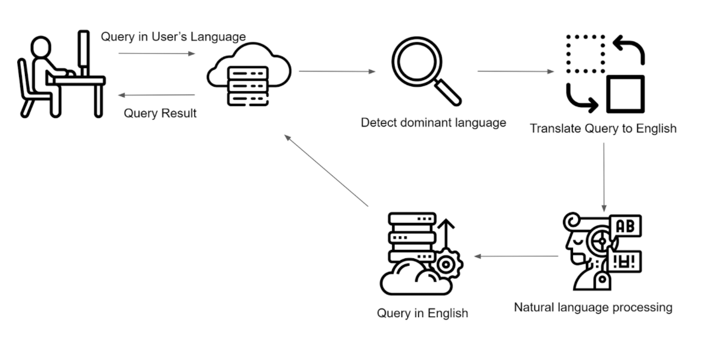

세계의 여러 나라에서 이용하는 서비스가 있다고 해보자. 

마침 그 서비스는 내가 만든 컨텐츠를 공유하고, 다른 사람들의 것들도 검색하여 그 컨텐츠들을 즐길 수 있다. 

그런데, 아쉽게도 우리나라에서 그 서비스가 런칭된지 얼마 되지 않아서인지 검색된 컨텐츠들이 빈약하기 그지 없다. 그러나 같은 뜻을 가진 단어를 다른 언어로 검색을 시도했더니, 내가 원하는 컨텐츠들이 넘쳐나는게 아닌가. 

위와 같은 상황이 벌어지는 것은, 공유된 컨텐츠의 제목이나 등록했던 태그들의 언어에서 비롯한다. 대부분의 사람들이 그들의 언어로 제목을 짓고, 태그들을 등록하기 때문이다. 

그렇다면 언어와 관계 없이 사용자에게 검색 경험을 어떻게 제공해 줄 수 있을까?

## Candidate Idea

위의 상황을 해결해 줄 수 있는 여러 방법들이 존재할 수 있겠지만, 여기에서는 우리가 생각하는 간단하고 효율적인 방법 하나를 소개하고자 한다.

기본 아이디어는 다음과 같이 두개로 나눌 수 있다.

### 사용자가 컨텐츠를 등록할 때

> 1. 사용자의 dominant 언어를 detect한다. 
> 2. detect된 사용자의 언어를 영어로 변경한다.
> 3. 자연어 처리를 통해 키워드들을 선정한다. 
> 4. 선정된 키워드를 데이터베이스에 기록한다.  

### 사용자가 컨텐츠를 검색할 때

> 1. 사용자가 자신의 언어로 검색을 시도한다. 
> 2. 사용자의 dominant 언어를 detect한다. 
> 3. detect된 사용자의 언어를 영어로 변경한다.
> 4. 자연어 처리를 통해 키워드들을 선정한다.
> 5. 선정된 키워드들을 이용하여 데이터베이스에 쿼리한다.

위의 두가지 Usecase 에 맞춰 필요한 기능은 먼저 **_사용자의 언어를 파악할 수 있어야 한다._** 인지 할 수 없는 언어는 아쉽게도 지원대상이 될 수 없다. 

그렇게  **_파악된 언어를 영어로 번역할 수 있어야 한다._** 우리의 목적은 특정 언어로 기록된 컨텐츠만 검색되는 문제를 해결하는 것에 있다. 이를 위해 업로드 된 컨텐츠의 정보를 영어로 번역하고, 검색어 또한 영어로 번역한다. 이렇게 검색 환경을 통일함으로써 사용자에게 적절한 검색 결과를 제공할 준비를 한다.

번역이 완료 되었으면 **_자연어 처리를 통해 키워드 형식으로 축출 할 수 있어야 한다._** 검색어가 하나의 키워드 일 수도 있고, 문장으로 되어 있을 수도 있기 때문이다. 

마지막으로 **_데이터를 저장할 데이터베이스와 검색엔진이 있어야 한다._** 우리가 처리해야할 데이터의 수는 많다고 가정할 때, 많은 양의 데이터를 저장하고, 효과적으로 검색 할 수 있는 기능들은 필수적이다. 또한, 자연어 처리된 키워드들은 복수 개일 수 있으며, 이에 대한 가중치 부여, 복합 쿼리등의 기능이 있어야 한다.

---

## Tools with SaaS

언어를 탐색하고, 번역하고, 분석하는 일은 분명 매력적인 일이 될 것이다. 하지만, 한 사람의 개발자가 혹은, 소규모의 팀이 진행하기에 확실히 효율적이지 못하다. 그래서 클라우드 기반의 소프트웨어를 찾아보는 것은 우리에게 좋은 옵션이 될 것이다.

|Translation|Natural Language Processing|Search Engine|
|:------------------:|:------------------:|:------------------:|
| `AWS Translate` | `AWS Comprehend` | `OpenSearch` |

위의 SaaS 이외에도 다양한 플랫폼의 적절한 솔루션들이 존재한다. 그러나 이 글에서는 편의상 AWS에서 제공하는 소프트웨어들을 기반으로 살펴 보고자 한다.

👉 [Part -2 에서 계속](https://ethan-baek.github.io/multilingual_search_system-part-2)

