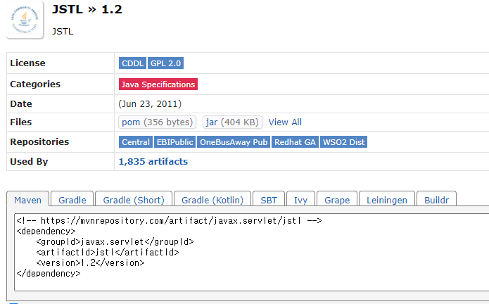

```
layout: single
published: true
title:  "7.Maven기반 프로젝트 구성"
categories : Jsp
tag : ["java","servlet"]
toc : true
toc_sticky: true
author_profile: true
sidebar :
    nav : "docs"
```


## Maven 기본 프로젝트 구성


### Maven이란?

- 복잡하고 대규모 프로젝트의 소스를 체계적으로 <u>컴파일</u>하기 위함
- 관련 라이브러리의 버전이나 종속성 관리를 쉽게 도와줌
- 스프링 프레임워크 개발에서 기본 빌드 도구로 활용됨
- 2012년 더 유연하고 복잡한 처리를 쉽게해주는 빌드 도구 Gradle나오게 되었고 안드로이드 앱 개발의 <u>기본 빌드 도구</u>가 됨
- 현재는 Gradle 과 Maven이 대표적인 빌드 도구다


### Maven과 Gradle의 차이

- Maven :

  - 빌드 설정을 pom.xml 파일에 설정

  - xml 구조이기 때문에 대규모 프로젝트 일수록 스크립트가 길어지고 가독성이 떨어짐

  - 다중프로젝트에서 특정설정을 다른 모듈에서 사용하려면 상속해야됨

  - 이클립스에 친화적

    

-  Gradle:

  - Groovy라고 하는 JVM 기반 언어를 통해 프로그램 구조를 설정함
  - 스크립트를 짧게 작성 가능
  - 설정 주입 방식을 사용하여 다중 프로젝트에 적합함
  - 인텔리제이에 친화적


## 리포지터리 

- 빌드 도구를 사용하면 필요한 핵심 라이브러리만 설정 파일에 등록하면 해당 라이브러리에서 필요하는 다른 라이브러리도 자동으로 설치되기 때문에 개발자가 일일이  번거롭게 해당 라이브러리를 찾아 다운로드 하지 않아도 되는 이점이 있다.

- <p style="color:red;">리포지터리란 라이브러리를 통합 보관하는 일종의 저장소이다.</p>

- 해당 라이브러리를 글로벌 저장소로부터 로컬 저장소로 다운로드한 다음 프로젝트에 복사하여 사용됨 

  

## 이클립스 Maven 설정

   1. 먼저 프로젝트를 선택 [Configure] -> [Convert to Maven Project]를 선택

   2. 기본 정보 설정하기 
      - Group Id : 기본 패키지 이름
      - Artifact Id : 생성되는 jar(war)파일의 이름, 소문자로 작성
      - Version : 버전 관리 번호
      - Packaging : jar(일반 앱 혹은 라이브러리) 또는 war(웹) 형태
      - 웹프로젝트로 빌드된 결과물은 war 패키지로 생성됨
      
   3. 필요한 라이브러리 등록하기 

    - 필요한 라이브러리는 리포지터리 사이트에서 코를 복사하여 사용
    
    - https://mvnrepository.com/ 에서 jstl을 검색하여 1.2 버전 코드를 복사하여 사용한다. (기존에 있던 jstl관련 라이브러리를 삭제한다.)
    
      


   4. JSTL라이브러리 의존성 추가하기 

      - 라이브러리를 추가할경우   <dependencies>...</dependency>사이에 넣어주어한다.

      - ```
        <project xmlns="http://maven.apache.org/POM/4.0.0" xmlns:xsi="http://www.w3.org/2001/XMLSchema-instance" xsi:schemaLocation="http://maven.apache.org/POM/4.0.0 https://maven.apache.org/xsd/maven-4.0.0.xsd">
          <modelVersion>4.0.0</modelVersion>
          <groupId>jwbook</groupId>
          <artifactId>jwbook</artifactId>
          <version>0.0.1-SNAPSHOT</version>
          <packaging>war</packaging>
          <build>
            <plugins>
              <plugin>
                <artifactId>maven-compiler-plugin</artifactId>
                <version>3.8.1</version>
                <configuration>
                  <release>16</release>
                </configuration>
              </plugin>
              <plugin>
                <artifactId>maven-war-plugin</artifactId>
                <version>3.2.3</version>
              </plugin>
            </plugins>
          </build>
          <dependencies>
          <!-- https://mvnrepository.com/artifact/javax.servlet/jstl -->
        	<dependency>
            	<groupId>javax.servlet</groupId>
            	<artifactId>jstl</artifactId>
            	<version>1.2</version>
        	</dependency>
          </dependencies>
        </project>
        ```

   5. Maven 프로젝트 업데이트

      - pom.xml 파일 -> [Maven] -> [Update Project]


## 정리!

1. Maven , Gradle는 무엇인가 ? 
   - 빌드 도구
2. Maven , Gradle의 주요 목적은?
   - 컴파일/실행 설정
   - 라이브러리 설정
3. Maven , Gradle를 사용하지 않으면?
   - 개발자가 필요한 라이브러리를 다운로드하여 [WEB-INF]폴더에 일일히 모두 복사하여 사용해야함
4. 빌드 도구를 사용하면 좋은 점은?
   - 필요한 라이브러리만 설정파일에 등록해두면 해당라이브러리가 필요하는 다른 라이브러리도 자동으로 설치됨
5.  리포지터리는 무엇인가?
   - 이러한 라이브러리를 통환 보관하는 일종의 저장소 
