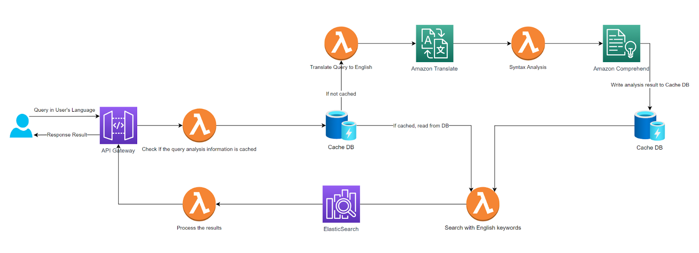
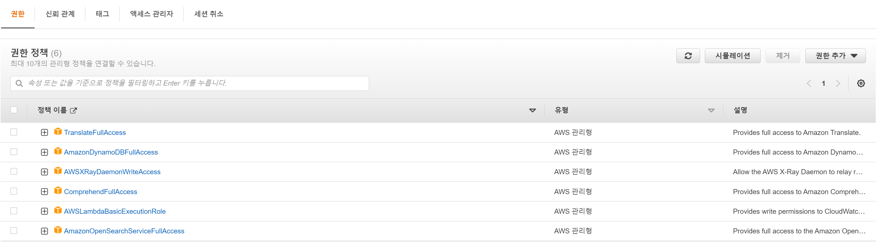
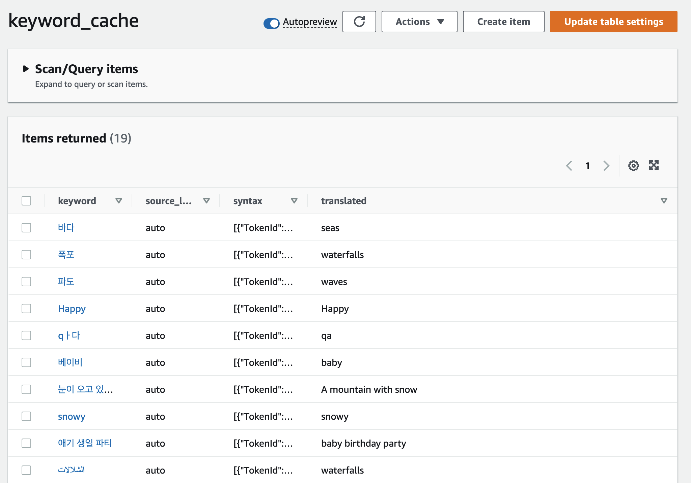

이제 마지막으로 Search System을 살펴보도록 하자. 


## 📐 Architecture


### Search System




AWS의 소프트웨어로 candidate Idea를 구체화한 search system이다.  기본 컨셉 아이디어와 다른 점은 Cache DB의 존재이다. 검색양이 많아질수록 AWS Translate 와 AWS의 자연어 처리 소프트웨어인 Comprehend의 호출이 찾아질 수 밖에 없다. Translate와 Comprehend는 호출에 따라 비용이 발생하는 비지니스 구조이므로, 이를 줄일수록 비용적인 부분을 구려한다면 Cache DB의 선택을 필수일 수 밖에 없다. 이를 고려하여 아래와 같이 구성해보았다.


> 1. 사용자가 검색어를 입력하면 검색어가 AWS의 API Gateway를 통해 sever에 전달된다.
> 2. Cache DB에 검색어가 저장되어 있는지 확인한다. 
>    1. 일치하는 검색어가 있다면, 영어로 번역된 키워드들을 반환한다.
>    2. 일치하는 검색어가 없다면, 
>       1. 검색어를 Translate를 이용하여 영어로 번역한다.
>       2. 번역된 검색어를 Comprehend를 이용하여 검색할 키워드들을 축출한다.
>       3. 축출된 키워드들을 Cache DB에 요청한 검색어와 함께 Cache DB에 저장한다.
> 3. 키워드들을 이용하여 OpenSearch/ElasticSearch와 같은 검색 엔진으로 쿼리한다.
> 4. 검색 엔진의 결과를 사용자에게 반환한다.


---


#### Search System 구성하기


##### API Gateway


|    Path    | Type  |                            Lambda                            |
| :--------: | :---: | :----------------------------------------------------------: |
| `/project` | `GET` | [search-with-cache](https://github.com/KineMasterCorp/MultilingualSearch-sample/tree/main/lambda/search-with-cache) with `Python` |


Upload system에선 POST 타입으로 Call을 받았다면 이번에는 GET 타입으로 Search Call을 받아보자. 

project 경로를 만들었다면, 연결시킬 lambda 함수를 준비한다. 


GET 타입으로 입력 받을 데이터는 아래와 같다.

```
https://API Gateway URL/search?q=검색어&size=가져올갯수
```


---


##### Lambda for searching projects


이제 [search-with-cache](https://github.com/KineMasterCorp/MultilingualSearch-sample/tree/main/lambda/search-with-cache) 코드를 참조하여 lambda 함수를 만들고 API Gateway의 GET 타입의 project와 연결하도록 한다.

이번 lambda 코드는 `pyhton`으로 작성했으며, 이 함수 내에서 translate, comprehend, cache DB 접근, opensearch 접근 등, 많은 일들을 수행하기 때문에 아래와 같은 권한을 요청한다.


- TranslateFullAccess
- AmazonDynamoDBFullAccess
- AWSXrayDamonWriteAccess
- ComprehendFullAcecess
- AWSLambdaBasicExecutionRole
- AmazonOpenSearchServiceFullAccess




>  참고: 이 권한에 필요한 것보다 더 넓은 범위를 사용하고 있다. 구현에 필요한 최소한의 보안 권한을 사용하는 것을 고려해야한다.


아래는 search-with-cache 코드의 일부분이다. `get_cache` 함수를 통해 Dynamo DB의 Cache table에서 검색어가 존재하는지 쿼리한다.


```python
def parse_query(local_query, source_language):
    (translated_query, syntax_tokens) = get_cache(local_query, source_language)
    if not translated_query:
        (translated_query, syntax_tokens) = parse_syntax(local_query, source_language)
        read_from_cache = False
    else:
        read_from_cache = True
    
    return (translated_query, syntax_tokens, read_from_cache)
```


 만약 번역된 쿼리가 존재하지 않는다면,  `parse_syntax` 함수에서 AWS translate의 `translate_text` API를 이용해 영어로 번역하고 마찬가지로 AWS comprehend의 `detect_syntax` API를 통해 검색어를 분석한다.


```python
def parse_syntax(local_query, source_language):
    try:
        result = translate.translate_text(Text=local_query, SourceLanguageCode=source_language, TargetLanguageCode='en')
        translated_query = result.get('TranslatedText')
        logger.info("Translation input: " + local_query + ", output: " + translated_query)
        
        result = comprehend.detect_syntax(Text=translated_query, LanguageCode='en')
        syntax_tokens = result['SyntaxTokens']
        
        return (translated_query, syntax_tokens)
    except Exception as e:
        logger.error("[Translate exception]: " + str(e))
        
    return ('', {})
```


이제 검색 엔진에 사용될 쿼리를 작성한다.  검색어가 키워드가 아닌 여러 단어의 조합이나 문장이라면, 불필요한 품사를 제거하는 것이 좋다. 또한, `NOUN` 혹은 `PROPN`과 같은 핵심 문구가 될만한 품사들에 가중치를 부여함으로써 검색의 품질을 향상 시킬 수 있다.

​    

```python
def build_query(local_query, read_size, translated_query, syntax_tokens):
    query_keywords = {}
for token in syntax_tokens:
    keyword = token['Text']
    pos = token['PartOfSpeech']['Tag']
    logger.info('text: ' + keyword + ', pos: ' + pos)
    
    if pos == 'NOUN' or pos == 'PROPN' or pos == 'VERB' or pos == 'ADJ' or pos == 'ADV' or pos == 'NUM':
        boost = 1
        if pos == 'NOUN' or pos == 'PROPN': boost = 20
        
        query_keywords[keyword] = boost

query_string = '"' + translated_query + '"^5'
logger.info('query: ' + query_string)
for word, boost in query_keywords.items():
    query_string += ' OR ' + word
    if boost > 1:
        query_string += '^' + str(boost)
        
# Put the user query into the query DSL for more accurate search results.
# Note that certain fields are boosted (^).

local_query_string = '"' + local_query + '"^10 OR ' + local_query

query = {
    "query": {
        "bool" : {
            "should": [
            {
                "query_string" : {
                    "fields" : ["title^6", "tags^5"],
                    "query": local_query_string
                }
            },
            {
                "query_string" : {
                  "fields" : ["title_translated^2", "title_translated.english^2", "tags_translated", "tags_translated.english"],
                  "query": query_string
                }
            }
            ]
        }
    }
}
if read_size > 0:
    query["size"] = read_size

return query
```


이제 검색 엔진에 쿼리를 수행하도록 한다. `parse_query`에서 `read_from_cache` 값이 `false`라면 cache DB에 값을 저장하는 것도 잊지 말자.


```python
r = client.search(body = query, filter_path = filter_path, index = index)
        
logger.info('Search for ' + local_query + ' has been completed..')

if not read_from_cache:
	cache_keyword(local_query, source_language, translated_query, syntax_tokens)
```


이제 response를 작성하여 lambda 함수를 마무리 한다.


```python
info_text = {
    "original_text": local_query,
    "translate_text": translated_query,
    "search_result": r,
    "query": query
}

# Add the search results to the response
response['body'] = json.dumps(info_text)
return response
```


---


##### DynamoDB to store the results of translation / syntax parsing


위에서 언급한 Cache DB를 DynamoDB로 구성하고 Cache 데이터를 저장할 `keyword_cache` table을 생성한다.





---


Conclusion


이제까지 Multilingual Search System 을 구성하는 방법을 가이드 해 드렸다. 위에 열거한 방법만으로도 적절한 선에서 내 언어로 global search를 하도록 도와줄 것이다.

그러나 사용자가 검색한 문구에 동음이의어가 존재했을 경우 어떻게 효과적으로 처리해야 하는지, 혹은 사용자의 검색 문구에 조금 더 효과적으로 가중치를 부여할 것인지 등과 같이 몇가지 과제도 여전히 남아있다. 

하지만 중요한 것은 사용자에게 이전보다 조금 더 좋은 검색 경험을 제공해 줄 수 있다는 점이며, 현재보다 조금 더 발전할 여지가 있다는 것이다.


