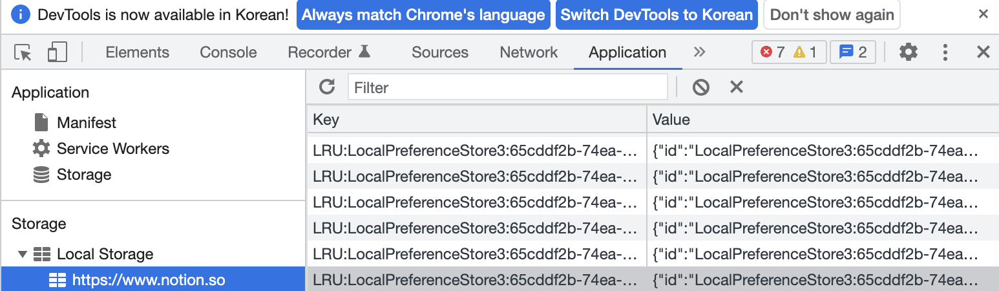

# Application


### 01. Application 패널의 기능은?

브라우저 저장소의 기능을 담당한다.

현재 로딩된 웹 페이지에서 사용된 모든 리소스 (이미지, DB, 로컬 및 세션 스토리지, 쿠키, 캐시)를 검사 및 관리할 수 있다.


---


### 02. Local Storage, Session Storage, Cookie 차이점은?

**세 저장소의 공통점은 **key - value 페어 객체 형태로 데이터가 저장된다.

**로컬 스토리지** 는 사용자가 지우지 않는 이상 데이터의 영구성이 보장된다. 

**세션 스토리지** 는 윈도우나 브라우저 탭을 닫을 경우 사라진다.

**쿠키** 는 지속 시간을 설정할 수 있고 4KB까지만 저장이 가능하다. DB와 직접적이지 않는 데이터를 저장할 때 사용한다. 문자열만 저장할 수 있다.


---


### 03. Local Storage, Session Storage, Cookie 사용 예시 - 어떤 데이터를 어디에 저장하면 좋을까?

**로컬 스토리지** 는 오랫동안 저장소에 유지해야 하는 데이터에 사용하며 **자동 로그인** 등 브라우저가 닫히지 않아도 유지될 수 있는 정보에 사용된다.

**세션 스토리지** 는 브라우저가 닫히면 정보가 초기화 되거나 지워지므로 **일회성 로그인, 장바구니** 등으로 사용된다.

**쿠키** 는 지속 시간을 설정할 수 있는 점으로써 **방문한 페이지를 저장하거나 웹 사이트에 "3일간 보지않기" 기능** 등 으로 사용된다.


---


### 04. Local Storage에 특정 데이터를 저장하고 가져오는 방법

스토리지에 데이터를 저장하고 가져오는 방법은 매우 간단하다.

필요한 함수나 실행파일 부분에 **web storage api** 를 사용하여 저장/출력 할 수 있다.

```js
// localStorage 객체는 단순한 key-value 저장소이다
// setItem 메서드를 사용하여 local storage에 데이터를 저장한다.
localStorage.setItem("key","value");
// getItem을 사용하여 어느 파일이든 원하는 위치에서 key 값에 대한 value 를 출력할 수 있다.
let localData = localStorage.getItem("key");

// session storage 도 local storage와 마찬가지로 사용할 수 있다.
sessionStorage.setItem("key","value");
let sessionData = sessionStorage.getItem("key");
```

이렇게 setItem 한 데이터는 개발자도구 Application 페널에 왼쪽 Storage 메뉴에서 확인할 수 있다. 



위 사진은 어느 사이트의 local storage 부분이다. 오른쪽 프로퍼티를 클릭하면 아래 사진처럼 객체형식으로 데이터를 보여준다.


