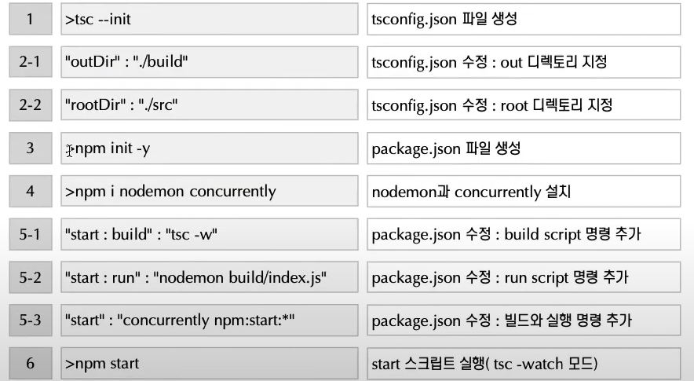
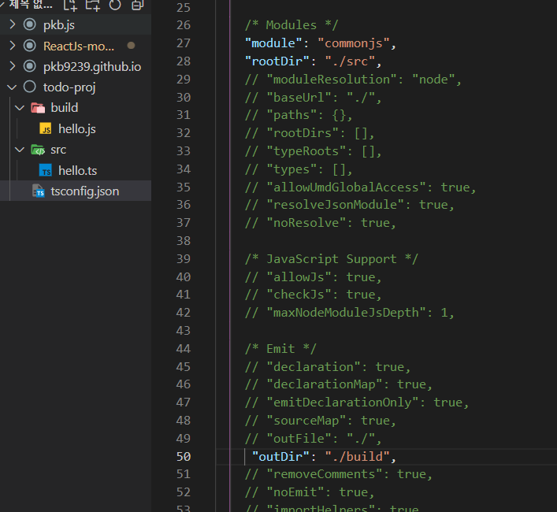
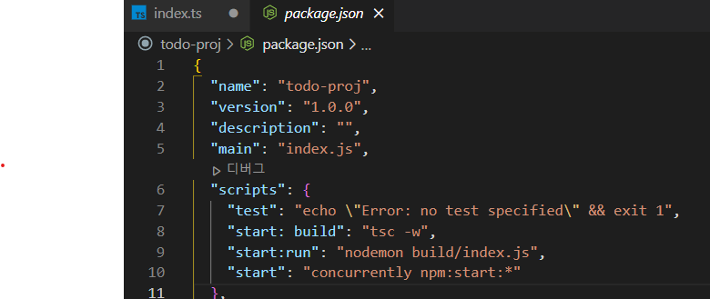

# TypeScript


## What is TypeScript?

* TypeScript는 안전하고 예측 가능한 코드  구현에 초점을 맞춘 JavaScript의 상위집합(Superset)언어 입니다.

* TypeScript의 가장 큰 특징은 기존 JavaScript에 Type System 을 적용한 것입니다.

* TypeScript로 작성된 코드는 TypeScript 컴파일러(tsc)를 통해 JavaScript 변환되고 이후 실행됩니다.

* Type System 이외에도 TypeScript는 Decorators와 같은 다양한 기능을 제공합니다.

  

###### ***                                             TypeScript  =  JavaScript  +  Type System***

```javascript
function add(n1, n2) {
	return n1 + n2;
}
console.log(add('1', '2')); // 12
```

```tsx
function add(n1: number, n2: number): number {
	return n1 + n2;
}
console.log(add('1', '2')); // compile error
```

## Tpye System

* TypeScript의 가장 큰 특징은 JavaScript의 타입 체계에 정적 타입(static typed)을 적용할 수 있도록 한 것입니다.

* JavaScript는 동적 타입 체계(dynamic typed)의 언어로 변수에 타입을 지정하지 않습니다.

* 동적 타입 체계는 프로그램에 유연성을 제공하지만 변수에 할당된 값을 읽어 사용하는 단계에서 문제가 발생할 수 있습니다.

* TypeScript는 변수, 파라미터에 타입을 지정할 수 있으며 선언된 타입의 값이 아닌 경우 에러를 발생합니다.

* TypeScript는 정적 타입을 지원합니다. 변수의 정의와 함께 대입할 값의 타입을 함께 지정합니다.

* 변수를 정의하면서 타입을 함께 지정하면 해당 타입의 데이터만 대입 가능하며 다른 타입의 값을 대입하면 컴파일 시점에 에러가 발생합니다.

* 변수의 선언과 마찬가지로 함수의 매개변수, 반환값의 정의에도 동일한 시스템을 적용할 수 있습니다.

* 매개변수에 타입을 지정하면 해당 타입의 데이터를 전달 인자로 하며 반환 값도 동일합니다.

  ```tsx
  let year: number = 2020;
  
  function sumNumbers(firstNumber: number, secondNumber: number): number {
  	return firstNumber + secondNumber;
  }
  ```


## Type Inference

* 정적으로 타입을 명시하지 않고 대입하는 값을 통해 타입을 유추해 결정하는 것이 타입 추론입니다.
* 기본적으로 변수의 선언과 함께 값을 대입하는 경우 해당 변수는 타입 추론으로 인해 대입되는 값의 타입을 갖습니다.
* 변수를 선언하고 같은 코드 라인에서 특정 값을 대입하면 TypeScript는 대입값의 타입을 유추해 변수의 타입을 확정합니다.
* 변수의 선언과 값의 대입을 다른 코드 라인에서 진행하면 해당 변수는 any 타입의 변수가 됩니다.


## 개발환경 구성

* TypeScript 개발 환경 구성을 위한 필수 모듈은 typescript.js 입니다.

* node 설치를 기본 전제로 npm(혹은 yarn)을 이용한 typescript를 설치하면 tsc를 이용해 *.ts 파일에 대한 컴파일이 가능합니다. (ts-node를 설치하면 컴파일과 실행을 한번에 수행할 수 있습니다.)

* TypeScript로 작성한 *.ts 파일은 tsc 컴파일 과정을 거치면 *.js 파일로 트랜스컴파일(transcompile) 됩니다.

* 개발을 위한 IDE는 Visual Studio Code, Intellij 등 다양하며 선택해 설치합니다.

  ```cmd
  >npm install -g typescript ts-node
  ```

* 기본적인 프로젝트의 구성 디렉토리는 src, build로 구분하여 작성 소스(*.ts)와 컴파일된 소스 (.js)를 구분합니다.

* 디렉토리를 구분해서 소스 파일들을 관리하기 위해 tsconfig.json 파일을 생성하고 관련 내용을 수정합니다.

* package.json 파일을 생성하고 nodemon과 concurrently 모듈을 설치합니다.

* package.json 파일에 scripts 내용을 추가하여 빌드(build)와 실행(run) 명령을 스크립트로 실행되도록 설정합니다. 







## Type Annotaltlons - Varlables, Object Literal Annotatlons

* 정적 타입을 기본으로 하는 C, Java와 마찬가지로 변수 선언에 타입을 지정할 수 있습니다.

* 변수에 대한 타입을 지정하면 해당 변수에 다른 타입의 값을 대입(assign) 할 수 없습니다.

* 변수에 정의한 타입과 다른 타입의 값을 대입하는 코드는 TypeScript 컴파일러에 의해 컴파일 오류가 발생됩니다.

* 객체 리터럴에 대한 타입 정의는 해당 리터럴 객체가 갖는 각각의 프로퍼티에 대한 타입을 나열하는 형태로 정의합니다.

  ```tsx
  // primitive types
  let name: string = "kim";
  let age: number = 20;
  let hasName: boolean = true;
  
  let nullValue: null = null;
  let nothing: undefined = undefined;
  
  // built in objects
  let now: Date = new Date();
  
  // Array
  let colors: string[] = ['red', 'yellow', 'blue'];
  let numbers: number[] = [1, 2, 3, 4, 5];
  
  // Class
  class Person {}
  let person: person = new Person();
  
  // Object literal
  let point: { x: number, y: number } = {
  	x: 10,
  	y: 20
  };
  ```


## Type Annotaltlons - Functions

* 함수를 정의할 때 파라미터와 반환값에 타입을 지정합니다.

* 함수의 종류(선언적 함수, 익명함수, 람다 함수)에 따라 타입 지정에 대한 표현에는 차이가 있습니다.

* 함수의 파라미터를 정의할 때 선택적 매개변수(Optional Parameter)를 지정할 수 있습니다.

  ``` tsx
  // 선언적 함수
  function add(n1: number, n2: number): number {
  	return n1 + n2;
  }
  
  // 익명 함수
  const add = function(n1: number, n2: number): number{
  	return n1 + n2;
  }
  
  // 람다 함수
  const add:(n1: number, n2: number) => number = (n1: number, n2: number) : number => {
  	return n1 + n2;
  }
  ```

* JavaScript는 기본적으로 가변인자를 통한 함수 호출이 가능했지만 TypeScript는 가변인자를 지원하지 않습니다.

* 대신 TypeScript는 함수의 오버로딩(Function overloading)을 통해 가변인자와 같은 효과를 구현할 수 있습니다.

* 선택적 매개변수는 함수 호출시 전달인자를 선택적으로 보낼 수 있는 기능의 매개변수 입니다.

* 이외에도 ES6 버전부터 지원하는 기본 매개변수(Default Parameter), 나머지 매개변수(Rest Parameter)가 있습니다.

  ```tsx
  function add(firstParam: string, secondParam: string): string;
  function add(firstParam: number, secondParam: number): number;
  
  function add(firstParam: any, secondParam: any): any {
  	console.log(firstParam + secondParam);
  }
  
  add(10, 20);
  add('10', '20');
  ```

  
